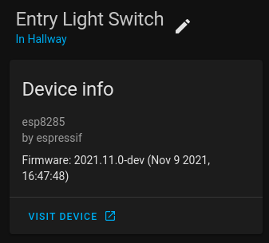

ESPHome 2021.11.0 - 17th November 2021
======================================

.. seo::
    :description: Changelog for ESPHome 2021.11.0.
    :image: /_static/changelog-2021.11.0.png
    :author: ESPHome
    :author_twitter: @esphome_

.. imgtable::
    :columns: 4

    CSE7761, components/sensor/cse7761, cse7761.svg
    CAP1188 Capacitive Touch Sensor, components/binary_sensor/cap1188, cap1188.jpg
    ESP32 Camera Web Server, components/esp32_camera_web_server, camera.svg, dark-invert
    Improv via Serial, components/improv_serial, improv.svg, dark-invert

State of the Open Smart Home
----------------------------

Mark your calendar for the `State of the Open Smart Home <https://www.home-assistant.io/state-of-the-open-home/>`__ hosted by Nabu Casa, Home Assistant & ESPHome
and we’ll be joined by our friends from WLED and Z-Wave JS to talk about our work on making this vision a reality.

Where: YouTube

When: Saturday, December 11, at 11am PST / 8pm CET

.. raw:: html

    <iframe width="560" height="315" src="https://www.youtube-nocookie.com/embed/6ZMXE5PXPqU"
            title="YouTube video player" frameborder="0"
            allow="accelerometer; autoplay; clipboard-write; encrypted-media; gyroscope; picture-in-picture"
            allowfullscreen>
    </iframe>

Improv via Serial
-----------------

.. raw:: html

    

    <improv-wifi-serial-launch-button>
        <i slot='unsupported'>The demo does not work in your browser. Use Google Chrome or Microsoft Edge.</i>
    </improv-wifi-serial-launch-button>

After we created :doc:`/components/esp32_improv`, we thought it might be a good idea to implement the same for serial connections.
See the docs here for :doc:`Improv via Serial </components/improv_serial>` and the
`website documentation <https://www.improv-wifi.com/serial/>`__ for implementing a client or implementing improv in other firmware.

Entity Categories for Home Assistant
------------------------------------

Home Assistant 2021.11 added support for `Entity Categories <https://www.home-assistant.io/blog/2021/11/03/release-202111/#entity-categorization>`__
and with this release certain ESPHome entites such as the restart switch and uptime sensors will have the config and diagnostic categories set respectively.
The category can be overridden by the user in the yaml configuration.

Configuration URL
-----------------

Another feature added to Home Assistant 2021.11 is the configuration URL. This allows for ESPHome devices to notify Home Assistant when the ``web_server`` is
enabled and there will be a button in the Home Assistant device page to link directly to the ``web_server`` UI for your ESPHome device.

Repeat Action
-------------

:ghuser:`oxan` has implemented a ``repeat`` action for those that want to execute a list of actions x number of times without just copying and pasting them.

Device name length
------------------

The maximum length of the device name has been limited to 31 characters to fall in line with standards and you will get
an error if you try to set a device name longer than that.

BLE Sensor UUID changes
-----------------------

A bug was introduced in 2021.9 with the UUIDs for the ``ble_client`` sensors being reversed incorrectly. This release flips them to be the correct way around
and you will need to reverse them in your YAML configuration.

BH1750
------

When using the default resolution of 0.5 for the BH1750, the result is now divided by 2 as per the finidings of the community.

Binary sensor device classes
----------------------------

:esphomepr:`2703` removed the ``update`` ``device_class`` for binary sensors incorrectly in 2021.11.0. :ghuser:`frenck` noticed this and has
added it back again in 2021.11.1.

Release 2021.11.1 - November 17
-------------------------------

- Fix AQI index calculator :esphomepr:`2739` by :ghuser:`freekode`
- Re-instate device class update for binary sensors :esphomepr:`2743` by :ghuser:`frenck`

Release 2021.11.2 - November 26
-------------------------------

- Allow UART debug configuration with no after: definition :esphomepr:`2753` by :ghuser:`mmakaay`
- Fix gif frame scaling #2717 :esphomepr:`2750` by :ghuser:`davet2001`
- esp32_camera_web_server: Improve support for MotionEye :esphomepr:`2777` by :ghuser:`ayufan`
- Remove floating point ops from the ISR :esphomepr:`2751` by :ghuser:`ssieb`
- Fix parsing numbers from null-terminated buffers :esphomepr:`2755` by :ghuser:`oxan`

Release 2021.11.3 - November 27
-------------------------------

- Fix restoring preferences for ESP32 :esphomepr:`2805` by :ghuser:`mmakaay`

Release 2021.11.4 - November 29
-------------------------------

- Fix parsing numbers in Anova :esphomepr:`2816` by :ghuser:`oxan`
- Fix parsing of multiple values in EZO sensor :esphomepr:`2814` by :ghuser:`oxan`
- Fix compilation error for WPA enterprise in ESP-IDF :esphomepr:`2815` by :ghuser:`CarlosGS`
- Correct bitmask for third color (blue) scaling. :esphomepr:`2817` by :ghuser:`davet2001`
- Add delay to improve stability :esphomepr:`2793` by :ghuser:`Conclusio`

Full list of changes
--------------------

New Features
^^^^^^^^^^^^

- Make per-loop display clearing optional :esphomepr:`2626` by :ghuser:`timn` (new-feature)
- Add Entity categories for Home Assistant :esphomepr:`2636` by :ghuser:`jesserockz` (new-feature)
- Add repeat action for automations :esphomepr:`2538` by :ghuser:`oxan` (new-feature)
- Neopixelbus redo method definitions :esphomepr:`2616` by :ghuser:`OttoWinter` (new-feature) (breaking-change)

New Components
^^^^^^^^^^^^^^

- Feature/sensor cse7761 :esphomepr:`2546` by :ghuser:`berfenger` (new-integration)
- Add `esp32_camera_web_server:` to expose mjpg/jpg images :esphomepr:`2237` by :ghuser:`ayufan` (new-integration)
- CAP1188 Capacitive Touch Sensor Support :esphomepr:`2653` by :ghuser:`MrEditor97` (new-integration)
- Implement Improv via Serial component :esphomepr:`2423` by :ghuser:`jesserockz` (new-integration)

Breaking Changes
^^^^^^^^^^^^^^^^

- TCS34725 BugFix and GA factor :esphomepr:`2445` by :ghuser:`razorback16` (breaking-change)
- Limit hostnames to 31 characters :esphomepr:`2531` by :ghuser:`oxan` (breaking-change)
- Move default build path to .esphome directory :esphomepr:`2586` by :ghuser:`OttoWinter` (breaking-change)
- ESP8266 disable PIO LDF :esphomepr:`2608` by :ghuser:`OttoWinter` (breaking-change)
- Remove autoload of xiaomi_ble and ruuvi_ble :esphomepr:`2617` by :ghuser:`spbrogan` (breaking-change)
- BH1750: Fix a too high default H-res2 mode value :esphomepr:`2536` by :ghuser:`kixtarter` (breaking-change)
- Add option to use MQTT abbreviations :esphomepr:`2641` by :ghuser:`paulmonigatti` (breaking-change)
- Add restore_mode to rotary_encoder :esphomepr:`2643` by :ghuser:`niklasweber` (breaking-change)
- Neopixelbus redo method definitions :esphomepr:`2616` by :ghuser:`OttoWinter` (new-feature) (breaking-change)
- Update device classes for binary sensors :esphomepr:`2703` by :ghuser:`lcavalli` (breaking-change)
- BLE_Sensor: Use as_reversed_hex_array to properly parse UUIDs after #1627 :esphomepr:`2737` by :ghuser:`tekmaven` (breaking-change)

Beta Fixes
^^^^^^^^^^

- Fix template number initial value being NaN :esphomepr:`2692` by :ghuser:`jesserockz`
- [remote_transmitter] accurate pulse timing for ESP8266 :esphomepr:`2476` by :ghuser:`CarlosGS`
- Uart debugging support :esphomepr:`2478` by :ghuser:`mmakaay`
- Enable addressable light power supply based on raw values :esphomepr:`2690` by :ghuser:`oxan`
- Remove my.ha links from improv :esphomepr:`2695` by :ghuser:`jesserockz`
- Only allow prometheus when using arduino :esphomepr:`2697` by :ghuser:`jesserockz`
- Update device classes for binary sensors :esphomepr:`2703` by :ghuser:`lcavalli` (breaking-change)
- Bump ESPAsyncWebServer to 2.1.0 :esphomepr:`2686` by :ghuser:`jesserockz`
- Allow setting custom command_topic for Select and Number components :esphomepr:`2714` by :ghuser:`kbialek`
- Restore InterruptLock on wifi-less ESP8266 :esphomepr:`2712` by :ghuser:`oxan`
- Feed WDT between doing ESP32 touchpad measurements :esphomepr:`2720` by :ghuser:`oxan`
- RemoteTransmitter fix. Bug from version 2021.10. Some changes. :esphomepr:`2706` by :ghuser:`dudanov`
- Fix indentation of write_lambda for modbus_controller number :esphomepr:`2722` by :ghuser:`jesserockz`
- Remove unnecessary duplicate touch_pad_filter_start :esphomepr:`2724` by :ghuser:`Maelstrom96`
- Add zeroconf as a direct dependency and lock the version :esphomepr:`2729` by :ghuser:`jesserockz`
- Improv serial/checksum changes :esphomepr:`2731` by :ghuser:`jesserockz`
- Fix zeroconf time comparisons :esphomepr:`2733` by :ghuser:`jesserockz`
- BLE_Sensor: Use as_reversed_hex_array to properly parse UUIDs after #1627 :esphomepr:`2737` by :ghuser:`tekmaven` (breaking-change)
- Fix senseair component uart read timeout :esphomepr:`2658` by :ghuser:`rotarykite`

All changes
^^^^^^^^^^^

- TCS34725 BugFix and GA factor :esphomepr:`2445` by :ghuser:`razorback16` (breaking-change)
- Change millis() to faster micros() for 3ms check in feed_wdt :esphomepr:`2492` by :ghuser:`CarlosGS`
- Add ESP32 IDF as a test env for PRs :esphomepr:`2494` by :ghuser:`mmakaay`
- use no hold master mode for si7021/htu21d :esphomepr:`2528` by :ghuser:`dmitriy5181`
- Bump pyyaml from 5.4.1 to 6.0 :esphomepr:`2521` by :ghuser:`dependabot[bot]`
- Clarify statement at the cmd wizard tool, for new users :esphomepr:`2519` by :ghuser:`CarlosGS`
- Continue ethernet setup if hostname fails :esphomepr:`2430` by :ghuser:`Tommatheussen`
- Bump aioesphomeapi from 9.1.5 to 10.0.0 :esphomepr:`2508` by :ghuser:`dependabot[bot]`
- Move TemplatableValue helper class to automation.h :esphomepr:`2511` by :ghuser:`oxan`
- [esp-idf fix] increase FreeRTOS ticker loop from 100Hz to 1kHz :esphomepr:`2527` by :ghuser:`CarlosGS`
- Bump pytest-asyncio from 0.15.1 to 0.16.0 :esphomepr:`2547` by :ghuser:`dependabot[bot]`
- [ESP32] ADC auto-range setting :esphomepr:`2541` by :ghuser:`CarlosGS`
- Bump paho-mqtt from 1.5.1 to 1.6.0 :esphomepr:`2568` by :ghuser:`dependabot[bot]`
- Fix ESP8266 dallas GPIO16 INPUT_PULLUP :esphomepr:`2581` by :ghuser:`OttoWinter`
- Fix platformio version in Dockerfile doesn't match requirements :esphomepr:`2582` by :ghuser:`OttoWinter`
- Fix platformio_install_deps no longer installing all lib_deps :esphomepr:`2584` by :ghuser:`OttoWinter`
- ESP32 ADC use factory calibration data :esphomepr:`2574` by :ghuser:`OttoWinter`
- Add mDNS config dump :esphomepr:`2576` by :ghuser:`mmakaay`
- Fix mDNS ESP8266 log not included :esphomepr:`2589` by :ghuser:`OttoWinter`
- Bump platformio from 5.2.1 to 5.2.2 :esphomepr:`2569` by :ghuser:`dependabot[bot]`
- Update docker base images :esphomepr:`2583` by :ghuser:`OttoWinter`
- Bump paho-mqtt from 1.6.0 to 1.6.1 :esphomepr:`2596` by :ghuser:`dependabot[bot]`
- Logging a proper url allows terminals to make it clickable :esphomepr:`2554` by :ghuser:`jesserockz`
- Bump aioesphomeapi from 10.0.0 to 10.0.3 :esphomepr:`2595` by :ghuser:`dependabot[bot]`
- Bump tzlocal from 3.0 to 4.0.1 :esphomepr:`2553` by :ghuser:`dependabot[bot]`
- Add IDF support to dallas :esphomepr:`2578` by :ghuser:`OttoWinter`
- Limit hostnames to 31 characters :esphomepr:`2531` by :ghuser:`oxan` (breaking-change)
- Add EntityBase properties to ESP32 Camera :esphomepr:`2600` by :ghuser:`paulmonigatti`
- Move default build path to .esphome directory :esphomepr:`2586` by :ghuser:`OttoWinter` (breaking-change)
- ESP8266 disable PIO LDF :esphomepr:`2608` by :ghuser:`OttoWinter` (breaking-change)
- Switch issue-close-app to GH Actions and workflow cleanup :esphomepr:`2624` by :ghuser:`OttoWinter`
- relax max entities checking :esphomepr:`2629` by :ghuser:`martgras`
- Allow setting URL as platform_version :esphomepr:`2598` by :ghuser:`oxan`
- Constrain GH Actions workflows permissions :esphomepr:`2625` by :ghuser:`OttoWinter`
- Bump tzlocal from 4.0.1 to 4.0.2 :esphomepr:`2631` by :ghuser:`dependabot[bot]`
- Bump esptool from 3.1 to 3.2 :esphomepr:`2632` by :ghuser:`dependabot[bot]`
- Add publish_initial_value option to rotary encoder :esphomepr:`2503` by :ghuser:`niklasweber`
- Remove autoload of xiaomi_ble and ruuvi_ble :esphomepr:`2617` by :ghuser:`spbrogan` (breaking-change)
- Bump aioesphomeapi from 10.0.3 to 10.1.0 :esphomepr:`2638` by :ghuser:`dependabot[bot]`
- Expose web_server port via the API :esphomepr:`2467` by :ghuser:`alexiri`
- Allow cloning/fetching Github PR branches in external_components :esphomepr:`2639` by :ghuser:`jesserockz`
- use update_interval for sntp synchronization :esphomepr:`2563` by :ghuser:`martgras`
- Feature/sensor cse7761 :esphomepr:`2546` by :ghuser:`berfenger` (new-integration)
- Bump aioesphomeapi from 10.1.0 to 10.2.0 :esphomepr:`2642` by :ghuser:`dependabot[bot]`
- BH1750: Fix a too high default H-res2 mode value :esphomepr:`2536` by :ghuser:`kixtarter` (breaking-change)
- Bump tzlocal from 4.0.2 to 4.1 :esphomepr:`2645` by :ghuser:`dependabot[bot]`
- convert SCD30 into Component, polls dataready register :esphomepr:`2308` by :ghuser:`geoffrey-vl`
- Add option to use MQTT abbreviations :esphomepr:`2641` by :ghuser:`paulmonigatti` (breaking-change)
- Fix deep sleep invert_wakeup mode :esphomepr:`2644` by :ghuser:`OttoWinter`
- Expose webserver_port to the native API :esphomepr:`2640` by :ghuser:`jesserockz`
- Fix for noise in pulse_counter and duty_cycle components :esphomepr:`2646` by :ghuser:`CarlosGS`
- Bump black from 21.9b0 to 21.10b0 :esphomepr:`2650` by :ghuser:`dependabot[bot]`
- Add restore_mode to rotary_encoder :esphomepr:`2643` by :ghuser:`niklasweber` (breaking-change)
- Make per-loop display clearing optional :esphomepr:`2626` by :ghuser:`timn` (new-feature)
- Allow esp8266 to compile with no wifi :esphomepr:`2664` by :ghuser:`glmnet`
- Fix CRC error during DSMR chunked message reading :esphomepr:`2622` by :ghuser:`mmakaay`
- Add Entity categories for Home Assistant :esphomepr:`2636` by :ghuser:`jesserockz` (new-feature)
- Add SPI lib for ESP8266 and only add lib for ESP32 when using Arduino :esphomepr:`2677` by :ghuser:`mmakaay`
- Hotfix for encrypted DSMR regression :esphomepr:`2679` by :ghuser:`mmakaay`
- Add HA Entity Category support to MQTT :esphomepr:`2678` by :ghuser:`paulmonigatti`
- Fix gpio validation for esp32 variants :esphomepr:`2609` by :ghuser:`martgras`
- Fix when package url has no branch/ref :esphomepr:`2683` by :ghuser:`jesserockz`
- SSD1306_base -> Add support for 64x32 size and fix typo for flip functions :esphomepr:`2682` by :ghuser:`ychieux`
- Fix dashboard imports for adoption :esphomepr:`2684` by :ghuser:`jesserockz`
- Add `esp32_camera_web_server:` to expose mjpg/jpg images :esphomepr:`2237` by :ghuser:`ayufan` (new-integration)
- fix esp32 rmt receiver item array length :esphomepr:`2671` by :ghuser:`glmnet`
- Remote base add pronto protocol :esphomepr:`2619` by :ghuser:`cvwillegen`
- Set up output_switch at priority DATA instead of HARDWARE. :esphomepr:`2648` by :ghuser:`duncf`
- fix rc switch protocol 6 :esphomepr:`2672` by :ghuser:`glmnet`
- Remove "delay_microseconds_accurate()" and improve systemwide delayMicroseconds() :esphomepr:`2497` by :ghuser:`CarlosGS`
- modbus_controller: remove hard coded register size :esphomepr:`2654` by :ghuser:`martgras`
- CAP1188 Capacitive Touch Sensor Support :esphomepr:`2653` by :ghuser:`MrEditor97` (new-integration)
- Add missing hal.h include in esp32_camera_web_server :esphomepr:`2689` by :ghuser:`oxan`
- [ESP32 ADC] Add option for raw uncalibrated output :esphomepr:`2663` by :ghuser:`CarlosGS`
- Introduce parse_number() helper function  :esphomepr:`2659` by :ghuser:`oxan`
- Add repeat action for automations :esphomepr:`2538` by :ghuser:`oxan` (new-feature)
- Neopixelbus redo method definitions :esphomepr:`2616` by :ghuser:`OttoWinter` (new-feature) (breaking-change)
- Introduce byteswap helpers :esphomepr:`2661` by :ghuser:`oxan`
- Max7219digit multiline :esphomepr:`1622` by :ghuser:`TVDLoewe`
- Clean-up string sanitization helpers :esphomepr:`2660` by :ghuser:`oxan`
- Introduce encode_value/decode_value() template functions :esphomepr:`2662` by :ghuser:`oxan`
- Make OTA function switchable in web_server component :esphomepr:`2685` by :ghuser:`lazlyhu`
- Implement Improv via Serial component :esphomepr:`2423` by :ghuser:`jesserockz` (new-integration)
- [ms5611]: Re-implement conversion from ADC readings to sensor values :esphomepr:`2665` by :ghuser:`anatoly-savchenkov`
- Fix template number initial value being NaN :esphomepr:`2692` by :ghuser:`jesserockz`
- [remote_transmitter] accurate pulse timing for ESP8266 :esphomepr:`2476` by :ghuser:`CarlosGS`
- Uart debugging support :esphomepr:`2478` by :ghuser:`mmakaay`
- Enable addressable light power supply based on raw values :esphomepr:`2690` by :ghuser:`oxan`
- Remove my.ha links from improv :esphomepr:`2695` by :ghuser:`jesserockz`
- Only allow prometheus when using arduino :esphomepr:`2697` by :ghuser:`jesserockz`
- Update device classes for binary sensors :esphomepr:`2703` by :ghuser:`lcavalli` (breaking-change)
- Bump ESPAsyncWebServer to 2.1.0 :esphomepr:`2686` by :ghuser:`jesserockz`
- Allow setting custom command_topic for Select and Number components :esphomepr:`2714` by :ghuser:`kbialek`
- Restore InterruptLock on wifi-less ESP8266 :esphomepr:`2712` by :ghuser:`oxan`
- Feed WDT between doing ESP32 touchpad measurements :esphomepr:`2720` by :ghuser:`oxan`
- RemoteTransmitter fix. Bug from version 2021.10. Some changes. :esphomepr:`2706` by :ghuser:`dudanov`
- Fix indentation of write_lambda for modbus_controller number :esphomepr:`2722` by :ghuser:`jesserockz`
- Remove unnecessary duplicate touch_pad_filter_start :esphomepr:`2724` by :ghuser:`Maelstrom96`
- Add zeroconf as a direct dependency and lock the version :esphomepr:`2729` by :ghuser:`jesserockz`
- Improv serial/checksum changes :esphomepr:`2731` by :ghuser:`jesserockz`
- Fix zeroconf time comparisons :esphomepr:`2733` by :ghuser:`jesserockz`
- BLE_Sensor: Use as_reversed_hex_array to properly parse UUIDs after #1627 :esphomepr:`2737` by :ghuser:`tekmaven` (breaking-change)
- Fix senseair component uart read timeout :esphomepr:`2658` by :ghuser:`rotarykite`
- Fix AQI index calculator :esphomepr:`2739` by :ghuser:`freekode`
- Re-instate device class update for binary sensors :esphomepr:`2743` by :ghuser:`frenck`
- Allow UART debug configuration with no after: definition :esphomepr:`2753` by :ghuser:`mmakaay`
- Fix gif frame scaling #2717 :esphomepr:`2750` by :ghuser:`davet2001`
- esp32_camera_web_server: Improve support for MotionEye :esphomepr:`2777` by :ghuser:`ayufan`
- Remove floating point ops from the ISR :esphomepr:`2751` by :ghuser:`ssieb`
- Fix parsing numbers from null-terminated buffers :esphomepr:`2755` by :ghuser:`oxan`
- Fix restoring preferences for ESP32 :esphomepr:`2805` by :ghuser:`mmakaay`
- Fix parsing numbers in Anova :esphomepr:`2816` by :ghuser:`oxan`
- Fix parsing of multiple values in EZO sensor :esphomepr:`2814` by :ghuser:`oxan`
- Fix compilation error for WPA enterprise in ESP-IDF :esphomepr:`2815` by :ghuser:`CarlosGS`
- Correct bitmask for third color (blue) scaling. :esphomepr:`2817` by :ghuser:`davet2001`
- Add delay to improve stability :esphomepr:`2793` by :ghuser:`Conclusio`

Past Changelogs
---------------

- :doc:`2021.10.0`
- :doc:`2021.9.0`
- :doc:`2021.8.0`
- :doc:`v1.20.0`
- :doc:`v1.19.0`
- :doc:`v1.18.0`
- :doc:`v1.17.0`
- :doc:`v1.16.0`
- :doc:`v1.15.0`
- :doc:`v1.14.0`
- :doc:`v1.13.0`
- :doc:`v1.12.0`
- :doc:`v1.11.0`
- :doc:`v1.10.0`
- :doc:`v1.9.0`
- :doc:`v1.8.0`
- :doc:`v1.7.0`
