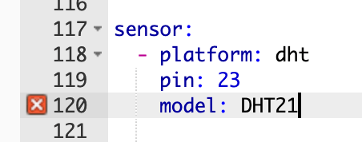

Changelog - Version 1.13.0 - May 30th 2019
==========================================

.. seo::
    :description: Changelog for ESPHome version 1.13.0.
    :image: /_static/changelog-1.13.0.png
    :author: Otto Winter
    :author_twitter: @OttoWinter_

.. imgtable::
    :columns: 4

    Climate Devices, components/climate/index, folder-open.svg
    Endstop Cover, components/cover/endstop, electric-switch.svg
    Time-Based Cover, components/cover/time_based, timer.svg
    Bang Bang Controller, components/climate/bang_bang, air-conditioner.svg

    AM2320, components/sensor/am2320, am2320.jpg
    CCS811, components/sensor/ccs811, ccs811.jpg
    Integration, components/sensor/integration, sigma.svg
    Pulse Width, components/sensor/pulse_width, pulse.svg

    Resistance Sensor, components/sensor/resistance, omega.svg
    NTC Thermistor, components/sensor/ntc, ntc.jpg
    CT Clamp, components/sensor/ct_clamp, ct_clamp.jpg
    Binary Sensor Map, components/sensor/binary_sensor_map, binary_sensor_map.jpg

    TTP229, components/binary_sensor/ttp229, ttp229.jpg
    Coolix IR Remote, components/climate/coolix, air-conditioner.svg
    Tcl112 IR Remote, components/climate/tcl112, air-conditioner.svg
    Sun, components/sun, weather-sunny.svg

    GPS Time Source, components/gps, crosshairs-gps.svg
    Custom Light, components/light/custom, language-cpp.svg
    Custom Cover, components/cover/custom, language-cpp.svg
    Custom Climate, components/climate/custom, language-cpp.svg

Oh hi there!

It's been a while since the last release (once again 😅). But I hope you'll be excited
to hear what's new in this latest release of ESPHome: 1.13.0!

First of all, as you can see in the table above, a *ton* of new components have been added. Some to
highlight are:

- **Cover Updates**: Covers now support setting arbitrary position (and the new time-based and endstop covers
  make full use of it).
- **Climate Support**: ESPHome now has a full climate abstraction - with the "bang bang" climate device
  you can automate thermostats directly on the ESP.
- **Sun, GPS** etc - This release brings a lot of helper components too of course.

But... the biggest change in this version has yet to be mentioned here: A complete refactor of the
ESPHome codebase. Remember the project rename in 1.11? It's nothing compared to the latest and greatest
`code refactor <https://github.com/esphome/esphome/pull/504>`__. ESPHome has gotten a completely new
directory structure, and the codebase has been simplified a lot.

**What does this mean for you?**

Well, you'll be happy to hear that this refactor improves **compile times** by around **2x**.
Additionally, these changes will make contributing a lot easier, because now the code is much more
modular.

**But it doesn't stop there!**

This release also brings another awesome new feature: Live validation! If you use the editor in the
ESPHome dashboard, your configuration will be validated on-the-fly and any validation errors
are shown directly in the editor in less than half a second!

I also want to give special shout outs to these awesome people who have contributed a lot of
features in this version:

- :ghuser:`gitolicious` for his awesome work on improving the dashboard!
- :ghuser:`mvturnho` for the new TTP219 and binary sensor map additions!
- :ghuser:`glmnet` for adding the TCL112 and Coolix climate platforms, as well :ghuser:`puuu`
  for pushing ahead with the climate component!
- Everyone who has been supporting me financially over `Patreon <https://www.patreon.com/ottowinter>`__!
- Everybody who reported bugs, contributed documentation and fixed things!

If you like this version, please consider starring the `ESPHome repository <https://github.com/esphome/esphome>`__
on Github 💫!

Other notable changes:
----------------------

- Hass.io Ingress - ESPHome now supports showing the dashboard directly in the Home Assistant frontend
  via the Hass.io Ingress feature.
- The i2c variant of the ttp229 device is now also supported.
- Covers now support position & tilt - you can use these with the new :doc:`endstop </components/cover/endstop>`
  and :doc:`time-based </components/cover/time_based>` cover platforms.
- ESPHome has received support for climate devices, you can now let your ESP control heaters/coolers
  directly on the ESP. Great for building a DIY thermostat or making an existing one IoT-enabled.
- :doc:`Lights </components/light/index>` now have some new actions: ``light.dim_relative`` and
  ``light.addressable_set``. Addressable lights now also support a new range syntax (``.range()`` and ``.all()``)
  functions to allow easier effect creation.
- Added a new custom component mechanism and contribution guidelines have been updated. See the
  :doc:`contributing guide </guides/contributing>` for more details.
- :doc:`RDM6300 </components/binary_sensor/rdm6300>` now also has a ``on_tag`` trigger like the PN532.
- :doc:`Remote Transmitter </components/remote_transmitter>` and :doc:`Remote Receiver </components/remote_receiver>`
  have gotten some new features: custom triggers and actions with templatable values.
- Added ``output.esp8266_pwm.set_frequency`` action for dynamically changing the frequency of the ESP8266
  PWM output (for example for active buzzers).
- Added ``servo.detach`` action to disable a servo - this prevents it from moving around once it's in position.
- Added ``stepper.set_speed`` to dynamically change a stepper's speed at runtime.
- Added ``text_sensor.state`` condition for checking a text sensor's state against a fixed value.
- Added :ref:`globals.set <globals-set_action>` action,
  :ref:`script.is_running <script-is_running_condition>` condition,
  :ref:`for <for_condition>` condition.
- Custom components can now access ESPHome's global variables.
- Added ``restore_mode`` for lights and :ref:`light.is_on/off <light-is_on_condition>`.

Breaking Changes
----------------

All of these are also documented in validation - just view the validation output and it should tell
you what has changed.

- ``esphome_core_version`` has been removed - ESPHome is no longer split up in the core and python repository.
- The ``esp32_ble_tracker`` binary sensor platform (not the global hub) has been renamed to ``ble_presence``.
- The remote transmitter switch has been removed and a template switch with the new actions should be used.
  See validation output.
- ``esphome_core_version`` has been removed - ESPHome is no longer split up in the core and python repository.
- Because of some internal changes, some ID names are used internally and can no longer be used.
  See validation errors.

Release 1.13.1 - May 30
-----------------------

- esphome: Fix validation TypeError :esphomepr:`574`
- esphome: Fix Sun Trigger :esphomepr:`572`
- esphome: Dashboard work around Hass.io bug :esphomepr:`575`
- esphome: Fix waveshare 7.5in model :esphomepr:`576`

Release 1.13.2 - May 31
-----------------------

- esphome: Fix remote_receiver binary_sensor schema :esphomepr:`578`
- esphome: Fix MQTT client_id changed :esphomepr:`579`
- esphome: Fix Rotary Encoder :esphomepr:`580`
- esphome: Fix travis build :esphomepr:`582`
- esphome: Fix MQTT on_message trigger :esphomepr:`583`
- esphome: Fix light partition :esphomepr:`584`
- esphome: Fix i2c setup priority :esphomepr:`585`
- docs: add note for asynchronously update of adc :docspr:`259` by :ghuser:`escoand`

Release 1.13.3 - June 1
-----------------------

- esphome: List the correct boards when building for ESP32 :esphomepr:`589` by :ghuser:`macourteau`
- esphome: Fix addressable effects :esphomepr:`590`
- esphome: Fix scripts circular dependency :esphomepr:`591`
- esphome: Fix timezone detection for timezones without daylight savings time :esphomepr:`586`
- esphome: Fix remote_receiver binary_sensor :esphomepr:`592`
- docs: Add missing filter name for ct_clamp :docspr:`258` by :ghuser:`jesserockz`
- esphome: Fix flicker light effect turning itself off :esphomepr:`594`
- esphome: Fix medium fan speed :esphomepr:`595`
- esphome: Fix dashboard for Py3 installs :esphomepr:`596`

Release 1.13.4 - June 3
-----------------------

- esphome: Add better esphomeyaml migration path :esphomepr:`600`
- esphome: Allow old remote_transmitter repeat schema :esphomepr:`601`
- esphome: Fix color wipe effect :esphomepr:`599`
- docs: Update integration.rst :docspr:`263` by :ghuser:`balk77`
- esphome: Fix hx711 :esphomepr:`602`
- esphome: Fix validation infinite loop with empty platform block :esphomepr:`598`
- esphome: Fix ADS1115 calculation :esphomepr:`606`
- esphome: ESP8266 connect fixes :esphomepr:`605`

Release 1.13.5 - June 8
-----------------------

- esphome: Move ESPHome version define :esphomepr:`607`
- esphome: Fix ForCondition time duration check :esphomepr:`610` by :ghuser:`ptatrai`
- docs: Add timezone mapping to Docker compose. :docspr:`266` by :ghuser:`jeff-h`
- esphome: DHT22 ignore invalid values :esphomepr:`614`
- esphome: Template Cover don't auto-set current_operation :esphomepr:`612`
- esphome: Fix Hass.io addon SSL :esphomepr:`613`
- esphome: Fix remote_receiver always shows sony :esphomepr:`617`
- esphome: Make ForCondition a component :esphomepr:`616`
- esphome: Update docker base image to 1.8.0 :esphomepr:`618`
- esphome: Fix integration sensor, add test :esphomepr:`619`
- esphome: Fix sun default elevation :esphomepr:`620`
- esphome: Update base image to 1.8.3 :esphomepr:`625`
- esphome: Fix status binary sensor for MQTT :esphomepr:`628`
- esphome: Work around ESP32 BLE issue :esphomepr:`626`
- esphome: Work around ESP32 core WiFi Bug :esphomepr:`627`

Release 1.13.6 - June 14
------------------------

- docs: Lambas won't just work with the short name :docspr:`269` by :ghuser:`ryannazaretian`
- esphome: Fix ESP32 RCSwitch Dump Stack Smash Protection :esphomepr:`636`
- esphome: Fix russia timezone detection :esphomepr:`637`
- esphome: Fix esp8266_restore_from_flash :esphomepr:`638`
- esphome: Fix globals.set :esphomepr:`635`
- esphome: Fix version.h file :esphomepr:`630`
- esphome: Fix remote_receiver raw binary sensor :esphomepr:`639`
- esphome: Re-add CustomMQTTDevice class :esphomepr:`640`

All changes
-----------

- docs: Extend the documentation of esp8266_restore_from_flash to include pla… :docspr:`203` by :ghuser:`placidorevilla`
- esphome: TTP229-LSF i2c device support :esphomepr:`489` by :ghuser:`mvturnho`
- docs: TTP229-LSF i2c device support :docspr:`205` by :ghuser:`mvturnho`
- docs: Remove deprecated filter_nan: option :docspr:`214` by :ghuser:`davericher`
- docs: Minor Gramatical fix :docspr:`220` by :ghuser:`meichthys`
- esphome: Add cover position/tilt support :esphomepr:`496`
- esphome: Add climate support :esphomepr:`502`
- esphome: Add 'at' time trigger :esphomepr:`493`
- docs: Stepper combine lambda docs :docspr:`223` by :ghuser:`AalianKhan`
- esphome: Simplify coroutine syntax :esphomepr:`503`
- docs: Added a section for all lambda calls :docspr:`222` by :ghuser:`AalianKhan`
- docs: Typo in ESP32 Touch Component :docspr:`216` by :ghuser:`jcullen86`
- docs: MQTT clean-mqtt: Document for docker :docspr:`210` by :ghuser:`bphermansson`
- esphome: Wio_link and wio_node pinout improvements :esphomepr:`505` by :ghuser:`sethcohn`
- docs: Voltage range of ADC is at the chip pin :docspr:`224` by :ghuser:`kimonm`
- esphome: Escape double quotes and backslashes in ssid and psk :esphomepr:`507` by :ghuser:`gitolicious`
- docs: Added Gitpod documentation :docspr:`225` by :ghuser:`gitolicious`
- docs: Fixed lint and ref errors :docspr:`228` by :ghuser:`gitolicious`
- esphome: 🏗 Merge C++ into python codebase :esphomepr:`504`
- docs: Create .gitpod.yml :docspr:`226` by :ghuser:`gitolicious`
- esphome: Cleanup dashboard JS :esphomepr:`491`
- docs: Add esp32_camera ttgo-camera example :docspr:`231` by :ghuser:`Naesstrom`
- esphome: Hass.io Ingress :esphomepr:`519`
- docs: Fix config name for showing previous page :docspr:`238` by :ghuser:`kevinior`
- docs: fixed copy paste error :docspr:`237` by :ghuser:`norges`
- docs: Update switch/index.rst lambda section :docspr:`236` by :ghuser:`EmmanuelLM`
- docs: Update h801 cookbook :docspr:`235` by :ghuser:`Eenoo`
- esphome: Create .gitpod.yml :esphomepr:`508` by :ghuser:`gitolicious`
- esphome: Fix MQTT Not Working in dev branch :esphomepr:`527` by :ghuser:`mtl010957`
- esphome: Fix custom_sensor codegen :esphomepr:`526` by :ghuser:`emwap`
- esphome: Fix compilation of automations :esphomepr:`525` by :ghuser:`envy`
- esphome: Add Custom Component tests :esphomepr:`529` by :ghuser:`emwap`
- esphome: Create .editorconfig :esphomepr:`524` by :ghuser:`gitolicious`
- docs: Fix minor typo in ESP32 camera docs :docspr:`241` by :ghuser:`richrd`
- esphome: Added save & validate button in editor window :esphomepr:`511` by :ghuser:`gitolicious`
- esphome: Fix compilation of my9231 component :esphomepr:`533` by :ghuser:`puuu`
- esphome: Allow rx_only mode of sds011 component :esphomepr:`534` by :ghuser:`puuu`
- esphome: MPU6050 fix temperature reading (wrong datatype) :esphomepr:`532` by :ghuser:`norges`
- esphome: Check lambdas for return statement :esphomepr:`539`
- esphome: Auto-Generate esphome.h :esphomepr:`538`
- esphome: Revert HLW8012 to use pulse counter :esphomepr:`537`
- esphome: Use int_range validator :esphomepr:`542`
- esphome: Dashboard editor live validation :esphomepr:`540`
- esphome: Sun support :esphomepr:`531`
- esphome: Update CI linter :esphomepr:`544`
- esphome: Updates for 1.13 :esphomepr:`546`
- esphome: Make Climate component work over mqtt :esphomepr:`535` by :ghuser:`puuu`
- esphome: CCS811 support :esphomepr:`536`
- esphome: GPS time source :esphomepr:`543`
- esphome: TTP229 BSF support :esphomepr:`547`
- docs: Update links :docspr:`243` by :ghuser:`oscar-b`
- esphome: Bme680 pressure value fix :esphomepr:`550` by :ghuser:`plopp`
- docs: Fix typo in docs mi flora :docspr:`250` by :ghuser:`seuros`
- docs: Stepper component: fix typo in doc :docspr:`254` by :ghuser:`Johboh`
- esphome: Suggested fix for empty domain :esphomepr:`555` by :ghuser:`ASMfreaK`
- docs: Sensor: correct example for on_raw_value :docspr:`255` by :ghuser:`Johboh`
- docs: Update bh1750.rst (fix incorrect link text) :docspr:`246` by :ghuser:`richrd`
- esphome: Don't fall back to the global availability topic if it is empty :esphomepr:`553` by :ghuser:`brandond`
- esphome: Add examples to Nextion page :esphomepr:`548` by :ghuser:`AalianKhan`
- esphome: Support for AM2320 temperature and humidity sensor :esphomepr:`554` by :ghuser:`T3m3z`
- docs: Documentation for AM2320 component :docspr:`249` by :ghuser:`T3m3z`
- esphome: Add TCL112 climate :esphomepr:`523` by :ghuser:`glmnet`
- docs: Add Coolix Tcl112 Climate :docspr:`247` by :ghuser:`glmnet`
- esphome: Add coolix climate ❄ 🔥 :esphomepr:`521` by :ghuser:`glmnet`
- esphome: added link from dashboard to web server, if configured :esphomepr:`556` by :ghuser:`gitolicious` (cherry-picked)
- esphome: Add NTC and resistance sensor :esphomepr:`560` (cherry-picked)
- esphome: Waveshare enter deep sleep mode on shutdown :esphomepr:`561` (cherry-picked)
- docs: extended mpr121 docs with debounce and thresholds config :docspr:`245` by :ghuser:`mvturnho` (cherry-picked)
- esphome: Mpr121 added debounce and thresholds config :esphomepr:`558` by :ghuser:`mvturnho` (cherry-picked)
- docs: Documentation for binary_sensor_map :docspr:`199` by :ghuser:`mvturnho` (cherry-picked)
- esphome: Binary sensor map implementation :esphomepr:`551` by :ghuser:`mvturnho` (cherry-picked)
- esphome: Fix CWWW/RGBWW lights :esphomepr:`562` (cherry-picked)
- esphome: added download, edit and retry buttons to upload modal :esphomepr:`557` by :ghuser:`gitolicious` (cherry-picked)
- esphome: Renamed upload button :esphomepr:`563` by :ghuser:`gitolicious`
- esphome: Warn if a component does long-running work in loop thread :esphomepr:`565`
- esphome: Add CT Clamp component :esphomepr:`559` by :ghuser:`jesserockz`
- docs: Add docs for CT Clamp :docspr:`256` by :ghuser:`jesserockz`
- docs: Put 'MAC_ADDRESS' instead of MAC_ADDRESS :docspr:`239` by :ghuser:`tiagofreire-pt`
- esphome: Fix TSL2561 invalid default :esphomepr:`566`
- esphome: Use copy for custom includes :esphomepr:`568`
- esphome: Add uart.write action :esphomepr:`567`
- esphome: Correctly set warm white variables :esphomepr:`569` by :ghuser:`jesserockz`
- esphome: Register light conditions :esphomepr:`570`

Past Changelogs
---------------

.. toctree::
    :maxdepth: 1

    v1.12.0
    v1.11.0
    v1.10.0
    v1.9.0
    v1.8.0
    v1.7.0
