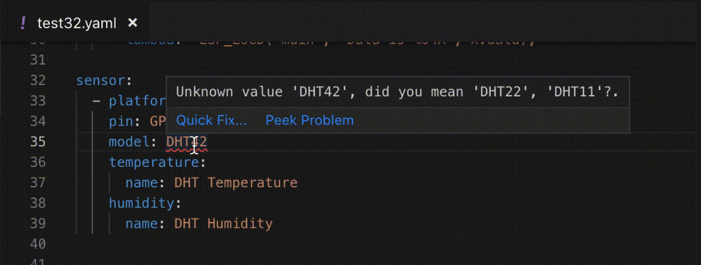

Changelog - Version 1.14.0 - November 1
=======================================

.. seo::
    :description: Changelog for ESPHome version 1.14.0.
    :image: /_static/changelog-1.14.0.png
    :author: Otto Winter
    :author_twitter: @OttoWinter_

.. imgtable::
    :columns: 5

    Captive Portal, components/captive_portal, wifi-strength-alert-outline.svg, dark-invert
    Visual Studio Code Plugin, https://marketplace.visualstudio.com/items?itemName=ESPHome.esphome-vscode, visual-studio-code.svg, dark-invert
    SIM800L, components/sim800l, sim800l.jpg
    DFPlayer, components/dfplayer, dfplayer.svg, dark-invert
    AS3935, components/sensor/as3935, as3935.jpg

    ATM90E32, components/sensor/atm90e32, atm90e32.jpg
    PZEM004T, components/sensor/pzem004t, pzem004t.svg
    PZEM AC, components/sensor/pzemac, pzem-ac.jpg
    PZEM DC, components/sensor/pzemdc, pzem-dc.jpg
    ADE7953, components/sensor/ade7953, ade7953.svg

    SenseAir, components/sensor/senseair, senseair_s8.jpg
    SCD30, components/sensor/scd30, scd30.jpg
    SHTCx, components/sensor/shtcx, shtc3.jpg
    STS3X, components/sensor/sts3x, sts3x.jpg
    SGP30, components/sensor/sgp30, sgp30.jpg

    Tx20, components/sensor/tx20, tx20.jpg
    VL53L0x, components/sensor/vl53l0x, vl53l0x.jpg
    Xiaomi CGG1, components/sensor/xiaomi_cgg1, xiaomi_cgg1.jpg
    Xiaomi LYWSD02, components/sensor/xiaomi_lywsd02, xiaomi_lywsd02.jpg
    ZyAura, components/sensor/zyaura, zgm053.jpg

    TLC59208F, components/output/tlc59208f, tlc59208f.jpg
    SM16716, components/output/sm16716, sm16716.svg
    Tuya Dimmer, components/light/tuya, brightness-medium.svg, dark-invert
    SSD1325, components/display/ssd1325, ssd1325.jpg
    Yashima IR Remote, components/climate/yashima, air-conditioner.svg, dark-invert

    MCP23008 I/O Expander, components/mcp230xx, mcp230xx.svg
    SX1509 I/O Expander, components/sx1509, sx1509.jpg

So... it's been a while since the last release...

But today - november 1 - the wait has finally ended! We're proud to announce ESPHome 1.14,
a release with the most features additions to date thanks to a ton of contributors!

Captive Portal
**************

First, we've heard your feedback in the feature request tracker. One of the highest requested
features has been to add a WiFi captive portal (also called "WiFiManager") capability to ESPHome.

.. figure:: /components/images/captive_portal-ui.png
    :align: center
    :width: 60.0%

With the new :doc:`captive portal </components/captive_portal>` component you can set up a fallback
WiFi hotspot that gets created if the ESP fails to connect to the WiFi network. If you're creating
a new device this is automatically enabled. To add this feature existing devices check out the
:doc:`captive portal example </components/captive_portal>`.

VSCode Plugin & New Integrations
********************************

:ghuser:`glmnet` has been very active in the ESPHome community - he not only managed a ton
of bug reports and feature requests, he also implemented some very interesting features:

- ESPHome now has a working VSCode plugin with live config validation support!
  Check out the `ESPHome plugin on the VSCode marketplace <https://marketplace.visualstudio.com/items?itemName=ESPHome.esphome-vscode>`__.
- The new :doc:`SIM800L integration </components/sim800l>` lets you send SMS and
  with :doc:`DF-Player </components/dfplayer>` you can play some music from your ESP 🎵

Thank you :ghuser:`glmnet` for your work!

New Sensors
***********

As you can see in the grid at the top of this page, there's been no shortage of sensors either!
There are all kinds of new sensor types here: from :doc:`lightning detectors ⚡️ </components/sensor/as3935>`,
the laser distance measuring :doc:`vl53l0x </components/sensor/vl53l0x>` to various environmental
sensors (thanks :ghuser:`TheEggi`, :ghuser:`valordk`!).

In list of supported power measuring chips has grown a lot with the 3-channel :doc:`ATM90E32 </components/sensor/atm90e32>`,
various PZEM-004Ts and the power monitoring chip in the :doc:`Shelly 2.5 </components/sensor/ade7953>`
(thanks :ghuser:`thompsa` :ghuser:`tsunglung`!).

Of course there's a lot more features in this release that didn't fit here anymore.
Just to name a few: new Xiaomi BLE devices are supported, the
:doc:`Tuya MCU protocol </components/light/tuya>` (thanks :ghuser:`ssieb` and :ghuser:`brandond`!) has been added and major
architectural parts of the ESPHome native API have changed to allow for faster
development.

Oh, and before we forget: ESPHome has reached 1.000 stars on GitHub!

As always, thanks to all contributors, bug reporters and patrons! Without you this would not
be possible!

Breaking Changes
----------------

- We have deprecated support for Python 2 installs. 1.14.x will still work with Python 2,
  but will print a warning. Starting with 1.15.0, ESPHome will require at least Python 3.6.
  Note: The Docker/Hass.io addon images already use Python 3 (:esphomepr:`784`, :esphomepr:`774`).

- The ``xiaomi_`` BLE platforms have been renamed to match their model numbers (:esphomepr:`755`).

   - ``xiaomi_mijia`` -> :doc:`xiaomi_lywsdcgq </components/sensor/xiaomi_lywsdcgq>`
   - ``xiaomi_miflora`` -> :doc:`xiaomi_hhccjcy01 </components/sensor/xiaomi_hhccjcy01>`

- As part of the addition of the captive portal component, the default ``reboot_timeout`` for
  ``wifi`` has been increased to 15 minutes from the previous 5 minutes (:esphomepr:`624`).

- The ESP32 LEDC ``bit_depth`` option has been removed. The best bit depth is now dynamically
  calculated (:esphomepr:`754`, :doc:`docs </components/output/ledc>`).

- For :doc:`pcf8574 </components/pcf8574>`, the ``INPUT_PULLUP`` option has been removed and replaced
  with ``INPUT`` (:esphomepr:`828`, :doc:`docs </components/pcf8574>`).

Release 1.14.1 - November 2
---------------------------

- docs: DIY Examples page :docspr:`395`
- esphome: refactored xiaomi ble data parsing :esphomepr:`823` by :ghuser:`Alex9779`
- docs: Document UART stop_bits :docspr:`396`
- esphome: Fix wizard mkdir :esphomepr:`824`
- esphome: Move native API enums to new namespace :esphomepr:`825`
- esphome: Fix update-all input in dashboard :esphomepr:`826`
- esphome: Remove PCF8574 input_pullup mode and cleanup :esphomepr:`828`
- esphome: Add servo missing restore option to codegen :esphomepr:`829`
- docs: Document missing servo restore option :docspr:`398`

Release 1.14.2 - November 3
---------------------------

- esphome: Fix weird ESP8266 wifi crashes :esphomepr:`831`

Release 1.14.3 - November 17
----------------------------

- docs: Fix typo: as3935 sensor docs :docspr:`401` by :ghuser:`TheJulianJES`
- docs: Remove references to scan_interval :docspr:`400` by :ghuser:`marrold`
- esphome: ESP8266 remove default opmode check :esphomepr:`835`
- esphome: WiFi AP apply manual ip settings :esphomepr:`836`
- esphome: Fix ESP32 rotary encoder :esphomepr:`834`
- esphome: Fix homeassistant.service schema lambda :esphomepr:`833`
- esphome: Update platformio libraries :esphomepr:`837`
- docs: Update brilliant-mirabella-genio-smart-plugs.rst - Added Gosund… :docspr:`402` by :ghuser:`Taigar2015`
- esphome: Update variable in scheduler :esphomepr:`838`
- esphome: Fix sun calculations for negative sun declination :esphomepr:`839`
- docs: Update diy.rst :docspr:`404` by :ghuser:`kvvoff`
- docs: DIY Examples : add Custom ESPHome for Wofea Alarm :docspr:`405` by :ghuser:`nbergont`
- docs: Update Mirabella Genio red LED GPIO :docspr:`406` by :ghuser:`ankycooper`
- esphome: fix missing checks of is_playing condition :esphomepr:`844` by :ghuser:`glmnet`
- docs: Update lcd_display.rst :docspr:`411` by :ghuser:`Destix`
- esphome: Add wifi output_power setting :esphomepr:`853`
- esphome: Add missing state attribute :esphomepr:`851`
- esphome: Fix neopixelbus missing method pins :esphomepr:`848`
- esphome: Fix sensor force_update native API :esphomepr:`847`
- esphome: Web server CORS headers :esphomepr:`840`
- esphome: Check DHT sensor exists before publishing :esphomepr:`850`
- esphome: Adjust some units :esphomepr:`852`
- esphome: Fix PZEM004T v2 :esphomepr:`846`
- esphome: Mark python 3.5 support deprecated :esphomepr:`849`
- docs: document the new has_position parameter for the template cover :docspr:`410` by :ghuser:`ssieb`
- esphome: add position reporting to the template cover :esphomepr:`821` by :ghuser:`ssieb`
- esphome: Atm90e32 pf fix :esphomepr:`841` by :ghuser:`Diramu`
- esphome: Switch to 115200 baud upload if 460800 fails :esphomepr:`856`
- esphome: Fix logger uart conflict check :esphomepr:`858` by :ghuser:`brandond`
- esphome: Tuya: Fix init sequence and handle wifi test command :esphomepr:`820` by :ghuser:`brandond`
- docs: add Topersun smart plug :docspr:`413` by :ghuser:`hmoffatt`
- esphome: Improve WiFi disconnect messages :esphomepr:`857`
- esphome: Fix MQTT python 3 stringify IPAddress Type :esphomepr:`864`
- esphome: Revert ESP32 BLE Tracker defaults :esphomepr:`863`
- esphome: Change ESP8266 default wifi output power :esphomepr:`862`

Release 1.14.4 - June 5
-----------------------

- docs: Added Android Beacon MQTT app :docspr:`417` by :ghuser:`turbo-lab`
- esphome: fix the problem of missing part of advertising packet when activ… :esphomepr:`868` by :ghuser:`warpzone`
- docs: dfplayer updates :docspr:`421` by :ghuser:`glmnet`
- docs: Fix time id conflict :docspr:`418` by :ghuser:`guiguid`
- docs: Cookbook for Sonoff Light Switches :docspr:`407` by :ghuser:`bensuffolk`
- esphome: fix climate_ir on receive optional :esphomepr:`897` by :ghuser:`glmnet`
- esphome: Fix MQTT logs Int or String expected Python 3 :esphomepr:`898`
- esphome: web_server call setup_controller :esphomepr:`899`
- esphome: Ignore ESP32 Camera unknown framesizes :esphomepr:`901`
- esphome: Update ESP32 BLE ADV parse to match BLE spec :esphomepr:`904`
- esphome: Add ESP8266 core v2.6.2 :esphomepr:`905`
- docs: Add doc for color correction of rgb* lights :docspr:`431` by :ghuser:`nickw444`
- docs: Use .timestamp instead of .time in time docs :docspr:`435` by :ghuser:`davidjb`
- docs: DIY Examples : Added SW420 Vibration Sensor with Remote Notifications :docspr:`436` by :ghuser:`rmooreID`
- docs: Fix broken link :docspr:`437` by :ghuser:`richrd`
- docs: Update getting_started_command_line.rst :docspr:`461` by :ghuser:`CyanoFresh`
- docs: Added degree symbol output on ~ for MAX7219 :docspr:`376` by :ghuser:`cyberplant`
- docs: change "tracker" to "presence" :docspr:`465` by :ghuser:`spattinson`
- docs: On_sunrise was listed twice in description. :docspr:`464` by :ghuser:`Mechotronic`
- docs: Patch 3 :docspr:`460` by :ghuser:`Valcob`
- docs: fixed non working example :docspr:`381` by :ghuser:`danibjor`
- docs: Added my custom component, now with correct syntax :docspr:`454` by :ghuser:`nldroid`
- docs: faq reboot_timeout :docspr:`472` by :ghuser:`glmnet`
- docs: my9231->bit_depth: parameter name and sonoff B1 :docspr:`489` by :ghuser:`anduchs`
- docs: New DIY project about Cat Feeder :docspr:`439` by :ghuser:`rubengargar`
- docs: Update diy.rst :docspr:`493` by :ghuser:`brianhanifin`
- docs: Add my ESPHome configs :docspr:`492` by :ghuser:`nuttytree`
- docs: Brightness feature not included in doc. :docspr:`445` by :ghuser:`tubalainen`
- docs: remove apostrophe :docspr:`504` by :ghuser:`perjury`
- docs: Add UART-based Mitsibishi HeatPump Component :docspr:`506` by :ghuser:`geoffdavis`
- docs: Update pzemac.rst :docspr:`495` by :ghuser:`Francisk0`
- docs: Fix link syntax :docspr:`507` by :ghuser:`geoffdavis`
- docs: Typo fix :docspr:`498` by :ghuser:`napieraj`
- docs: Fix some typos in Sonoff basic light switch :docspr:`480` by :ghuser:`kaykayehnn`
- docs: Wrong IC :docspr:`499` by :ghuser:`Tuckie`
- docs: small mistype fix :docspr:`477` by :ghuser:`trylika`
- docs: Update sonoff.rst :docspr:`470` by :ghuser:`TBobsin`
- docs: Update sonoff-t1-3.rst :docspr:`497` by :ghuser:`RockBomber`
- docs: remove uppercase allowed in names :docspr:`487` by :ghuser:`truglodite`
- docs: Update ssd1306.rst :docspr:`481` by :ghuser:`Valcob`
- docs: Update board for Sonoff and link to Tasmota :docspr:`484` by :ghuser:`sillyfrog`
- docs: Update migrate_sonoff_tasmota.rst :docspr:`483` by :ghuser:`jasonehines`
- docs: added rgbww light using pwm driver :docspr:`482` by :ghuser:`morph027`
- docs: add a note about the log level of dump: all :docspr:`475` by :ghuser:`drewp`
- docs: ifan02 cookbook :docspr:`218` by :ghuser:`quazzie`
- docs: Add documentation for cwww and rgbww constant_brightness variables. :docspr:`530` by :ghuser:`kroimon`
- docs: remove link to Adafruit :docspr:`531` by :ghuser:`ebaschiera`
- docs: Revert "Add documentation for cwww and rgbww constant_brightness vari… :docspr:`539` by :ghuser:`glmnet`
- docs: Add Stepper Motor blinds to diy examples :docspr:`534` by :ghuser:`icarome`
- docs: Update sonoff.rst :docspr:`549` by :ghuser:`MrZetor`
- docs: Improve LEDC documentation :docspr:`557` by :ghuser:`Skaronator`
- docs: Update wifi.rst :docspr:`562` by :ghuser:`kbouchard111`
- docs: Add unit_of_measurement to make graphing happens :docspr:`569` by :ghuser:`deftdawg`
- docs: Simple grammar change. :docspr:`578` by :ghuser:`mnaz`
- docs: Fix typos :docspr:`561` by :ghuser:`mje-nz`
- docs: Adding example of how to use a buzzer :docspr:`570` by :ghuser:`declanshanaghy`
- docs: Deleted Warning because the component is already tested :docspr:`615` by :ghuser:`deltazerorsan`
- docs: Update datasheet URL on SHTCX page :docspr:`598` by :ghuser:`JeffResc`
- docs: Update datagram URL on TX20 page :docspr:`599` by :ghuser:`JeffResc`
- docs: Update datasheet URL on SCD30 page :docspr:`600` by :ghuser:`JeffResc`
- docs: Update datasheet URL on STS3X page :docspr:`602` by :ghuser:`JeffResc`
- docs: Update datasheet URL on SGP30 page :docspr:`601` by :ghuser:`JeffResc`
- docs: Update Home Assistant custom component URL on contributing guide page :docspr:`603` by :ghuser:`JeffResc`
- docs: Update WaveShare E-Paper URL on WaveShare E-Paper page :docspr:`597` by :ghuser:`JeffResc`
- docs: Fix copy/paste error :docspr:`574` by :ghuser:`mniess`
- docs: Update pulse_counter.rst :docspr:`609` by :ghuser:`m1ch`
- docs: Add smart intercom blogpost :docspr:`621` by :ghuser:`frog32`
- docs: Minor spelling :docspr:`622` by :ghuser:`AalianKhan`
- docs: Added NEO Coolcam :docspr:`496` by :ghuser:`nldroid`
- docs: pzemac energy support :docspr:`514` by :ghuser:`rradar`
- docs: Revert "pzemac energy support" :docspr:`623` by :ghuser:`glmnet`
- docs: Changed miflora platforms :docspr:`586` by :ghuser:`Guyohms`
- docs: Update docs to reflect ssd1327 support :docspr:`500` by :ghuser:`igg`
- docs: Typo: NEC -> Sony :docspr:`624` by :ghuser:`gitolicious`
- docs: Not every nodeMCU board supports 12V :docspr:`626` by :ghuser:`Laess3r`
- docs: Revert "Update docs to reflect ssd1327 support" :docspr:`634` by :ghuser:`glmnet`

Notable Changes & New Features
------------------------------

- Dashboard Interface: Add an "Update all" button (:esphomepr:`615`).
- Uploads over USB are now about 4 times faster (:esphomepr:`761`).
- `ESPHome-Flasher v1.2.0 <https://github.com/esphome/esphome-flasher/releases/tag/v1.2.0>`__ has been
  released with fixes for ESP32s and faster uploads.
- All :doc:`native API </components/api>` communication stubs are now automatically
  generated using automated scripts. This is a big step towards making the API more flexible, for
  example cross-device communication (:esphomepr:`633`).
- New class :apiclass:`CustomAPIDevice` to declare user-defined services straight from custom components.
  See the updated :doc:`custom component guide </custom/custom_component>`.
- :ref:`Sensors <config-sensor>` have a new ``force_update`` option (:esphomepr:`783`).
- Add GPIO Switch :ref:`interlock_wait_time <switch-gpio-interlocking>` (:esphomepr:`777`).
- Add a configurable priority for WiFi network selection (:esphomepr:`658`, :doc:`docs </components/wifi>`).
- Add :ref:`script.wait <script-wait_action>` action (:esphomepr:`778`).
- Dashboard Interface: Add an interface for editing ``secrets.yaml`` (:esphomepr:`672` by :ghuser:`Anonym-tsk`).
- Dashboard Interface: Authorization by username and password for non-Hass.io installs
  (:esphomepr:`668` by :ghuser:`Anonym-tsk`).
- Dashboard Interface: The material icons font is now shipped with ESPHome
  (:esphomepr:`703` by :ghuser:`Anonym-tsk`).
- Add :ref:`output.ledc.set_frequency <output-ledc-set_frequency_action>` action (:esphomepr:`754`).
- Changing from an effect to a static color for addressable light now
  has per-LED transitions (:esphomepr:`750`).
- Add :ref:`rotary_encoder.set_value <sensor-rotary_encoder-set_value_action>` action (:esphomepr:`747`).
- You can now specify per-device descriptions in the dashboard interface
  (:esphomepr:`707` by :ghuser:`Anonym-tsk`, :doc:`docs </components/esphome>`).
- The :doc:`SPI bus </components/spi>` now sends data over the hardware SPI bus if possible.
  This can result in significant speedups for displays (:esphomepr:`623`).
- Add ``delayed_on_off`` binary_sensor filter (:esphomepr:`700` by :ghuser:`kepten`,
  :ref:`docs <sensor-filters>`).
- Implement ``median`` sensor filter (:esphomepr:`697` by :ghuser:`jvanderneutstulen`,
  :ref:`docs <sensor-filters>`).
- A function scheduler now handles all of ESPHome's timeout/interval calls, replacing the
  previous per-component implementation (:esphomepr:`609`).
- Add support for calibrating MH-Z19 sensors (:esphomepr:`683` by :ghuser:`Anonym-tsk`, :doc:`docs </components/sensor/mhz19>`).
- Add BLE scan parameters for improving BLE detection percentage
  (:esphomepr:`769`, :doc:`docs </components/esp32_ble_tracker>`).
- Add configurable ignore bits to rc_switch_raw codes (:esphomepr:`650` by :ghuser:`mtl010957`,
  :doc:`docs </components/remote_receiver>`).
- New ``restore`` option has been added to :doc:`servos </components/servo>` (:esphomepr:`829`).
- Add IR receiver support for coolix climate devices (:esphomepr:`645` by :ghuser:`glmnet`, :doc:`docs </components/climate/climate_ir>`).
- Add :ref:`calibrate_polynomial <sensor-calibrate_polynomial>` sensor filter (:esphomepr:`642`).
- Allow setting the initial mode of HLW8012 sensors (:esphomepr:`611` by :ghuser:`brandond`, :doc:`docs </components/sensor/hlw8012>`).
- Add tilt actions to :doc:`template cover </components/cover/template>` (:esphomepr:`577` by :ghuser:`mtl010957`).
- Add backlight handling for lcd_pcf8574 (:esphomepr:`573` by :ghuser:`adarazs`, :doc:`docs </components/display/lcd_display>`).

All changes
-----------

- esphome: CLI show version better :esphomepr:`581`
- esphome: SM16716 support :esphomepr:`541`
- docs: Add documentation for SM16716 output component. :docspr:`217` by :ghuser:`kll`
- docs: Document the backlight control for lcd_pcf8574 :docspr:`261` by :ghuser:`adarazs`
- esphome: Add backlight handling for lcd_pcf8574 :esphomepr:`573` by :ghuser:`adarazs` (new-feature)
- esphome: clear and disable editor while fetching contents :esphomepr:`603` by :ghuser:`gitolicious`
- esphome: Scan length for AddressableScanEffect :esphomepr:`608` by :ghuser:`majorpeter` (new-feature)
- docs: Scaneffectlength :docspr:`264` by :ghuser:`majorpeter`
- esphome: Fix ForCondition time duration check :esphomepr:`610` by :ghuser:`ptatrai` (cherry-picked)
- esphome: DHT22 ignore invalid values :esphomepr:`614` (cherry-picked)
- esphome: Template Cover don't auto-set current_operation :esphomepr:`612` (cherry-picked)
- esphome: Fix Hass.io addon SSL :esphomepr:`613` (cherry-picked)
- esphome: Fix remote_receiver always shows sony :esphomepr:`617` (cherry-picked)
- esphome: Make ForCondition a component :esphomepr:`616` (cherry-picked)
- esphome: Update docker base image to 1.8.0 :esphomepr:`618` (cherry-picked)
- esphome: Fix integration sensor, add test :esphomepr:`619` (cherry-picked)
- esphome: Fix sun default elevation :esphomepr:`620` (cherry-picked)
- esphome: Allow setting the initial mode of HLW8012 sensors :esphomepr:`611` by :ghuser:`brandond` (new-feature)
- docs: Allow setting the initial mode of HLW8012 sensors :docspr:`268` by :ghuser:`brandond`
- esphome: Add more efficient SPI implementation :esphomepr:`622`
- esphome: Allow id() syntax for custom code :esphomepr:`621`
- esphome: Dashboard Update all button :esphomepr:`615` (new-feature)
- esphome: Add central function scheduler :esphomepr:`609`
- esphome: Update base image to 1.8.3 :esphomepr:`625` (cherry-picked)
- esphome: Fix status binary sensor for MQTT :esphomepr:`628` (cherry-picked)
- esphome: Work around ESP32 BLE issue :esphomepr:`626` (cherry-picked)
- esphome: Work around ESP32 core WiFi Bug :esphomepr:`627` (cherry-picked)
- esphome: Add HW SPI support :esphomepr:`623` (new-feature)
- esphome: Captive Portal :esphomepr:`624` (breaking-change)
- esphome: Fix ESP32 RCSwitch Dump Stack Smash Protection :esphomepr:`636` (cherry-picked)
- esphome: Fix russia timezone detection :esphomepr:`637` (cherry-picked)
- esphome: Fix globals.set :esphomepr:`635` (cherry-picked)
- esphome: Fix version.h file :esphomepr:`630` (cherry-picked)
- esphome: Fix remote_receiver raw binary sensor :esphomepr:`639` (cherry-picked)
- esphome: Re-add CustomMQTTDevice class :esphomepr:`640` (cherry-picked)
- esphome: Yashima climate new component :esphomepr:`634` by :ghuser:`diraimondo`
- docs: Add Yashima Climate component docs :docspr:`275` by :ghuser:`diraimondo`
- esphome: Fix home assistant binary sensor initial state :esphomepr:`632` by :ghuser:`glmnet`
- esphome: Atmel M90E32AS Energy Metering IC. Found in CircuitSetup 2chan and 6chan energy meterss :esphomepr:`629` by :ghuser:`thompsa`
- docs: Add docs for atm90e32 sensor :docspr:`271` by :ghuser:`thompsa`
- esphome: Add set_threshold and get_value methods to ESP32TouchBinarySensor. :esphomepr:`631` by :ghuser:`rnauber`
- esphome: Make logger string memory usage more efficient :esphomepr:`641`
- docs: Add SIM800L docs :docspr:`257` by :ghuser:`glmnet`
- esphome: SMS Sender / Receiver :esphomepr:`522` by :ghuser:`glmnet`
- esphome: Create Protobuf Plugin for automatically generating native API stubs :esphomepr:`633`
- esphome: Template tilt cover :esphomepr:`577` by :ghuser:`mtl010957` (new-feature)
- esphome: Provide the lights current color to the addressable_lambda_effect. :esphomepr:`646` by :ghuser:`rnauber`
- docs: Update sun.rst :docspr:`278` by :ghuser:`pove`
- esphome: Fixed rc_switch dump off by one bit :esphomepr:`652` by :ghuser:`mtl010957`
- esphome: Adding ignore bits to narrow compare of received codes :esphomepr:`650` by :ghuser:`mtl010957` (new-feature)
- esphome: Fix remote_transmitter wait time unit :esphomepr:`654`
- esphome: Update dependencies :esphomepr:`653`
- esphome: CT Clamp ADS1115 Improvements :esphomepr:`647`
- esphome: Add calibrate_polynomial sensor filter :esphomepr:`642` (new-feature)
- esphome: WIP: ESP8266 work on connection issues :esphomepr:`648`
- docs: Added docs for ignore bit setting on rc_switch_raw and fixed ref links :docspr:`279` by :ghuser:`mtl010957`
- docs: Absolute humidity calculation description :docspr:`283` by :ghuser:`tomlut`
- docs: ZyAura CO2 / Temperature / Humidity Sensor :docspr:`281` by :ghuser:`Anonym-tsk`
- esphome: ZyAura CO2 / Temperature / Humidity Sensor :esphomepr:`656` by :ghuser:`Anonym-tsk`
- esphome: Fix deep sleep on_shutdown hooks :esphomepr:`660`
- esphome: ESP32 Use NVS directly :esphomepr:`659`
- docs: Added TX20/TX23 sensor documentation :docspr:`150` by :ghuser:`TheEggi`
- esphome: added tx20 wind speed sensor :esphomepr:`275` by :ghuser:`TheEggi`
- docs: Added docs for tilt capability in template cover :docspr:`260` by :ghuser:`mtl010957`
- docs: Add description next to title :docspr:`227` by :ghuser:`jjok`
- esphome: WiFi networks priority :esphomepr:`658` (new-feature)
- esphome: Change ESP32 default power_save_mode to light :esphomepr:`661`
- docs: Added TTGO T-Journal :docspr:`289` by :ghuser:`bwente`
- docs: Updated confusing deep_sleep.prevent documentation :docspr:`287` by :ghuser:`ofalvai`
- docs: Fix typo in transmit_sony documentation :docspr:`299` by :ghuser:`davericher`
- esphome: Restore sending "None" effect type :esphomepr:`667` by :ghuser:`tribut`
- esphome: fix missing schedule call :esphomepr:`690` by :ghuser:`glmnet`
- docs: Update logger.rst :docspr:`313` by :ghuser:`srg74`
- esphome: Remove double publish_state in ultrasonic sensor :esphomepr:`696` by :ghuser:`brandond`
- esphome: Local Material Icons :esphomepr:`703` by :ghuser:`Anonym-tsk`
- esphome: Corrected ESP32 hardware UART pins :esphomepr:`701` by :ghuser:`jwozny`
- esphome: Fix mqtt_text_sensor to honor unique_id when set. :esphomepr:`698` by :ghuser:`middelink`
- docs: Minor changes to the setup steps :docspr:`327` by :ghuser:`fabaff`
- esphome: Fix duplicate set_update_interval() calls on same component :esphomepr:`693` by :ghuser:`middelink`
- esphome: MH-Z19 calibration support :esphomepr:`683` by :ghuser:`Anonym-tsk` (new-feature)
- esphome: Implement median filter :esphomepr:`697` by :ghuser:`jvanderneutstulen` (new-feature)
- docs: Median filter :docspr:`319` by :ghuser:`jvanderneutstulen`
- docs: MH-Z19 calibration support :docspr:`312` by :ghuser:`Anonym-tsk`
- docs: Update names :docspr:`326` by :ghuser:`fabaff`
- docs: Fix header level :docspr:`325` by :ghuser:`fabaff`
- docs: 7.50in waveshare e-paper works :docspr:`321` by :ghuser:`rafl`
- docs: Fix api.proto url :docspr:`310` by :ghuser:`pstuifzand`
- esphome: add xiaomi BLE Thermometer lywsd02 model support :esphomepr:`664` by :ghuser:`junnikokuki`
- docs: Add Sonoff Mini  to 'Generic Sonoff' page :docspr:`320` by :ghuser:`Infinitte`
- esphome: Fix GPS time source. :esphomepr:`704`
- docs: Add configuration example for TTGO T-Camera v1.7 :docspr:`318` by :ghuser:`erichiller`
- esphome: License for Material Design Icons :esphomepr:`708` by :ghuser:`Anonym-tsk`
- docs: LYWSD02  :docspr:`292` by :ghuser:`G1K`
- esphome: add time based cover, has built in endstop :esphomepr:`665` by :ghuser:`glmnet` (new-feature)
- esphome: Add delayed_on_off binary_sensor filter :esphomepr:`700` by :ghuser:`kepten` (new-feature)
- docs: Add doc for delayed_on_off binary_sensor filter :docspr:`324` by :ghuser:`kepten`
- esphome: fix wifi info :esphomepr:`709` by :ghuser:`glmnet`
- docs: Add description of id Parameter :docspr:`329` by :ghuser:`guptamp`
- esphome: fix integration sensor :esphomepr:`711` by :ghuser:`glmnet`
- esphome: Add support for Sensirion SCD30 CO2 sensors :esphomepr:`712` by :ghuser:`valordk`
- docs: Add documentation for Sensirion SCD30 CO2 sensors :docspr:`333` by :ghuser:`valordk`
- esphome: Fixes sim800l :esphomepr:`678` by :ghuser:`glmnet`
- docs: Update esp32_camera.rst jpeg quality :docspr:`332` by :ghuser:`glogiotatidis`
- docs: add has_built_in_endstop docs :docspr:`302` by :ghuser:`glmnet`
- docs: Update incorrect GPIO pin for Mirabella Genio Cold + Warm White… :docspr:`337` by :ghuser:`epetousis`
- esphome: Use default format to render FloatLiteral :esphomepr:`717` by :ghuser:`fritzm`
- esphome: Add coolix receiver :esphomepr:`645` by :ghuser:`glmnet` (new-feature)
- docs: add coolix receiver :docspr:`288` by :ghuser:`glmnet`
- esphome: Fix https://github.com/esphome/issues/issues/658 :esphomepr:`724` by :ghuser:`fake-name`
- docs: Update hdc1080.rst :docspr:`343` by :ghuser:`magnusja`
- esphome: Update MANIFEST.in to fix esphome/issues#650 :esphomepr:`733` by :ghuser:`shbatm`
- docs: Fix link to light-is_on_condition :docspr:`345` by :ghuser:`myplacedk`
- esphome: fixes samsung ir :esphomepr:`738` by :ghuser:`glmnet`
- esphome: Allow 64 bit codes and add nexa remote support. :esphomepr:`662` by :ghuser:`abmantis` (new-feature)
- docs: Fix, optimize mijia :docspr:`293` by :ghuser:`G1K`
- esphome: AS3935 Lightning sensor :esphomepr:`666` by :ghuser:`TheEggi`
- esphome: Full height log window :esphomepr:`673` by :ghuser:`Anonym-tsk`
- docs: Make it clearer that only one deep sleep component is allowed. :docspr:`303` by :ghuser:`jeff-h`
- esphome: Secrets editor :esphomepr:`672` by :ghuser:`Anonym-tsk` (new-feature)
- esphome: Authorization by username and password :esphomepr:`668` by :ghuser:`Anonym-tsk` (new-feature)
- esphome: Basic Auth for web_server component :esphomepr:`674` by :ghuser:`Anonym-tsk`
- docs: Basic Auth for web_server component :docspr:`304` by :ghuser:`Anonym-tsk`
- esphome: Improve SHT3xD reconnect handling :esphomepr:`675` by :ghuser:`valordk`
- docs: Fix description of the sensor :docspr:`309` by :ghuser:`mpettitt`
- esphome: Device description in dashboard :esphomepr:`707` by :ghuser:`Anonym-tsk` (new-feature)
- docs: Device description in dashboard :docspr:`335` by :ghuser:`Anonym-tsk`
- esphome: support for the sx1509 i2c device :esphomepr:`651` by :ghuser:`mvturnho`
- esphome: Add support for TI TLC59208F :esphomepr:`718` by :ghuser:`tamisoft`
- docs: ADD TLC59208F documentation :docspr:`338` by :ghuser:`tamisoft`
- docs: Add Xiaomi Cleargrass Sensor Documentation :docspr:`346` by :ghuser:`sermayoral`
- esphome: Add Xiaomi Cleargrass Temperature and Humidity Sensor :esphomepr:`735` by :ghuser:`sermayoral`
- docs: The 4.20in display works fine :docspr:`359` by :ghuser:`fredrike`
- docs: Update sonoff.rst :docspr:`341` by :ghuser:`ZabojnikM`
- esphome: Fix for PCF8574 output chattering at the start/reboot :esphomepr:`744` by :ghuser:`amishv`
- esphome: Add ADE7953 Support :esphomepr:`593`
- esphome: refactored xiaomi sensors :esphomepr:`755` by :ghuser:`Alex9779` (breaking-change)
- docs: Xiaomi refactor :docspr:`361` by :ghuser:`Alex9779`
- esphome: fix CGG1 log message :esphomepr:`757` by :ghuser:`Alex9779`
- docs: Add link to index.rst check list item :docspr:`363` by :ghuser:`glmnet`
- docs: Added cookbook for Teckin SB50 Bulb :docspr:`360` by :ghuser:`nebula-it`
- esphome: Add mcp23008 support :esphomepr:`649` by :ghuser:`TomFahey`
- docs: Adding the IO2 pin to the GPIO pin list :docspr:`354` by :ghuser:`SqyD`
- docs: Updated MCP23017 Component To Cover 8 & 16 Port Chips :docspr:`277` by :ghuser:`TomFahey`
- esphome: Brightness ssd1306 :esphomepr:`723` by :ghuser:`glmnet`
- esphome: Fix potential ISR digital_write issue :esphomepr:`753`
- esphome: Fix addressable light fade to black function :esphomepr:`752`
- esphome: Make UART flush function consistent :esphomepr:`748`
- esphome: Update and pin all python requirements :esphomepr:`759`
- esphome: Fix MCP23017 setup priority :esphomepr:`751`
- esphome: Add rotary_encoder.set_value action :esphomepr:`747` (new-feature)
- esphome: Fix strobe/flicker effect not using selected value :esphomepr:`749`
- esphome: Add support for TTGO ePaper module :esphomepr:`730` by :ghuser:`thomasklingbeil`
- esphome: BME280: Increase sensor timeout :esphomepr:`727` by :ghuser:`lobradov`
- esphome: Base climate ir :esphomepr:`726` by :ghuser:`glmnet`
- docs: Add documentation for TTGO ePaper :docspr:`342` by :ghuser:`thomasklingbeil`
- esphome: Fix dallas not unknown :esphomepr:`716`
- esphome: Integration sensor use double precision :esphomepr:`715`
- esphome: calibrate_linear check not all from values same :esphomepr:`714`
- esphome: SenseAir S8 CO2 sensor support :esphomepr:`705` by :ghuser:`Anonym-tsk`
- docs: SenseAir S8 CO2 sensor support :docspr:`330` by :ghuser:`Anonym-tsk`
- esphome: Fix remote_transmitter type_a encoding :esphomepr:`742` by :ghuser:`nicuh`
- esphome: vscode support check file exists :esphomepr:`763` by :ghuser:`glmnet`
- docs: Proof reading changes :docspr:`364` by :ghuser:`thenameiwantedwastaken`
- docs: add tcl112 receiver docs :docspr:`365` by :ghuser:`glmnet`
- esphome: add tcl112 receiver :esphomepr:`762` by :ghuser:`glmnet`
- esphome: Sensor filter_out rounded :esphomepr:`765`
- esphome: Use higher default baudrate for USB upload :esphomepr:`761`
- esphome: add support for climate action :esphomepr:`720` by :ghuser:`marcelveldt`
- esphome: Add LEDC set_frequency action :esphomepr:`754` (new-feature)
- esphome: Fork some base libraries :esphomepr:`758`
- esphome: Update ESP8266/ESP32 bases :esphomepr:`760`
- esphome: Captive portal fixes :esphomepr:`766`
- esphome: Fix typo in Component::set_interval :esphomepr:`767`
- esphome: Fix platformio monkey patch :esphomepr:`768`
- esphome: Addressable light transition :esphomepr:`750` (new-feature)
- esphome: Fixes for Python 3 :esphomepr:`702` by :ghuser:`fabaff`
- esphome: Add BLE scan parameters :esphomepr:`769` (new-feature)
- esphome: Filter some debug lines from PlatformIO in output :esphomepr:`771`
- esphome: ESP32 Upgrade AsyncTCP to 1.1.1 :esphomepr:`773`
- esphome: Switch to Python 3 for docker installs :esphomepr:`774`
- docs: Add script.wait action :docspr:`367` (new-feature)
- docs: Add ESP32 scan parameters :docspr:`368`
- docs: Hint how to include HA secrets.yaml instead :docspr:`362` by :ghuser:`rlowens`
- esphome: Add SSD1325 Display Component :esphomepr:`736` by :ghuser:`evandcoleman` (cherry-picked)
- docs: Add documentation for SSD1325 OLED displays :docspr:`347` by :ghuser:`evandcoleman` (cherry-picked)
- esphome: Add support for SGP30 eCO2 and TVOC sensors :esphomepr:`679` by :ghuser:`valordk` (cherry-picked)
- docs: Add documentation for SGP30 eCO2 and TVOC sensors :docspr:`308` by :ghuser:`valordk` (cherry-picked)
- esphome: Add support for SHTCx Temperature sensors :esphomepr:`676` by :ghuser:`valordk` (cherry-picked)
- esphome: Add support for STS3x Temperature sensors :esphomepr:`669` by :ghuser:`valordk` (cherry-picked)
- docs: Add documentation for SHTCx Temperature sensors :docspr:`305` by :ghuser:`valordk` (cherry-picked)
- docs: Add documentation for STS3x Temperature sensors :docspr:`300` by :ghuser:`valordk` (cherry-picked)
- esphome: Add dfplayer mini component :esphomepr:`655` by :ghuser:`glmnet` (cherry-picked)
- docs: Add DFPlayer docs :docspr:`306` by :ghuser:`glmnet` (cherry-picked)
- docs: Add rotary_encoder.set_value action :docspr:`358` (cherry-picked)
- esphome: Add new component for Tuya dimmers :esphomepr:`743` by :ghuser:`ssieb` (cherry-picked)
- docs: Add documentation for new Tuya dimmer component :docspr:`353` by :ghuser:`ssieb` (cherry-picked)
- docs: SX1509 device documentation :docspr:`315` by :ghuser:`mvturnho` (cherry-picked)
- docs: Fix typo :docspr:`352` by :ghuser:`bonanitech`
- docs: Minor typo :docspr:`349` by :ghuser:`dannysauer`
- docs: Clarify NodeMCU ESP8266 VIN pin :docspr:`340` by :ghuser:`Justahobby01`
- docs: Add TorchStar LED controller to 'Generic Sonoff' page :docspr:`351` by :ghuser:`dale3h`
- docs: Remove references to Python 2 :docspr:`328` by :ghuser:`fabaff` (cherry-picked)
- docs: Cookbook Guide for Zemismart LED RGBW Downlights :docspr:`297` by :ghuser:`cryptelli`
- docs: Authorization by username and password :docspr:`296` by :ghuser:`Anonym-tsk` (cherry-picked)
- docs: AS3935 Lightning sensor :docspr:`294` by :ghuser:`TheEggi` (cherry-picked)
- docs: Cookbook ape :docspr:`334` by :ghuser:`glmnet`
- esphome: Add lint check for integer constants :esphomepr:`775`
- docs: fix indent on sample :docspr:`369` by :ghuser:`glmnet` (cherry-picked)
- esphome: Add script.wait action :esphomepr:`778` (cherry-picked) (new-feature)
- docs: update esp32camera documentation - note about PWM :docspr:`348` by :ghuser:`h0--`
- esphome: Vl53l0x :esphomepr:`644` (cherry-picked)
- esphome: Add GPIO Switch interlock wait time :esphomepr:`777` (cherry-picked) (new-feature)
- esphome: Add PZEM004T/PZEMAC/PZEMDC Support :esphomepr:`587` (cherry-picked)
- esphome: Update AsyncMQTTClient/ESPAsyncWebServer :esphomepr:`779` (cherry-picked)
- esphome: Implementation of LCD Clear :esphomepr:`781` by :ghuser:`amishv` (cherry-picked)
- docs: fixed typo :docspr:`370` by :ghuser:`amishv`
- esphome: Add sensor force_update option :esphomepr:`783` (cherry-picked) (new-feature)
- docs: Add sensor force_update option :docspr:`371` (cherry-picked)
- docs: Spelling and grammar fixes :docspr:`372` by :ghuser:`scop`
- docs: Add missing actual install step in getting started with Hass.io :docspr:`373` by :ghuser:`scop`
- esphome: Update docker base image to 2.0.1 :esphomepr:`785` (cherry-picked)
- esphome: Fix ledc can't find bit_depth :esphomepr:`786` (cherry-picked)
- esphome: web_server_base AUTO_LOAD includes ASYNC_TCP :esphomepr:`788` by :ghuser:`Schnilz` (cherry-picked)
- esphome: Add Python 2 deprecation notice :esphomepr:`784` (breaking-change) (cherry-picked)
- docs: Update time.rst to add GPS as source :docspr:`375` by :ghuser:`mbo18`
- esphome: Fix modbus CRC calculation :esphomepr:`789` (cherry-picked)
- esphome: Add additional custom lint checks :esphomepr:`790` (cherry-picked)
- esphome: Implement more dump_configs :esphomepr:`791` (cherry-picked)
- esphome: Add missing include - fixes missing GPIOPin definition :esphomepr:`794` by :ghuser:`cjd` (cherry-picked)
- esphome: Fix MQTT not showing logs with Python 3 :esphomepr:`797` (cherry-picked)
- esphome: Fix scheduler first execution :esphomepr:`798` (cherry-picked)
- esphome: Make file generation saving atomic :esphomepr:`792` (cherry-picked)
- esphome: Fujitsu General climate new component :esphomepr:`677` by :ghuser:`31337Ghost` (cherry-picked)
- esphome: Warn when UART and logger operating on same bus :esphomepr:`803` (cherry-picked)
- esphome: Add Tuya message for no datapoints :esphomepr:`804` (cherry-picked)
- esphome: AS3935 Use normal pin polling for IRQ :esphomepr:`805` (cherry-picked)
- esphome: Fix modbus register :esphomepr:`806` (cherry-picked)
- esphome: Fix web server transition length truncated :esphomepr:`807` (cherry-picked)
- docs: fix xiaomi docs :docspr:`384` by :ghuser:`Alex9779` (cherry-picked)
- esphome: Add check if middle_text is too short :esphomepr:`811` by :ghuser:`grea09` (cherry-picked)
- esphome: [Hotfix] Dashboard authentication on Py3 :esphomepr:`812` by :ghuser:`Anonym-tsk` (cherry-picked)
- esphome: Uppercase ESPHome :esphomepr:`814` (cherry-picked)
- esphome: Print update interval for pulse counter :esphomepr:`816` (cherry-picked)
- esphome: Allow TimePeriod for time_period_str_unit :esphomepr:`815` (cherry-picked)
- docs: Typo fix pzem004t :docspr:`387` by :ghuser:`Anonym-tsk` (cherry-picked)
- esphome: Scheduler fixes :esphomepr:`813` (cherry-picked)
- esphome: Fix fan oscillating :esphomepr:`818` (cherry-picked)
- esphome: Fix some binary_sensor not having an initial state :esphomepr:`819` (cherry-picked)

Past Changelogs
---------------

- :doc:`v1.13.0`
- :doc:`v1.12.0`
- :doc:`v1.11.0`
- :doc:`v1.10.0`
- :doc:`v1.9.0`
- :doc:`v1.8.0`
- :doc:`v1.7.0`
