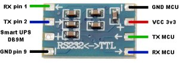

APC Smart UPS
=============

.. seo::
    :description: Instructions for setting up APC UPS compatible with Smart protocol.

The ``apcups`` component allows you to integrate an APC UPS compatible with Smart 
protocol in ESPHome. It uses :ref:`UART <uart>` for communication.

Once configured you can use sensors as described below for your projects.

Overview
--------

Most APC smart UPSes have a male ``DB9`` connector on their back allowing for monitoring and control 
via the SmartUPS protocol. This connector is not wired as a standard serial port, pinout 
corresponds to APC's factory cable ``940-024C``, where ``RX`` is pin ``1``, ``TX`` is pin ``2`` and 
``GND`` is pin ``9``. Newer models have an ``RJ50`` connector (similar to ``RJ45`` but with `10` pins) for the
factory cable ``AP940-0625A`` or ``AP940-1525A`` cable. This socket accepts both ``RJ50`` 
and ``RJ45`` plugs. In case of using an ``RJ45``, ``TX`` is pin ``1``, ``RX`` is pin ``7`` and 
``GND`` is pin ``6`` (+ chassis ``GND`` is pin ``3``).

Since this port works at standard RS232 (``5V``) levels, it cannot be connected directly to the MCU. 
A level shifter module has to be used like ``HW-027``: 

    HW-027 level shifter module connections to a smart-compatible UPS

APC UPSes communicate at ``2400`` baud (older models) or ``9200`` baud (newer models).

.. note::

    This component supports only the APC UPS models talking the **smartups** protocol through the serial 
    port. APC has many other models (like ``RS``, ``XS``) which only have an ``RJ50`` USB port and 
    connect as a ``HID`` device to a host computer, these are not supported by this component.

Component
---------

A configured UART is required.

.. code-block:: yaml

    # Example configuration entry
    uart:
        id: ups
        rx_pin: GPIO3
        tx_pin: GPIO1
        baud_rate: 2400

    sensor:
      - platform: apcups
        id: myups
        internal_temp:
          id: temp
          name: Internal Temperature
        battery_voltage:
          id: bat
          name: Battery Voltage
        battery_level:
          id: batlev
          name: Battery level
        power_load:
          id: load
          name: Power load
        input_voltage:
          id: inv
          name: Input Voltage
        output_voltage:
          id: ouv
          name: Output Voltage
        line_frequency:
          id: freq
          name: Line Frequency
        estimated_runtime:
          id: runt
          name: Estimated Runtime

Configuration variables:

- **input_voltage**: Input Voltage
- ...

All sensors are *Optional* and support all other options from :ref:`Sensor <config-sensor>`.

.. note::

    If you are using an ESP8266, serial logging may cause problems reading from UART. For best 
    results, hardware serial is recommended. Software serial may not be able to read all 
    received data if other components spend a lot of time in the ``loop()``.

    For hardware serial only a limited set of pins can be used. Either ``tx_pin: GPIO1`` and 
    ``rx_pin: GPIO3``  or ``tx_pin: GPIO15`` and ``rx_pin: GPIO13``.

    The disadvantage of using the hardware uart is that you can't use serial logging because 
    the serial logs would be sent to the modbus device and cause errors.

    Serial logging can be disabled by setting ``baud_rate: 0``.

    See :doc:`logger` for more details

    .. code-block:: yaml

        logger:
            level: <level>
            baud_rate: 0

See Also
--------

- :ref:`uart`
- :doc:`logger`
- :ref:`Sensor <config-sensor>`
- `Pinout for 940-024C cable<https://pinoutguide.com/UPS/apc-rackmount-smartsig_pinout.shtml>`__
- `Pinout for 940-1525A cable<https://pinoutguide.com/UPS/apc_0625_cable_pinout.shtml>`__
- `UPS Constants <https://kirbah.github.io/apc-ups/UPS-constants/>`__
- `APC smart protocol <http://www.apcupsd.org/manual/manual.html#apc-smart-protocol>`__
- :ghedit:`Edit`
