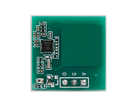

AirTouch AT581x Radar
=====================

.. seo::
    :description: Instructions for setting up AirTouch AT581x Radar
    :image: at581x.png
    :keywords: radar

The `AirTouch AT581x radar <https://en.airtouching.com/product/32.html>`__
(aka ``AT581x``) is a familly of 5.8GHz radar which can be used for human presence detection. It can detect tiny movements
and compared to a PIR sensor **it can detect presence continuously**. This can be useful, for example, to turn
the lights on when you enter a room, keep them on as long as you are there (without waving your hands at the
sensor) and turn them off almost immediately after you leave the room.

They are ultra-low power (as low as 40µA of current consumption) and are extremely simple to use, yet can be setup by I2C.
It's installed in many low cost appliance, like the ESP32S3-BOX-3, and can be found by many different manufacturer or reference,
like the MoreSense MS58-3909S68U4.

It is possible to use this sensor with only a single GPIO pin; however, if you wish to change its settings,
a :doc:`/components/i2c` component (and its requisite GPIO pins) is required in your device's configuration.



    AirTouch AT581x Radar / presence detection sensor

.. code-block:: yaml

    # Example configuration entry
    at581x:
      id: "Radar"
      i2c_id: bus_a

.. _at581x-component:

Component/Hub
-------------

You need to have the hub component (``at581x:`` entry) defined to be able to change the sensor's
settings, get it listed as an motion entity or being able to turn on/off the radio frequency emmission.
A :doc:`/components/binary_sensor/gpio` alone could be sufficient if you only want
to determine presence/occupancy. When you define ``at581x:`` you'll need to have a ``i2c:`` entry in
your configuration with both the SDA and SCL pins defined.

Multiple instances of this component may be defined if multiple :doc:`/components/i2c` components are available:

.. code-block:: yaml

    at581x:
      - id: mmWave_1
        i2c_id: bus_a
        address: 0x28
      - id: mmWave_2
        i2c_id: bus_a
        address: 0x29
      ...

Configuration variables:
************************

- **id** (*Optional*, :ref:`config-id`): Manually specify the ID used for code generation. Necessary if you want
  to define multiple instances of this component.
- **i2c_id** (*Optional*, :ref:`config-id`): Manually specify the ID of the :doc:`/components/i2c` if you want
  to use multiple I2C buses.

.. _at581x-binary_sensor:

Binary Sensor
-------------

The state of the radar detection is available via its GPIO pin. It's required to use a GPIO binary sensor to monitor the motion status

.. code-block:: yaml

    binary_sensor:
      - platform: gpio
        name: "Human in front"
        pin: GPIOXX

Configuration variables:
************************

- Refer to other options from :ref:`Binary Sensor <config-binary_sensor>` and :doc:`GPIO Binary Sensor </components/binary_sensor/gpio>`.

.. _at581x-switch:

Switch
------

:ref:`Switch components <config-switch>` are used to enable/disable radio frequency hardware.

.. code-block:: yaml

    switch:
      - platform: at581x
        at581x_id: Radar
        name: "Enable Radar"

Configuration variables:
************************

- **at581x_id** (*Optional*, :ref:`config-id`): The ID of the AT581x component defined above.
  Required when multiple instances of the ``at581x`` component are defined.
- All other options from :ref:`Switch <config-switch>`.

.. _at581x-actions:

Actions
-------

.. _at581x-action_settings:

``at581x.settings`` Action
**************************

.. warning::

    The hardware frontend reset option is only required to reset the frontend in case it is struck, before sending the
    new configuration. However, a frontend reset is always performed after changing the settings.

The radar has several settings which can be changed. These settings are not saved in non-volatile memory
and need to be set on each boot.

The settings action allows changing of any number of the radar's internal parameters/settings. With this
action, any unspecified parameters will remain unchanged.

.. code-block:: yaml

    on_...:
      - at581x.settings:
          id: "Waveradar"
          hw_frontend_reset: false
          frequency: 5800MHz
          sensing_distance: 200 # 0-1023
          poweron_selfcheck_time: 2000ms
          protect_time: 1s
          trigger_base: 500ms
          trigger_keep: 10s
          stage_gain: 3 # 0-12 the higher the value the smaller the gain
          power_consumption: 70µA


Configuration variables:
````````````````````````

- **id** (*Optional*, :ref:`config-id`): Manually specify the ID of the sensor on which settings should be
  changed. If only one radar is defined, this is optional.
- **hw_frontend_reset** (*Optional*, boolean): If set to true, a reset of the analog frontend will be performed before
  changing other options. Ignored if not set or set to ``false``. Upon applying the settings a frontend reset
  will be performed anyway, this is only useful if the sensor is not answering or locked up.
- **frequency** (*Optional*, int): Any of the possible frequencies (5696, 5715, 5730, 5748, 5765, 5784, 5800, 5819, 5836, 5851, 5869, 5888) in MHz.
- **sensing_distance** (*Optional*, int): A unitless number, in range 0-1023, specifying the maximum distance to detect motion
- **poweron_selfcheck_time** (*Optional*, int): The delay to perform self check and calibration on power on. Recommanded not to change this
- **protect_time** (*Optional*, int): The delay after an end-of-trigger event where the detection will not trigger anymore. Max 65535ms
- **trigger_base** (*Optional*, int): The delay while a detection must be active to change the state of the sensor. Max 65535ms
- **trigger_keep** (*Optional*, int): The delay that the output will stay high after a detection event. This is usually what you want to change.
- **stage_gain** (*Optional*, int): The analog gain to use for threshold test. Any value in range 0-12, with 12 being the lowest gain and 0 the highest
- **power_consumption** (*Optional*, int): Any of the possible power profile (48, 56, 63, 70, 77, 91, 105, 115, 40, 44, 47, 51, 54, 61, 68, 78) in µA


``at581x.reset`` Action
***********************

Restart the sensor.

.. code-block:: yaml

    on_...:
      at581x.reset:

Configuration variables:
````````````````````````

- **id** (*Optional*, :ref:`config-id`): Manually specify the ID of the AT581x component. Useful when multiple instances of this component are defined.

See Also
--------
- :ref:`I2C bus <i2c>`
- :ref:`Binary Sensor <config-binary_sensor>`
- :doc:`GPIO Binary Sensor </components/binary_sensor/gpio>`
- :ref:`config-id`
- :ghedit:`Edit`
