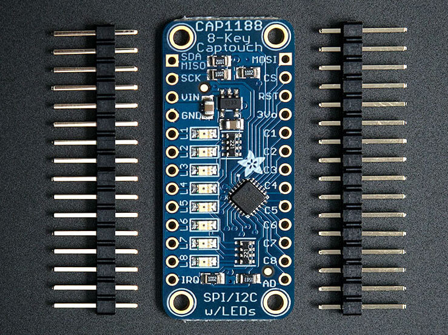

CAP1188 Capacitive Touch Sensor
===============================

.. seo::
    :description: Instructions for setting up CAP1188 Capacitive Touch Sensor
    :image: cap1188.jpg
    :keywords: CAP1188

.. _cap1188-component:

Component/Hub
-------------

The ``cap1188`` sensor platform allows you to use your CAP1188
(`datasheet <https://cdn-shop.adafruit.com/datasheets/CAP1188.pdf>`__,
`Adafruit`_) Capacitive Touch Sensor with ESPHome. The :ref:`I²C <i2c>` bus is
required to be set up in your configuration for this sensor to work.

    CAP1188 Capacitive Touch Sensor. Image by `Adafruit`_.

.. _Adafruit: https://learn.adafruit.com/adafruit-cap1188-breakout/overview

.. code-block:: yaml

    # Example configuration entry
    cap1188:
      id: cap1188_component
      address: 0x29
      reset_pin: GPIOXX
      touch_threshold: 0x40
      allow_multiple_touches: true

    binary_sensor:
      - platform: cap1188
        id: touch_key0
        channel: 0
        name: "Touch Key 0"

Configuration variables:
------------------------

The configuration is made up of two parts: The central component, and individual Binary sensors per channel.

- **address** (*Optional*, int): The I²C address of the sensor. Defaults to ``0x29``.
- **id** (*Optional*, :ref:`config-id`): Set the ID of this sensor.
- **reset_pin** (*Optional*, :ref:`config-pin`): Set the pin that is used to reset the CAP1188 board on boot.
- **touch_threshold** (*Optional*, int): The touch threshold for all channels. This defines the sensitivity for touch detection.

   - ``0x01``: Maximum sensitivity - Most sensitive to touch
   - ``0x20``: Default sensitivity
   - ``0x40``: Medium sensitivity (I used this sensitivity when being used through a 3mm sheet of plastic)
   - ``0x80``: Minimum sensitivity - Least sensitive to touch

- **allow_multiple_touches** (*Optional*, boolean): Whether to allow multitouch. Defaults to off.

Binary Sensor
-------------

The ``cap1188`` binary sensor allows you to use your CAP1188 with ESPHome.
First, setup a :ref:`cap1188-component` and then use this binary sensor platform to create individual
binary sensors for each touch sensor.

Configuration variables:

- **name** (*Optional*, string): The name for the binary sensor.
- **cap1188_id** (*Optional*, :ref:`config-id`): The ID of the CAP1188 defined above. Useful for multiple CAP1188's on the I²C bus.
- **id** (*Optional*, :ref:`config-id`): Manually specify the ID used for code generation.
- **channel** (**Required**, int): The channel number the CAP1188 the touchkey is connected to.
- All other options from :ref:`Binary Sensor <config-binary_sensor>`.

.. note::

    SPI is not currently supported. I²C must be used at this time.

See Also
--------

- :ref:`sensor-filters`
- :apiref:`cap1188/cap1188.h`
- `Adafruit CAP1188 Library <https://github.com/adafruit/Adafruit_CAP1188_Library>`__ by `Adafruit <https://www.adafruit.com/>`__
- :ghedit:`Edit`
