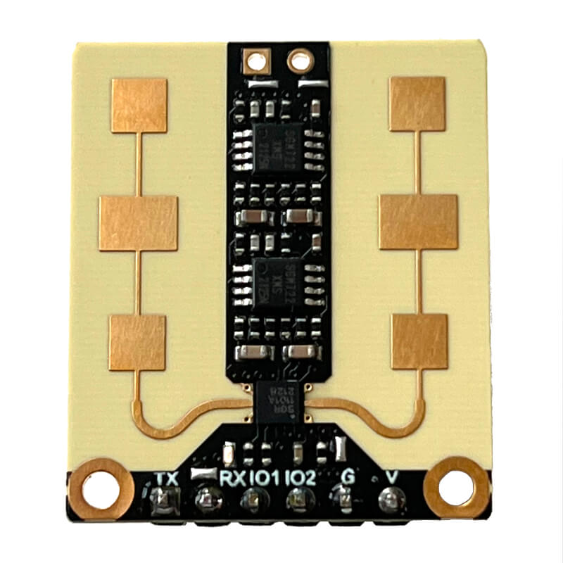

DFRobot mmWave Radar
===============================

.. seo::
    :description: Instructions for setting up DFRobot mmWave Radar
    :image: dfrobot_mmwave_radar.jpg
    :keywords: mmwave

The `DFRobot mmWave Radar <https://wiki.dfrobot.com/mmWave_Radar_Human_Presence_Detection_SKU_SEN0395>`__ (aka ``SEN0395``) is a 24GHz radar which can be used for human presence detection.
It can detect tiny movements and compared to a PIR sensor **it can detect presence continuously**. This can be useful,
for example to turn on the lights when you enter a room, keep them on as long as you are there (without waving your hands at the sensor) and turn it off directly
after you leave the room.

- **Change settings**: only via ``uart``
- **Presence detection**: either via ``uart`` or ``gpio`` pin

    DFRobot mmWave Radar / presence detection sensor

.. code-block:: yaml

    # Example configuration entry
    uart:
      tx_pin: GPIO13
      rx_pin: GPIO14
      baud_rate: 115200

    dfrobot_mmwave_radar:

    binary_sensor:
      # Information coming from uart bus
      - platform: dfrobot_mmwave_radar
        name: Mmwave Detected via UART

      # Information coming from dedicated gpio (IO2)
      - platform: gpio
        name: Mmwave Detected via GPIO
        device_class: motion
        pin:
          number: GPIO15
          mode: INPUT_PULLDOWN

.. _dfr_mmwave-component:

Component
-------------

You only need to have the component (``dfrobot_mmwave_radar:`` entry) defined if you want to change settings of the sensor or read the state via UART.
If you only want to read the state via a GPIO pin, a :doc:`/components/binary_sensor/gpio` is sufficient.
When you define ``dfrobot_mmwave_radar:`` you also need to have a ``uart:`` entry in your configuration with both the TX and RX pins set to some pins
on your board and the baud rate set to 115200.

To define multiple sensors, you need to define the component with a list of ``id`` entries with ``uart_id`` since each sensor needs
it's own :ref:`UART bus <uart>`.

.. code-block:: yaml

    dfrobot_mmwave_radar:
      - id: mmwave_1
        uart_id: uart_1
      - id: mmwave_2
        uart_id: uart_2
      ...

**Configuration variables**:

- **id** (*Optional*, :ref:`config-id`): Manually specify the ID used for code generation. Necessary if you want to define multiple mmwave radars.
- **uart_id** (*Optional*, :ref:`config-id`): Manually specify the ID of the UART Component if you want to use multiple UART buses.

Binary Sensor
-------------

via GPIO
********

To read presence values you can simply use a :doc:`/components/binary_sensor/gpio` and connect to IO2 of the mmwave radar.
An advantage of using a dedicated gpio pin might be to be able to use interrupts, e.g. if you want to wake up ESPHome from sleep.

If you don't want to change settings and only read presence values, you don't even need the ``dfrobot_mmwave_radar:`` and ``uart:``
components.

.. code-block:: yaml

    binary_sensor:
      - platform: gpio
        name: Mmwave Detected via GPIO
        device_class: motion
        pin:
          number: GPIO15
          mode: INPUT_PULLDOWN

via UART
********

If you want, you can use the sensor only using a uart connection. It might be an advantage to be able to save an extra pin. However, the CPU
needs to be running in order to process incoming sensor data. You cannot wake up the processor by using uart only.

First, setup a :ref:`UART bus <uart>` and :ref:`dfr_mmwave-component` and then use this binary sensor platform to create individual
binary sensors for each presence sensor.

.. code-block:: yaml

    binary_sensor:
      - platform: dfrobot_mmwave_radar
        name: Mmwave Detected via UART

Configuration variables:

- **id** (*Optional*, :ref:`config-id`): Manually specify the ID used for code generation.
- **name** (*Optional*, string): The name for the binary sensor.
- **dfrobot_mmwave_radar_id** (*Optional*, :ref:`config-id`): The ID of the DFRobot mmWave component defined above. Useful for multiple mmWave sensors.
- All other options from :ref:`Binary Sensor <config-binary_sensor>`.

``dfrobot_mmwave_radar.settings`` Action
----------------------------------------

.. warning::

    As it seems every time you change / save the configuration of the mmwave radar, it is written to its internal flash or EEPROM
    which can be susceptible to damage when writing a lot. Do not change setting on every boot or several times per second,
    otherwise the mmwave radar might suffer damage. Instead, find the correct settings during setup phase and do not regularly change
    settings later on.

The DFRobot mmWave Radar has several settings which can be changed. These settings are saved in non-volatile memory and do not need to be set on each boot.

All options of the settings action are optional and only the specified options are changed. Unspecified parameters are untouched (not set to a default value).
You can change one option, a few or all a the same time.

.. code-block:: yaml

    on_...:
      - dfrobot_mmwave_radar.settings:
          factory_reset: true
          detection_segments:
            # Define between one and four segments
            - 0cm - 3m
            - 5.1m - 6.6m
          output_latency:
            delay_after_detect: 0s
            delay_after_disappear: 0s
          start_after_power_on: true
          turn_on_led: false
          presence_via_uart: true
          sensitivity: 7

Configuration options:

- **id** (*Optional*, :ref:`config-id`): Manually specify the ID of the mmwave sensor which settings should be changed. If only one radar is defined, this is optional.

- **factory_reset** (*Optional*, boolean): If set to true, a factory reset of the sensor will be performed (before changing other options if present). Ignored if not set or set to false.

- **detection_segments** (*Optional*, list): A list of detection segments. A segment specifies from where to where detection should trigger.
  One up to four segments and ranges from 0cm to 9m can be specified. Distances should be defined in steps of 15cm. Internally the specified ranges are rounded.
  A range is defined using a start distance followed by a dash and the end distance.
  
    .. code-block:: yaml

        detection_segments:
          - 0cm - 3m
          - 5.1m - 6.6m

  In the above example, if a person was present in the range between 0cm and 3m (distance from the sensor) or between 5.1m and 6.6m 
  the sensor would trigger (meaning a person was detected). If a person is present between 3.1m and 5m or 6.7m and 9m it would not trigger.
  Factory default is 0cm - 3m.

- **output_latency** (*Optional*, dictionary):

  - **delay_after_detect** (**Required**, :ref:`config-time`): Time to wait before signaling that a person was detected. Specify in steps of 25ms. Factory default is 2.5s.
  - **delay_after_disappear** (**Required**, :ref:`config-time`): Time to wait before signaling that a person disappeared. Specify in steps of 25ms. Factory default is 10s.

- **start_after_power_on** (*Optional*, boolean): If set to true, sensor will start immediately after power-on. If set to false (and if sensor was previously stopped), the sensor needs
  to be manually started. Factory default is false.

- **turn_on_led** (*Optional*, boolean): If set to true, the LED soldered on the mmwave sensor blinks during operation. If set to false it stays off. Factory default is true.

- **presence_via_uart** (*Optional*, boolean): If set to true, send presence information via uart (and GPIO). If set to false, only send presence info using GPIO. Factory default is true.

- **sensitivity** (*Optional*, int): Set the sensitivity of the sensor. Ranges from 0 to 9.

``dfrobot_mmwave_radar.start`` Action
----------------------------------------

.. note::

    It seems the DFRobot mmWave Radar has a bug in it's firmware. If the uart tx line (rx on the sensor) is held low (e.g. during serial flashing),
    the sensor resets. When such a "uart reset" happens, the sensor does not immediately start, even if it was configured that way.
    Only after 20 seconds the sensor starts. If you start the sensor during this 20s window, it tries to start again after
    20 seconds and it unexpectedly resets. If you don't wait for 20s it keeps on resetting (and stopping the sensor).

Start the sensor.

.. code-block:: yaml

    on_...:
      dfrobot_mmwave_radar.start

Configuration options:

- **id** (*Optional*, :ref:`config-id`): Manually specify the ID of the mmwave component if you have multiple ones.

``dfrobot_mmwave_radar.stop`` Action
----------------------------------------

Stop the sensor.

.. code-block:: yaml

    on_...:
      dfrobot_mmwave_radar.stop

Configuration options:

- **id** (*Optional*, :ref:`config-id`): Manually specify the ID of the mmwave component if you have multiple ones.

``dfrobot_mmwave_radar.reset`` Action
----------------------------------------

Restart the sensor.

.. code-block:: yaml

    on_...:
      dfrobot_mmwave_radar.reset

Configuration options:

- **id** (*Optional*, :ref:`config-id`): Manually specify the ID of the mmwave component if you have multiple ones.

See Also
--------
- :ref:`UART bus <uart>`
- :ref:`Binary Sensor <config-binary_sensor>`
- :ref:`config-id`
- `DFRobot mmWave Radar Wiki page <https://wiki.dfrobot.com/mmWave_Radar_Human_Presence_Detection_SKU_SEN0395>`__
- :ghedit:`Edit`
