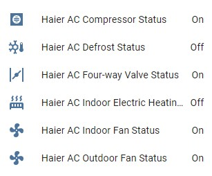

Haier Climate Binary Sensors
============================

.. seo::
    :description: Instructions for setting up additional binary sensors for Haier climate devices.
    :image: haier.svg

Additional sensors for Haier Climate device. **These sensors are supported only by the hOn protocol**.

.. code-block:: yaml

    # Example configuration entry
    uart:
      baud_rate: 9600
      tx_pin: 17
      rx_pin: 16
      id: ac_port
    
    climate:
      - platform: haier
        id: haier_ac
        protocol: hOn
        name: Haier AC
        uart_id: ac_port
    
    binary_sensor:
      - platform: haier
        haier_id: haier_ac
        compressor_status:
          name: Haier Outdoor Compressor Status
        defrost_status:
          name: Haier Defrost Status
        four_way_valve_status:
          name: Haier Four Way Valve Status
        indoor_electric_heating_status:
          name: Haier Indoor Electric Heating Status
        indoor_fan_status:
          name: Haier Indoor Fan Status
        outdoor_fan_status:
          name: Haier Outdoor Fan Status

Configuration variables:
------------------------

- **haier_id** (**Required**, :ref:`config-id`): The id of haier climate component
- **compressor_status** (*Optional*): A binary sensor that indicates Haier climate compressor activity.

  - **name** (**Required**, string): The name of the sensor.
  - **id** (*Optional*, :ref:`config-id`): ID of the sensor, can be used for code generation
  - All other options from :ref:`Sensor <config-sensor>`.
- **defrost_status** (*Optional*): A binary sensor that indicates defrost procedure activity.

  - **name** (**Required**, string): The name of the sensor.
  - **id** (*Optional*, :ref:`config-id`): ID of the sensor, can be used for code generation
  - All other options from :ref:`Sensor <config-sensor>`.
- **four_way_valve_status** (*Optional*): A binary sensor that indicates four way valve status.

  - **name** (**Required**, string): The name of the sensor.
  - **id** (*Optional*, :ref:`config-id`): ID of the sensor, can be used for code generation
  - All other options from :ref:`Sensor <config-sensor>`.
- **indoor_electric_heating_status** (*Optional*): A binary sensor that indicates electrical heating system activity.

  - **name** (**Required**, string): The name of the sensor.
  - **id** (*Optional*, :ref:`config-id`): ID of the sensor, can be used for code generation.
  - All other options from :ref:`Sensor <config-sensor>`.
- **indoor_fan_status** (*Optional*): A binary sensor that indicates indoor fan activity. 

  - **name** (**Required**, string): The name of the sensor.
  - **id** (*Optional*, :ref:`config-id`): ID of the sensor, can be used for code generation
  - All other options from :ref:`Sensor <config-sensor>`.
- **outdoor_fan_status** (*Optional*): A binary sensor that indicates outdoor fan activity. 

  - **name** (**Required**, string): The name of the sensor.
  - **id** (*Optional*, :ref:`config-id`): ID of the sensor, can be used for code generation
  - All other options from :ref:`Sensor <config-sensor>`.

See Also
--------

- :doc:`Haier Climate </components/climate/haier>`
- :ref:`sensor-filters`
- :ghedit:`Edit`
