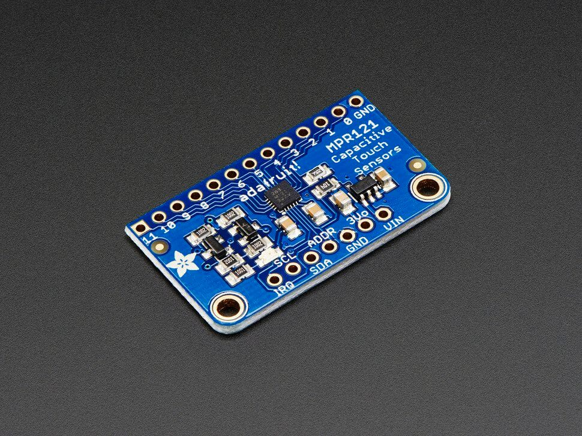

MPR121 Capacitive Touch Sensor
==============================

.. seo::
    :description: Instructions for setting up MPR121 Capacitive Touch Sensor
    :image: mpr121.jpg
    :keywords: MPR121

.. _mpr121-component:

Component/Hub
-------------

The ``mpr121`` sensor platform allows you to use your MPR121
(`datasheet <https://cdn-learn.adafruit.com/downloads/pdf/adafruit-mpr121-12-key-capacitive-touch-sensor-breakout-tutorial.pdf>`__,
`Adafruit`_) Capacitive Touch Sensor with ESPHome. The :ref:`I²C <i2c>` is
required to be set up in your configuration for this sensor to work.

    MPR121 Capacitive Touch Sensor. Image by `Adafruit`_.

.. _Adafruit: https://learn.adafruit.com/adafruit-mpr121-12-key-capacitive-touch-sensor-breakout-tutorial/overview

.. code-block:: yaml

    # Example configuration entry
    mpr121:
      id: mpr121_component
      address: 0x5A
      touch_debounce: 1
      release_debounce: 1
      touch_threshold: 10
      release_threshold: 7

    binary_sensor:
      - platform: mpr121
        id: touch_key0
        channel: 0
        name: "Touch Key 0"
        touch_threshold: 12
        release_threshold: 6

Configuration variables:
------------------------

The configuration is made up of two parts: The central component, and individual Binary sensors per channel.

- **address** (*Optional*, int): The I²C address of the sensor. Defaults to ``0x5A``.
- **id** (*Optional*, :ref:`config-id`): Set the ID of this sensor.
- **touch_debounce** (*Optional*, int): The minimum length before a touch is recognized. Range is from 0 to 7.
  Defaults to 0.
- **release_debounce** (*Optional*, int): The minimum length that no touch is recognized before a release event is created.
  Range is from 0 to 7. Defaults to 0.
- **touch_threshold** (*Optional*, int): The touch threshold for all channels. This defines the sensitivity for touch detection
  and should be between 5 and 30 (lower = more sensitive). Defaults to 12. Typically the touch threshold is a little bigger than the release threshold.
- **release_threshold** (*Optional*, int): The release defines the sensitivity for touch detection and should be between 5 and 30. Defaults to 6.

Binary Sensor
-------------

The ``mpr121`` binary sensor allows you to use your MPR121 with ESPHome.
First, setup a :ref:`mpr121-component` and then use this binary sensor platform to create individual
binary sensors for each touch sensor.

Configuration variables:

- **mpr121_id** (*Optional*, :ref:`config-id`): The ID of the MPR121 defined above. Useful for multiple MPR121's on the I²C bus
- **channel** (**Required**, int): The channel number at the MPR121 the touchkey is connected to.
- **touch_threshold** (*Optional*, int): A per-channel override of the global touch_threshold value. If not specified, uses the global value.
- **release_threshold** (*Optional*, int): A per-channel override of the global release_threshold value. If not specified, uses the global value.
- All other options from :ref:`Binary Sensor <config-binary_sensor>`.

GPIO
----

The ``mpr121`` also supports configuring its touch electrodes as GPIO inputs and outputs. To do so,
specify an ``id`` in the configuration of the ``mpr121`` component. Then, configure a GPIO output or
input using this ID in the ``mpr121`` field.

.. code-block:: yaml

    output:
      - id: ext_5v_power
        platform: gpio
        pin:
          mpr121: mpr121_component
          number: 10
          mode: OUTPUT
          inverted: true

The ``number`` refers to the ELEx pin number on the MPR121 chip. Only ELE4 up to including ELE11 are
available as GPIO.

GPIO and touch functionality may be used at the same time, but not on the same pins.

It is also not valid to configure a pin as GPIO when a pin with a higher number is used as touch
channel. This is because touch functionality is configured as a range, starting at ELE0.
For example:

- Using channel 2 and 5 as touch and channel 6 as GPIO is okay
- Using channel 2 and 5 as touch and channel 4 as GPIO is not okay

See Also
--------

- :ref:`sensor-filters`
- :apiref:`mpr121/mpr121.h`
- `Adafruit MPR121 Library <https://github.com/adafruit/Adafruit_MPR121_Library>`__ by `Adafruit <https://www.adafruit.com/>`__
- :ghedit:`Edit`
