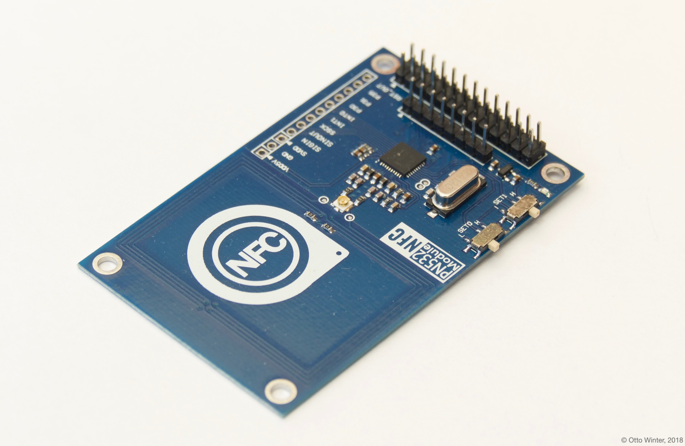
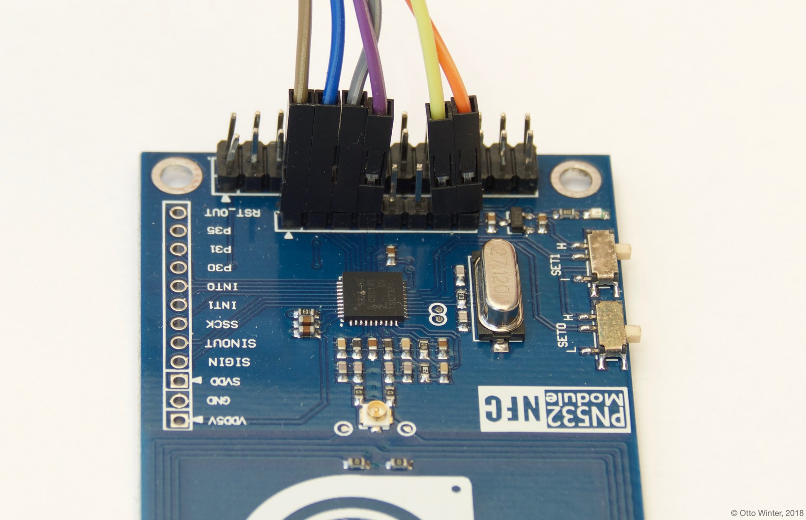

PN532 NFC/RFID
==============

.. seo::
    :description: Instructions for setting up PN532 NFC tag readers and tags in ESPHome
    :image: pn532.jpg
    :keywords: PN532, NFC, RFID

.. _pn532-component:

Component/Hub
-------------

The ``pn532`` component allows you to use PN532 NFC/RFID controllers
(`datasheet <https://cdn-shop.adafruit.com/datasheets/pn532ds.pdf>`__, `Adafruit <https://www.adafruit.com/product/364>`__)
with ESPHome. This component is a global hub that establishes the connection to the PN532 via :ref:`SPI <spi>` or :ref:`I²C <i2c>` and
outputs its data. Using the :ref:`PN532 binary sensors <pn532-tag>` you can then
create individual binary sensors that track if an NFC/RFID tag is currently detected by the PN532.

See :ref:`pn532-setting_up_tags` for information on how to setup individual binary sensors for this component.

The PN532 can be configured to use either the SPI **or** I²C protocol for data communication.
You will need to switch the dip switches located on the module according to the table printed on the board.
SPI is usually switch 1 OFF and switch 2 ON and I²C is usually switch 1 ON and switch 2 OFF.
You will need to have the :ref:`SPI Bus <spi>` or the :ref:`I²C Bus <i2c>` configured depending on your choice.

.. code-block:: yaml

    # Example configuration for SPI (choose which one!)
    pn532_spi:
      cs_pin: D3
      update_interval: 1s

    # Example configuration for I²C (choose which one!)
    pn532_i2c:
      update_interval: 1s

    binary_sensor:
      - platform: pn532
        uid: 74-10-37-94
        name: "PN532 NFC Tag"

Configuration variables:
************************

- **cs_pin** (**Required for SPI**, :ref:`Pin Schema <config-pin_schema>`): The pin on the ESP that the chip select line
  is connected to.
- **update_interval** (*Optional*, :ref:`config-time`): The duration of each scan on the PN532. This affects the
  duration that the individual binary sensors stay active when they're found.
  If a device is not found within this time window, it will be marked as not present. Defaults to 1s.
- **on_tag** (*Optional*, :ref:`Automation <automation>`): An automation to perform
  when a tag is read. See :ref:`pn532-on_tag`.
- **on_tag_removed** (*Optional*, :ref:`Automation <automation>`): An automation to perform
  when a tag is removed. See :ref:`pn532-on_tag_removed`.
- **spi_id** (*Optional*, :ref:`config-id`): Manually specify the ID of the :ref:`SPI Component <spi>` if you want
  to use multiple SPI buses.
- **i2c_id** (*Optional*, :ref:`config-id`): Manually specify the ID of the :ref:`I²C Component <spi>` if you want
  to use multiple I²C buses.
- **id** (*Optional*, :ref:`config-id`): Manually specify the ID for this component.

    Example for hooking up the PN532 via SPI. Notice the position of the two switches on the right.

.. _pn532-on_tag:

``on_tag``
----------

This automation will be triggered when the PN532 module responds with a tag. This will only be triggered
if the tag is changed or goes away for one cycle of ``update_interval``.

The parameter ``x`` this trigger provides is of type ``std::string`` and is the tag UID in the format
``74-10-37-94``. The configuration below will for example publish the tag ID on the MQTT topic ``pn532/tag``.

.. code-block:: yaml

    pn532:
      # ...
      on_tag:
        then:
          - mqtt.publish:
              topic: pn532/tag
              payload: !lambda 'return x;'

A tag scanned event can also be sent to the Home Assistant tag component
using :ref:`api-homeassistant_tag_scanned_action`.

.. code-block:: yaml

    pn532:
      # ...
      on_tag:
        then:
          - homeassistant.tag_scanned: !lambda 'return x;'

Alternatively you could also send the value directly to Home Assistant via a
:doc:`template sensor </components/sensor/template>`.

.. code-block:: yaml

    pn532:
      # ...
      on_tag:
        then:
        - text_sensor.template.publish:
            id: rfid_tag
            state: !lambda 'return x;'

    text_sensor:
      - platform: template
        name: "RFID Tag"
        id: rfid_tag

.. _pn532-on_tag_removed:

``on_tag_removed``
------------------

This automation will be triggered when the PN532 module responds with no tag. This will only be triggered
if the tag goes away for one cycle of ``update_interval``.

The parameter ``x`` this trigger provides is of type ``std::string`` and is the removed tag UID in the format
``74-10-37-94``. The configuration below will for example publish the removed tag ID on the MQTT topic ``pn532/tag_removed``.

.. code-block:: yaml

    pn532:
      # ...
      on_tag_removed:
        then:
          - mqtt.publish:
              topic: pn532/tag_removed
              payload: !lambda 'return x;'

.. _pn532-tag:

NFC/RFID Tag
------------

The ``pn532`` binary sensor platform lets you track if an NFC/RFID tag with a given
unique id (``uid``) is currently being detected by the PN532 or not.

.. code-block:: yaml

    # Example configuration entry
    spi:
      clk_pin: D0
      miso_pin: D1
      mosi_pin: D2

    pn532_spi:
      cs_pin: D3
      update_interval: 1s

    binary_sensor:
      - platform: pn532
        uid: 74-10-37-94
        name: "PN532 NFC Tag"

Configuration variables:
************************

- **uid** (**Required**, string): The unique ID of the NFC/RFID tag. This is a hyphen-separated list
  of hexadecimal values. For example ``74-10-37-94``.
- **name** (**Required**, string): The name of the binary sensor.
- **id** (*Optional*, :ref:`config-id`): Manually specify the ID used for code generation.
- All other options from :ref:`Binary Sensor <config-binary_sensor>`.

.. _pn532-setting_up_tags:

Setting Up Tags
---------------

To set up binary sensors for specific NFC tags you first have to know their unique IDs. To obtain this
id, first set up a simple PN532 configuration without any binary sensors like above.

When your code is running and you approach the PN532 with an NFC Tag, you should see a message like this:

.. code::

    Found new tag '74-10-37-94'

Then copy this id and create a ``binary_sensor`` entry as in the configuration example. Repeat this process for
each tag.

See Also
--------

- :doc:`index`
- :doc:`rdm6300`
- :apiref:`pn532/pn532.h`
- :ghedit:`Edit`
