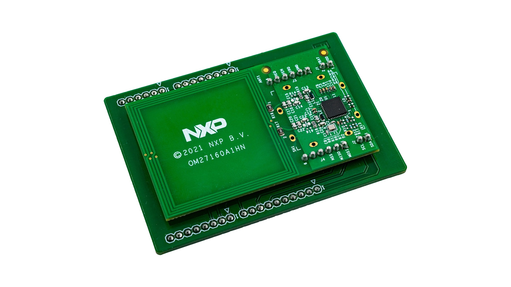

PN7160 NFC
==========

.. seo::
    :description: Instructions for setting up PN7160 NFC tag readers and tags in ESPHome
    :image: pn716x.jpg
    :keywords: PN7160, NFC, RFID

.. _pn7160-component:

Component/Hub
-------------

The ``pn7160`` component allows you to use PN7160 NFC controllers with ESPHome. This component is a global hub that
establishes a connection to the PN7160 via :ref:`SPI <spi>` or :ref:`I²C <i2c>`, enabling the use of
:ref:`PN7160 binary sensors <pn7160-binary_sensor>` to track if/when an NFC tag is detected by the PN7160.

Within ESPHome, the PN7160 can be configured to use either the SPI **or** I²C protocol for data communication.
Note that there are different versions of the IC for each bus type, each with a different part number; in other
words, **the bus type cannot be changed by jumpers/switches as it is determed at the time of manufacture.**

You must determine which version of the IC you have and then configure the corresponding bus -- either the
:ref:`SPI bus <spi>` or the :ref:`I²C bus <i2c>`.

See :ref:`pn7160-setting_up_tags` for information on how to set up per-tag binary sensors with this component.

.. _pn7160-spi:

Over SPI
--------

The ``pn7160_spi`` component allows you to use :ref:`SPI-equipped <spi>` PN7160 NFC controllers with with ESPHome.
Using :ref:`PN7160 binary sensors <pn7160-binary_sensor>` you can then create individual binary sensors to track
if/when an NFC tag is detected by the PN7160.

.. code-block:: yaml

    pn7160_spi:
      cs_pin: 15
      dwl_req_pin: 17
      irq_pin: 35
      ven_pin: 16
      wkup_req_pin: 21
      emulation_message: https://www.home-assistant.io/tag/pulse_ce
      tag_ttl: 1000ms

Configuration variables:
************************

- **cs_pin** (**Required**, :ref:`Pin Schema <config-pin_schema>`): The pin connected to the PN7160's ``NSS`` (chip
  select) line.
- **dwl_req_pin** (*Optional*, :ref:`Pin Schema <config-pin_schema>`): The pin connected to the PN7160's
  ``DWL_REQ`` line. Used to invoke the PN7160's firmware update mode; may be used in a future release.
- **irq_pin** (**Required**, :ref:`Pin Schema <config-pin_schema>`): The pin connected to the PN7160's ``IRQ`` line.
- **ven_pin** (**Required**, :ref:`Pin Schema <config-pin_schema>`): The pin connected to the PN7160's ``VEN`` line.
- **wkup_req_pin** (*Optional*, :ref:`Pin Schema <config-pin_schema>`): The pin connected to the PN7160's
  ``WKUP_REQ`` line. May be used to improve power management in a future release.
- **emulation_message** (*Optional*, string): When scanned by another NFC card/tag reader (such as a smartphone), this
  string is used as the content for an NDEF-formatted response. This allows the PN7160 to act as a tag in addition to a
  tag reader/writer.
- **tag_ttl** (*Optional*, :ref:`config-time`): The duration that must elapse after the PN7160 is no longer able to
  "see" a tag before it is considered to have been removed from the reader.
- **on_tag** (*Optional*, :ref:`Automation <automation>`): An automation to perform when a tag is first read. See
  :ref:`pn7160-on_tag`.
- **on_tag_removed** (*Optional*, :ref:`Automation <automation>`): An automation to perform after a tag is removed. See
  :ref:`pn7160-on_tag_removed`.
- **on_emulated_tag_scan** (*Optional*, :ref:`Automation <automation>`): An automation to perform when the PN7160 is
  scanned by another tag reader (such as a smartphone). See :ref:`pn7160-on_emulated_tag_scan`.
- **spi_id** (*Optional*, :ref:`config-id`): Manually specify the ID of the :ref:`SPI Component <spi>` if you want
  to use multiple SPI buses.
- **id** (*Optional*, :ref:`config-id`): Manually specify the ID for this component.

.. _pn7160-i2c:

Over I²C
--------

The ``pn7160_i2c`` component allows you to use :ref:`I²C-equipped <i2c>` PN7160 NFC controllers with ESPHome.
Using :ref:`PN7160 binary sensors <pn7160-binary_sensor>` you can then create individual binary sensors to track
if/when an NFC tag is detected by the PN7160.

.. code-block:: yaml

    pn7160_i2c:
      dwl_req_pin: 17
      irq_pin: 35
      ven_pin: 16
      wkup_req_pin: 21
      emulation_message: https://www.home-assistant.io/tag/pulse_ce
      tag_ttl: 1000ms

Configuration variables:
************************

- **dwl_req_pin** (*Optional*, :ref:`Pin Schema <config-pin_schema>`): The pin connected to the PN7160's
  ``DWL_REQ`` line. Used to invoke the PN7160's firmware update mode; may be used in a future release.
- **irq_pin** (**Required**, :ref:`Pin Schema <config-pin_schema>`): The pin connected to the PN7160's ``IRQ`` line.
- **ven_pin** (**Required**, :ref:`Pin Schema <config-pin_schema>`): The pin connected to the PN7160's ``VEN`` line.
- **wkup_req_pin** (*Optional*, :ref:`Pin Schema <config-pin_schema>`): The pin connected to the PN7160's
  ``WKUP_REQ`` line. May be used to improve power management in a future release.
- **emulation_message** (*Optional*, string): When scanned by another NFC card/tag reader (such as a smartphone), this
  string is used as the content for an NDEF-formatted response. This allows the PN7160 to act as a tag in addition to a
  tag reader/writer.
- **tag_ttl** (*Optional*, :ref:`config-time`): The duration that must elapse after the PN7160 is no longer able to
  "see" a tag before it is considered to have been removed from the reader.
- **on_tag** (*Optional*, :ref:`Automation <automation>`): An automation to perform when a tag is first read. See
  :ref:`pn7160-on_tag`.
- **on_tag_removed** (*Optional*, :ref:`Automation <automation>`): An automation to perform after a tag is removed. See
  :ref:`pn7160-on_tag_removed`.
- **on_emulated_tag_scan** (*Optional*, :ref:`Automation <automation>`): An automation to perform when the PN7160 is
  scanned by another tag reader (such as a smartphone). See :ref:`pn7160-on_emulated_tag_scan`.
- **i2c_id** (*Optional*, :ref:`config-id`): Manually specify the ID of the :ref:`I²C Component <i2c>` if you need
  to use multiple I²C buses.
- **id** (*Optional*, :ref:`config-id`): Manually specify the ID for this component.

Actions
-------

.. _pn7160-set_clean_mode:

``tag.set_clean_mode`` Action
*****************************

Use this action to invoke "clean mode" -- the next tag presented to the PN7160 will be "cleaned", removing all data
from the tag.

.. code-block:: yaml

    on_...:
      then:
        - tag.set_clean_mode: my_pn7160_id

.. _pn7160-set_format_mode:

``tag.set_format_mode`` Action
******************************

Use this action to invoke "format mode" -- the next tag presented to the PN7160 will be "formatted", leaving only an
empty NDEF message structure on the tag.

.. code-block:: yaml

    on_...:
      then:
        - tag.set_format_mode: my_pn7160_id

.. _pn7160-set_read_mode:

``tag.set_read_mode`` Action
****************************

Use this action to invoke "read mode" -- the next tag presented to the PN7160 will be read. This is the default mode
that the component operates in.

.. code-block:: yaml

    on_...:
      then:
        - tag.set_read_mode: my_pn7160_id

.. _pn7160-set_write_message:

``tag.set_write_message`` Action
********************************

Use this action to set the NDEF message used for "write mode" (see below).

.. code-block:: yaml

    on_...:
      then:
        - tag.set_write_message:
            message: https://www.home-assistant.io/tag/pulse
            include_android_app_record: false

- **message** (**Required**, string, templatable): The string to include in the tag's first NDEF record; typically
  a URL as shown.
- **include_android_app_record** (*Optional*, boolean): Include a second NDEF record required for some Android
  operating systems. Defaults to ``true``.

.. _pn7160-set_write_mode:

``tag.set_write_mode`` Action
*****************************

Use this action to invoke "write mode" -- the next tag presented to the PN7160 will have its NDEF message set to the
message defined by the ``tag.set_write_message`` action (see above). **Note that a message must be set before this mode
may be invoked.**

.. code-block:: yaml

    on_...:
      then:
        - tag.set_write_mode: my_pn7160_id

.. _pn7160-set_emulation_message:

``tag.set_emulation_message`` Action
************************************

Use this action to set the NDEF message used for card (tag) emulation mode, when enabled (see below).

.. code-block:: yaml

    on_...:
      then:
        - tag.set_emulation_message:
            message: https://www.home-assistant.io/tag/pulse
            include_android_app_record: false

- **message** (**Required**, string, templatable): The string to include in the (emulated) tag's first NDEF record;
  typically a URL as shown.
- **include_android_app_record** (*Optional*, boolean): Include a second NDEF record required for some Android
  operating systems. Defaults to ``true``.

.. _pn7160-emulation_off:

``tag.emulation_off`` Action
****************************

Use this action to disable card (tag) emulation mode. The PN7160 will no longer respond to requests from other readers,
such as smartphones.

.. code-block:: yaml

    on_...:
      then:
        - tag.emulation_off: my_pn7160_id

.. _pn7160-emulation_on:

``tag.emulation_on`` Action
***************************

Use this action to enable card (tag) emulation mode. The PN7160 will respond to requests from other readers, such as
smartphones.

.. code-block:: yaml

    on_...:
      then:
        - tag.emulation_on: my_pn7160_id

.. _pn7160-polling_off:

``tag.polling_off`` Action
****************************

Use this action to disable card (tag) reading/writing. The PN7160 will no longer read or write cards/tags.

.. code-block:: yaml

    on_...:
      then:
        - tag.polling_off: my_pn7160_id

.. _pn7160-polling_on:

``tag.polling_on`` Action
***************************

Use this action to enable card (tag) reading/writing. The PN7160 will read or write cards/tags.

.. code-block:: yaml

    on_...:
      then:
        - tag.polling_on: my_pn7160_id

Triggers
--------

.. _pn7160-on_tag:

``on_tag`` Trigger
******************

This automation will be triggered immediately after the PN7160 module identifies a tag and reads its NDEF
message (if one is present).

The parameter ``x`` this trigger provides is of type ``std::string`` and is the tag UID in the format
``74-10-37-94``. The example configuration below will publish the tag ID on the MQTT topic ``pn7160/tag``.

See :ref:`pn7160-ndef_reading` below for how to use the second ``tag`` parameter that is provided to this trigger.

.. code-block:: yaml

    pn7160_...:
      # ...
      on_tag:
        then:
          - mqtt.publish:
              topic: pn7160/tag
              payload: !lambda 'return x;'

A tag scanned event can also be sent to the Home Assistant tag component
using :ref:`api-homeassistant_tag_scanned_action`.

.. code-block:: yaml

    pn7160_...:
      # ...
      on_tag:
        then:
          - homeassistant.tag_scanned: !lambda 'return x;'

You could also send the value to Home Assistant via a :doc:`template sensor </components/sensor/template>`:

.. code-block:: yaml

    pn7160_...:
      # ...
      on_tag:
        then:
        - text_sensor.template.publish:
            id: nfc_tag
            state: !lambda 'return x;'

    text_sensor:
      - platform: template
        name: "NFC Tag"
        id: nfc_tag

.. _pn7160-on_tag_removed:

``on_tag_removed`` Trigger
**************************

This automation will be triggered after the ``tag_ttl`` interval (see above) when the PN7160 no longer "sees" a
previously scanned tag.

The parameter ``x`` this trigger provides is of type ``std::string`` and is the removed tag UID in the format
``74-10-37-94``. The example configuration below will publish the removed tag ID on the MQTT topic ``pn7160/tag_removed``.

.. code-block:: yaml

    pn7160:
      # ...
      on_tag_removed:
        then:
          - mqtt.publish:
              topic: pn7160/tag_removed
              payload: !lambda 'return x;'

.. _pn7160-on_emulated_tag_scan:

``on_emulated_tag_scan`` Trigger
********************************

If card emulation is enabled, this automation will be triggered when another reader (such as a smartphone) scans the
PN7160 and reads the NDEF message it responds with. No parameters are available to this action because data is only
sent *from* the PN7160 *to* the scanning device.

.. code-block:: yaml

    pn7160:
      # ...
      on_emulated_tag_scan:
        then:
          - rtttl.play: "alert:d=32,o=5,b=160:e6,p,e6,p,e6"

.. _pn7160-binary_sensor:

Binary Sensor
-------------

The ``pn7160`` binary sensor platform provides an easy way to determine exactly when an NFC tag with either a specific
unique ID (``uid``) or NDEF message is detected by the PN7160.

.. code-block:: yaml

    # Example configuration entry
    binary_sensor:
      - platform: pn7160
        ndef_contains: pulse
        name: "PN7160 Pulse Tag"
      - platform: pn7160
        uid: 74-10-37-94
        name: "PN7160 NFC Tag"

Configuration variables:
************************

- **ndef_contains** (*Optional*, string): A (sub)string that must appear in the tag's NDEF message. May not be used
  with ``uid`` (below).
- **uid** (*Optional*, string): The unique ID of the NFC tag. This is a hyphen-separated list of hexadecimal values.
  For example: ``74-10-37-94``. May not be used with ``ndef_contains`` (above).
- **name** (**Required**, string): The name of the binary sensor.
- **id** (*Optional*, :ref:`config-id`): Manually specify the ID used for code generation.
- All other options from :ref:`Binary Sensor <config-binary_sensor>`.

.. _pn7160-setting_up_tags:

Setting Up Tags
***************

To set up a binary sensor for a given NFC tag you must first know either its unique ID (``uid``) or (part of) a string
that is contained within its NDEF message.

To obtain a tag's UID:

- Set up a simple PN7160 configuration without any binary sensors.
- Approach the PN7160 with an NFC tag. When the tag is sufficiently close to the reader, you'll see a message in the
  logs similar to this:

  .. code::

      Read tag type Mifare Classic with UID 1C-E5-E7-A6

- Copy this ID and use it to create a ``binary_sensor`` entry as shown in the configuration example above. Repeat this
  process for each tag.

As an alternative, a substring contained within the tag's NDEF message can also be used. Since *you* are able to
define the NDEF message, this approach is more flexible and even allows multiple cards/tags to share the same message.
The PN7160 is faster and more responsive than its predecessors so there is no noticeable performance degradation when
using the NDEF message instead of the tag UID.

.. _pn7160-ndef:

NDEF
====

The PN7160 supports reading NDEF messages from and writing NDEF messages to cards/tags.

.. _pn7160-ndef_reading:

NDEF Reading
------------

Given an NFC tag formatted and written using the Home Assistant Companion App, the following example will send the NDEF
message the tag contains to Home Assistant using the :ref:`api-homeassistant_tag_scanned_action`. The ``tag`` variable
is supplied to the ``on_tag`` and ``on_tag_removed`` triggers and any actions that run in them.

.. code-block:: yaml

    pn7160_...:
      # ...
      on_tag:
        then:
          - homeassistant.tag_scanned: !lambda |
              if (!tag.has_ndef_message()) {
                return x;
              }
              auto message = tag.get_ndef_message();
              auto records = message->get_records();
              for (auto record : records) {
                std::string payload = record->get_payload();
                size_t pos = payload.find("https://www.home-assistant.io/tag/");
                if (pos != std::string::npos) {
                  return payload.substr(pos + 34);
                }
              }
              return x;

.. _pn7160-ndef_writing:

NDEF Writing
------------

The examples below illustrate how NDEF messages may be written to cards/tags via the PN7160. Note that a
:doc:`button </components/button/index>` is a great mechanism to use to trigger these actions.

The first example will write a simple, fixed NDEF message to a tag. 

.. code-block:: yaml

    on_...
      then:
        - tag.set_write_message:
            message: https://www.home-assistant.io/tag/pulse
            include_android_app_record: false   # optional
        - tag.set_write_mode: my_pn7160_id

The next example can be used to write a (pseudo) random UUID to a tag in the same manner as the Home Assistant
Companion App.

.. code-block:: yaml

    on_...
      then:
        - tag.set_write_message:
            message: !lambda |-
              static const char alphanum[] = "0123456789abcdef";
              std::string uri = "https://www.home-assistant.io/tag/";
              for (int i = 0; i < 8; i++) {
                uri += alphanum[random_uint32() % (sizeof(alphanum) - 1)];
              }
              uri += "-";
              for (int j = 0; j < 3; j++) {
                for (int i = 0; i < 4; i++) {
                  uri += alphanum[random_uint32() % (sizeof(alphanum) - 1)];
                }
                uri += "-";
              }
              for (int i = 0; i < 12; i++) {
                uri += alphanum[random_uint32() % (sizeof(alphanum) - 1)];
              }
              ESP_LOGD("pn7160", "Payload to be written: %s", uri.c_str());
              return uri;
        - tag.set_write_mode: my_pn7160_id

See Also
--------

- :doc:`index`
- :doc:`pn532`
- :doc:`rc522`
- :doc:`rdm6300`
- :apiref:`pn7160/pn7160.h`
- :ghedit:`Edit`
