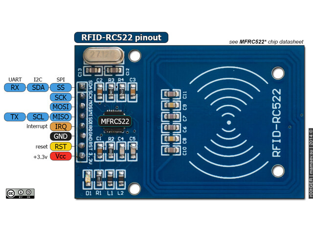

RC522 RFID
==========

.. seo::
    :description: Instructions for setting up RC522 RFID tag readers and tags in ESPHome
    :image: rc522.jpg
    :keywords: RC522, RFID

.. _rc522-component:

The ``rc522`` component allows you to use RC522 RFID controllers
(`datasheet <https://www.nxp.com/docs/en/data-sheet/MFRC522.pdf>`__, `Ali Express <https://es.aliexpress.com/item/1260729519.html>`__)
with ESPHome. ESPHome can read the tag UID from it, every RFID tag comes with a unique
UID value. Each known tag can be associated to a binary sensor, or you can use the tag information directly.
See :ref:`rc522-setting_up_tags` for information on how to setup individual binary sensors for this component.
The RC522 supports SPI, I²C and UART communication protocols, ESPHome can use either SPI or I²C.

Component/Hub
-------------

* If you have a module like the image above, it can only be used in SPI mode (`unless hacked <https://forum.arduino.cc/index.php?topic=442750.0>`__)
  and you need to have an :ref:`SPI bus <spi>` in your configuration with both the **miso_pin** and **mosi_pin** set.

* If you have a RC522 which communicates via I²C like in the M5 Stack then you need to have an :ref:`I²C <i2c>` bus configured.

Over SPI
--------

The ``rc522_spi`` component allows you to use RC522 RFID controllers with ESPHome. This component is a global hub that
establishes the connection to the RC522 via :ref:`SPI <spi>` (also available over I²C). Using the
:ref:`RC522 binary sensors <rc522-tag>` you can then create individual binary sensors that track if
an RFID tag is currently detected by the RC522.

.. code-block:: yaml

    spi:

    rc522_spi:
      cs_pin: GPIO15

    binary_sensor:
      - platform: rc522
        uid: 74-10-37-94
        name: "RC522 RFID Tag"

Configuration variables:
************************

- **cs_pin** (**Required**, :ref:`Pin Schema <config-pin_schema>`): The pin on the ESP that the chip select line
  is connected to.
- **spi_id** (*Optional*, :ref:`config-id`): Manually specify the ID of the :ref:`SPI Component <spi>` if you want
  to use multiple SPI buses.
- **on_tag** (*Optional*, :ref:`Action <config-action>`): An automation to perform when a tag is read. See
  :ref:`rc522-on_tag`.
- **reset_pin** (*Optional*, :ref:`Pin Schema <config-pin_schema>`): The pin connected to the RST line. Some tests
  shows the RC522 working okay without this.
- **update_interval** (*Optional*, :ref:`config-time`): The duration of each scan on the RC522. This affects the
  duration that the individual binary sensors stay active when they're found.
  If a device is not found within this time window, it will be marked as not present. Defaults to ``1s``.
- **id** (*Optional*, :ref:`config-id`): Manually specify the ID for this component.

Over I²C
--------

The ``rc522_i2c`` component allows you to use RC522 RFID controllers with ESPHome. This component is a global hub that
establishes the connection to the RC522 via :ref:`I²C <i2c>` (also available over SPI). Using the
:ref:`RC522 binary sensors <rc522-tag>` you can then create individual binary sensors that track if
an RFID tag is currently detected by the RC522.

.. code-block:: yaml

    i2c:

    rc522_i2c:

    binary_sensor:
      - platform: rc522
        uid: 74-10-37-94
        name: "RC522 RFID Tag"

Configuration variables:
************************

- **address** (*Optional*, int): Manually specify the I²C address of the sensor. Defaults to ``0x28``.
- **i2c_id** (*Optional*, :ref:`config-id`): Manually specify the ID of the :ref:`I²C Component <i2c>` if you want
  to use multiple I²C buses.
- **on_tag** (*Optional*, :ref:`Action <config-action>`): An automation to perform when a tag is read. See
  :ref:`rc522-on_tag`.
- **reset_pin** (*Optional*, :ref:`Pin Schema <config-pin_schema>`): The pin connected to the RST line. Some tests
  shows the RC522 working okay without this.
- **update_interval** (*Optional*, :ref:`config-time`): The duration of each scan on the RC522. This affects the
  duration that the individual binary sensors stay active when they're found.
  If a device is not found within this time window, it will be marked as not present. Defaults to ``1s``.
- **id** (*Optional*, :ref:`config-id`): Manually specify the ID for this component.

.. _rc522-on_tag:

``on_tag`` Action
-----------------

This automation will be triggered when the RC522 module responds with a tag. Please note that this
can be called quite often (with an interval of ``update_interval``) as it's triggered repeatedly
if the tag is re-read many times.

The parameter ``x`` this trigger provides is of type ``std::string`` and is the tag UID in the format
``74-10-37-94``. The configuration below will for example publish the tag ID on the MQTT topic ``rc522/tag``.

.. code-block:: yaml

    rc522_spi: # or rc522_i2c
      # ...
      on_tag:
        then:
          - mqtt.publish:
              topic: rc522/tag
              payload: !lambda 'return x;'

A tag scanned event can also be sent to the Home Assistant tag component
using :ref:`api-homeassistant_tag_scanned_action`.

.. code-block:: yaml

    rc522_spi: # or rc522_i2c
      # ...
      on_tag:
        then:
          - homeassistant.tag_scanned: !lambda 'return x;'

.. _rc522-tag:

``rc522`` Binary Sensor
-----------------------

The ``rc522`` binary sensor platform lets you track if an RFID tag with a given
unique id (``uid``) is currently being detected by the RC522 or not.

.. code-block:: yaml

    # Example configuration entry
    spi:
      clk_pin: D0
      miso_pin: D1
      mosi_pin: D2

    rc522_spi: # or rc522_i2c
      cs_pin: D3
      update_interval: 1s

    binary_sensor:
      - platform: rc522
        uid: 74-10-37-94
        name: "RC522 RFID Tag"

Configuration variables:
************************

- **uid** (**Required**, string): The unique ID of the RFID tag. This is a hyphen-separated list
  of hexadecimal values. For example ``74-10-37-94``.
- **name** (**Required**, string): The name of the binary sensor.
- **id** (*Optional*, :ref:`config-id`): Manually specify the ID used for code generation.
- All other options from :ref:`Binary Sensor <config-binary_sensor>`.

.. _rc522-setting_up_tags:

Setting Up Tags
---------------

To set up binary sensors for specific RFID tags you first have to know their unique IDs. To obtain this
id, first set up a simple RC522 configuration without any binary sensors like above.

When your code is running and you approach the RC522 with an RFID Tag, you should see a message like this:

.. code::

    Found new tag '74-10-37-94'

Then copy this id and create a ``binary_sensor`` entry as in the configuration example. Repeat this process for
each tag.

See Also
--------

- :doc:`index`
- :doc:`rdm6300`
- :doc:`pn532`
- :apiref:`rc522/rc522.h`
- :ghedit:`Edit`
