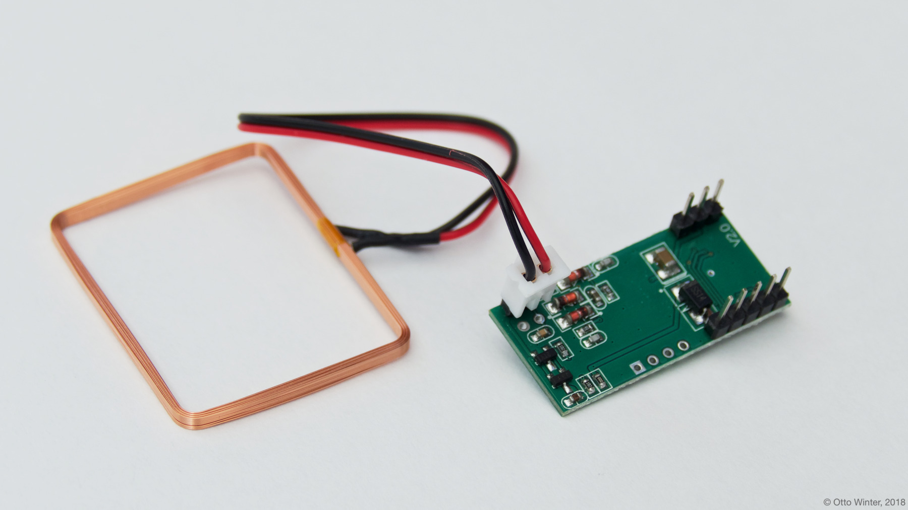
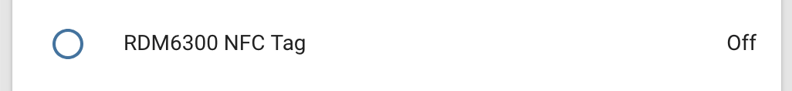

RDM6300 NFC/RFID
================

.. seo::
    :description: Instructions for setting up RDM6300 NFC/RFID tag readers and tags in ESPHome.
    :image: rdm6300.jpg
    :keywords: RDM6300, NFC, RFID

.. _rdm6300-component:

Component/Hub
-------------

The ``rdm6300`` component allows you to use RDM6300 NFC/RFID controllers
(`datasheet <https://elty.pl/upload/download/RFID/RDM630-Spec.pdf>`__, `iTead <https://www.itead.cc/rdm6300.html>`__)
with ESPHome. This component is a global hub that establishes the connection to the RDM6300 via :ref:`UART <uart>` and
translates the received data. Using the :ref:`RDM6300 binary sensors <rdm6300-tag>` you can then
create individual binary sensors that track if an NFC/RFID tag is currently detected by the RDM6300.

See :ref:`rdm6300-setting_up_tags` for information on how to setup individual binary sensors for this component.

As the communication with the RDM6300 is done using UART, you need
to have an :ref:`UART bus <uart>` in your configuration with the ``rx_pin`` connected to the data pin of the RDM6300 and
with the baud rate set to 9600

.. code-block:: yaml

    # Example configuration entry
    uart:
      rx_pin: D0
      baud_rate: 9600

    rdm6300:

    binary_sensor:
      - platform: rdm6300
        uid: 7616525
        name: "RDM6300 NFC Tag"

Configuration variables:
************************

- **uart_id** (*Optional*, :ref:`config-id`): Manually specify the ID of the :ref:`UART Component <uart>` if you want
  to use multiple UART buses.
- **on_tag** (*Optional*, :ref:`Automation <automation>`): An automation to perform
  when a tag is read. See :ref:`rdm6300-on_tag`.
- **id** (*Optional*, :ref:`config-id`): Manually specify the ID for this component.

.. _rdm6300-on_tag:

``on_tag``
----------

This automation will be triggered when the RDM6300 module responds with a tag.

The parameter ``x`` this trigger provides is of type ``uint32_t`` and is the tag UID as a 32-bit
unsigned integer.

.. code-block:: yaml

    rdm6300:
      # ...
      on_tag:
        then:
          - mqtt.publish:
              topic: rdm6300/tag
              payload: !lambda 'return to_string(x);'

A tag scanned event can also be sent to the Home Assistant tag component
using :ref:`api-homeassistant_tag_scanned_action`.

.. code-block:: yaml

    rdm6300:
      # ...
      on_tag:
        then:
          - homeassistant.tag_scanned: !lambda 'return to_string(x);'

.. _rdm6300-tag:

``rdm6300`` Binary Sensor
-------------------------

The ``rdm6300`` binary sensor platform lets you track if an NFC/RFID tag with a given
unique id (``uid``) is currently being detected by the RDM6300 or not.

.. code-block:: yaml

    # Example configuration entry
    uart:
      rx_pin: D0
      baud_rate: 9600

    rdm6300:

    binary_sensor:
      - platform: rdm6300
        uid: 7616525
        name: "RDM6300 NFC Tag"

Configuration variables:
************************

- **uid** (**Required**, int): The unique ID of the NFC/RFID tag.
- **name** (**Required**, string): The name of the binary sensor.
- **id** (*Optional*, :ref:`config-id`): Manually specify the ID used for code generation.
- All other options from :ref:`Binary Sensor <config-binary_sensor>`.

.. _rdm6300-setting_up_tags:

Setting Up Tags
---------------

To set up binary sensors for specific NFC tags you first have to know their unique IDs. To obtain this
id, first set up a simple RDM6300 configuration without any binary sensors like above.

When your code is running and you approach the RDM6300 with an NFC Tag, you should see a message like this:

.. code::

    Found new tag with ID '7616525'

Then copy this id and create a ``binary_sensor`` entry as in the configuration example. Repeat this process for
each tag.

See Also
--------

- :doc:`pn532`
- :doc:`/components/binary_sensor/index`
- :apiref:`rdm6300/rdm6300.h`
- :ghedit:`Edit`
