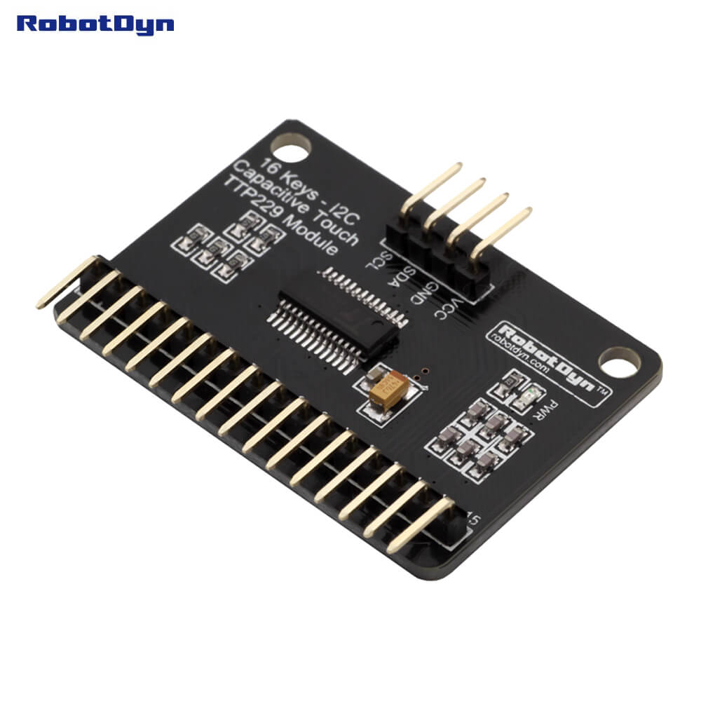

TTP229 Capacitive Touch Sensor
==============================

.. seo::
    :description: Instructions for setting up TTP229 Capacitive Touch Sensor
    :image: ttp229.jpg
    :keywords: TTP229

The ``ttp229`` component allows you to use your TTP229 `datasheet <https://www.tontek.com.tw/uploads/product/106/TTP229-LSF_V1.0_EN.pdf>`__
Capacitive Touch Sensor with ESPHome.

There are two types of this sensor:

- **ttp229_lsf**: The :ref:`I²C <i2c>` version of the sensor, uses SDA+SCL pins.
- **ttp229_bsf**: The pin-based version of the sensor, uses SDO+SCL pins.

    TTP229 Capacitive Touch Sensor. Image by `RobotDyn`_.

.. _RobotDyn: https://www.tinytronics.nl/shop/nl/sensoren/touch/robotdyn-touch-module-ttp229-lsf-16-kanaals

``ttp229_lsf`` Component
------------------------

.. code-block:: yaml

    # Example configuration entry
    ttp229_lsf:

    binary_sensor:
      - platform: ttp229_lsf
        name: TTP229 Channel 0
        channel: 0

Configuration variables:
************************

The configuration is made up of two parts: The central component, and individual Binary sensors per channel.

- **id** (*Optional*, :ref:`config-id`): Manually set the ID of this sensor.

``ttp229_lsf`` Binary Sensor
----------------------------

Configuration variables:

- **name** (**Required**, string): The name of the binary sensor.
- **channel** (**Required**, int): The channel number at the TTP229 the touchkey is connected to.
- **id** (*Optional*, :ref:`config-id`): Manually specify the ID used for code generation.
- All other options from :ref:`Binary Sensor <config-binary_sensor>`.

``ttp229_bsf`` Component
------------------------

.. code-block:: yaml

    # Example configuration entry
    ttp229_bsf:
      sdo_pin: D0
      scl_pin: D1

    binary_sensor:
      - platform: ttp229_bsf
        name: TTP229 Channel 0
        channel: 0

Configuration variables:
************************

The configuration is made up of two parts: The central component, and individual Binary sensors per channel.

Base Configuration:

- **sdo_pin** (**Required**, :ref:`Pin Schema <config-pin_schema>`): The pin the
  SDO pin is connected to.
- **scl_pin** (**Required**, :ref:`Pin Schema <config-pin_schema>`): The pin the
  SCL pin is connected to.
- **id** (*Optional*, :ref:`config-id`): Manually set the ID of this component.

``ttp229_bsf`` Binary Sensor
----------------------------

Configuration variables:

- **name** (**Required**, string): The name of the binary sensor.
- **channel** (**Required**, int): The channel number at the TTP229 the touchkey is connected to.
- **id** (*Optional*, :ref:`config-id`): Manually specify the ID used for code generation.
- All other options from :ref:`Binary Sensor <config-binary_sensor>`.

See Also
--------

- :ref:`sensor-filters`
- :apiref:`ttp229_lsf/ttp229_lsf.h`
- :apiref:`ttp229_bsf/ttp229_bsf.h`
- :ghedit:`Edit`
