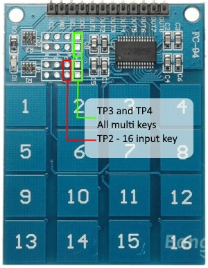

TTP229 Capacitive Touch Sensor
==============================

.. seo::
    :description: Instructions for setting up TTP229 BSF Capacitive Touch Sensor
    :image: ttp229_bsf.jpg
    :keywords: TTP229_BSF

The ``ttp229_bsf`` sensor platform allows you to use your TTP229 BSF `datasheet <https://www.sunrom.com/get/611100>`__
Capacitive Touch Sensor with ESPHome.

The TTP229 BSF has no software configurations so you have to configure your device by hardware.
For the 16 key touchpads there are some excellent technotes around.
For instance the one found at `HobbyComponents forum <http://forum.hobbycomponents.com/viewtopic.php?f=73&t=1781&hilit=hcmodu0079>`__

When you have the 16 key ttp229-bsf touchkeypad you need to connect the TP2 jumper to have full use of the 16 keypads.
Also when you want to allow for multi keypress detection for all 16 keys you need to connect TP3 and TP4 as well.

There are two types of these TTP229 devices available. 
- The TTP229-LSF this is the i2c variant that is also supported by esphome.
- The TTP229-BSF this device uses a two wire proprietary protocol.
Besides the communication protocol these device also have a different pin layout. So they are in no way interchangeable.

    TTP229 BSF Capacitive Touch Sensor.

.. code-block:: yaml

    # Example configuration entry
    ttp229_bsf:
      id: ttp229_bsf_device

    binary_sensor:
      - platform: ttp229_bsf
        name: "TTP229 BSF Channel 0"
        channel: 0

Configuration variables:
------------------------

The configuration is made up of two parts: The central component, and individual Binary sensors per channel.

Base Configuration:

- **id** (*Optional*, :ref:`config-id`): Set the ID of this sensor.

Binary Sensor Configuration:

- **name** (**Required**, string): The name of the binary sensor.
- **channel** (**Required**, integer): The channel number at the ttp229 the touchkey is connected to.
- **id** (*Optional*, :ref:`config-id`): Manually specify the ID used for code generation.
- All other options from :ref:`Binary Sensor <config-binary_sensor>`.
http://marketplace.eclipse.org/marketplace-client-intro?mpc_install=61063
See Also
--------

- :doc:`index`
- :doc:`/components/binary_sensor/ttp229`
- :ref:`sensor-filters`
- :apiref:`sensor/ttp229_bsf_sensor.h`
