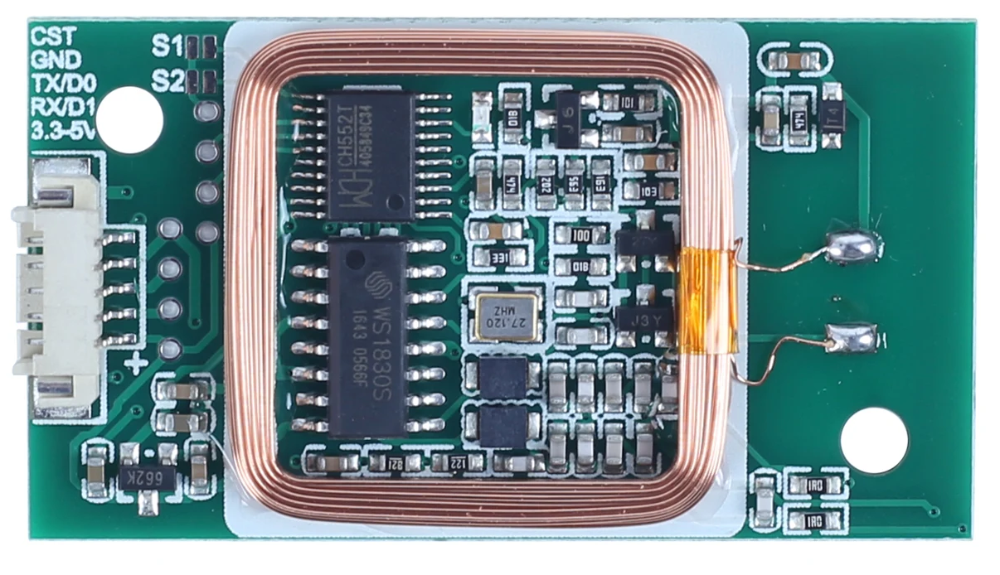

ws1850 UART Tag Reader
======================

.. seo::
    :description: Instructions for setting up UART tag readers that use the wx18x0 chips.
    :image: ws18x0_side.png
    :keywords: ws1830, ws1850, NFC, RFID

.. _ws18x0_uart-component:

Component/Hub
-------------

The ``ws18x0_uart`` component allows you to use various RFID readers that connect over UART and use a 9 or 10 byte protocol
with ESPHome. This component establishes a connection to the readers via :ref:`UART <uart>` and translates the received data. 
Using the :ref:`ws18x0 binary sensors <ws18x0-tag>` you can then create individual binary sensors that track when a tag is detected.

There are various versions of the readers using this protocol. There is no specific standard for this 
protocol I could find, and some of the readers use different ICs which aren't ws1830 or ws1850 however
I had to pick a name. Some of them read multiple frequencies which is quite useful if creating a generic 
reader. Search on Aliexpress for "RFID Reader" and "NFC Reader" to find these readers, and check the protocol 
they use to see if suitable.

Some examples of readers:

* https://www.aliexpress.com/item/4001293753917.html
* https://www.aliexpress.com/item/4001022322648.html
* https://www.aliexpress.com/item/1005002347220856.html

Protocol
--------

.. list-table:: **Protocol**
  :header-rows: 1
  :widths: 30 10 10

  * - Description
    - Length
    - Raw Data
  * - Protocol Header : 0x02
    - 1 byte
    - \-
  * - Data Length : 0x09 or 0x0A
    - 1 byte
    - **Y**
  * - Card Type (see below)
    - 1 byte
    - **Y**
  * - Card Data
    - 4-5 bytes
    - **Y**
  * - XOR Check 
    - 1 byte
    - \-
  * - Data end : 0x03
    - 1 byte
    - \-

Most readers will support a limited subset of types, but the following are the possible card types:

.. list-table:: **Card types**
  :header-rows: 1
  :widths: 10 20

  * - Type
    - Description
  * - 0x02
    - EM4100
  * - 0x01
    - Mifare 1K
  * - 0x03
    - Mifare 4K
  * - 0x10
    - HID card
  * - 0x11
    - T5567
  * - 0x20
    - ID card
  * - 0x21
    - ISO14443B
  * - 0x22
    - FELICA
  * - 0x30
    - 15693 Tag
  * - 0x50
    - CPU card
  * - 0x51
    - Sector information
  * - 0xFF
    - Keyboard data

See :ref:`ws18x0_uart-setting_up_tags` for information on how to setup individual binary sensors for this component.

Only the last four bytes of the card data are used in generating the card ID. There is access to the full data 
length / card type / card ID data, see :ref:`ws18x0-raw_data`.

UART Comms
----------

As the communication with the tag reader is done using UART, you need
to have an :ref:`UART bus <uart>` in your configuration with the ``rx_pin`` connected to the tx pin of the tag reader and
the baud rate set to 9600. The tag readers are send only, so no ``tx_pin`` is required.

.. code-block:: yaml

    # Example configuration entry
    uart:
      rx_pin: GPIO25
      baud_rate: 9600

    ws18x0_uart:

    binary_sensor:
      - platform: ws18x0_uart
        uid: 7616525
        name: "My Access Tag"

Configuration variables:
************************

- **uart_id** (*Optional*, :ref:`config-id`): Manually specify the ID of the :ref:`UART Component <uart>` if you want
  to use multiple UART buses.
- **on_tag** (*Optional*, :ref:`Automation <automation>`): An automation to perform
  when a tag is read. See :ref:`ws18x0-on_tag`.
- **id** (*Optional*, :ref:`config-id`): Manually specify the ID for this component.

.. _ws18x0-on_tag:

``on_tag``
----------

This automation will be triggered when the reader responds with a tag.

The parameter ``x`` this trigger provides is of type ``uint32_t`` and is the tag UID as a 32-bit
unsigned integer.

.. code-block:: yaml

    ws18x0_uart:
      # ...
      on_tag:
        then:
          - mqtt.publish:
              topic: tag_reader/tag
              payload: !lambda 'return to_string(x);'

A tag scanned event can also be sent to the Home Assistant tag component
using :ref:`api-homeassistant_tag_scanned_action`.

.. code-block:: yaml

    ws18x0_uart:
      # ...
      on_tag:
        then:
          - homeassistant.tag_scanned: !lambda 'return to_string(x);'

.. _ws18x0-raw:

Raw Data
--------

The tag data is delivered in a 32-bit unsigned integer. This tag reader also reads the tag type, and 
in some versions has an extra byte of information for the tag ID. The full information returned is
6 or 7 bytes and is unique to each tag. This fits into a ``uint64_t``, and can be examined with the 
following code:

.. code-block:: yaml

    ws18x0_uart:
      id: my_tagread
      # ...
      on_tag:
        then:
          - mqtt.publish:
              topic: tag_reader/tag_raw
              payload: !lambda 'return to_string(id(my_tagread).raw());'

.. _ws18x0-tag:

Binary Sensor
-------------------------

The ``ws18x0_uart`` binary sensor platform lets you track if an tag with a given
unique id (``uid``) is currently being detected or not.

.. code-block:: yaml

    # Example configuration entry
    uart:
      rx_pin: D0
      baud_rate: 9600

    ws18x0_uart:

    binary_sensor:
      - platform: ws18x0_uart
        uid: 7616525
        name: "RFID Tag"

Configuration variables:
************************

- **uid** (**Required**, int): The unique ID of the NFC/RFID tag.
- **name** (**Required**, string): The name of the binary sensor.
- **id** (*Optional*, :ref:`config-id`): Manually specify the ID used for code generation.
- All other options from :ref:`Binary Sensor <config-binary_sensor>`.

.. _ws18x0_uart-setting_up_tags:

Setting Up Tags
---------------

To set up binary sensors for specific NFC tags you first have to know their unique IDs. To obtain this
id, first set up a simple configuration without any binary sensors like above.

When your code is running and you approach the tag reader with a tag, you should see a message like this:

.. code::

    Found new tag with ID '7616525'

Then copy this id and create a ``binary_sensor`` entry as in the configuration example. Repeat this process for
each tag.

See Also
--------

- :doc:`/components/binary_sensor/index`
- :apiref:`ws18x0_uart/ws18x0_uart.h`
- :ghedit:`Edit`
