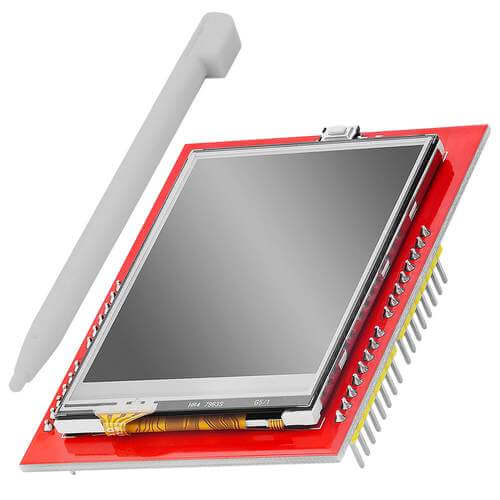

XPT2046 Touch Screen Controller
==================================

.. esphome:component-definition::
   :alias: xpt2046
   :category: binary-sensor
   :friendly_name: XPT2046
   :toc_group: Binary Sensor Components
   :toc_image: xpt2046.jpg

.. seo::
    :description: Instructions for setting up XPT2046 touch screen controller with ESPHome
    :image: xpt2046.jpg
    :keywords: XPT2046

.. _xpt2046-component:

Component/Hub
-------------

The ``xpt2046`` component allows using the touch screen controllers
based on the XPT2046 chip
(`datasheet <https://datasheetspdf.com/pdf-file/746665/XPTEK/XPT2046/1>`__,
`AZ-Delivery`_) with ESPHome. Many cheap LCD displays contain this controller.
The :ref:`SPI <spi>` is required to be set up in your configuration for this sensor to work.

    XPT2046 Touch Screen Controller

.. _AZ-Delivery: https://www.az-delivery.de/en/products/2-4-tft-lcd-touch-display

.. code-block:: yaml

    # Example configuration entry
    xpt2046:
      id: touchscreen
      cs_pin: 17
      irq_pin: 16
      update_interval: 50ms
      report_interval: 1s
      threshold: 400
      dimension_x: 240
      dimension_y: 320
      calibration_x_min: 3860
      calibration_x_max: 280
      calibration_y_min: 340
      calibration_y_max: 3860
      swap_x_y: false

    binary_sensor:
      - platform: xpt2046
        xpt2046_id: touchscreen
        id: touch_key0
        x_min: 80
        x_max: 160
        y_min: 106
        y_max: 212
        on_state:
          - lambda: 'ESP_LOGI("main", "key0: %s", (x ? "touch" : "release"));'
  

Configuration variables:
------------------------
The configuration is made up of two parts: The touch screen component, and optional individual binary sensors.

Base Configuration:

- **id** (*Optional*, :ref:`config-id`): Set the ID of this sensor.

- **cs_pin** (*Optional*, :ref:`Pin Schema <config-pin_schema>`): The chip select pin.
  Often marked ``T_CS`` on the board.

- **irq_pin** (*Optional*, :ref:`Pin Schema <config-pin_schema>`): The touch detection pin.
  Often marked ``T_IRQ`` on the board. If not specified the component will use polling
  via SPI.

- **update_interval** (*Optional*, :ref:`config-time`): The interval to check the
  sensor. If ``irq_pin`` is specified the touch will be detected nearly instantaneously and this setting 
  will be used only for the release detection. Defaults to ``50ms``.

- **report_interval** (*Optional*, :ref:`config-time`): The interval to periodically
  report the coordinates while the touch screen is touched. Defaults to ``never``.

- **threshold** (*Optional*, int): The value to detect the touch or release. Defaults to ``400``.

- **dimension_x** (*Optional*, int): The dimension of the display in the horizontal
  direction. Usually in pixels but a percentage can be useful as well. Defaults to ``100``.

- **dimension_y** (*Optional*, int): The dimension of the display in the vertical
  direction. Usually in pixels but a percentage can be useful as well. Defaults to ``100``.

- **calibration_x_min** (*Optional*, int): The raw value corresponding to the left
  (or top if ``swap_x_y`` is specified) edge of the display. See :ref:`xpt2046-calibration`
  for the process to calibrate the touch screen. Defaults to ``0``.

- **calibration_x_max** (*Optional*, int): The raw value corresponding to the right
  (or bottom if ``swap_x_y`` is specified) edge of the display. Defaults to ``4095``.

- **calibration_y_min** (*Optional*, int): The raw value corresponding to the top
  (or left if ``swap_x_y`` is specified) edge of the display. Defaults to ``0``.

- **calibration_y_max** (*Optional*, int): The raw value corresponding to the bottom
  (or right if ``swap_x_y`` is specified) edge of the display. Defaults to ``4095``.

- **swap_x_y** (*Optional*, boolean): If true the x and y axes are swapped. Defaults to ``false``.

- **on_state** (*Optional*, :ref:`Automation <automation>`): An automation to perform
  when the touch screen is pressed or released. See :ref:`xpt2046-on_state`.

.. _xpt2046-on_state:

``on_state`` Action
-------------------

This automation will be triggered when the XPT2046 touch screen detects a touch, a release
or periodically each ``report_interval`` while touched.

This trigger provides three arguments: ``x`` and ``y`` are of the type int and specify the
coordinates of the touch and a bool ``touched`` specifying whether a touch or release was
detected.

Additionally to the coordinates, the touch status and the raw values needed for the calibration
can be accessed as member variables.

The following code

.. code-block:: yaml

    xpt2046:
      on_state:
        - lambda: |-
            ESP_LOGI("main", "args x=%d, y=%d, touched=%s", x, y, (touched ? "touch" : "release"));
            ESP_LOGI("main", "member x=%d, y=%d, touched=%d, x_raw=%d, y_raw=%d, z_raw=%d",
                id(touchscreen).x,
                id(touchscreen).y,
                (int) id(touchscreen).touched,
                id(touchscreen).x_raw,
                id(touchscreen).y_raw,
                id(touchscreen).z_raw
                );

produces

.. code-block:: none

    [20:17:37][I][main:065]: args x=145, y=261, touched=touch
    [20:17:37][I][main:073]: member x=145, y=261, touched=1, x_raw=1686, y_raw=3218, z_raw=424
    [20:17:37][I][main:065]: args x=145, y=261, touched=release
    [20:17:37][I][main:073]: member x=145, y=261, touched=0, x_raw=0, y_raw=0, z_raw=0

Binary Sensor
-------------

The ``xpt2046`` binary sensor allows you to setup areas on the touch screen as virtual
buttons. First, setup a :ref:`xpt2046-component` and then use this binary sensor platform
to create individual binary sensors for each virtual button.

- **name** (*Optional*, string): The name for the binary sensor.
- **id** (*Optional*, :ref:`config-id`): Manually specify the ID used for code generation.
- **xpt2046_id** (*Optional*, :ref:`config-id`): Specify the ID of the component the sensor is part of. Useful when you have more than one touch screen.
- **x_min** (**Required**, int): Left coordinate of the screen area to be detected as the virtual button.
- **x_max** (**Required**, int): Right coordinate of the screen area to be detected as the virtual button.
- **y_min** (**Required**, int): Top coordinate of the screen area to be detected as the virtual button.
- **y_max** (**Required**, int): Bottom coordinate of the screen area to be detected as the virtual button.
- All other options from :ref:`Binary Sensor <config-binary_sensor>`.

.. _xpt2046-calibration:

Calibration
-----------

To match the point of the touch to the display coordinates the touch screen has to be calibrated.
The XPT2046 component returns raw values in the 0 to 4095 range. Those raw values are available
as the ``x_raw`` and ``y_raw`` member variables and for example write them out as in the example
:ref:`xpt2046-on_state`. The goal of the calibration is to identify the raw values corresponding
to the edges of the screen.

The calibration assumes a display oriented in a way that you will be using it, i.e. your
:ref:`display-engine` component has to have the [0,0] logical coordinate at the top left.
Set the dimensions as ``dimension_x`` and ``dimension_y`` and do not set any calibration
values nor ``swap_x_y``.

.. code-block:: yaml

    # Touchscreen
    xpt2046:
      id: touchscreen
      cs_pin: 17
      irq_pin: 16
      dimension_x: 240
      dimension_y: 320
      on_state:
        - lambda: |-
            if (touched)
              ESP_LOGI("cal", "x=%d, y=%d, x_raw=%d, y_raw=%d",
                  id(touchscreen).x,
                  id(touchscreen).y,
                  id(touchscreen).x_raw,
                  id(touchscreen).y_raw
                  );

Get a stylus or a similar object, run the project and touch the corners of the screen at
the edge pixels. Repeat several times and note minimum and maximum x and y raw values.

.. code-block:: none

    ... top left ...
    [21:07:48][I][cal:071]: x=217, y=34, x_raw=3718, y_raw=445
    [21:07:49][I][cal:071]: x=222, y=32, x_raw=3804, y_raw=419
    ... top right ...
    [21:07:52][I][cal:071]: x=19, y=36, x_raw=334, y_raw=370
    [21:07:52][I][cal:071]: x=22, y=35, x_raw=386, y_raw=347
    ... bottom left ...
    [21:08:00][I][cal:071]: x=224, y=299, x_raw=3836, y_raw=3835
    [21:08:00][I][cal:071]: x=225, y=303, x_raw=3848, y_raw=3878
    [21:08:01][I][cal:071]: x=223, y=299, x_raw=3807, y_raw=3829
    ... bottom right ...
    [21:08:11][I][cal:071]: x=16, y=299, x_raw=281, y_raw=3839
    [21:08:12][I][cal:071]: x=19, y=302, x_raw=328, y_raw=3866
    [21:08:13][I][cal:071]: x=20, y=296, x_raw=358, y_raw=3799

That means that the minimum raw x is 281, maximum 3848, minimum y 347 and maximum 3878.

Identify which raw value is the display's x direction and what the y one. In our case
moving right decreases the x raw value and going down increases the y one so the axes
match and we *don't* need to use ``swap_x_y``. If the raw x is the display's y,
use ``swap_x_y = true``.

If one of the coordinates goes in the "wrong" direction it needs to be inverted.
The inversion is performed by swapping the minimum and maximum values. In our
case the horizontal direction represented by the raw x (no swap) is inverted
so the ``calibration_x_min`` needs to be larger than ``calibration_x_max``.
The vertical direction is fine. The configuration would thus be

.. code-block:: yaml

    xpt2046:
      calibration_x_min: 3848
      calibration_x_max: 281
      calibration_y_min: 347
      calibration_y_max: 3878

Compile, run and click on the edges again. The x and y should now match the coordinates
of the display.

.. code-block:: none

    [21:32:34][I][cal:071]: x=7, y=6, x_raw=3755, y_raw=407
    [21:32:37][I][cal:071]: x=237, y=4, x_raw=313, y_raw=385
    [21:32:43][I][cal:071]: x=239, y=318, x_raw=284, y_raw=3845
    [21:33:05][I][cal:071]: x=2, y=313, x_raw=3821, y_raw=3793

Note that the touch screen is not extremely precise and there might be nonlinearities
or similar errors so don't expect a pixel-perfect precision. You can verify the touchpoint
using a display lambda similar to the following.

.. code-block:: none

    display:
      - platform: ili9341
        lambda: |-
          it.fill(BLACK);
          if (id(touchscreen).touched)
            it.filled_circle(id(touchscreen).x, id(touchscreen).y, 10, RED);

To be exact, the component does the following

- reads the raw x and y and normalizes it using (non-inverted) min and max values
- swaps x and y if needed
- inverts if needed
- scales to the display dimensions

See Also
--------

- :ref:`Binary Sensor Filters <binary_sensor-filters>`
- :apiref:`xpt2046/xpt2046.h`
- `XPT2046 Library <https://platformio.org/lib/show/542/XPT2046_Touchscreen>`__ by `Paul Stoffregen <https://github.com/PaulStoffregen>`__
- :ghedit:`Edit`
