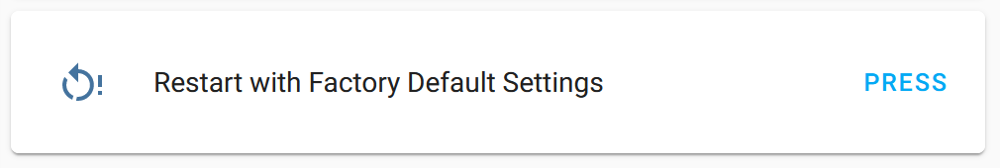

Factory Reset Button
====================

.. seo::
    :description: Instructions for setting up buttons that can remotely invalidate all ESPHome preferences stored in flash and reboot ESP.
    :image: restart.svg

The ``factory_reset`` button allows you to remotely invalidate (reset) all ESPHome :ref:`preferences <preferences-flash_write_interval>` stored in flash memory and reboot your node.
After reboot all states, parameters and variables will be reinitialized with their default values. This is useful:

- for devices preflashed with ESPHome to reset behavior back to factory state
- in case of moving a device to a new environment or starting a new use-case (e.g. reset counters or state)
- for privacy concerns when giving away a device

.. note::

    **USE WITH GREAT CAUTION!** All credentials, global variables, counters and saved states stored in non-volatile memory will be lost with no chance of recovering them.
    Even raw reading of flash memory with ``esptool`` will not help, since data is physically erased from flash memory.

    For devices configured using :doc:`captive portal </components/captive_portal>`, this will reset WiFi settings as well, thus making such devices offline.
    You'll need to be in close proximity to your device to configure it again using a built-in WiFi access point and captive portal.

.. code-block:: yaml

    # Example configuration entry
    button:
      - platform: factory_reset
        name: Restart with Factory Default Settings

Configuration variables:
------------------------

- **name** (**Required**, string): The name of the button.
- **id** (*Optional*, :ref:`config-id`): Manually specify the ID used for code generation.
- All other options from :ref:`Button <config-button>`.

See Also
--------

- :doc:`shutdown`
- :doc:`restart`
- :doc:`safe_mode`
- :doc:`/components/switch/factory_reset`
- :doc:`template`
- :apiref:`factory_reset/factory_reset_button.h`
- :ghedit:`Edit`
