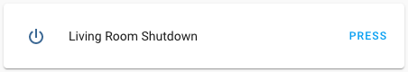

Shutdown Button
===============

.. seo::
    :description: Instructions for setting up buttons that can remotely shut down the ESP.
    :image: power_settings.svg

The ``shutdown`` button platform allows you to shutdown your node remotely
through Home Assistant. It does this by putting the node into deep sleep mode with no
wakeup source selected. After enabling, the only way to startup the ESP again is by
pressing the reset button or restarting the power supply.

.. code-block:: yaml

    # Example configuration entry
    button:
      - platform: shutdown
        name: "Living Room Shutdown"

Configuration variables:
------------------------

- **name** (**Required**, string): The name for the button.
- **id** (*Optional*, :ref:`config-id`): Manually specify the ID used for code generation.
- All other options from :ref:`Button <config-button>`.

See Also
--------

- :doc:`restart`
- :doc:`safe_mode`
- :doc:`factory_reset`
- :doc:`/components/switch/shutdown`
- :doc:`template`
- :apiref:`shutdown/shutdown_button.h`
- :ghedit:`Edit`
