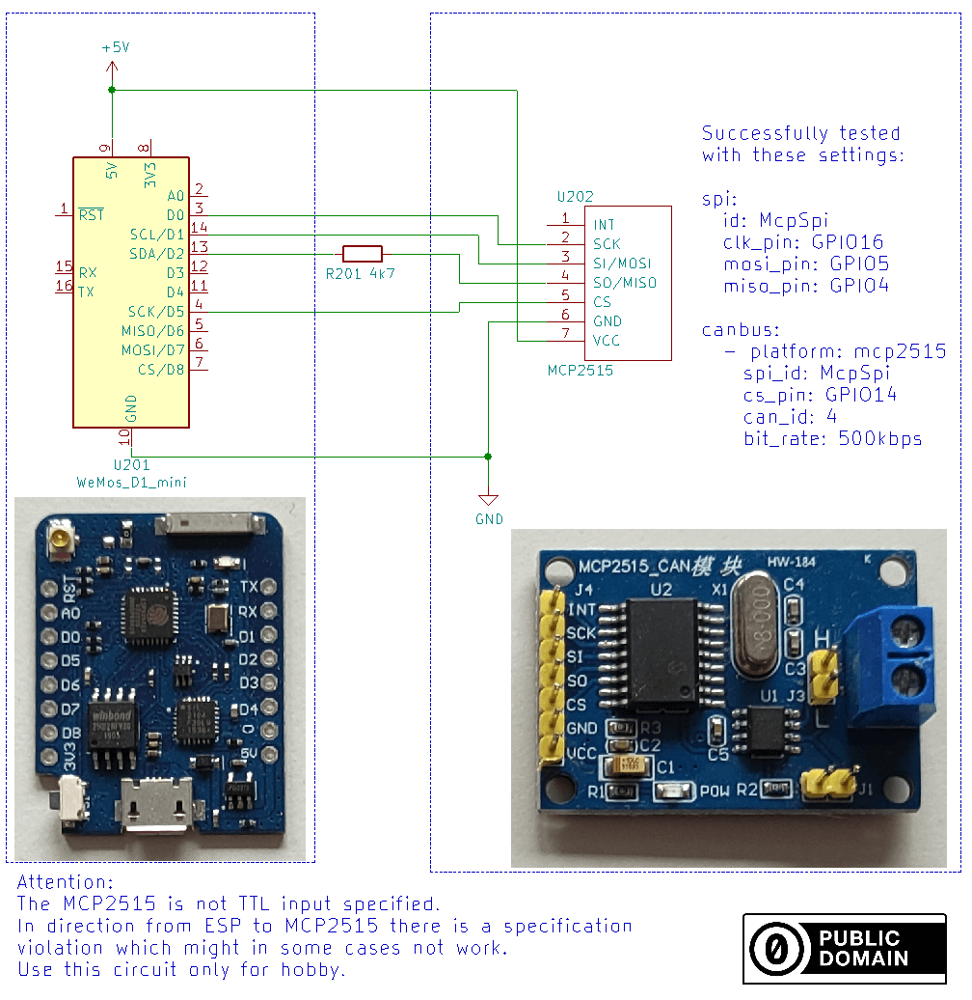

.. _canbus:

CAN bus
=======

.. seo::
    :description: Instructions for setting up an CAN bus in ESPHome
    :image: canbus.svg
    :keywords: CAN

Controller Area Network (CAN bus) is a serial bus protocol to connect individual systems and sensors
as an alternative to conventional multi-wire looms.
It allows automotive components to communicate on a single or dual-wire networked data bus up to 1Mbps.
CAN is an International Standardization Organization (ISO) defined serial communications bus originally
developed for the automotive industry to replace the complex wiring harness with a two-wire bus. The
specification calls for high immunity to electrical interference and the ability to self-diagnose and repair
data errors. These features have led to CAN’s popularity in a variety of industries including building
automation, medical, and manufacturing.

The current ESPHome implementation supports single frame data transfer. In this way you may send and
receive data frames up to 8 bytes.
With this you can transmit the press of a button or the feedback from a sensor on the bus.
All other devices on the bus will be able to get this data to switch on/off a light or display the
transmitted data.

The CAN bus itself has only two wires named Can High and Can Low or CanH and CanL. For the ESPHome
CAN bus to work you need to select the device that has the physical CAN bus implemented.
You can configure multiple buses.

Any can bus node can transmit data at any time, and any node can send any ``can_id`` value and any
node can receive any can_id too. Is up to you how to organize the can_id values. You can setup a can
bus network where each node has a can id which will use to broadcast data about itself, if a node
should, e.g. turn on a light, it can listen for can messages with the can id assigned to it.
So you can have several nodes being able to control a light in e.g. node 20.

Base CAN Bus Configuration
--------------------------

Each canbus platform extends this configuration schema.

.. code-block:: yaml

    # Example configuration entry
    canbus:
      - platform: ...
        can_id: 4
        on_frame:
        - can_id: 500
          use_extended_id: false
          then:
          - lambda: |-
              std::string b(x.begin(), x.end());
              ESP_LOGD("can id 500", "%s", &b[0] );

.. _config-canbus:

Configuration variables:
************************

- **id** (*Optional*, :ref:`config-id`): Manually specify the ID used for code generation.
- **can_id** (*Optional*, int): Default CAN id used for transmitting frames. Not required if you only
  want to receive frames.
- **use_extended_id** (*Optional*, boolean): default *false* identifies the type of *can_id*:
  *false*: Standard 11 bits IDs, *true*: Extended 29 bits ID
- **bit_rate** (*Optional*, enum): One of the supported bitrates. Defaults to ``125KBPS``.
  Bitrates marked with * are not supported by the internal ESP32 CAN controller.

    - 5KBPS *
    - 10KBPS *
    - 20KBPS *
    - 31K25BPS *
    - 33KBPS *
    - 40KBPS *
    - 50KBPS
    - 80KBPS *
    - 83K3BPS *
    - 95KBPS *
    - 100KBPS
    - 125KBPS
    - 200KBPS *
    - 250KBPS
    - 500KBPS
    - 1000KBPS

Automations:
------------

- **on_frame** (*Optional*, :ref:`Automation <automation>`): An automation to perform when a
  CAN frame is received. See :ref:`canbus-on-frame`.

.. _canbus-on-frame:

``on_frame``
************

This automation will be triggered when a CAN frame is received. A variable ``x`` of type
``std::vector<uint8_t>`` containing the frame data and a variable ``can_id`` of type ``uint32_t``
containing the actual received CAN id are passed to the automation for use in lambdas.

.. note::

    Messages this node sends to the same ID will not show up as received messages.

.. code-block:: yaml

    canbus:
      - platform: ...
        on_frame:
        - can_id: 43 # the received can_id
          then:
            - if:
                condition:
                  lambda: 'return (x.size() > 0) ? x[0] == 0x11 : false;'
                then:
                  light.toggle: light1
        - can_id:      0b00000000000000000000001000000
          can_id_mask: 0b11111000000000011111111000000
          use_extended_id: true
          then:
            - lambda: |-
                auto pdo_id = can_id >> 14;
                switch (pdo_id)
                {
                  case 117:
                    ESP_LOGD("canbus", "exhaust_fan_duty");
                    break;
                  case 118:
                    ESP_LOGD("canbus", "supply_fan_duty");
                    break;
                  case 119:
                    ESP_LOGD("canbus", "supply_fan_flow");
                    break;
                  // to be continued...
                }

Configuration variables:
************************

- **can_id** (**Required**, int): The received CAN id to trigger this automation on.
- **can_id_mask** (*Optional*, int): The bit mask to apply to the received CAN id before trying to match it
  with *can_id*, defaults to ``0x1fffffff`` (all bits of received CAN id are compared with *can_id*).
- **use_extended_id** (*Optional*, boolean): Identifies the type of *can_id* to match on, defaults to *false*.

``canbus.send`` Action
**********************

The can bus can transmit frames by means of the ``canbus.send`` action.
There are several forms to use it:

.. code-block:: yaml

    on_...:
      - canbus.send:
          data: [ 0x10, 0x20, 0x30 ]
          canbus_id: my_mcp2515 # optional if you only have 1 canbus device
          can_id: 23 # override the can_id configured in the can bus

    on_...:
      - canbus.send: [ 0x11, 0x22, 0x33 ]

      - canbus.send: 'hello'

      # Templated, return type is std::vector<uint8_t>
      - canbus.send: !lambda
          return {0x00, 0x20, 0x42};

Configuration variables:

- **data** (**Required**, binary data): Data to transmit, up to 8 bytes or
  characters are supported by can bus per frame.
- **canbus_id** (*Optional*): Optionally set the can bus id to use for transmitting
  the frame. Not needed if you are using only 1 can bus.
- **can_id** (*Optional*, int): Allows to override the can id configured in
  the can bus device.
- **use_extended_id** (*Optional*, boolean): default *false* identifies the type of *can_id*:
  *false*: Standard 11 Bit IDs, *true*: Extended 29Bit ID
- **remote_transmission_request** (*Optional*, boolean): Set to send CAN bus frame to request data from another node
  (defaults to *false*). If a certain data length code needs to be sent, provide as many (dummy) bytes in *data*.

ESP32 CAN Component
-------------------

The ESP32 has an integrated CAN controller and therefore doesn't need an external controller necessarily.
You only need to specify the RX and TX pins.

.. code-block:: yaml

    # Example configuration entry
    canbus:
      - platform: esp32_can
        tx_pin: GPIO1
        rx_pin: GPIO3
        can_id: 4
        bit_rate: 50kbps
        on_frame:
          ...

Configuration variables:
************************

- **rx_pin** (**Required**, :ref:`Pin <config-pin>`): Receive pin.
- **tx_pin** (**Required**, :ref:`Pin <config-pin>`): Transmit pin.
- All other options from :ref:`Canbus <config-canbus>`.

MCP2515 Component
-----------------

The MCP2515 is a spi device and therefore you must first add the configuration for the spi bus to your file.
You need to have an :ref:`SPI bus <spi>` in your configuration with both the **mosi_pin** and **miso_pin** set.

For wiring up the MSP2515 please refer to the section below.

.. code-block:: yaml

    # Example configuration entry
    canbus:
      - platform: mcp2515
        cs_pin: D5
        can_id: 4
        bit_rate: 50kbps
        on_frame:
        - can_id: 500
            then:
            - lambda: |-
                std::string b(x.begin(), x.end());
                ESP_LOGD("canid 500", "%s", &b[0] );
            - light.turn_off: light_1
        - can_id: 501
            then:
            - light.turn_on:
                id: light_1
                brightness: !lambda "return (x.size() > 0) ? (float) x[0]/255 : 0;"

Configuration variables:
************************

- **cs_pin** (**Required**, :ref:`Pin Schema <config-pin_schema>`): Is used to tell the receiving SPI device
  when it should listen for data on the SPI bus. Each device has an individual ``CS`` line.
  Sometimes also called ``SS``.
- **clock** (*Optional*): One of ``8MHZ``, ``16MHZ`` or ``20MHZ``. Clock crystal used on the MCP2515 device.
  Defaults to ``8MHZ``.
- **mode** (*Optional*): Operation mode. Default to ``NORMAL``

  - NORMAL: Normal operation
  - LOOPBACK: Loopback mode can be used to just test you spi connections to the device
  - LISTENONLY: only receive data

- All other options from :ref:`Canbus <config-canbus>`.

Wiring options
---------------
Easiest approach is to just use fully assembled boards and just add one resistor in the MISO line.
This runs MOSI, SCK and CS out of specification which is nearly never a problem.

A more advanced option is to fully convert the 5V and 3.3V logic levels with a level shifter.

.. figure:: images/canbus_mcp2515_txs0108e.png
    :align: center
    :target: ../_images/canbus_mcp2515_txs0108e.png

Extended ID
-----------
Standard IDs and Extended IDs can coexist on the same segment.

.. note::

    It is important to know that for example Standard 0x123 and Extended 0x123 are different addresses.
    This example shows how the different ID types are used in the configuration for transmission and receiving.
    For the IDs decimal or hexadecimal notation is possible:
    0x000 - 0x7ff / 0-2047 for Standard IDs only.
    0x00000000 - 0x1fffffff / 0-536870911 for Extended IDs.

.. code-block:: yaml

    # Transmission of extended and standard ID 0x100 every second
    time:
      - platform: sntp
        on_time:
          - seconds: /1
            then:
              - canbus.send:
                  # Extended ID explicit
                  use_extended_id: true
                  can_id: 0x100
                  data: [0x01, 0x02, 0x03, 0x04, 0x05, 0x06, 0x07, 0x08]
              - canbus.send:
                  # Standard ID by default
                  can_id: 0y100
                  data: [0x01, 0x02, 0x03, 0x04, 0x05, 0x06, 0x07, 0x08]

    canbus:
      - platform: mcp2515
        id: my_mcp2515
        spi_id: McpSpi
        cs_pin: GPIO14
        can_id: 0x1fff
        use_extended_id: true
        bit_rate: 125kbps
        on_frame:
        - can_id: 0x123
          use_extended_id: true
          then:
          - lambda: |-
              std::string b(x.begin(), x.end());
              ESP_LOGD("can extended id 0x123", "%s", &b[0] );
        - can_id: 0x123
          then:
          - lambda: |-
              std::string b(x.begin(), x.end());
              ESP_LOGD("can standard id 0x123", "%s", &b[0] );

Binary Sensor Example
---------------------
Example for the following application:
Button is connected on a can node which sends an A message on ID 0x100 with payload 0x01 for contact closed and 0x00 for contact open.

.. code-block:: yaml

    spi:
      id: McpSpi
      clk_pin: GPIO16
      mosi_pin: GPIO5
      miso_pin: GPIO4

    binary_sensor:
      - platform: template
        name: "CAN Bus Button"
        id: "can_bus_button"

    canbus:
      - platform: mcp2515
        id: my_mcp2515
        spi_id: McpSpi
        cs_pin: GPIO14
        can_id: 4
        bit_rate: 125kbps
        on_frame:
        - can_id: ${0x100}
          then:
            - lambda: |-
                if(x.size() > 0) {
                  switch(x[0]) {
                    case 0x0: id(can_bus_button).publish_state(false); break; // button release
                    case 0x1: id(can_bus_button).publish_state(true); break;  // button down
                  }
                }

Cover Example
-------------
Example for following application:
Buttons are connected on the CAN-Node and also the motor is connected via CAN.

.. epigraph::

    | **Button 1:** ID 0x50B - 1 byte payload
    | (0: Button release, 1: Button down, 2: long down, 3: long release, 4 double click)
    | **Button 2:** ID 0x50C - 1 byte payload
    | (0: Button release, 1: Button down, 2: long down, 3: long release, 4 double click)
    | **Motor:** ID 0x51A - 1 byte payload
    | (0: off, 1: open, 2: close)

.. code-block:: yaml

    spi:
      id: McpSpi
      clk_pin: GPIO16
      mosi_pin: GPIO5
      miso_pin: GPIO4

    canbus:
      - platform: mcp2515
        id: my_mcp2515
        spi_id: McpSpi
        cs_pin: GPIO14
        can_id: 4
        bit_rate: 125kbps
        on_frame:
        - can_id: 0x50c
          then:
            - lambda: |-
                if(x.size() > 0) {
                  auto call = id(TestCover).make_call();
                  switch(x[0]) {
                    case 0x2: call.set_command_open(); call.perform(); break; // long pressed
                    case 0x1:                                                 // button down
                    case 0x3: call.set_command_stop(); call.perform(); break; // long released
                    case 0x4: call.set_position(1.0); call.perform(); break;  // double click
                  }
                }
        - can_id: 0x50b
          then:
            - lambda: |-
                if(x.size() > 0) {
                  auto call = id(TestCover).make_call();
                  switch(x[0]) {
                    case 0x2: call.set_command_close(); call.perform(); break; // long pressed
                    case 0x1:                                                  // button down
                    case 0x3: call.set_command_stop(); call.perform(); break;  // long released
                    case 0x4: call.set_position(0.0); call.perform(); break;   // double click
                  }
                }

    cover:
      - platform: time_based
        name: "MyCanbusTestCover"
        id: TestCover
        device_class: shutter
        has_built_in_endstop: true
        open_action:
          - canbus.send:
              data: [ 0x01 ]
              canbus_id: my_mcp2515
              can_id: 0x51A
        open_duration: 2min
        close_action:
          - canbus.send:
              data: [ 0x02 ]
              canbus_id: my_mcp2515
              can_id: 0x51A
        close_duration: 2min
        stop_action:
          - canbus.send:
              data: [ 0x00 ]
              canbus_id: my_mcp2515
              can_id: 0x51A

See Also
--------

- :apiref:`spi/spi.h`
- :ghedit:`Edit`
