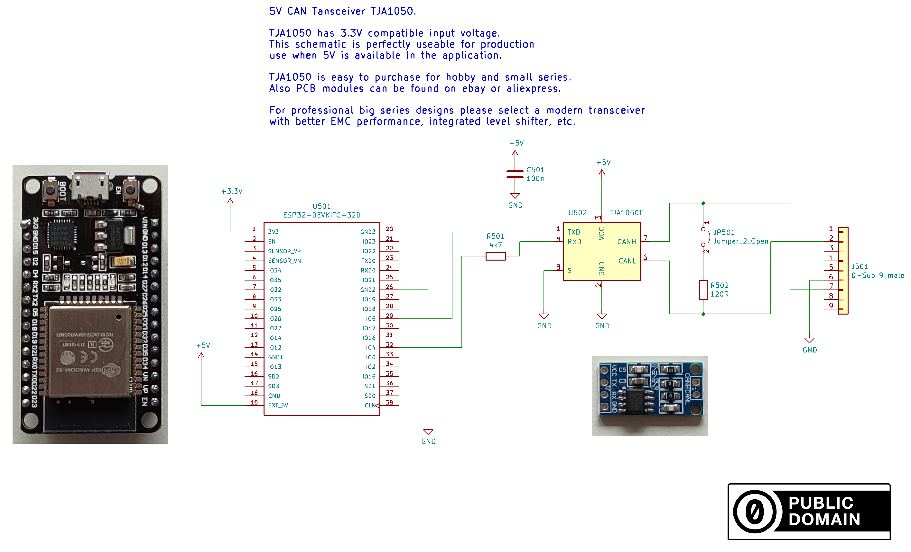
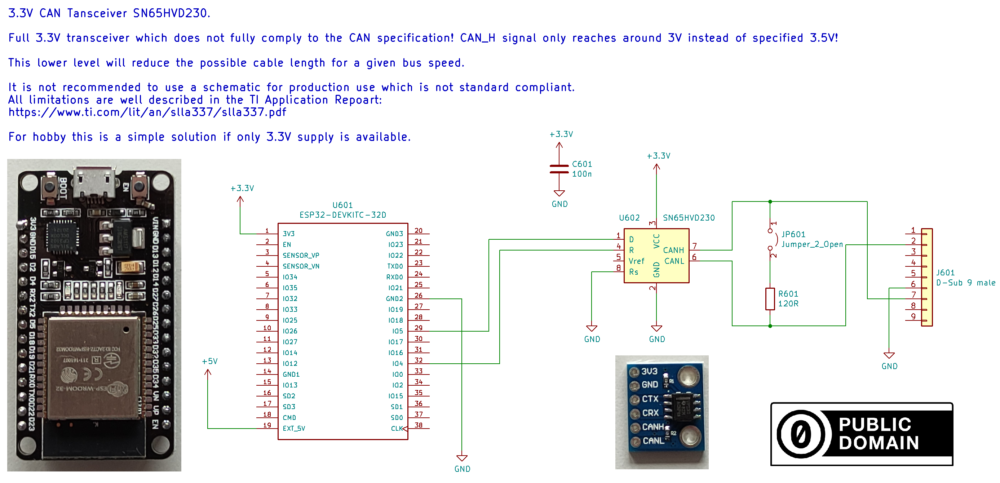

ESP32 CAN
=========

.. seo::
    :description: Instructions for setting up the ESP32 CAN bus platform in ESPHome
    :image: canbus.svg
    :keywords: CAN, ESP32

The ESP32 has an integrated CAN controller and therefore doesn't necessarily need an external controller.
You only need to specify the RX and TX pins. Any GPIO will work.

.. code-block:: yaml

    # Example configuration entry
    canbus:
      - platform: esp32_can
        tx_pin: GPIOXX
        rx_pin: GPIOXX
        can_id: 4
        bit_rate: 50kbps
        on_frame:
          ...

Configuration variables:
------------------------

- **rx_pin** (**Required**, :ref:`Pin <config-pin>`): Receive pin.
- **tx_pin** (**Required**, :ref:`Pin <config-pin>`): Transmit pin.
- **rx_queue_len** (**Optional**, int): Length of RX queue.
- **tx_queue_len** (**Optional**, int): Length of TX queue, 0 to disable.
- All other options from :ref:`Canbus <config-canbus>`.

.. _esp32-can-bit-rate:

The following table lists the bit rates supported by the component for ESP32 variants:

=================== ======= ========== ========== ========== ========== ==========
bit_rate            ESP32   ESP32-S2   ESP32-S3   ESP32-C3   ESP32-C6   ESP32-H2
=================== ======= ========== ========== ========== ========== ==========
1KBPS                        x          x          x          x          x
5KBPS                        x          x          x          x          x
10KBPS                       x          x          x          x          x
12K5BPS                      x          x          x          x          x
16KBPS                       x          x          x          x          x
20KBPS                       x          x          x          x          x
25KBPS               x       x          x          x          x          x
31K25BPS
33KBPS
40KBPS
50KBPS               x       x          x          x          x          x
80KBPS
83K38BPS
95KBPS
100KBPS              x       x          x          x          x          x
125KBPS (Default)    x       x          x          x          x          x
250KBPS              x       x          x          x          x          x
500KBPS              x       x          x          x          x          x
800KBPS              x       x          x          x          x          x
1000KBPS             x       x          x          x          x          x
=================== ======= ========== ========== ========== ========== ==========

Wiring options
--------------

5V CAN transceivers are cheap and generate compliant levels. If you power your
board with 5V this is the preferred option. R501 is important to reduce the 5V
logic level down to 3.3V, to avoid damaging the ESP32. You can alternatively
use a voltage divider here instead.

If you prefer to only have a 3.3V power supply, special 3.3V CAN transceivers are available.

See Also
--------

- :doc:`index`
- :apiref:`canbus/canbus.h`
- :ghedit:`Edit`
