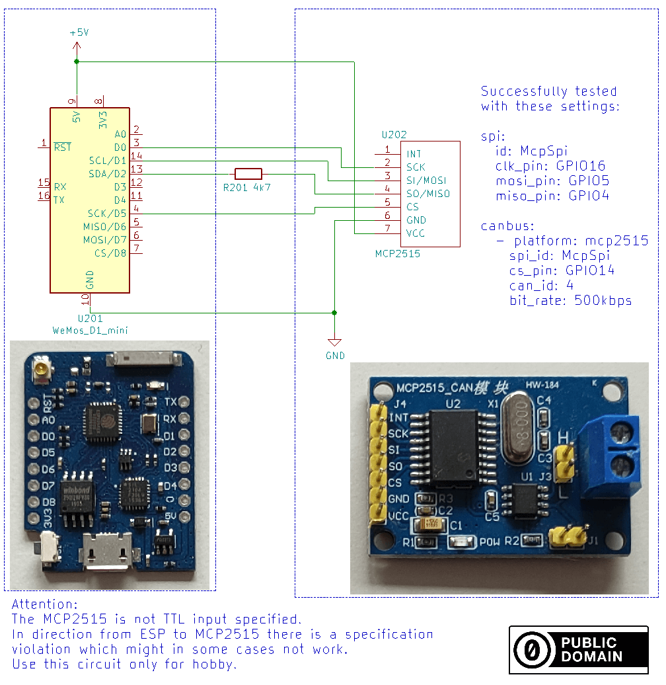
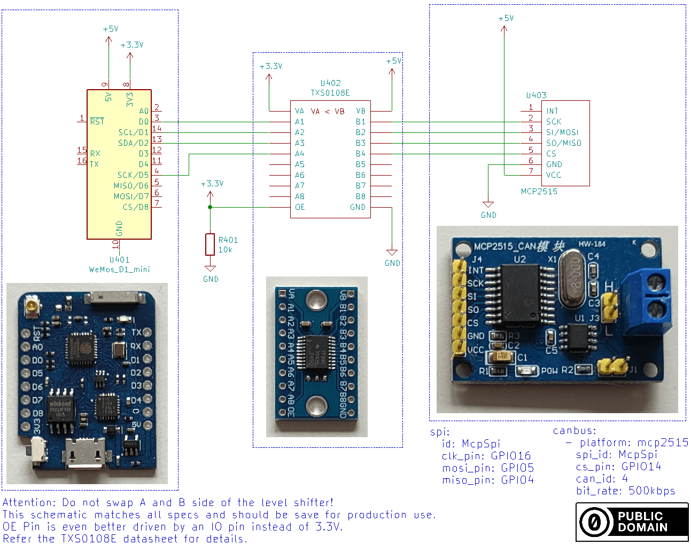

MCP2515
=======

.. seo::
    :description: Instructions for setting up the MCP2515 CAN bus platform in ESPHome
    :image: canbus.svg
    :keywords: CAN, MCP2515

The MCP2515 communicates with ESPHome via the :ref:`SPI bus <spi>`; to use it, you must have at least one
:ref:`SPI bus <spi>` with both the ``mosi_pin`` and ``miso_pin`` defined in your ESPHome configuration.

The :ref:`mcp2515-wiring` section below illustrates how to wire up your MCP2515.

.. code-block:: yaml

    # Example configuration entry
    canbus:
      - platform: mcp2515
        cs_pin: GPIOXX
        can_id: 4
        bit_rate: 50kbps
        on_frame:
        - can_id: 500
            then:
            - lambda: |-
                std::string b(x.begin(), x.end());
                ESP_LOGD("canid 500", "%s", &b[0] );
            - light.turn_off: light_1
        - can_id: 501
            then:
            - light.turn_on:
                id: light_1
                brightness: !lambda "return (x.size() > 0) ? (float) x[0]/255 : 0;"

Configuration variables:
------------------------

- **cs_pin** (**Required**, :ref:`Pin Schema <config-pin_schema>`): Is used to signal to a SPI device when it should
  listen for data on the SPI bus. Each SPI device has its own ``CS`` line. Sometimes also called ``SS``.
- **clock** (*Optional*, frequency): The frequency of the clock crystal used on the MCP2515 device. One of ``8MHZ``,
  ``12MHz``, ``16MHZ`` or ``20MHZ``. Defaults to ``8MHZ``.
- **mode** (*Optional*, enum): Operating mode. One of:

  - ``NORMAL``: Normal operation. *(default)*
  - ``LOOPBACK``: Loopback mode is useful for testing your connections to/from the device.
  - ``LISTENONLY``: Receive data only.

- All other options from :ref:`Canbus <config-canbus>`.

.. note::

    Not all combinations of clock and bitrate are supported. An unsupported combination will not be flagged at
    compile time. Check your ESPHome device's logs for a message like ``Invalid frequency/bitrate combination``
    if you suspect this is an issue.

.. _mcp2515-wiring:

Wiring options
--------------

The easiest approach is to use fully assembled boards and just add one resistor on the MISO line. This runs MOSI, SCK
and CS out of specification which is rarely a problem.

A more complex option is to properly convert the 3.3V and 5V logic levels with a level shifter.

See Also
--------

- :doc:`index`
- :apiref:`canbus/canbus.h`
- :ghedit:`Edit`
