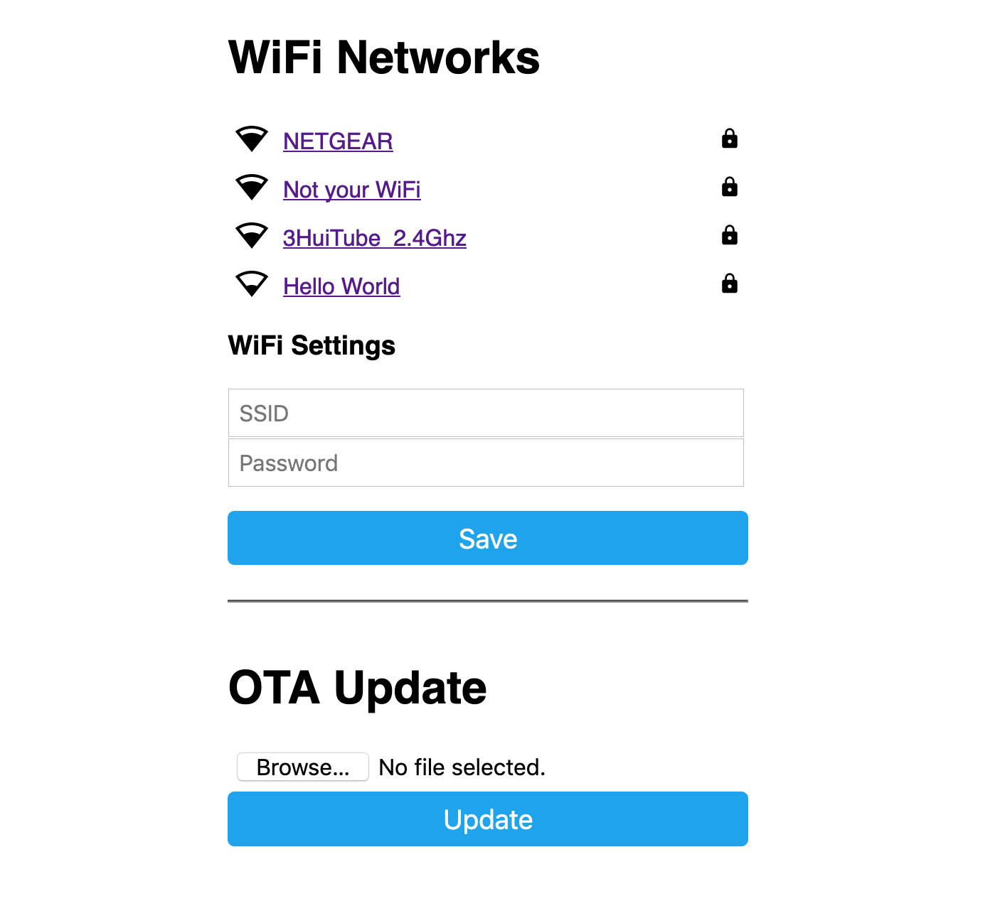

Captive Portal
==============

.. seo::
    :description: Instructions for setting up the Captive Portal fallback mechanism in ESPHome.
    :image: wifi-strength-alert-outline.svg

The captive portal component in ESPHome is a fallback mechanism for when connecting to the
configured :doc:`WiFi <wifi>` fails.

After 1 minute of unsuccessful WiFi connection attempts, the ESP will start a WiFi hotspot
(with the credentials from your configuration)

In this web interface, you can manually override the WiFi settings of the device (please note
this will be overwritten by any subsequent upload - unless ``keep_user_credentials`` is enabled in :doc:`WiFi <wifi>` - so make sure to also update your YAML configuration).

Additionally, you can upload a new firmware file.

When you connect to the fallback network, the web interface should open automatically (see also
login to network notifications). If that does not work, you can also navigate to http://192.168.4.1/
manually in your browser.

.. code-block:: yaml

    # Example configuration entry
    wifi:
      # ...
      ap:
        ssid: "Livingroom Fallback Hotspot"
        password: !secret wifi_ap_password
      # Set to true to preserve captive_portal credentials over OTA updates
      # Note that you can't set STA credentials in YAML if you're using this
      #keep_user_credentials: true

    captive_portal:

No configuration variables.

See Also
--------

- :doc:`wifi`
- :doc:`improv_serial`
- :doc:`esp32_improv`
- :apiref:`captive_portal/captive_portal.h`
- :ghedit:`Edit`
