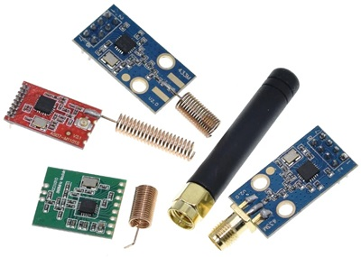

CC1101 Low-Power Sub-1 GHz RF Transceiver
=========================================

.. seo::
    :description: Instructions for setting up CC1101 RF Tranceiver
    :image: cc1101.jpg
    :keywords: cc1101

The ``CC1101 RF Tranceiver`` (`datasheet <https://www.ti.com/lit/ds/symlink/cc1101.pdf>`__) can be used together 
with the ``remote_transmitter`` and ``remote_receiver`` components to communicate over free to use frequencies 
like 433.92 or 868 MHz. 

Tested frameworks are Arduino and esp-idf but it might work with others.

    CC1101 boards.

On ESP8266, you can use a single pin instead of GD0O and GD02 (gdo0_pin is an optional parameter). If assigned,
the pin direction will be reversed for the transfers.

On ESP32, this will not work, you must connect two separate pins. remote_transmitter to GDO0, remote_receiver to GDO2.
If only trasmitting works, they are probably switched.

The ESP8266 can also work with two separate pins, of course. If no gdo0_pin is given, that's the default mode.

Example configuration for ESP8266
---------------------------------

.. code-block:: yaml

    spi:
      clk_pin: D5
      miso_pin: D6
      mosi_pin: D7
    
    cc1101:
      id: transceiver
      cs_pin: D8
      gdo0_pin:
        number: D1
        allow_other_uses: true
      bandwidth: 200
      frequency: 433920

    remote_transmitter:
      pin:
        number: D1  # GDO0
        allow_other_uses: true
      carrier_duty_percent: 100%

    remote_receiver:
      pin:
        number: D1  # GDO0
        allow_other_uses: true
      dump:
        - rc_switch
      tolerance: 50%
      buffer_size: 2kb
      filter: 250us
      idle: 4ms

Example configuration for ESP32
-------------------------------

Based on a generic nodemcu-32s board.

.. code-block:: yaml

    spi:
      clk_pin: GPIO18
      miso_pin: GPIO19
      mosi_pin: GPIO23
    
    cc1101:
      id: transceiver
      cs_pin: GPIO5
      bandwidth: 200
      frequency: 433920

    remote_transmitter:
      pin: GPIO32  # GDO0
      carrier_duty_percent: 100%

    remote_receiver:
      pin: GPIO33  # GDO2
      dump:
        - rc_switch
      tolerance: 50%
      buffer_size: 2kb
      filter: 250us
      idle: 4ms

Example configuration for ESP32-C3
----------------------------------

This one has a problem (`<https://github.com/esphome/issues/issues/2934>`__) which needs a workaround. And it does not seem to work with the Arduino framework, use esp-idf only.

Basically, the receiver has to be pushed to the third channel by adding a dummy transmitter to an unused pin.

.. code-block:: yaml

    spi:
      clk_pin: GPIO6
      miso_pin: GPIO5
      mosi_pin: GPIO7

    cc1101:
      id: transceiver
      cs_pin: GPIO10
      bandwidth: 200
      frequency: 433920

    remote_transmitter:
      - pin: GPIO8
        id: dummy_transmitter
      - pin: GPIO3  # GDO0
        carrier_duty_percent: 100%
        id: real_transmitter

    remote_receiver:
      pin: GPIO4  # GDO2
      dump:
        - rc_switch
      tolerance: 50%
      buffer_size: 2kb
      filter: 250us
      idle: 4ms

Alternatively these modified remote components can directly set ``rmt_channel``.

- `<https://github.com/predam/remote_transmitter/>`__
- `<https://github.com/Jorre05/remote_receiver/>`__

.. code-block:: yaml

    remote_transmitter:
      pin: GPIO3  # GDO0
      carrier_duty_percent: 100%
      rmt_channel: 0

    remote_receiver:
      pin: GPIO4  # GDO2
      rmt_channel: 2
      dump:
        - rc_switch
      tolerance: 50%
      buffer_size: 2kb
      filter: 250us
      idle: 4ms

Sensors for RSSI and LQI. dBm and a raw number.

.. code-block:: yaml

    cc1101:
      id: transceiver
      cs_pin: GPIO5
      bandwidth: 200
      frequency: 433920
      rssi:
        name: "RSSI"
      lqi:
        name: "LQI"

The CC1101 also has a temperature sensor. It is possible to use it on the ESP32, but because the temperature is reported on the GDO0 pin as an analog signal, it also has to be connected to an ADC capable input pin (ESP8266 does not have such). The ADC pin is an input pin, when gdo0_adc_id is set, transmission will not work. Currently there is no solution to this. To restore transmission a new firmware without gdo0_adc_id has to be flushed and the device must be reset.

.. code-block:: yaml

    sensor:
      - platform: adc
        pin:
          number: GPIO32
          allow_other_uses: true
        name: "ADC"
        id: gdo0_adc
        update_interval: 10s

    cc1101:
      id: transceiver
      cs_pin: GPIO5
      gdo0_pin:
        number: GPIO32
        allow_other_uses: true
      gdo0_adc_id: gdo0_adc
      bandwidth: 200
      frequency: 433920
      temperature:
        name: "Temperature"

    remote_transmitter:
      pin:
        number: GPIO32 # This is GDO0
        allow_other_uses: true
      carrier_duty_percent: 100%

    remote_receiver:
      pin: GPIO33 # This is GDO2
      dump:
        - rc_switch
      # Settings to optimize recognition of RF devices
      tolerance: 50%
      buffer_size: 2kb
      filter: 250us
      idle: 4ms

Configuration variables:
------------------------

- **cs_pin** (**Required**, :ref:`config-pin`): SPI Chip Select.
- **gdo0_pin** (*Optional*, :ref:`config-pin`): This is the bidirectional pin for ESP8266.
- **gdo0_adc_id** (*Optional*, string): ADC id to be used by the temperature sensor.
- **bandwidth** (*Optional*, int): Defaults to 200 KHz.
- **frequency** (*Optional*, int): Defaults to 433920 KHz.
- **rssi** (*Optional*): RSSI sensor. Value in dBm. The RSSI value is an estimate of the signal power level in the chosen channel. See datasheet 17.3 for further information.
- **lqi** (*Optional*): Link Quality Indicator sensor. The Link Quality Indicator is a metric of the current quality of the received signal. See datasheet 17.6 for further information.
- **temperature** (*Optional*): Integrated temperature sensor.

Detect a magnetic window sensor
-------------------------------

.. code-block:: yaml

    binary_sensor:
      - platform: remote_receiver
        name: "Window"
        rc_switch_raw:
          code: '110111110001111011100110'
        filters:
          - delayed_off: 1000ms

Transmit a message using the button component
---------------------------------------------

.. code-block:: yaml

    button:
      - platform: template
        name: "Gate"
        on_press:
          # - cc1101.begin_tx: transceiver
          - remote_transmitter.transmit_rc_switch_raw_cc1101:
              code: '0111000110010011110110010100011111110001001011110111'
              protocol:
                pulse_length: 434
                sync: [1,6]
                zero: [1,2]
                one: [2,1]
                inverted: true
              repeat:
                times: 10
          # - cc1101.end_tx: transceiver

Transfers, except transmit_rc_switch_raw_cc1101, must be surrounded with ``cc1101.begin_tx`` and ``cc1101.end_tx``.

Example pinout for a few tested boards
--------------------------------------

+-----------------+------+------+------+------+------+------+------+------+-----------+
|BOARD            | MISO | MOSI | SCK  | CSN  | GDO0 | GDO2 | SDA  | SCL  |           |
+-----------------+------+------+------+------+------+------+------+------+-----------+
|nodemcu-32s      |  19  |  23  |  18  |  5   |  32  |  33  |      |      |           |
+-----------------+------+------+------+------+------+------+------+------+-----------+
|lolin_s2_mini    |  37  |  35  |  36  |  34  |  8   |  9   |      |      |           |
+-----------------+------+------+------+------+------+------+------+------+-----------+
|c3 supermini     |  5   |  7   |  6   |  10  |  3   |  4   |  0   |  1   | [1]_ [2]_ |
+-----------------+------+------+------+------+------+------+------+------+-----------+
|d1_mini          |  12  |  13  |  14  |  15  |  5   |      |  4   |  TX  | [3]_      |
+-----------------+------+------+------+------+------+------+------+------+-----------+
|d1_mini (no i2c) |  12  |  13  |  14  |  15  |  5   |  4   |      |      |           |
+-----------------+------+------+------+------+------+------+------+------+-----------+

SDA/SCL is not needed of course, they are just there as suggestions in case you also need I2C on such a low pin count board.

.. [1] add one dummy transmitter (`<https://github.com/esphome/issues/issues/2934>`__)
.. [2] the c3 supermini has multiple versions, this one has the led on pin 8 and the button on pin 9
.. [3] still possible to use i2c with TX

See Also
--------

- :doc:`/components/remote_transmitter`
- :doc:`/components/remote_receiver`
- :ghedit:`Edit`
