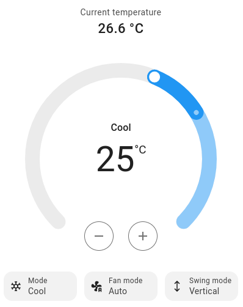

Bang Bang Climate Controller
============================

.. seo::
    :description: Instructions for setting up Bang Bang climate controllers with ESPHome.
    :image: air-conditioner.svg

The ``bang_bang`` climate platform allows you to regulate a value with a
`bang-bang controller <https://en.wikipedia.org/wiki/Bang%E2%80%93bang_control>`__ (also called hysteresis controller).

.. note::

    A number of people have asked about the behavior of the bang-bang controller. In version 1.15, a
    :doc:`thermostat <thermostat>` component was added which behaves more like a common thermostat; it is
    essentially two bang-bang controllers in one. Please see the `Bang-bang vs. Thermostat`_ section below
    if you are not sure which is appropriate for your application.

The bang-bang controller's principle of operation is quite simple. First, you specify an observable
value (for example the temperature of a room). The controller will try to keep this observed value
in a defined range. To do this, the controller can activate objects like a heating unit to change
the observed value.

The range that the controller will try to keep the observed value in can be controlled through the
front-end with the ``target_temperature_low`` and ``target_temperature_high`` values (see screenshot below).
As soon as the observed temperature dips below or above this range it will activate one of the
defined actions ``cool_action``, ``heat_action`` and ``idle_action``.

There are three types of bang bang controllers this platform can represent:

- **Heaters**: For devices where the observed temperature can only be increased.

  - As soon as the temperature goes below the lower target temperature, ``heat_action`` will be called.
  - When the temperature goes above the higher temperature, ``idle_action`` will be called.
  - If you change operating mode (manual mode). And it is between high and low temperature. It does not wait to get to low temperature, it starts working until it gets to high temperature.

- **Coolers**: For devices where the observed temperature can only be decreased.

  - As soon as the temperature goes above the higher target temperature, ``cool_action`` will be called.
  - When the temperature goes below the lower temperature, ``idle_action`` will be called.
  - If you change operating mode (manual mode). And it is between high and low temperature. It does not wait to get to high temperature, it starts working until it gets to low temperature.

- **Heater+Cooler**: For devices where the temperature can both actively be increased and decreased.

  - When the current temperature is below the lower target temperature, ``heat_action`` is called.
  - When the current temperature is within the target temperature range, ``idle_action`` is called.
  - When the current temperature is above the higher target temperature, ``cool_action`` is called.

Do note that the actions are only called when the current temperature leaves the target temperature range.

.. code-block:: yaml

    # Example configuration entry
    climate:
      - platform: bang_bang
        name: "Bang Bang Climate Controller"
        sensor: my_temperature_sensor
        default_target_temperature_low: 20 °C
        default_target_temperature_high: 22 °C

        heat_action:
          - switch.turn_on: heater
        idle_action:
          - switch.turn_off: heater

Configuration variables:
------------------------

- **sensor** (**Required**, :ref:`config-id`): The sensor that is used to measure the current temperature.
- **humidity_sensor** (**Optional**, :ref:`config-id`): If specified, this sensor is used to measure the current humidity.
  This is used for information only and does not influence temperature control.
- **default_target_temperature_low** (**Required**, float): The default low target temperature for
  the control algorithm. This can be dynamically set in the frontend later.
- **default_target_temperature_high** (**Required**, float): The default high target temperature for
  the control algorithm. This can be dynamically set in the frontend later.
- **idle_action** (**Required**, :ref:`Action <config-action>`): The action to call when
  the climate device wants to enter idle mode.
- **heat_action** (*Optional*, :ref:`Action <config-action>`): The action to call when
  the climate device wants to heating mode and increase the current temperature. At least one
  of ``heat_action`` and ``cool_action`` need to be specified.
- **cool_action** (*Optional*, :ref:`Action <config-action>`): The action to call when
  the climate device wants to cooling mode and decrease the current temperature.
- All other options from :ref:`Climate <config-climate>`.

Advanced options:

- **away_config** (*Optional*): Additionally specify target temperature range settings for away mode.
  Away mode can be used to have a second set of target temperatures (for example while the user is
  away or during nighttime)

  - **default_target_temperature_low** (**Required**, float): The default low target temperature for
    the control algorithm during away mode.
  - **default_target_temperature_high** (**Required**, float): The default high target temperature for
    the control algorithm during away mode.

.. note::

    While this platform uses the term temperature everywhere, it can also be used for other values.
    For example, controlling humidity is also possible with this platform.

Bang-bang vs. Thermostat
------------------------

The behavior of the bang-bang controller is a topic that has surfaced on the ESPHome Discord server
countless times -- many people have been confused by what it does. While they are similar, there are
two key differences between the bang-bang component and the :doc:`thermostat <thermostat>` component:

- When actions are triggered
- How the set points are used by the controller

Now is a good time to ensure you understand exactly how a bang-bang controller should behave; if you do not have
a clear understanding of this, be sure to check out the
`Wikipedia article <https://en.wikipedia.org/wiki/Bang%E2%80%93bang_control>`__.

The Problem with Dual-Function Systems
**************************************

If you are not attempting to operate a system that can both heat and cool, you'll likely want to skip to the next
section about user interface.

As outlined above, in general:

- As soon as the temperature goes below the *lower* target temperature, ``heat_action`` is called to activate heating.
- Heating will continue until the temperature reaches the *upper* target temperature, at which point ``idle_action`` is called to stop heating.
- As soon as the temperature goes above the *upper* target temperature, ``cool_action`` is called to activate cooling.
- Cooling will continue until the temperature reaches the *lower* target temperature, at which point ``idle_action`` is called to stop cooling.

A single bang-bang controller may work well for systems that only heat or only cool; however, it begins to break down
when applied to systems that may both heat *and* cool. This is simply because both actions are tied to both set
points -- that is, the point at which heating stops *is also the point at which cooling begins*. The reverse is also
true: the point at which cooling stops *is also the point at which heating begins*. Let's look at an example:

Consider a system that both heats and cools. The ``target_temperature_low`` set point is 20 °C while the
``target_temperature_high`` set point is 22 °C. The sensor reports that the temperature is 19.75 °C, so the controller
calls ``heat_action`` to activate heating. Heating continues until the temperature reaches ``target_temperature_high``
(22 °C in this case). Once this temperature is achieved, ``idle_action`` is called to stop heating. *However*, should
temperature drift even slightly above ``target_temperature_high``--even just a fraction of a degree for a fraction of
a second--the controller will call ``cool_action`` to begin cooling. Now, cooling will continue until
``target_temperature_low`` is reached again, but, as before, should the temperature drift even slightly below
``target_temperature_low`` for even a fraction of a second, ``heat_action`` will be invoked again, and the cycle will
repeat. It will "ping-pong" between the two set points, potentially forever. Oscillation at the "edges" of the
hysteresis window, or going past the set point in either direction, should be expected; consider, for example, a heater
that is turned off after it reaches its set point. The heating element will remain hot (potentially for quite a while),
and as such will continue to heat the air until the element fully cools down to match the ambient air/room temperature.

The :doc:`thermostat <thermostat>` component differs in that there is hysteresis around *each* set point. For example,
if the ``target_temperature_low`` set point is 20 °C, and the (default) hysteresis value of 0.5 °C is used,
``heat_action`` is called at a temperature of 19.5 °C and ``idle_action`` is called at 20.5 °C. If cooling, as defined
by ``target_temperature_high``, is set to 22 °C, ``cool_action`` would be called at 22.5 °C and ``idle_action`` called
at 21.5 °C. Again, it is essentially two bang-bang controllers in one.

Behavioral differences aside, there is another important difference between these two components: user interface.

User Interface
**************

The interaction with this component via the Home Assistant user interface is also different than what is seen on most
common residential thermostats. Generally speaking, most thermostats allow either one or two set points -- one of them
is associated with heating while the other with cooling, and this is exactly how the :doc:`thermostat <thermostat>`
component uses them. If you set the "heat" set point to 20 °C, most people assume this means the heating system will
keep the temperature as close to 20 °C as possible. The same is true for the upper set point, for cooling: if you set
a temperature of 22 °C, most people assume the cooling system will keep the temperature as close to 22 °C as possible.

The bang-bang controller does not use the set points this way. If you set the lower set point to 20 °C and set the
upper set point to 22 °C, then *the temperature will be brought as high as 22 °C but go no lower than 20 °C.*

The behavior is not difficult to understand, but, as we've learned from many discussions on the Discord server, it
departs from what most people seem to expect.

Which is Right for Me?
**********************

It comes down to two points:

- If you have a dual-function system (both heating and cooling), you'll almost certainly want to use the
  :doc:`thermostat <thermostat>` component.
- If you have a single-function system *and* have a specific need or desire to manually control both the upper and
  lower bounds for hysteresis, use the bang-bang controller.

In all other situations, the :doc:`thermostat <thermostat>` component is probably best.

See Also
--------

- :doc:`/components/climate/index`
- :apiref:`bang_bang/bang_bang_climate.h`
- :ghedit:`Edit`
