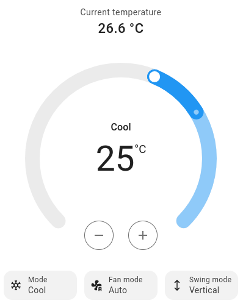

IR Remote Climate
=================

.. seo::
    :description: Controls a variety of compatible Climate devices via IR
    :image: air-conditioner-ir.svg

This climate component allows you to control compatible AC units by sending an infrared (IR)
control signal, just as the unit's handheld remote controller would.

There is a growing list of compatible units. If your unit is not listed below you should
submit a feature request (see FAQ).

+---------------------------------------+---------------------+----------------------+
| Name                                  | Platform name       |  Supports receiver   |
|                                       |                     |                      |
+=======================================+=====================+======================+
| :ref:`Arduino-HeatpumpIR<heatpumpir>` | ``heatpumpir``      |                      |
+---------------------------------------+---------------------+----------------------+
| Ballu                                 | ``ballu``           | yes                  |
+---------------------------------------+---------------------+----------------------+
| Coolix                                | ``coolix``          | yes                  |
+---------------------------------------+---------------------+----------------------+
| Daikin                                | ``daikin``          | yes                  |
+---------------------------------------+---------------------+----------------------+
| :ref:`Daikin ARC<daikin_arc>`         | ``daikin_arc``      | yes                  |
+---------------------------------------+---------------------+----------------------+
| :ref:`Daikin BRC<daikin_brc>`         | ``daikin_brc``      | yes                  |
+---------------------------------------+---------------------+----------------------+
| :ref:`Delonghi<delonghi_ir>`          | ``delonghi``        | yes                  |
+---------------------------------------+---------------------+----------------------+
| Emmeti                                | ``emmeti``          | yes                  |
+---------------------------------------+---------------------+----------------------+
| Fujitsu General                       | ``fujitsu_general`` | yes                  |
+---------------------------------------+---------------------+----------------------+
| :ref:`GREE<gree_ir>`                  | ``gree``            |                      |
+---------------------------------------+---------------------+----------------------+
| Hitachi                               | ``hitachi_ac344``   | yes                  |
|                                       | ``hitachi_ac424``   |                      |
+---------------------------------------+---------------------+----------------------+
| :ref:`LG<climate_ir_lg>`              | ``climate_ir_lg``   | yes                  |
+---------------------------------------+---------------------+----------------------+
| Midea                                 | ``midea_ir``        | yes                  |
+---------------------------------------+---------------------+----------------------+
| :ref:`Mitsubishi<mitsubishi>`         | ``mitsubishi``      | yes                  |
+---------------------------------------+---------------------+----------------------+
| Noblex                                | ``noblex``          | yes                  |
+---------------------------------------+---------------------+----------------------+
| TCL112, Fuego                         | ``tcl112``          | yes                  |
+---------------------------------------+---------------------+----------------------+
| :ref:`Toshiba<toshiba>`               | ``toshiba``         | yes                  |
+---------------------------------------+---------------------+----------------------+
| :ref:`Whirlpool<whirlpool>`           | ``whirlpool``       | yes                  |
+---------------------------------------+---------------------+----------------------+
| Yashima                               | ``yashima``         |                      |
+---------------------------------------+---------------------+----------------------+
| :ref:`Whynter<whynter>`               | ``whynter``         | yes                  |
+---------------------------------------+---------------------+----------------------+
| :ref:`ZH/LT-01<zhlt01>`               | ``zhlt01``          | yes                  |
+---------------------------------------+---------------------+----------------------+

This component requires that you have configured a :doc:`/components/remote_transmitter`.

Due to the unidirectional nature of IR remote controllers, this component cannot determine the
actual state of the device and will assume the state of the device is the latest state requested.

However, when receiver is supported, you can optionally add a :doc:`/components/remote_receiver`
component so the climate state will be tracked when it is operated with the original remote
controller unit.

.. code-block:: yaml

    # Example configuration entry
    remote_transmitter:
      pin: GPIOXX
      carrier_duty_percent: 50%

    climate:
      - platform: coolix       # adjust to match your AC unit!
        name: "Living Room AC"

Configuration Variables:
------------------------

- **name** (**Required**, string): The name for the climate device.
- **sensor** (*Optional*, :ref:`config-id`): The sensor that is used to measure the ambient
  temperature. This is only for reporting the current temperature in the frontend.
- **supports_cool** (*Optional*, boolean): Enables setting cooling mode for this climate device. Defaults to ``true``.
- **supports_heat** (*Optional*, boolean): Enables setting heating mode for this climate device. Defaults to ``true``.
- **receiver_id** (*Optional*, :ref:`config-id`): The id of the remote_receiver if this platform supports
  receiver. see: :ref:`ir-receiver_id`.
- All other options from :ref:`Climate <config-climate>`.

Advanced Options
----------------

- **id** (*Optional*, :ref:`config-id`): Manually specify the ID used for code generation.
- **transmitter_id** (*Optional*, :ref:`config-id`): Manually specify the ID of the remote transmitter.

.. _heatpumpir:

Arduino-HeatpumpIR
------------------

The ``heatpumpir`` platform supports dozens of manufacturers and hundreds of AC units by utilising the `Arduino-HeatpumpIR library <https://github.com/ToniA/arduino-heatpumpir>`__.

This platform should only be used if your AC unit is not supported by any of the other (native) platforms. No support can be provided for Arduino-HeatpumpIR, because it is a third party library.

This platform utilises the library's generic one-size-fits-all API, which might not line up perfectly with all of the supported AC units. For example, some AC units have more fan speed options than what the generic API supports.

Additional configuration must be specified for this platform:

- **protocol** (**Required**, string): Choose one of Arduino-HeatpumpIR's supported protcols: ``aux``, ``ballu``, ``carrier_mca``, ``carrier_nqv``, ``daikin_arc417``, ``daikin_arc480``, ``daikin``, ``electroluxyal``, ``fuego``, ``fujitsu_awyz``, ``gree``, ``greeya``, ``greeyac``, ``greeyan``, ``greeyt``, ``hisense_aud``, ``hitachi``, ``hyundai``, ``ivt``, ``midea``, ``mitsubishi_fa``, ``mitsubishi_fd``, ``mitsubishi_fe``, ``mitsubishi_heavy_fdtc``, ``mitsubishi_heavy_zj``, ``mitsubishi_heavy_zm``, ``mitsubishi_heavy_zmp``, ``mitsubishi_heavy_kj``, ``mitsubishi_msc``, ``mitsubishi_msy``, ``mitsubishi_sez``, ``panasonic_ckp``, ``panasonic_dke``, ``panasonic_jke``, ``panasonic_lke``, ``panasonic_nke``, ``samsung_aqv``, ``samsung_fjm``, ``sharp``, ``toshiba_daiseikai``, ``toshiba``, ``zhlt01``
- **horizontal_default** (**Required**, string): What to default to when the AC unit's horizontal direction is *not* set to swing. Options are: ``left``, ``mleft``, ``middle``, ``mright``, ``right``, ``auto``
- **vertical_default** (**Required**, string): What to default to when the AC unit's vertical direction is *not* set to swing. Options are: ``down``, ``mdown``, ``middle``, ``mup``, ``up``, ``auto``
- **max_temperature** (**Required**, float): The maximum temperature that the AC unit supports being set to.
- **min_temperature** (**Required**, float): The minimum temperature that the AC unit supports being set to.
- **sensor** (*Optional*, :ref:`config-id`): The sensor that is used to measure the ambient temperature.

.. note::

    - The ``greeyac`` protocol supports a feature Gree calls "I-Feel". The handheld remote control
      has a built-in temperature sensor and it will periodically transmit the temperature from this sensor to the
      AC unit. If a ``sensor`` is provided in the configuration with this model, the sensor's temperature will be
      transmitted to the ``greeyac`` device in the same manner as the original remote controller. How often the
      temperature is transmitted is determined by the ``update_interval`` assigned to the ``sensor``. Note that
      ``update_interval`` must be less than 10 minutes or the ``greeyac`` device will revert to using its own
      internal temperature sensor; a value of 2 minutes seems to work well. See :doc:`/components/sensor/index`
      for more information.

    - The ``zhlt01`` protocol supports multiple AC brands: Eurom, Chigo, Tristar, Tecnomaster, Elgin, Geant, Tekno, Topair, Proma, Sumikura, JBS, Turbo Air, Nakatomy, Celestial Air, Ager, Blueway, Airlux, etc.

.. _ir-receiver_id:

Using a Receiver
----------------

.. note::

    This is only supported with select climate devices, see "Supports receiver" in the table at the top of the page.

Optionally, some platforms can listen to data the climate device sends over infrared to update their state (
for example what mode the device is in). By setting up a :doc:`remote_receiver </components/remote_receiver>`
and passing its ID to the climate platform you can enable this mode.

When using a receiver it is recommended to put the IR receiver as close as possible to the equipment's
IR receiver.

.. code-block:: yaml

    # Example configuration entry
    remote_receiver:
      id: rcvr
      pin:
        number: GPIOXX
        inverted: true
        mode:
          input: true
          pullup: true
      # high 55% tolerance is recommended for some remote control units
      tolerance: 55%

    climate:
      - platform: coolix
        name: "Living Room AC"
        receiver_id: rcvr

.. _midea_ir:

``midea_ir`` Climate
-------------------------

These air conditioners support two protocols: Midea and Coolix. Therefore, when using an IR receiver, it considers both protocols and publishes the received states.

Additional configuration is available for this platform

Configuration variables:

- **use_fahrenheit** (*Optional*, boolean): Allows you to transfer the temperature to the air conditioner in degrees Fahrenheit. The air conditioner display also shows the temperature in Fahrenheit. Defaults to ``false``.

.. code-block:: yaml

    # Example configuration entry
    climate:
      - platform: midea_ir
        name: "AC"
        sensor: room_temperature
        use_fahrenheit: true

.. note::

    - See :ref:`Transmit Midea<remote_transmitter-transmit_midea>` to send custom commands, including Follow Me mode.
    - See :ref:`Toshiba<toshiba>` below if you are looking for compatibility with Midea model MAP14HS1TBL or similar.

.. _climate_ir_lg:

``climate_ir_lg`` Climate
-------------------------

Additional configuration is available for this platform

Configuration variables:

- **header_high** (*Optional*, :ref:`config-time`): time for the high part of the header for the LG protocol. Defaults to ``8000us``
- **header_low** (*Optional*, :ref:`config-time`): time for the low part of the header for the LG protocol. Defaults to ``4000us``
- **bit_high** (*Optional*, :ref:`config-time`): time for the high part of any bit in the LG protocol. Defaults to ``600us``
- **bit_one_low** (*Optional*, :ref:`config-time`): time for the low part of a '1' bit in the LG protocol. Defaults to ``1600us``
- **bit_zero_low** (*Optional*, :ref:`config-time`): time for the low part of a '0' bit in the LG protocol. Defaults to ``550us``

.. code-block:: yaml

    # Example configuration entry
    climate:
      - platform: climate_ir_lg
        name: "AC"
        sensor: room_temperature
        header_high: 3265us # AC Units from LG in Brazil, for example use these timings
        header_low: 9856us

.. _daikin_arc:

``daikin_arc`` Climate
-------------------------

The Daikin ARC remotes are used by the japanese model of Daikin.

.. code-block:: yaml

    # Example configuration entry
    climate:
      - platform: daikin_arc
        name: "AC"
        sensor: room_temperature

.. _daikin_brc:

``daikin_brc`` Climate
-------------------------

The Daikin BRC remotes are used by the ceiling cassette model of Daikin heatpumps.

Configuration variables:

- **use_fahrenheit** (*Optional*, boolean): U.S. models of the Daikin BRC remote send the temperature in Fahrenheit, if your remote shows Fahrenheit and can not be changed to Celsius then set this to true. Defaults to ``false``.

.. code-block:: yaml

    # Example configuration entry
    climate:
      - platform: daikin_brc
        name: "AC"
        sensor: room_temperature
        use_fahrenheit: true

.. _delonghi_ir:

``delonghi`` Climate
-------------------------

Currently supports the protocol used by some Delonghi portable units

Known working with:

- Delonghi PAC WE 120HP

.. _mitsubishi:

``mitsubishi`` Climate
------------------------

Additonal configurations available for this platform.

Configuration variables:

- **set_fan_mode** (*Optional*, string): Select the fan modes desired or that are supported on your remote. Defaults to ``3levels``

  - Options are: ``3levels`` , ``4levels``, ``quiet_4levels``.

    - ``3levels``; Low [fan speed 1], Medium [2], High [3]
    - ``4levels``; Low [1], Middle [2], Medium [3], High [4]
    - ``quiet_4levels``; Low [1], Middle [2], Medium [3], High [4], Quiet [5]

- **supports_dry** (*Optional*, boolean): Enables setting dry mode for this unit. Defaults to ``false``.
- **supports_fan_only** (*Optional*, boolean): Enables setting fan only mode for this unit. Confirm that mode is supported on your remote. Defaults to ``false``.

- **horizontal_default** (*Optional*, string): What to default to when the AC unit's horizontal direction is *not* set to swing. Defaults to ``middle``.

  - Options are: ``left``, ``middle-left``, ``middle``, ``middle-right``, ``right``, ``auto``
- **vertical_default** (*Optional*, string): What to default to when the AC unit's vertical direction is *not* set to swing. Defaults to ``middle``.

  - Options are: ``down``, ``middle-down``, ``middle``, ``middle-up``, ``up``, ``auto``

.. note::

    - This climate IR component is also known to work with some Stiebel Eltron Units. It has been tested with Stiebel Eltron IR-Remote ``KM07F`` and unit ``ACW 25 i``

.. code-block:: yaml

    # Example configuration entry
    climate:
      - platform: mitsubishi
        name: "Heatpump"
        set_fan_mode: "quiet_4levels"
        supports_dry: "true"
        supports_fan_only: "true"
        horizontal_default: "left"
        vertical_default: "down"

.. _toshiba:

``toshiba`` Climate
-------------------

Additional configuration is available for this model.

Configuration variables:

- **model** (*Optional*, string): There are two valid models

  - ``GENERIC``: Temperature range is from 17 to 30 (default)
  - ``RAC-PT1411HWRU-C``: Temperature range is from 16 to 30; unit displays temperature in degrees Celsius
  - ``RAC-PT1411HWRU-F``: Temperature range is from 16 to 30; unit displays temperature in degrees Fahrenheit

.. note::

    - While they are identified as separate models here, the ``RAC-PT1411HWRU-C`` and ``RAC-PT1411HWRU-C`` are
      in fact the same physical model/unit. They are separated here only because different IR codes are used
      depending on the desired unit of measurement. This only affects how temperature is displayed on the unit itself.

    - The ``RAC-PT1411HWRU`` model supports a feature Toshiba calls "Comfort Sense". The handheld remote control
      has a built-in temperature sensor and it will periodically transmit the temperature from this sensor to the
      AC unit. If a ``sensor`` is provided in the configuration with this model, the sensor's temperature will be
      transmitted to the ``RAC-PT1411HWRU`` in the same manner as the original remote controller. How often the
      temperature is transmitted is determined by the ``update_interval`` assigned to the ``sensor``. Note that
      ``update_interval`` must be less than seven minutes or the ``RAC-PT1411HWRU`` will revert to using its own
      internal temperature sensor; a value of 30 seconds seems to work well. See :doc:`/components/sensor/index`
      for more information.

    - This climate IR component is also known to work with Midea model MAP14HS1TBL and may work with other similar
      models, as well. (Midea acquired Toshiba's product line and re-branded it.)

.. _whirlpool:

``whirlpool`` Climate
---------------------

Additional configuration is available for this model.

Configuration variables:

- **model** (*Optional*, string): There are two valid models

  - ``DG11J1-3A``: Temperature range is from 18 to 32 (default)
  - ``DG11J1-91``: Temperature range is from 16 to 30

.. _whynter:

``whynter`` Climate
-------------------------

Additional configuration is available for this platform

Configuration variables:

- **use_fahrenheit** (*Optional*, boolean): Allows you to transfer the temperature to the air conditioner in degrees Fahrenheit. The air conditioner display also shows the temperature in Fahrenheit. Defaults to ``false``.

.. code-block:: yaml

    # Example configuration entry
    climate:
      - platform: whynter
        name: "AC"
        sensor: room_temperature
        use_fahrenheit: true
        supports_heat: true

.. _gree_ir:

``gree`` Climate
---------------------

Additional configuration is available for this model.

Configuration variables:

- **model** (*Required*, string): GREE has a few different protocols depending on model. One of these will work for you.

  - ``generic``
  - ``yan``
  - ``yaa``
  - ``yac``

.. code-block:: yaml

    # Example configuration entry
    climate:
      - platform: gree
        name: "AC"
        sensor: room_temperature
        model: yan

.. _zhlt01:

``zhlt01`` Climate
---------------------

ZH/LT-01 is a remote control that is used with many locally branded split airconditioners.
Supported brands include:

- Eurom
- Chigo
- Tristar
- Tecnomaster
- Elgin
- Geant
- Tekno
- Topair
- Proma
- Sumikura
- JBS
- Turbo Air
- Nakatomy
- Celestial Air
- Ager
- Blueway
- Airlux

No additional configuration is required for this model.

See Also
--------

- :doc:`/components/climate/index`
- :doc:`/components/remote_receiver`
- :doc:`/components/remote_transmitter`
- :doc:`/components/sensor/index`
- :apiref:`ballu.h <ballu/ballu.h>`,
- :apiref:`coolix.h <coolix/coolix.h>`,
  :apiref:`daikin.h <daikin/daikin.h>`
  :apiref:`fujitsu_general.h <fujitsu_general/fujitsu_general.h>`,
  :apiref:`hitachi_ac344.h <hitachi_ac344/hitachi_ac344.h>`,
  :apiref:`midea_ir.h <midea_ir/midea_ir.h>`,
  :apiref:`mitsubishi.h <mitsubishi/mitsubishi.h>`,
  :apiref:`tcl112.h <tcl112/tcl112.h>`,
  :apiref:`yashima.h <yashima/yashima.h>`
  :apiref:`whirlpool.h <whirlpool/whirlpool.h>`
  :apiref:`climate_ir_lg.h <climate_ir_lg/climate_ir_lg.h>`
- :ghedit:`Edit`
