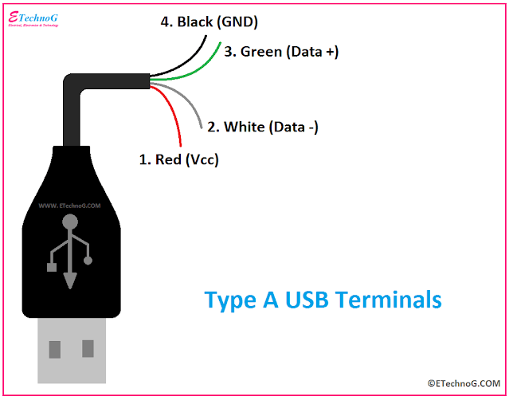
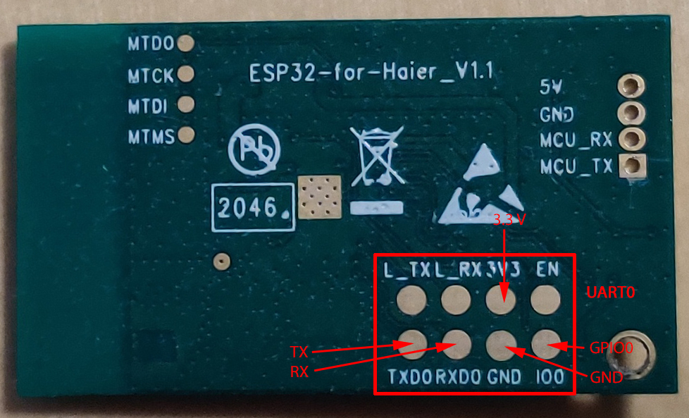

Haier Climate
=============

.. seo::
    :description: Instructions for setting up Haier climate devices.
    :image: air-conditioner.svg

This is an implementation of the ESPHome component to control HVAC on the base of the SmartAir2 and hOn Haier protocols (AC that is controlled by the hOn or SmartAir2 application).

There are two versions of the Haier protocol: the older version uses an application called SmartAir2 while the newer version uses an application called hOn. Both protocols are compatible on the transport level but utilize different commands to control appliances.

Older Haier models controlled by the SmartAir2 application are using the KZW-W002 module. This module can’t be reused, and you need to replace it with an ESP or RPI Pico W module. The USB connector on the board doesn’t support the USB protocol. It is a UART port that just uses a USB connector. To connect the ESP board to your AC you can cut a USB type A cable and connect wires to the climate connector.

.. list-table:: Haier UART pinout
    :header-rows: 1

    * - Board
      - USB
      - Wire color
      - ESP8266
    * - 5V
      - VCC
      - red
      - 5V
    * - GND
      - GND
      - black
      - GND
    * - TX
      - DATA+
      - green
      - RX
    * - RX
      - DATA-
      - white
      - TX

    KZW-W002 module pinout

Newer Haier models using a module called ESP32-for-Haier. It is an ESP32 single-core board with an ESP32-S0WD chip. In some cases, you can reuse this module and flash it with ESPHome, but some new modules don’t support this. They look the same but have encryption enabled.

**Warning!** The new generation of ESP32-Haier devices has encryption enabled, so they can only be flashed with firmware that is signed with a private key. There is no way to make them work with ESPHome, so if you try to do it, the board will get into a boot loop with the error ``rst:0x10 (RTCWDT_RTC_RESET),boot:0x13 (SPI_FAST_FLASH_BOOT)`` The only way to recover this board is to flash it with the original image. So before starting your experiments make a backup image.

    ESP32-for-Haier UART0 pinout

Also, you can use any other ESP32, ESP8266, or an RPI pico W board. In this case, you will need to cut the original wire or make a connector yourself (the board has a JST SM04B-GHS-TB connector)

This component requires a :ref:`uart` to be setup.

.. code-block:: yaml

    # Example configuration entry
    climate:
      - platform: haier
        id: haier_ac
        protocol: hOn
        name: Haier AC
        uart_id: ac_port
        wifi_signal: true
        beeper: true
        display: true
        visual:
          min_temperature: 16 °C
          max_temperature: 30 °C
          temperature_step: 1 °C
        supported_modes:
        - 'OFF'
        - HEAT_COOL
        - COOL
        - HEAT
        - DRY
        - FAN_ONLY
        supported_swing_modes:
        - 'OFF'
        - VERTICAL
        - HORIZONTAL
        - BOTH
      supported_presets:
        - AWAY
        - ECO
        - BOOST
        - SLEEP
      on_alarm_start:
        then:
          - logger.log:
              level: WARN
              format: "Alarm activated. Code: %d. Message: \"%s\""
              args: [ code, message]
      on_alarm_end:
        then:
          - logger.log:
              level: INFO
              format: "Alarm deactivated. Code: %d. Message: \"%s\""
              args: [ code, message]

Configuration variables:
------------------------

- **id** (*Optional*, :ref:`config-id`): Manually specify the ID used for code generation.
- **uart_id** (*Optional*, :ref:`config-id`): ID of the UART port to communicate with AC.
- **protocol** (*Optional*, string): Defines communication protocol with AC. Possible values: hon or smartair2. The default value is smartair2.
- **name** (**Required**, string): The name of the climate device.
- **wifi_signal** (*Optional*, boolean): If true - send wifi signal level to AC.
- **answer_timeout** (*Optional*, :ref:`config-time`): Responce timeout. The default value is 200ms.
- **alternative_swing_control** (*Optional*, boolean): (supported by smartAir2 only) If true - use alternative values to control swing mode. Use only if the original control method is not working for your AC.
- **control_packet_size** (*Optional*, int): (supported only by hOn) Define the size of the control packet. Can help with some newer models of ACs that use bigger packets. The default value: 10.
- **control_method** (*Optional*, list): (supported only by hOn) Defines control method (should be supported by AC). Supported values: MONITOR_ONLY - no control, just monitor status, SET_GROUP_PARAMETERS - set all AC parameters with one command (default method), SET_SINGLE_PARAMETER - set each parameter individually (this method is supported by some new ceiling ACs like AD71S2SM3FA)
- **display** (*Optional*, boolean): Can be used to set the AC display off.
- **beeper** (*Optional*, boolean): Can be used to disable beeping on commands from AC. Supported only by hOn protocol.
- **supported_modes** (*Optional*, list): Can be used to disable some of AC modes. Possible values: 'OFF', HEAT_COOL, COOL, HEAT, DRY, FAN_ONLY
- **supported_swing_modes** (*Optional*, list): Can be used to disable some swing modes if your AC does not support it. Possible values: 'OFF', VERTICAL, HORIZONTAL, BOTH
- **supported_presets** (*Optional*, list): Can be used to disable some presets. Possible values for smartair2 are: AWAY, BOOST, COMFORT. Possible values for hOn are: AWAY, ECO, BOOST, SLEEP. AWAY preset can be enabled only in HEAT mode, it is disabled by default
- **on_alarm_start** (*Optional*, :ref:`Automation <automation>`): (supported only by hOn) Automation to perform when AC activates a new alarm. See :ref:`haier-on_alarm_start`
- **on_alarm_end** (*Optional*, :ref:`Automation <automation>`): (supported only by hOn) Automation to perform when AC deactivates a new alarm. See :ref:`haier-on_alarm_end`
- All other options from :ref:`Climate <config-climate>`.

Automations
-----------

.. _haier-on_alarm_start:

``on_alarm_start`` Trigger
**************************

This automation will be triggered when a new alarm is activated by AC. The error code of the alarm will be given in the variable "code" (type uint8_t), error message in the variable "message" (type char*). Those variables can be used in :ref:`lambdas <config-lambda>`

.. code-block:: yaml

    climate:
      - protocol: hOn
        on_alarm_start:
          then:
            - logger.log:
                level: WARN
                format: "Alarm activated. Code: %d. Message: \"%s\""
                args: [ code, message]

.. _haier-on_alarm_end:

``on_alarm_end`` Trigger
************************

This automation will be triggered when a previously activated alarm is deactivated by AC. The error code of the alarm will be given in the variable "code" (type uint8_t), error message in the variable "message" (type char*). Those variables can be used in :ref:`lambdas <config-lambda>`

.. code-block:: yaml

    climate:
      - protocol: hOn
        on_alarm_end:
          then:
            - logger.log:
                level: INFO
                format: "Alarm deactivated. Code: %d. Message: \"%s\""
                args: [ code, message]

``climate.haier.power_on`` Action
*********************************

This action turns AC power on.

.. code-block:: yaml

    on_...:
      then:
        climate.haier.power_on: device_id

``climate.haier.power_off`` Action
**********************************

This action turns AC power off

.. code-block:: yaml

    on_...:
      then:
        climate.haier.power_off: device_id

``climate.haier.power_toggle`` Action
*************************************

This action toggles AC power

.. code-block:: yaml

    on_...:
      then:
        climate.haier.power_toggle: device_id

``climate.haier.display_on`` Action
***********************************

This action turns the AC display on

.. code-block:: yaml

    on_...:
      then:
        climate.haier.display_on: device_id

``climate.haier.display_off`` Action
************************************

This action turns the AC display off

.. code-block:: yaml

    on_...:
      then:
        climate.haier.display_off: device_id

``climate.haier.health_on`` Action
**********************************

Turn on health mode (`UV light sterilization <https://www.haierhvac.eu/en/node/1809>`__)

.. code-block:: yaml

    on_...:
      then:
        climate.haier.health_on: device_id

``climate.haier.health_off`` Action
***********************************

Turn off health mode

.. code-block:: yaml

    on_...:
      then:
        climate.haier.health_off: device_id

``climate.haier.beeper_on`` Action
**********************************

(supported only by hOn) This action enables beep feedback on every command sent to AC

.. code-block:: yaml

    on_...:
      then:
        climate.haier.beeper_on: device_id

``climate.haier.beeper_off`` Action
***********************************

(supported only by hOn) This action disables beep feedback on every command sent to AC (keep in mind that this will not work for IR remote commands)

.. code-block:: yaml

    on_...:
      then:
        climate.haier.beeper_off: device_id

``climate.haier.set_vertical_airflow`` Action
*********************************************

(supported only by hOn) Set direction for vertical airflow if the vertical swing is disabled. Possible values: Health_Up, Max_Up, Up, Center, Down, Health_Down.

.. code-block:: yaml

    on_...:
      then:
        - climate.haier.set_vertical_airflow:
          id: device_id
          vertical_airflow: Up

``climate.haier.set_horizontal_airflow`` Action
***********************************************

(supported only by hOn) Set direction for horizontal airflow if the horizontal swing is disabled. Possible values: Max_Left, Left, Center, Right, Max_Right.

.. code-block:: yaml

    on_...:
      then:
        - climate.haier.set_horizontal_airflow:
          id: device_id
          vertical_airflow: Right

``climate.haier.start_self_cleaning`` Action
********************************************

(supported only by hOn) Start `self-cleaning <https://www.haier.com/in/blogs/beat-the-summer-heat-with-haier-self-cleaning-ac.shtml>`__

.. code-block:: yaml

    on_...:
      then:
        - climate.haier.start_self_cleaning: device_id

``climate.haier.start_steri_cleaning`` Action
*********************************************

(supported only by hOn) Start 56°C steri-cleaning

.. code-block:: yaml

    on_...:
      then:
        - climate.haier.start_steri_cleaning: device_id

See Also
--------

- `haier-esphome <https://github.com/paveldn/haier-esphome>`__
- :doc:`Haier Climate Sensors </components/sensor/haier>`
- :doc:`Haier Climate Binary Sensors </components/binary_sensor/haier>`
- :doc:`/components/climate/index`
- :apiref:`haier/climate/haier.h`
- :ghedit:`Edit`
