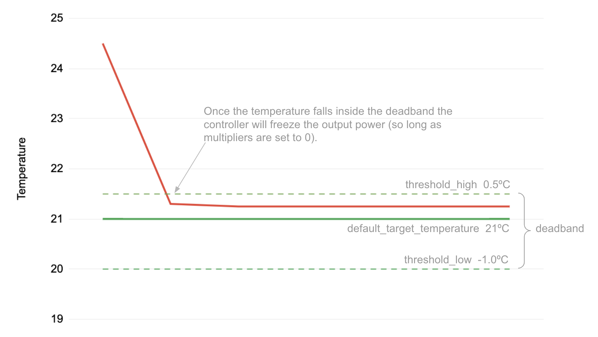
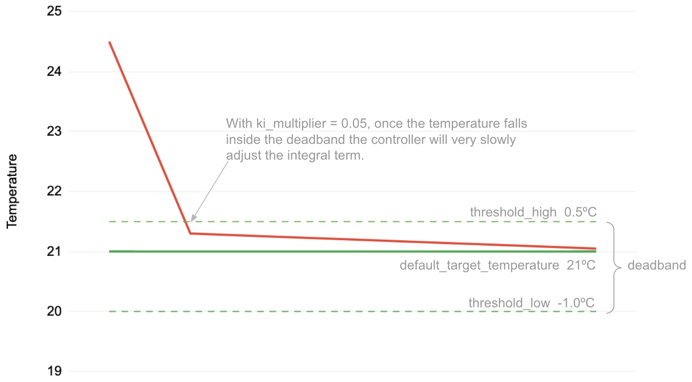

PID Climate
===========

.. seo::
    :description: Instructions for setting up PID climate controllers with ESPHome.
    :image: function.svg

The ``pid`` climate platform allows you to regulate a value with a
`PID controller <https://en.wikipedia.org/wiki/PID_controller>`__.

PID controllers are good at modulating an output signal to get a sensor reading to a specified
setpoint. For example, it can be used to modulate the power of a heating unit to get the
temperature to a user-specified setpoint.

.. note::

    PID is like cruise control in the cars: it keeps the car's speed constant by continuously
    adjusting the fuel quantity, based on load measurements. Eg when the car has to go up on a hill,
    the system notices the load increase thus immediately gives more fuel to the engine; and when it
    goes down on the other side of the hill, it notices the load decrease thus reduces or cuts off fuel
    completely so that car speed remains as constant as possible. The calculation takes in consideration
    constants like car weight, wind resistance etc.

    This kind of math can be used for a heating or cooling system too, and an auto-tuning algorithm can help
    determining such constants, which mainly describe the heat loss of the room or building. Goal is to
    keep the temperature as constant as possible, and smooth out oscillations otherwise produced by
    classic thermostats.

Explaining how PID controllers work in detail is out of scope of this documentation entry,
but there's a nice article explaining the function principle `here <https://blog.opticontrols.com/archives/344>`__.

.. code-block:: yaml

    # Example configuration entry
    climate:
      - platform: pid
        name: "PID Climate Controller"
        sensor: temperature_sensor
        default_target_temperature: 21°C
        heat_output: heater
        control_parameters:
          kp: 0.49460
          ki: 0.00487
          kd: 12.56301
          output_averaging_samples: 5      # smooth the output over 5 samples
          derivative_averaging_samples: 5  # smooth the derivative value over 10 samples
        deadband_parameters:
          threshold_high: 0.5°C       # deadband within +/-0.5°C of target_temperature
          threshold_low: -0.5°C

Configuration variables:
------------------------

- **sensor** (**Required**, :ref:`config-id`): The sensor that is used to measure the current
  temperature.
- **humidity_sensor** (**Optional**, :ref:`config-id`): If specified, this sensor is used to measure the current humidity.
  This is used for information only and does not influence temperature control.
- **default_target_temperature** (**Required**, float): The default target temperature (setpoint)
  for the control algorithm. This can be dynamically set in the frontend later.
- **heat_output** (*Optional*, :ref:`config-id`): The ID of a :ref:`float output <config-output>`
  that increases the current temperature. At least one of ``heat_output`` and ``cool_output`` must
  be specified.
- **cool_output** (*Optional*, :ref:`config-id`): The ID of a :ref:`float output <config-output>`
  that decreases the current temperature. At least one of ``heat_output`` and ``cool_output`` must
  be specified.
- **control_parameters** (**Required**): Control parameters of the PID controller.

  - **kp** (**Required**, float): The factor for the proportional term of the PID controller.
  - **ki** (*Optional*, float): The factor for the integral term of the PID controller.
    Defaults to ``0``.
  - **kd** (*Optional*, float): The factor for the derivative term of the PID controller.
    Defaults to ``0``.
  - **min_integral** (*Optional*, float): The minimum value of the integral term multiplied by
    ``ki`` to prevent windup. Defaults to ``-1``.
  - **max_integral** (*Optional*, float): The maximum value of the integral term multiplied by
    ``ki`` to prevent windup. Defaults to ``1``.
  - **starting_integral_term** (*Optional*, float): Set the initial output, by priming the integral
    term. This is useful for when your system is rebooted and you don't want to wait
    for it to get back equilibrium.

  - **output_averaging_samples** (*Optional*, int): average the output over this many samples. PID controllers
    can be quite sensitive to small changes on the input sensor. By averaging the last X output samples,
    the temperature can be more stable. However, the larger the sampling window, the less responsive the
    PID controller. Defaults to ``1`` which is no sampling/averaging.

  - **derivative_averaging_samples** (*Optional*, int): average the derivative term over this many samples. Many
    controllers don't use the derivative term because it is sensitive to slight changes in the input sensor.
    By taking an average of the derivative term it might become more useful for you. Most PID controllers call
    this derivative filtering. The derivative term is used to pre-act so don't filter too much. Defaults to ``1``
    which is no sampling/averaging.

- **deadband_parameters** (*Optional*): Enables a deadband to stabilise and minimise changes in the
  output when the temperature is close to the target temperature. See `Deadband Setup`_.

  - **threshold_high/threshold_low** (**Required**, float): Specifies a high/low
    threshold defining the deadband around the target temperature. For instance with
    ``default_target_temperature`` of ``21°C`` and thresholds of ``+/-0.5°C``, the deadband will be
    between ``20.5°C - 21.5°C``. The PID controller will limit output changes within the deadband.
  - **kp_multiplier** (*Optional*, float): Set the ``kp`` gain when inside the deadband. Defaults to ``0``.
  - **ki_multiplier** (*Optional*, float): Set the ``ki`` gain when inside the deadband. Defaults to ``0``.
  - **kd_multiplier** (*Optional*, float): Set the ``kd`` gain when inside the deadband. Recommended this
    is set to ``0``. Defaults to ``0``.

  - **deadband_output_averaging_samples** (*Optional*, int): Typically when inside the deadband the PID Controller has
    reached a state of equilibrium, so it advantageous to use a higher number of output samples
    like 10-30 samples. Defaults to ``1`` which is no sampling/averaging.

- All other options from :ref:`Climate <config-climate>`.

.. _pid-setup:

PID Controller Setup
--------------------

To set up a PID climate controller, you need a couple of components:

- A :ref:`Sensor <config-sensor>` to read the current temperature (``sensor``).
- At least one :ref:`float output <config-output>` to drive for heating or cooling (or both).
  This could for example be a PWM output via :doc:`/components/output/sigma_delta_output` or :doc:`/components/output/slow_pwm` that drives a heating unit.

  Please note the output *must* be controllable with continuous value (not only ON/OFF, but any state
  in between for example 50% heating power).

.. note::

    The sensor should have a short update interval. The PID update frequency is tied to the update
    interval of the sensor. Set a short ``update_interval`` like ``5s`` on the sensor.

    We recommend putting a filter on the sensor (see filters in :doc:`/components/sensor/index`) and
    using ``output_averaging_samples`` to calm the PID sensor from a noisy input sensor.

Deadband Setup
--------------
A deadband is used to prevent the PID controller from further adjusting the power
once the temperature has settled within a range of the target temperature.

We do this by specifying a high/low threshold of the target temperature.

To understand the benefit, consider a heating/cooling HVAC which is constantly
oscillating between heating and cooling as the thermostat records very minor
changes from +0.1º to -0.1º. Clearly this is undesirable and will cause wear
and tear as the HVAC oscillates.  With a deadband in place the heater won't
activate until the thermostat breaches the low_threshold and the cooler won't activate
until the thermostat breaches the high_threshold.

The most basic setup specifies the threshold around the target temperature as follows:

.. code-block:: yaml

    default_target_temperature: 21°C
    ...
    deadband_parameters:
      threshold_high: 0.5°C
      threshold_low: -1.0°C

In this example the deadband is between ``20.0°C - 21.5°C``. The PID controller will limit any output
variation inside this deadband. How it limits depends on how you set the `Deadband Multipliers`_.

Deadband Multipliers
********************

Deadband Multipliers tell the controller how to operate when inside of the deadband.

Each of the p,i and d terms can be controlled using the kp, ki and kd multipliers. For instance, if the kp_multiplier
is set to 0.05 then the final proportional term will be set to 5% of its normal value within the deadband.

If all of the multipliers are set to 0, then the controller will not adjust power at all within the
deadband. This is the default behavior.

Most deadband implementations set kp and ki multipliers to a small gain like ``0.05`` and set
derivative to 0. This means that the PID output will calmly make minor adjustments over a 20x longer
timeframe to stay within the deadband zone.

To start with we recommend just setting the ``ki_multiplier`` to ``0.05`` (5%). Then
set ``kp_multiplier`` to ``0.05`` (5%) if the controller is falling out of the deadband too often.

.. code-block:: yaml

    default_target_temperature: 21°C
    ...
    deadband_parameters:
      threshold_high: 0.5°C
      threshold_low: -1.0°C
      kp_multiplier: 0.0   # proportional gain turned off inside deadband
      ki_multiplier: 0.05  # integral accumulates at only 5% of normal ki
      kd_multiplier: 0.0   # derviative is turned off inside deadband
      deadband_output_averaging_samples: 15   # average the output over 15 samples within the deadband

Deadband Output Averaging Samples
*********************************
Since we expect the PID Controller to be at equilibrium while inside the deadband, we can
average the output over a longer range of samples, like 15 samples. This helps even further
with temperature and controller stability.

.. _pid-autotune:

Autotuning
----------

Finding suitable ``kp``, ``ki`` and ``kd`` control parameters for the PID controller manually
needs some experience with PID controllers. ESPHome has an auto-tuning algorithm that automatically
finds suitable PID parameters to start using an adaption of the Ziegler-Nichols method with
relay autotuning (Åström and Hägglund).

To autotune the control parameters:

1. Set up the PID controller with all control parameters set to zero:

  .. code-block:: yaml

      climate:
        - platform: pid
          id: pid_climate
          name: "PID Climate Controller"
          sensor: temperature_sensor
          default_target_temperature: 21°C
          heat_output: heater
          control_parameters:
            kp: 0.0
            ki: 0.0
            kd: 0.0

2. Create a :doc:`template button </components/button/template>` to start autotuning later:

  .. code-block:: yaml

      button:
        - platform: template
          name: "PID Climate Autotune"
          on_press:
            - climate.pid.autotune: pid_climate

3. Compile & Upload the new firmware.

Now you should have a climate entity called *PID Climate Controller* and a button called
*PID Climate Autotune* visible in your frontend of choice.

The autotune algorithm works by repeatedly switching the heat/cool output to full power and off.
This induces an oscillation of the observed temperature and the measured period and amplitude
is automatically calculated. To do this, it needs to observe at least 3 oscillation cycles.

.. note::

    You **have to set the setpoint** of the climate controller to a value the
    device can reach. For example if the temperature of a room is to be controlled, the setpoint needs
    to be above the ambient temperature. If the ambient temperature is 20°C, the setpoint of the
    climate device should be set to at least ~24°C so that an oscillation can be induced.

    Also take care of external influences, like for example when room temperature is severely affected by
    outdoor weather like sun, if it starts to warm up the room in parallel with the heating
    autotune will likely fail or give false results.

4. Set an appropriate setpoint (see note above) and turn on the climate controller (Heat, Cool or Auto).

5. Click the *PID Climate Autotune* button and look at the the logs of the device.

   You should see output like

   .. code-block:: text

       PID Autotune:
         Autotune is still running!
         Status: Trying to reach 24.25 °C
         Stats so far:
           Phases: 4
           Detected 5 zero-crossings
           # ...

.. note::

    In the output above, the autotuner is driving the heating output at 100% and trying to reach 24.25 °C.

    This will continue for some time until data for 3 phases (6 crossings of the setpoint; or a bit more, depending on
    the data quality) have been acquired.

    The autotune algorithm may take a long time to complete, it depends on the time needed to reproduce the
    heating up and cooling down oscillations the required number of times.

6. When the PID autotuner has succeeded, output like the one below can be seen:

   .. code-block:: text

       PID Autotune:
         State: Succeeded!
         All checks passed!
         Calculated PID parameters ("Ziegler-Nichols PID" rule):

         control_parameters:
           kp: 0.49460
           ki: 0.00487
           kd: 12.56301

         Please copy these values into your YAML configuration! They will reset on the next reboot.

As soon as the the autotune procedure finishes, the climate starts to work with the calculated parameters
so that expected operation can be immediately verified.

If satisfied, copy the values in ``control_parameters`` into your configuration:

   .. code-block:: yaml

       climate:
         - platform: pid
           # ...
           control_parameters:
             kp: 0.49460
             ki: 0.00487
             kd: 12.56301

The *PID Climate Autotune* button can be removed from the config, if the results are satisfactory,
it's not needed anymore.

7. Complete, compile & upload the updated firmware.

If the calculated PID parameters are not good, you can try some of the alternative parameters
printed below the main control parameters in the log output.

``climate.pid.autotune`` Action
-------------------------------

This action starts the autotune process of the PID controller.

.. code-block:: yaml

    on_...:
      # Basic
      - climate.pid.autotune: pid_climate

      # Advanced
      - climate.pid.autotune:
          id: pid_climate
          noiseband: 0.25
          positive_output: 25%
          negative_output: -25%

Configuration variables:

- **id** (**Required**, :ref:`config-id`): ID of the PID Climate to start autotuning for.
- **noiseband** (*Optional*, float): The noiseband of the process (=sensor) variable. The value
  of the PID controller must be able to reach this value. Defaults to ``0.25``.
- **positive_output** (*Optional*, float): The positive output power to drive the heat output at.
  Defaults to ``1.0``.
- **negative_output** (*Optional*, float): The negative output power to drive the cool output at.
  Defaults to ``-1.0``.

The ``positive_output`` and ``negative_output`` parameters can be used to compensate the heating or the
cooling process during the autotune, in the cases when they are not changing the temperature at the
same rate, resulting in a not symmetrical oscillation. The autotune result will print a message when
it's recommended to repeat the entire procedure with such parameters configured.

``climate.pid.set_control_parameters`` Action
---------------------------------------------

This action sets new values for the control parameters of the PID controller. This can be
used to manually tune the PID controller. Make sure to take update the values you want on
the YAML file! They will reset on the next reboot.

.. code-block:: yaml

    on_...:
      - climate.pid.set_control_parameters:
          id: pid_climate
          kp: 0.0
          ki: 0.0
          kd: 0.0

Configuration variables:

- **id** (**Required**, :ref:`config-id`): ID of the PID Climate to start autotuning for.
- **kp** (**Required**, float): The factor for the proportional term of the PID controller.
- **ki** (*Optional*, float): The factor for the integral term of the PID controller.
  Defaults to ``0``.
- **kd** (*Optional*, float): The factor for the derivative term of the PID controller.
  Defaults to ``0``.

``climate.pid.reset_integral_term`` Action
------------------------------------------

This action resets the integral term of the PID controller to 0. This might be necessary under certain
conditions to avoid the control loop to overshoot (or undershoot) a target.

.. code-block:: yaml

    on_...:
      # Basic
      - climate.pid.reset_integral_term: pid_climate

Configuration variables:

- **id** (**Required**, :ref:`config-id`): ID of the PID Climate being reset.

``pid`` Sensor
--------------

Additionally, the PID climate platform provides an optional sensor platform to monitor
the calculated PID parameters to help finding good PID values.

.. code-block:: yaml

    sensor:
      - platform: pid
        name: "PID Climate Result"
        type: RESULT

Configuration variables:

- **name** (**Required**, string): The name of the sensor
- **type** (**Required**, string): The value to monitor. One of

  - ``RESULT`` - The resulting value (sum of P, I, and D terms).
  - ``ERROR`` - The calculated error (setpoint - process_variable)
  - ``PROPORTIONAL`` - The proportional term of the PID controller.
  - ``INTEGRAL`` - The integral term of the PID controller.
  - ``DERIVATIVE`` - The derivative term of the PID controller.
  - ``HEAT`` - The resulting heating power to the supplied to the ``heat_output``.
  - ``COOL`` - The resulting cooling power to the supplied to the ``cool_output``.
  - ``KP`` - The current factor for the proportional term of the PID controller.
  - ``KI`` - The current factor for the integral term of the PID controller.
  - ``KD`` - The current factor for the differential term of the PID controller.

Advanced options:

- **climate_id** (*Optional*, :ref:`config-id`): The ID of the pid climate to get the values from.

See Also
--------

- Ziegler-Nichols Method: Nichols, N. B. and J. G. Ziegler (1942), 'Optimum settings for automatic
  controllers', Transactions of the ASME, 64, 759-768
- Åström, K. J. and T. Hägglund (1984a), 'Automatic tuning of simple regulators',
  Proceedings of IFAC 9th World Congress, Budapest, 1867-1872
- :doc:`/components/climate/index`
- :doc:`/components/output/sigma_delta_output`
- :doc:`/components/output/slow_pwm`
- `Principles of PID <https://blog.opticontrols.com/archives/344>`__
- :apiref:`pid/pid_climate.h`
- :apiref:`PID Autotuner <pid/pid_autotuner.h>`
- :ghedit:`Edit`
