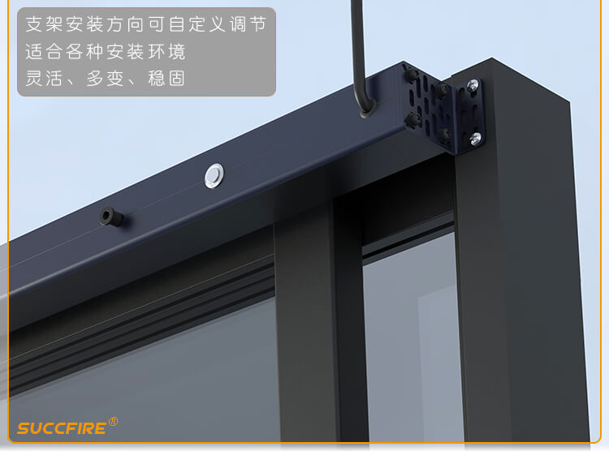
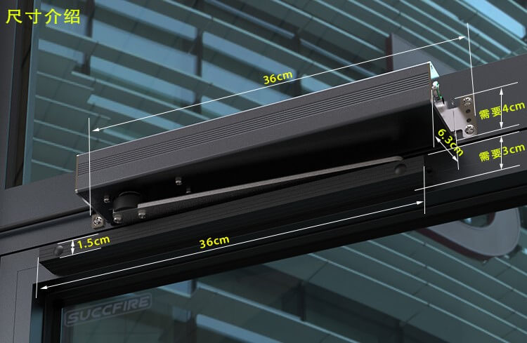

Chenyang Cover
==============

.. seo::
    :description: Instructions for setting up Chenyang RS485 covers in ESPHome.
    :image: chenyang.png

The ``chenyang`` cover platform allows you to use your Chenyang CP12, CP14, CP16, CP31, CP95, etc. RS485-controlled window openers.
Full operational feedback and position control.

    Chenyang CP12 Sliding Window Opener. Image by `Succfire <https://item.taobao.com/item.htm?id=615577885024>`__.

    Chenyang Casement Window Opener. Image by `Succfire <https://item.taobao.com/item.htm?id=624226793696>`__.

Overview
--------

This component works for all Chenyang models with a RS485 interface. Use a RS485-UART/TTL converter with automatic flow control (e.g. SP485, it needs to just have ``RX``/``TX`` pins, no ``DE``/``RE``) to connect to your ESP8266/ESP32. As the communication is done using UART (baud rate of 9600), you need to have an :ref:`UART bus <uart>` in your configuration with the ``rx_pin`` connected to the converter's ``RX`` and the ``tx_pin`` connected to the converter's ``TX``.

.. code-block:: yaml

    # Example configuration entry
    uart:
      rx_pin: GPIO13
      tx_pin: GPIO15
      baud_rate: 9600

    cover:
      - platform: chenyang
        name: "Chenyang Cover"
        address: 0xFF
        update_interval: 1s

Configuration variables:
------------------------

- **name** (**Required**, string): The name of the cover.
- **address** (*Optional*, int): Address of the window opener. Defaults to factory default ``0xFF``.
- **update_interval** (*Optional*, :ref:`config-time`): How often to poll for operational status and position updates. Defaults to ``1s``.
- **id** (*Optional*, :ref:`config-id`): Manually specify the ID used for code generation.
- All other options from :ref:`Cover <config-cover>`.

See Also
--------

- :doc:`index`
- :apiref:`cover/chenyang.h`
- `Chenyang RS485 protocol specification (english) <https://drive.google.com/file/d/16b1IaAimyyDuLjRlgnlAeW8OSLYSf_rX/view>`__
- `Chenyang RS485 protocol specification (chinese) <https://drive.google.com/file/d/10S3m_5JZkiAjXkFAwmEjy-bUrft7CRXl/view>`__
- :ghedit:`Edit`
