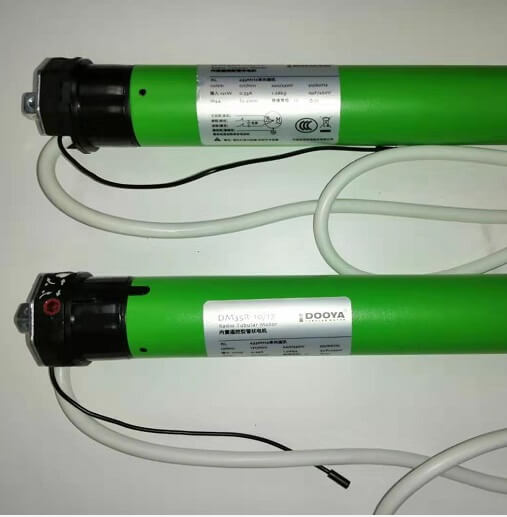
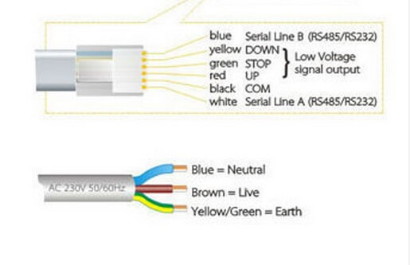

Dooya Cover
=============

.. seo::
    :description: Instructions for setting up Dooya RS485 covers in ESPHome.
    :image: dooya.jpg

The ``dooya`` cover platform allows you to use your Dooya DM35EQL/J, DM45EQL/J, etc. RS485-controlled shades.
Full operational feedback and position control.

    Dooya DM35 Tubular Motor (`catalogue <http://downloads.dooya.com/interiorapplication.pdf>`__, `Dooya <http://www.dooya.com>`__). Image by `Guangzhou Yuhong Curtain Materials Co., Ltd. <https://www.alibaba.com/product-detail/Dooya-Buit-in-Tubular-Motor-35mm_62376489679.html>`__.

    This component works for all Dooya models with a RS485 interface. It is provided via a 6-wire cable, pinout varies according to model.

Overview
--------

Use a RS485-UART/TTL converter with automatic flow control (e.g. SP485, it needs to just have ``RX``/``TX`` pins, no ``DE``/``RE``) to connect to your ESP8266/ESP32. As the communication is done using UART (baud rate of 9600), you need to have an :ref:`UART bus <uart>` in your configuration with the ``rx_pin`` connected to the converter's ``RX`` and the ``tx_pin`` connected to the converter's ``TX``.

.. code-block:: yaml

    # Example configuration entry
    uart:
      rx_pin: GPIO13
      tx_pin: GPIO15
      baud_rate: 9600

    cover:
      - platform: dooya
        name: "Dooya Cover"
        address: 0xFEFE
        update_interval: 500ms

Configuration variables:
------------------------

- **name** (**Required**, string): The name of the cover.
- **address** (*Optional*, int): Address of the motor. Defaults to factory default ``0xFEFE``.
- **update_interval** (*Optional*, :ref:`config-time`): How often to poll for operational status and position updates. Defaults to ``500ms``.
- **id** (*Optional*, :ref:`config-id`): Manually specify the ID used for code generation.
- All other options from :ref:`Cover <config-cover>`.

See Also
--------

- :doc:`index`
- :apiref:`cover/dooya.h`
- `Dooya RS485 protocol specification <https://drive.google.com/file/d/1C2GRhmSnMZNEexg_YGczrKEE6p8-d9PT/view>`__
- :ghedit:`Edit`
