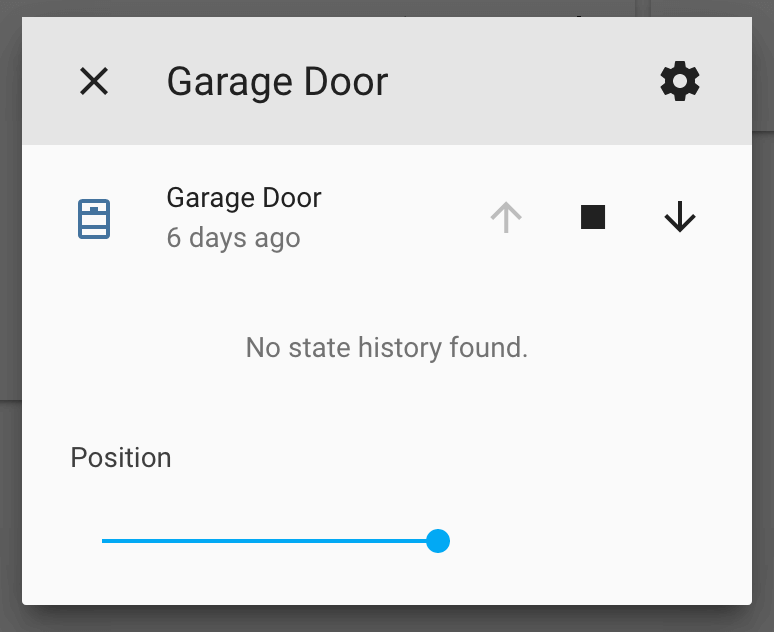

Feedback Cover
==============

.. seo::
    :description: Instructions for setting up feedback covers in ESPHome.

The ``feedback`` cover platform allows you to create covers with position control that 
can optionally have feedback from sensors to detect the fully-open and fully-closed states (endstops), 
and from sensors to detect actual movement (opening/closing). In all the cases the current
position is approximated with the time the cover has been moving in a direction.

It supports *open*, *close*, *stop* and *toggle* actions. Tilt control is not supported.

.. code-block:: yaml

    # Example configuration entry
    cover:
      - platform: feedback
        name: "Gate"

        open_action:
          - switch.turn_on: open_cover_switch
        open_duration: 2.1min
        open_endstop: open_endstop_binary_sensor
        open_sensor: open_movement_binary_sensor

        close_action:
          - switch.turn_on: close_cover_switch
        close_duration: 2min
        close_endstop: close_endstop_binary_sensor
        close_sensor: close_movement_binary_sensor

        stop_action:
          - switch.turn_off: open_cover_switch
          - switch.turn_off: close_cover_switch

Use Cases
---------

It is a versatile cover that can accommodate for a number of DIY setups, or monitoring an externally controlled cover:

Time-Based
**********

Simplest case, when no sensors are available. The state is thus assumed.

It is a drop-in replacement of :doc:`/components/cover/time_based`

Endstop Sensors
***************

For cases where there are endstops at one or both ends of the cover to detect the fully-open and fully-closed states.
When any of these endstops are reached, an actual state is read and updated and the cover optionally 
stopped (via ``stop_action``). The state is not assumed.

The extension also handles the case where the cover has builtin endstops, which stops the movement, independently to
the component's logic. In this case, when the cover is fully closed (either if timed based or sensor based) the 
``stop_action`` is not triggered.

It is a drop-in replacement of :doc:`/components/cover/endstop`.

Movement Sensors
****************

If movement feedback is available, the cover no longer operates in *optimistic mode* (assuming that movement starts
as soon as an action is triggered) and can also react to commands issued to cover from an external control and still
keep states in sync (useful for "smartization" of an existing cover).

When there are no specific endstop sensors, and if the cover has builtin endstops and no external control logic,
these movement sensors can optionally be use to infer the endstop state. 
When the movement stops (with no stop action being requested) it is assumed that it was caused by
the builtin endstops, and so the close/open state (according to current direction) was reached. 
This function is activated setting ``infer_endstop`` to True.

It can be used to replace a :doc:`/components/cover/current_based`, with some modifications in the yaml. See :ref:`migrating_current_based`

Safety Features
---------------

To protect the cover hardware from damage, some safety options are available:

- *Max duration*, to protect from faulty endstops
- *Direction change wait time*, like an interlock wait time, to protect motors from sudden direction changes
- *Obstacle sensors* and *rollback*, possibility to stop and optionally rollback the cover when some external sensors detects an obstacle 
  (it might be a sensor for high current consumption or an infrared light detecting an obstruction in the path).

Configuration variables
-----------------------

- **name** (**Required**, string): The name of the cover.
- **id** (*Optional*, :ref:`config-id`): Manually specify the ID used for code generation.

- **stop_action** (**Required**, :ref:`Action <config-action>`): The action that should
  be performed when the remote requests the cover to be closed or an endstop is reached.

Open options:

- **open_action** (**Required**, :ref:`Action <config-action>`): The action that should
  be performed when the remote requests the cover to be opened.
- **open_duration** (**Required**, :ref:`config-time`): The amount of time it takes the cover
  to open up from the fully-closed state.
- **open_endstop** (**Optional**, :ref:`config-id`): The ID of the
  :ref:`Binary Sensor <config-binary_sensor>` that turns on when the open position is reached.
- **open_sensor** (**Optional**, :ref:`config-id`): The ID of the
  :ref:`Binary Sensor <config-binary_sensor>` that turns on when the cover is moving in the open direction.
- **open_obstacle_sensor** (**Optional**, :ref:`config-id`): The ID of the
  :ref:`Binary Sensor <config-binary_sensor>` that turns on when an obstacle that blocks the
  open direction is detected.

Close options:

- **close_action** (**Required**, :ref:`Action <config-action>`): The action that should
  be performed when the remote requests the cover to be closed.
- **close_duration** (**Required**, :ref:`config-time`): The amount of time it takes the cover
  to close from the fully-open state.
- **close_endstop** (**Optional**, :ref:`config-id`): The ID of the
  :ref:`Binary Sensor <config-binary_sensor>` that turns on when the closed position is reached.
- **close_sensor** (**Optional**, :ref:`config-id`): The ID of the
  :ref:`Binary Sensor <config-binary_sensor>` that turns on when the cover is moving in the close direction.
- **close_obstacle_sensor** (**Optional**, :ref:`config-id`): The ID of the
  :ref:`Binary Sensor <config-binary_sensor>` that turns on when an obstacle that blocks the
  close direction is detected.

Additional options:

- **has_built_in_endstop** (*Optional*, boolean): Indicates that the cover has built in end stop
  detectors. In this configuration the ``stop_action`` is not performed when the open or close
  time is completed and if the cover is commanded to open or close the corresponding actions
  will be performed without checking current state. Defaults to ``false``.
- **infer_endstop_from_movement** (*Optional*, boolean): Whether to infer endstop state from the movement sensor. 
  Requires movement sensors to be set, no endstop sensors and to have builtin endstops. Defaults to ``false``.
- **assumed_state** (*Optional*, boolean): Whether the true state of the cover is not known.
  This will make the Home Assistant frontend show buttons for both OPEN and CLOSE actions, instead
  of hiding or disabling one of them. Defaults to ``true`` if no sensor is available to known
  the actual state of the cover.
- **max_duration** (*Optional*, :ref:`config-time`): The maximum duration the cover should be opening
  or closing. Useful for protecting from dysfunctional endstops. 
  Requires internal, builtin or inferred endstops.
- **direction_change_wait_time** (*Optional*, :ref:`config-time`): Stops cover and forces a wait time between changes in direction,
  and takes it into account when computing cover position (useful to protect motors). 
  When this option is set (even at 0s) if an open/close action is invoked while the cover is moving in the opposite direction,
  then and intermediate stop action will be invoked to generate the delay. 
- **acceleration_wait_time** (*Optional*, :ref:`config-time`): Considers a wait time needed by the cover to actually 
  start moving after command is issued and takes it into account when computing cover position 
  (useful for heavy covers with large inertia). 
  Intended to not accumulate error when doing multiple partial open/close actions). 
  The open/close duration includes one instance of this delay, as it is the total amount of time from
  issuing a command to reaching endstop.
  Defaults to ``0s``.
- **update_interval** (*Optional*, :ref:`config-time`): The interval
  to publish updated position information to the UI while the cover is moving.
  Defaults to ``1s``.
- **obstacle_rollback** (*Optional*, percentage): The percentage of rollback the cover will perform in case of
  obstacle detection while moving. Defaults to ``10%``.
- All other options from :ref:`Cover <config-cover>`.

Example Configurations
----------------------

.. _migrating_current_based:

Migrating Current-Based Cover
*****************************

Most options can be left untouched, but some modifications are needed:

1. All current sensing related options must be moved to auxiliary :doc:`/components/binary_sensor/analog_threshold`,
   to convert current readings to binary sensors, using the corresponding thresholds and delays.

   If there where any open/close obstacle current threshold defined, a separate binary sensor with that threshold should be defined.
   The option ``start_sensing_delay`` should be directly replaced by a ``delayed_off`` filter in the movement sensors, or alternatively
   hysteresis options could be used to reduce the noise.  
2. To have the very same behavior implicit in current based cover, you must always set ``has_built_in_endstop`` and ``infer_endstop_from_movement``
   to True.

  .. code-block:: yaml

      # Example original sensor configuration 
      cover:
        - platform: current_based
          name: "Current Based Cover"

          open_sensor: open_current_sensor
          open_moving_current_threshold: 0.5
          open_obstacle_current_threshold: 0.8
          start_sensing_delay: 0.8s
          # ...rest of options

      # Example converted sensor configuration 
      binary_sensor:
        - platform: analog_threshold
          id: open_binary_sensor
          sensor_id: open_current_sensor
          threshold: 0.5
          filters:
            - delayed_off: 0.8s
        - platform: analog_threshold
          id: open_obstacle_binary_sensor
          sensor_id: open_current_sensor
          threshold: 0.8
        # ... repeat for close sensors

      cover:
        - platform: feedback
          name: "Feedback Based Cover"
          has_built_in_endstop: true
          infer_endstop_from_movement: true

          open_sensor: open_binary_sensor
          open_obstacle_sensor: open_obstacle_binary_sensor
          #... rest of options

3. Malfunction detection is not directly supported by Feedback Cover, as the malfunction was very narrowly defined to a specific use case 
   (while in other hardware configurations, the same situation is perfectly valid). 

   The malfunction alerted specifically when there was current in the opposite direction of the requested operation (possibly due to a relay welded).
   This detection can still be achieved by putting the logic directly in the switch, (or whatever needed according to your specific use case).

  .. code-block:: yaml

      # Example original malfunction configuration 
      cover:
        - platform: current_based
          close_sensor: close_current        
          close_action:
            - switch.turn_on: open_relay
          open_sensor: open_current 
          open_action:
            - switch.turn_on: open_relay 
             
          malfunction_detection: true
          malfunction_action:
            - logger.log: "Malfunction detected. Relay welded."   
          #... rest of options 

      # Example converted malfunction configuration 
      switch:
        - platform: gpio
          id: open_relay
          #... rest of options 
          on_turn_off:
            - delay: 200ms #allow for switching time and any discharge
            - if:
                condition: 
                  binary_sensor.is_on: open_binary_sensor
                  # alternative can check directly  
                  # on sensor.in_range open_current
                then:
                  - logger.log: "Malfunction detected. Relay welded."   

See Also
--------

- :doc:`index`
- :ref:`automation`
- :apiref:`feedback/feedback_cover.h`
- :ghedit:`Edit`
