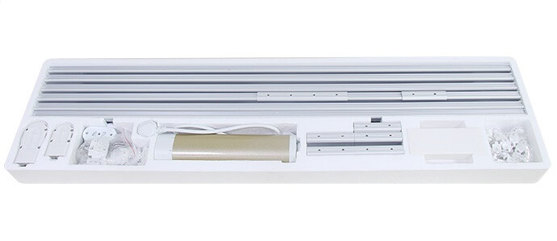

GM40 Cover
==========

.. seo::
    :description: Instructions for setting up GM40 RS485 covers in ESPHome.
    :image: gm40.jpg

The ``gm40`` cover platform allows you to use your GM40 RS485-controlled curtain motors.
Full operational feedback and position control.

    GM40 curtain motor. Image by `Galime <https://galime.en.alibaba.com>`__.

    Complete curtain track set. Image by `Galime <https://galime.en.alibaba.com>`__.

Overview
--------

This component works for GM40 motors with a RS485 interface. Use a RS485-UART/TTL converter with automatic flow control (e.g. SP485, it needs to just have ``RX``/``TX`` pins, no ``DE``/``RE``) to connect to your ESP8266/ESP32. As the communication is done using UART (baud rate of 9600), you need to have an :ref:`UART bus <uart>` in your configuration with the ``rx_pin`` connected to the converter's ``RX`` and the ``tx_pin`` connected to the converter's ``TX``.

.. code-block:: yaml

    # Example configuration entry
    uart:
      rx_pin: GPIO13
      tx_pin: GPIO15
      baud_rate: 9600

    cover:
      - platform: gm40
        name: "GM40 Cover"
        address: 0x00

Configuration variables:
------------------------

- **name** (**Required**, string): The name of the cover.
- **address** (*Optional*, int): Address of the window opener. Defaults to factory default ``0x00``.
- **id** (*Optional*, :ref:`config-id`): Manually specify the ID used for code generation.
- All other options from :ref:`Cover <config-cover>`.

See Also
--------

- :doc:`index`
- :apiref:`cover/gm40.h`
- `GM40 RS485 protocol specification (chinese) <https://drive.google.com/file/d/1mFCdPNQR-FDhkB7dxYXVVKhp7QonGyVp/view>`__
- :ghedit:`Edit`
