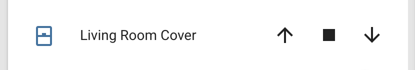

Template Cover
==============

.. seo::
    :description: Instructions for setting up template covers in ESPHome.
    :image: description.svg

The ``template`` cover platform allows you to create simple covers out of just a few
actions and a value lambda. Once defined, it will automatically appear in Home Assistant
as a cover and can be controlled through the frontend.

.. code-block:: yaml

    # Example configuration entry
    cover:
      - platform: template
        name: "Template Cover"
        lambda: |-
          if (id(top_end_stop).state) {
            return COVER_OPEN;
          } else {
            return COVER_CLOSED;
          }
        open_action:
          - switch.turn_on: open_cover_switch
        close_action:
          - switch.turn_on: close_cover_switch
        stop_action:
          - switch.turn_on: stop_cover_switch
        optimistic: true

Possible return values for the optional lambda:

 - ``return COVER_OPEN;`` if the cover should be reported as OPEN.
 - ``return COVER_CLOSED;`` if the cover should be reported as CLOSED.
 - ``return {};`` if the last state should be repeated.

Configuration variables:
------------------------

- **name** (**Required**, string): The name of the cover.
- **lambda** (*Optional*, :ref:`lambda <config-lambda>`):
  Lambda to be evaluated repeatedly to get the current state of the cover.
- **open_action** (*Optional*, :ref:`Action <config-action>`): The action that should
  be performed when the remote (like Home Assistant's frontend) requests the cover to be opened.
- **close_action** (*Optional*, :ref:`Action <config-action>`): The action that should
  be performed when the remote requests the cover to be closed.
- **stop_action** (*Optional*, :ref:`Action <config-action>`): The action that should
  be performed when the remote requests the cover to be stopped.
- **toggle_action** (*Optional*, :ref:`Action <config-action>`): The action that should
  be performed when the remote requests to toggle the the cover.
- **optimistic** (*Optional*, boolean): Whether to operate in optimistic mode - when in this mode,
  any command sent to the template cover will immediately update the reported state and no lambda
  needs to be used. Defaults to ``false``.
- **assumed_state** (*Optional*, boolean): Whether the true state of the cover is not known.
  This will make the Home Assistant frontend show buttons for both OPEN and CLOSE actions, instead
  of hiding one of them. Defaults to ``false``.
- **has_position** (*Optional*, boolean): Whether this cover will publish its position as a floating point number.
  By default (``false``), the cover only publishes OPEN/CLOSED position.
  Parameter useless if you set the POSITION_ACTION (is set to TRUE).
- **tilt_action** (*Optional*, :ref:`Action <config-action>`): The action that should
  be performed when the remote (like Home Assistant's frontend) requests the cover be set to a specific
  tilt position. The desired tilt is available in the lambda in the ``tilt`` variable.
- **tilt_lambda** (*Optional*, :ref:`lambda <config-lambda>`):
  Lambda to be evaluated repeatedly to get the current tilt position of the cover.
- **position_action** (*Optional*, :ref:`Action <config-action>`): The action that should
  be performed when the remote (like Home Assistant's frontend) requests the cover be set to a specific
  position. The desired position is available in the lambda in the ``pos`` variable.
- **id** (*Optional*, :ref:`config-id`): Manually specify the ID used for code generation.
- All other options from :ref:`Cover <config-cover>`.

.. _cover-template-publish_action:

``cover.template.publish`` Action
---------------------------------

You can also publish a state to a template cover from elsewhere in your YAML file
with the ``cover.template.publish`` action.

.. code-block:: yaml

    # Example configuration entry
    cover:
      - platform: template
        name: "Template Cover"
        id: template_cov

    # in some trigger
    on_...:
      - cover.template.publish:
          id: template_cov
          state: OPEN

      # Templated
      - cover.template.publish:
          id: template_cov
          state: !lambda 'return COVER_OPEN;'

Configuration options:

- **id** (**Required**, :ref:`config-id`): The ID of the template cover.
- **state** (*Optional*, :ref:`templatable <config-templatable>`):
  The state to publish. One of ``OPEN``, ``CLOSED``. If using a lambda, use ``COVER_OPEN`` or ``COVER_CLOSED``.
- **position** (*Optional*, :ref:`templatable <config-templatable>`, float):
  The position to publish, from 0 (CLOSED) to 1.0 (OPEN)
- **tilt** (*Optional*, :ref:`templatable <config-templatable>`, float):
  The tilt position to publish, from 0 (CLOSED) to 1.0 (OPEN)
- **current_operation** (*Optional*, :ref:`templatable <config-templatable>`, string):
  The current operation mode to publish. One of ``IDLE``, ``OPENING`` and ``CLOSING``. If using a lambda, use ``COVER_OPERATION_IDLE``, ``COVER_OPERATION_OPENING``, and ``COVER_OPERATION_CLOSING``.

.. note::

    This action can also be written in lambdas:

    .. code-block:: cpp

        id(template_cov).position = COVER_OPEN;
        id(template_cov).tilt = 0.5;
        id(template_cov).publish_state();

See Also
--------

- :doc:`/components/cover/index`
- :ref:`automation`
- :doc:`/cookbook/garage-door`
- :apiref:`template/cover/template_cover.h`
- :ghedit:`Edit`
