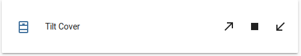

Tilt Cover
==============

.. seo::
    :description: Instructions for setting up tilt covers in ESPHome.
    :image: description.png

The ``tilt`` cover platform allows you to create covers that have tilting slats or louvers.
The tilting action does not give any feedback, the tilt position is always assumed to match
the commanded position. The tilt movement is typically accomplished by a servo motor.
This platform is useful for typical Venetian horizontal (or vertical) blinds that can be commanded
to go directly to a set tilt angle anywhere between full down (left) and full up (right) angle.
The value is expressed as a percentage of full up (or right) angle position.

.. code-block:: yaml

    # Example Tilt Cover configuration entry
    cover:
      - platform: tilt
        name: "Tilt Cover"
        tilt_closed_value: 0%
        tilt_opened_value: 100%
        tilt_close_speed: 20
        tilt_open_speed: 20
        id: tilt_cover
        tilt_action:
          - output.set_level:
            id: tilt_output
            level: !lambda "return id(tilt_cover)->tilt;"
        
The resulting Home Assistant Cover card will look like this:

    
The details card of the cover will look like this, note the open and close arrows and the tilt slider:

.. figure:: images/cover-tilt-details.png
    :align: center
    :width: 50.0%

Configuration variables:
------------------------

- **name** (**Required**, string): The name of the cover.
- **tilt_action** (**Required**, :ref:`Action <config-action>`): The action that should be
  performed when the remote requests the cover to be set to a tilt position. The
  command payload is avilable as the ``tilt`` property of the cover object. To access it
  by ``id`` set ``id: <some identifier>`` and use ``id(<some identifier>)->tilt`` in a :ref:`Lambda <config-lambda>`.
  Typical case will be to send the tilt position to an ``output.set_level``.
- **tilt_closed_value** (*Optional*, percentage): Tilt position to set the cover to when the
  remote requests the cover tilt to be set to closed. Defaults to 0%.
- **tilt_opened_value** (*Optional*, percentage): Tilt position to set the cover to when the
  remote requests the cover tilt to be set to open. Defaults to 100%.
- **tilt_close_speed** (*Optional*, float): Speed of movement in the closing direction, in units of %/second.
  Defaults to 0, which disables the speed control and sets the tilt position command immediately.
- **tilt_open_speed** (*Optional*, float): Speed of movement in the opening direction, in units of %/second.
  Defaults to 0, which disables the speed control and sets the tilt position command immediately.
- **id** (*Optional*, :ref:`config-id`): Manually specify the ID used for code generation.
- All other options from :ref:`Cover <config-cover>`.
- If MQTT enabled, all other options from :ref:`MQTT Component <config-mqtt-component>`.

See Also
--------

- :doc:`/components/cover/index`
- :ref:`automation`
- :apiref:`cover/tilt_cover.h`
- :ghedit:`Edit`
