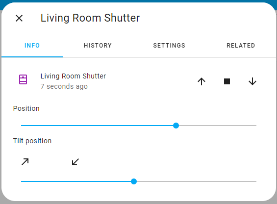

Time Based Cover with Tilt Function
===================================

.. seo::
    :description: Instructions for setting up time-based covers with tilt function (venetian blinds) driven by one motor in ESPHome.
    :image: timer.svg

The ``time_based_tilt`` cover platform allows you to create covers with position and tilt control 
that are driven by one motor and do not have any position feedback. Such a solution can be found 
in the external venetian blinds. The state of the cover is thus always an assumed one, the current 
position and tilt are approximated with the time the cover has been moving in a direction. 
It can also be used to control covers without a tilt function. In this case, the rotation time must be 
set to 0. Has an automatic recalibration function at extreme positions. Takes into account the inertia time 
and the interlocking time when changing direction.

.. code-block:: yaml

    # Example configuration entry
    cover:
      - platform: time_based_tilt
        name: "Time-Based Tilt Cover"
        open_duration: 58700ms
        close_duration: 57700ms
        inertia_open_time: 300ms
        tilt_open_duration: 930ms
        inertia_close_time: 250ms
        tilt_close_duration: 900ms
        interlock_wait_time: 500ms
        recalibration_time: 2500ms

        open_action:
          - switch.turn_on: open_cover_switch

        close_action:
          - switch.turn_on: close_cover_switch

        stop_action:
          - switch.turn_off: open_cover_switch
          - switch.turn_off: close_cover_switch

Configuration variables:
------------------------

- **name** (**Required**, string): The name of the cover.
- **open_duration** (**Required**, :ref:`config-time`): The amount of time it takes the cover
  to open up from the fully-closed state.
- **close_duration** (**Required**, :ref:`config-time`): The amount of time it takes the cover
  to close from the fully-open state.
- **open_action** (**Required**, :ref:`Action <config-action>`): The action that should
  be performed when the remote requests the cover to be opened.
- **close_action** (*Optional*, :ref:`Action <config-action>`): The action that should
  be performed when the remote requests the cover to be closed.
- **stop_action** (**Required**, :ref:`Action <config-action>`): The action that should
  be performed to stop the cover when the remote requests the cover to be stopped or
  when the cover has been opening/closing for the given durations.  
- **tilt_open_duration** (**Optional**, :ref:`config-time`): The amount of time it takes lamellas 
  to tilt from the fully-closed state.
- **tilt_close_duration** (**Optional**, :ref:`config-time`): The amount of time it takes lamellas 
  to tilt from the fully-open state.
- **inertia_open_time** (**Optional**, :ref:`config-time`): The time of inertia before lamellas begin 
  to open after a change in direction of movement.
- **inertia_close_time** (**Optional**, :ref:`config-time`):The time of inertia before lamellas begin 
  to close after a change in direction of movement.  
- **interlock_wait_time** (**Optional**, :ref:`config-time`): Set how long it should wait after a change 
  of direction. Useful for motors where immediately turning on in the other direction could cause problems.
  Remember to set the time no less than for the GPIO switch if similar settings are made for the GPIO switch.
- **recalibration_time** (**Optional**, :ref:`config-time`):The calibration time at the extreme positions (0%, 100%).
  If set, the motor will remain on for the set time after reaching the extreme positions.
- **assumed_state** (*Optional*, boolean): Whether the true state of the cover is not known.
  This will make the Home Assistant frontend show buttons for both OPEN and CLOSE actions, instead
  of hiding or disabling one of them. Defaults to ``true``.
- **id** (*Optional*, :ref:`config-id`): Manually specify the ID used for code generation.
- All other options from :ref:`Cover <config-cover>`.

.. note::

    The stop button on the UI is always enabled even when the cover is stopped and each press
    on the button will cause the ``stop_action`` to be performed.

.. note::

    The state of the cover can be restored from flash after a node reboot, with 
    ``esp8266_restore_from_flash: true`` option set. 
    See :doc:`esp8266_restore_from_flash </components/esphome>` for details.

See Also
--------

- :doc:`index`
- :ref:`automation`
- :apiref:`time_based_tilt/time_based_tilt_cover.h`
- :ghedit:`Edit`
