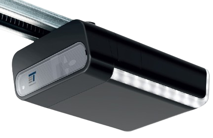

Tormatic/Novoferm Cover
=======================

.. seo::
    :description: Setting up Tormatic and Novoferm covers in ESPHome.
    :image: tormatic.png

The ``tormatic`` cover platform allows you to control Tormatic and Novoferm
garage door drives manufactured in 2016 onwards. The following models should
be supported:

 * Tormatic Black 600, Black 800, Black 1000
 * Novoferm Novomatic 423
 * Novoferm Novomatic 563 S
 * Novoferm Novoport IV

    Tormatic Black 600 Garage Door Drive

.. note::

    This component was written and tested against a Novoferm 423, so
    compatibility with other models is currently not guaranteed. Please update
    this documentation if you confirm this to work on other models as well.
    
    The vendor's cloud-based remote is not known to perform model or feature
    detection, so it's assumed that the protocol is the same across all models.

As the communication with the garage door drive is done using UART, you need to
have an :ref:`UART bus <uart>` in your configuration with the ``rx_pin``
connected unit's USB D- line and the ``tx_pin`` connected to the USB's D+ line.
The baud rate should be set to 9600. See `Setup`_ for more detailed
instructions.

.. code-block:: yaml

    # Example configuration entry
    uart:
      rx_pin: GPIO19
      tx_pin: GPIO20
      baud_rate: 9600

    cover:
      - platform: tormatic
        device_class: garage
        name: Novoferm 423

Setup
-----

The garage door drive ('unit') contains a female USB Type B port that does
**not** speak the USB protocol. It is not a conventional USB port, though it
supplies 5V between the usual USB Vcc and ground pins and can be used to feed an
ESP32 board.

The D+ and D- terminals are used as a 9600/8N1 UART pair **with 5V logic levels
(!)**. All current ESP family devices expect 3V logic levels, so a level shifter
is needed on the data lines for this to work correctly. Experiments with
connecting an ESP32 S2's GPIO hardware directly to these pins yielded strange
results; the ESP runs hot, doesn't connect to WiFi and the ESP's 3V tx logic
level is slightly underpowered, so the unit doesn't receive the ESP's messages
correctly most of the time.

The unit pulls the USB's D- (white) line high and uses it to transmit data. It
receives data on the D+ (green) line, meaning **the ESP should transmit on D+
and receive on D-**. On a Wemos S2, these lines are directly routed to GPIO19
(D-) and GPIO20 (D+), since there is no separate in-line USB chip. This makes
the S2 an ideal device for this purpose; it keeps the cable simple and compact,
since it needs to fit in a tight space in the unit. Only a single header pin
needs to be soldered the PCB to supply 3.3V to the logic level shifter, but it
can be bent 90 degrees to sit parallel to the PCB, keeping a low profile.

Configuration variables:
------------------------

- **name** (**Required**, string): The name of the cover.
- **open_duration** (*Optional*, :ref:`config-time`): The amount of time the
  gate is expected to need to go from a fully closed to opened state. Defaults
  to ``15s``. Used to interpolate the position value published to Home Assistant
  during gate movements, and for stopping the gate at a specific requested
  position. This value is automatically recalibrated after an uninterrupted
  closed -> opened movement.
- **close_duration** (*Optional*, :ref:`config-time`): The opposite of
  ``open_duration``. Defaults to ``22s``.
- All other options from :ref:`Cover <config-cover>`.

Known Issues
------------

 * Pausing an action twice (e.g. open - pause - open - pause) will result in the
   unit incorrectly remaining in 'opening' status for exactly 60 seconds. This
   is difficult to work around without making the protocol completely
   client-side authoritative, but this would mean we can no longer detect gate
   movements initiated by the physical button or an RF remote. An annoying but
   acceptable defect.
 * The position updates during gate movements are time-based approximations and
   don't account for acceleration and grace movements near the start and end of
   the action. The unit itself doesn't provide accurate position information.

See Also
--------

- :doc:`index`
- :ref:`automation`
- :apiref:`tormatic/tormatic_cover.h`
- :ghedit:`Edit`
