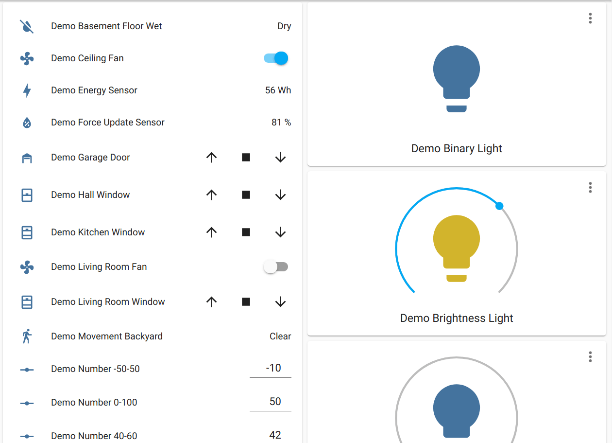

Demo Component
==============

.. seo::
    :description: Instructions for setting up the demo component in ESPHome
    :image: description.svg

The ``demo`` component can be used for testing to generate sample instances of many
different components (sensors, lights, ...)

.. code-block:: yaml

    # Example configuration entry
    demo:

Configuration variables:
------------------------

This component has no configuration variables

See Also
--------

- :apiref:`demo/demo_sensor.h`
- :ghedit:`Edit`
