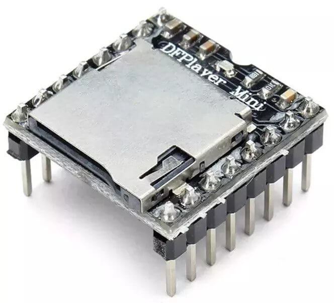

DF-Player mini
==============

.. seo::
    :description: Instructions for setting up DF Player Mini integration in ESPHome.
    :image: crosshair-gps.png

The ``dfplayer`` (`datasheet <https://wiki.dfrobot.com/DFPlayer_Mini_SKU_DFR0299>`__), component
allows you to play sound and music stored in an SD card or USB flash drive.

    DF-Player mini Module.

For this integration to work you need to have set up a :ref:`UART bus <uart>`
in your configuration.

Overview
--------

The module can be powered by the 3.3V output of a NodeMCU. For communication you can connect only
the ``tx_pin`` of the ``uart`` bus to the module's ``RX`` but if you need feedback of playback active 
you will also need to connect the ``rx_pin`` to the module's ``TX``.
For best quality audio a powered stereo speaker can be connected to the modules ``DAC_R``,
``DAC_I`` and ``GND``, alternatively the module features a built-in 3W audio amplifier, in that case 
the pins ``SPK_1`` and ``SPK_2`` should be connected to one passive speaker and a 5V 1A power supply
will be required.

.. code-block:: yaml

    # Example configuration entry
    uart:
      tx_pin: GPIO2
      rx_pin: GPIO5
      baud_rate: 9600

    # Declare DFPlayer mini module
    dfplayer:
      on_finished_playback:
        then:
          logger.log: 'Somebody press play!'

Configuration variables:
------------------------

- **uart_id** (*Optional*, :ref:`config-id`): Manually specify the ID of the UART hub.
- **id** (*Optional*, :ref:`config-id`): Manually specify the ID used for code generation.
- **on_finished_playback** (*Optional*, :ref:`Automation <automation>`): An action to be
  performed when playback is finished.

``dfplayer.is_playing`` Condition
---------------------------------

This Condition returns true while playback is active.

.. code-block:: yaml

    # In some trigger:
    on_...:
      if:
        condition:
          dfplayer.is_playing
        then:
          logger.log: 'Playback is active!'

``dfplayer.play_next`` Action
-----------------------------

Starts playback of next track or skips to the next track.

.. code-block:: yaml

    on_...:
      then:
        - dfplayer.play_next:

``dfplayer.play_previous`` Action
---------------------------------

Plays the previously played track.

.. code-block:: yaml

    on_...:
      then:
        - dfplayer.play_previous:

``dfplayer.play`` Action
------------------------

Plays a track.

.. code-block:: yaml

    on_...:
      then:
        - dfplayer.play:
          file: 23
          loop: false
        # Shorthand
        - dfplayer.play: 23

Configuration options:

- **file** (*Optional*, int, :ref:`templatable <config-templatable>`): The global track
  number (from all tracks in the device). If not specified plays the first track.
- **loop** (*Optional*, bool, :ref:`templatable <config-templatable>`): Repeats playing
  the same track. Defaults to ``False``.

``dfplayer.play_folder`` Action
-------------------------------

Plays files inside numbered folders, folders must be numbered from 1 and with leading
zeros. Like `01`, `02`, ... etc. Files inside the folders must be numbered with two
leading zeros, like `001.mp3`, `002.mp3`, ... etc.
Folder numbers can range from 1 to 99 and file name from 1 to 255 or folder number
from 1 to 10 and file number from 1 to 1000.

.. code-block:: bash

    /01
      /001.mp3
      /002.mp3
      ..
    /02
      /001.mp3
      /002.mp3
      /003.mp3
      ..

.. code-block:: yaml

    on_...:
      then:
        - dfplayer.play_folder:
            folder: 2
            file: 1

Configuration options:

- **folder** (**Required**, int, :ref:`templatable <config-templatable>`): The folder number.
- **file** (*Optional*, int, :ref:`templatable <config-templatable>`): The file number
  inside the folder to play. Optional only if ``loop`` is not set.
- **loop** (*Optional*, bool, :ref:`templatable <config-templatable>`): Repeats playing
  all files in the folder. Causes ``file`` to be ignored. Defaults to ``False``.

``dfplayer.set_device`` Action
------------------------------

Changes the device in use. Valid values are ``TF_CARD`` and ``USB``.

.. code-block:: yaml

    on_...:
      then:
        - dfplayer.set_device: TF_CARD

``dfplayer.set_volume`` Action
------------------------------

Changes volume.

.. code-block:: yaml

    on_...:
      then:
        - dfplayer.set_volume:
            volume: 20
        # Shorthand
        - dfplayer.set_volume: 20

Configuration options:

- **volume** (**Required**, int, :ref:`templatable <config-templatable>`): The volume value.
  Valid values goes from 0 to 30.

``dfplayer.set_eq`` Action
--------------------------

Changes audio equalization preset.

.. code-block:: yaml

    on_...:
      then:
        - dfplayer.set_eq:
            eq_preset: ROCK
        # Shorthand
        - dfplayer.set_eq: ROCK

Configuration options:

- **eq_preset** (**Required**): Eq Preset value. Valid values are ``NORMAL``, ``POP``, ``ROCK``, ``JAZZ``,
  ``CLASSIC`` and ``BASS``.

``dfplayer.sleep`` Action
-------------------------

Enters sleep mode. Playback is stopped and the action ``dfplayer.set_device: TF_CARD`` should be
send for playback to be enabled again.

.. code-block:: yaml

    on_...:
      then:
        - dfplayer.sleep

``dfplayer.reset`` Action
-------------------------

Module reset.

.. code-block:: yaml

    on_...:
      then:
        - dfplayer.reset

``dfplayer.start`` Action
-------------------------

Starts playing a track or resumes paused playback.

.. code-block:: yaml

    on_...:
      then:
        - dfplayer.start

``dfplayer.pause`` Action
-------------------------

Pauses playback, playback can be resumed from the same position with ``dfplayer.start``.

.. code-block:: yaml

    on_...:
      then:
        - dfplayer.pause

``dfplayer.stop`` Action
------------------------

Stops playback.

.. code-block:: yaml

    on_...:
      then:
        - dfplayer.stop

``dfplayer.random`` Action
--------------------------

Randomly plays all tracks.

.. code-block:: yaml

    on_...:
      then:
        - dfplayer.random

All actions
-----------

- **id** (*Optional*, :ref:`config-id`): Manually specify the ID of the DFPlayer if you have multiple components.

Test setup
----------

With the following code you can quickly setup a node and use Home Assistant's service in the developer tools.
E.g. for calling ``dfplayer.play_folder`` select the service ``esphome.test_node_dfplayer_play`` and in
service data enter

.. code-block:: json

    { "file": 23 }

Sample code
***********

.. code-block:: yaml

    esphome:
      name: test_node
      platform: ESP8266
      board: nodemcu

    wifi:
      ssid: !secret wifi_ssid
      password: !secret wifi_pass

    logger:
      level: VERBOSE

    uart:
      tx_pin: GPIO2
      rx_pin: GPIO5
      baud_rate: 9600

    dfplayer:
      on_finished_playback:
        then:
          logger.log: 'Playback finished event'

    api:
      services:
      - service: dfplayer_next
        then:
          - dfplayer.play_next:
      - service: dfplayer_previous
        then:
          - dfplayer.play_previous:
      - service: dfplayer_play
        variables:
          file: int
        then:
          - dfplayer.play: !lambda 'return file;'
      - service: dfplayer_play_loop
        variables:
          file: int
          loop_: bool
        then:
          - dfplayer.play:
              file: !lambda 'return file;'
              loop: !lambda 'return loop_;'
      - service: dfplayer_play_folder
        variables:
          folder: int
          file: int
        then:
          - dfplayer.play_folder:
              folder: !lambda 'return folder;'
              file: !lambda 'return file;'

      - service: dfplayer_play_loop_folder
        variables:
          folder: int
        then:
          - dfplayer.play_folder:
              folder: !lambda 'return folder;'
              loop: True

      - service: dfplayer_set_device_tf
        then:
          - dfplayer.set_device: TF_CARD

      - service: dfplayer_set_device_usb
        then:
          - dfplayer.set_device: USB

      - service: dfplayer_set_volume
        variables:
          volume: int
        then:
          - dfplayer.set_volume: !lambda 'return volume;'
      - service: dfplayer_set_eq
        variables:
          preset: int
        then:
          - dfplayer.set_eq: !lambda 'return static_cast<dfplayer::EqPreset>(preset);'

      - service: dfplayer_sleep
        then:
          - dfplayer.sleep

      - service: dfplayer_reset
        then:
          - dfplayer.reset

      - service: dfplayer_start
        then:
          - dfplayer.start

      - service: dfplayer_pause
        then:
          - dfplayer.pause

      - service: dfplayer_stop
        then:
          - dfplayer.stop

      - service: dfplayer_random
        then:
          - dfplayer.random

See Also
--------

- :apiref:`dfplayer/dfplayer.h`
- :ghedit:`Edit`
