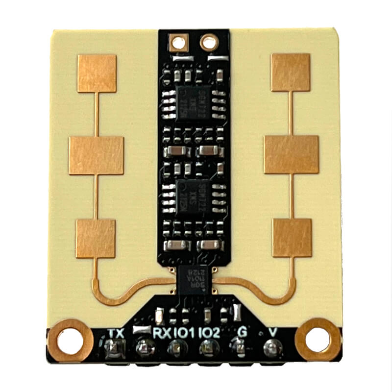

DFRobot mmWave Radar
====================

.. seo::
    :description: Instructions for setting up DFRobot mmWave Radar
    :image: dfrobot_sen0395.jpg
    :keywords: mmWave

The `DFRobot mmWave Radar <https://wiki.dfrobot.com/mmWave_Radar_Human_Presence_Detection_SKU_SEN0395>`__
(aka ``SEN0395``) is a 24GHz radar which can be used for human presence detection. It can detect tiny movements
and compared to a PIR sensor **it can detect presence continuously**. This can be useful, for example, to turn
the lights on when you enter a room, keep them on as long as you are there (without waving your hands at the
sensor) and turn them off almost immediately after you leave the room.

It is possible to use this sensor with only a single GPIO pin; however, if you wish to change its settings,
a :doc:`/components/uart` component (and its requisite GPIO pins) is required in your device's configuration.



    DFRobot mmWave Radar / presence detection sensor

.. code-block:: yaml

    # Example configuration entry
    dfrobot_sen0395:

    binary_sensor:
      # Information coming from uart bus
      - platform: dfrobot_sen0395
        name: Mmwave Detected via UART

      # Information coming from dedicated gpio (IO2)
      - platform: gpio
        name: Mmwave Detected via GPIO
        device_class: motion
        pin:
          number: GPIOXX
          mode: INPUT_PULLDOWN

    switch:
      # Switch to turn on/off detection
      - platform: dfrobot_sen0395
        name: Mmwave Active

.. _dfrobot_sen0395-component:

Hub Component
-------------

You only need to have the hub component (``dfrobot_sen0395:`` entry) defined if you want to change the sensor's
settings or read its state via the UART. A :doc:`/components/binary_sensor/gpio` alone is sufficient if you only want
to determine presence/occupancy. When you define ``dfrobot_sen0395:`` you'll need to have a ``uart:`` entry in
your configuration with both the TX and RX pins defined and the baud rate must be set to ``115200``.

Multiple instances of this component may be defined if multiple :doc:`/components/uart` components are available:

.. code-block:: yaml

    dfrobot_sen0395:
      - id: mmWave_1
        uart_id: uart_1
      - id: mmWave_2
        uart_id: uart_2
      ...

Configuration variables:
************************

- **id** (*Optional*, :ref:`config-id`): Manually specify the ID used for code generation. Necessary if you want
  to define multiple instances of this component.
- **uart_id** (*Optional*, :ref:`config-id`): Manually specify the ID of the :doc:`/components/uart` if you want
  to use multiple UART buses.

.. _dfrobot_sen0395-binary_sensor:

Binary Sensor
-------------

.. _dfrobot_sen0395-via_gpio:

Via GPIO
********

To determine presence, you can simply use a :doc:`/components/binary_sensor/gpio` and connect a single GPIO pin
from your processor to the IO2 pin of the mmWave radar. Using a dedicated GPIO pin may offer an advantage since
it may wake the processor from sleep.

If you don't want/need to change the radar's settings and only need to determine presence/occupancy, the
``dfrobot_sen0395:`` and ``uart:`` components are not necessary.

.. code-block:: yaml

    binary_sensor:
      - platform: gpio
        name: Presence Detected via GPIO
        device_class: motion
        pin:
          number: GPIOXX
          mode: INPUT_PULLDOWN

.. _dfrobot_sen0395-via_uart:

Via UART
********

Connecting the sensor via the serial connection (UART) allows both changing its settings as well as reading its state.
Note, however, that the UART peripheral cannot wake the processor; if you plan on sleeping the processor, you'll likely
still need to use the :ref:`GPIO pin <dfrobot_sen0395-via_gpio>` approach described above (in addition to the UART).

First, setup a :doc:`/components/uart` and :ref:`dfrobot_sen0395-component` and then use its binary sensor platform
to create individual binary sensors for each presence sensor.

.. code-block:: yaml

    binary_sensor:
      - platform: dfrobot_sen0395
        name: Presence Detected via UART

Configuration variables:
************************

- **dfrobot_sen0395_id** (*Optional*, :ref:`config-id`): The ID of the DFRobot mmWave component defined above.
  Required when multiple instances of the ``dfrobot_sen0395`` component are defined.
- All other options from :ref:`Binary Sensor <config-binary_sensor>`.

.. _dfrobot_sen0395-switch:

Switch
------

:ref:`Switch components <config-switch>` are used to enable/disable various module features/functions.

.. code-block:: yaml

    switch:
      - platform: dfrobot_sen0395
        dfrobot_sen0395_id: mmWave
        type: sensor_active
        name: mmWave Active

Configuration variables:
************************

- **dfrobot_sen0395_id** (*Optional*, :ref:`config-id`): The ID of the DFRobot mmWave component defined above.
  Required when multiple instances of the ``dfrobot_sen0395`` component are defined.
- **type** (**Required**): One of:

  - ``presence_via_uart``: when enabled, the module sends presence information via both the serial connection and
    GPIO pin; when disabled, presense is indicated only via the GPIO pin.
  - ``sensor_active``: when enabled, presence detection is reported; when disabled, presense will not be reported.
  - ``start_after_boot``: when enabled, the sensor will start immediately after power-on; when disabled, the sensor
    must be manually started.
  - ``turn_on_led``: when enabled, the mmWave sensor's LED blinks during operation; when disabled, the LED will always
    remain off.

- All other options from :ref:`Switch <config-switch>`.

.. _dfrobot_sen0395-actions:

Actions
-------

.. _dfrobot_sen0395-action_settings:

``dfrobot_sen0395.settings`` Action
***********************************

.. warning::

    Each change to the configuration of the mmWave radar triggers a write to its internal flash/EEPROM.
    Write cycles to this memory are limited, so avoid the practice of changing settings frequently.
    Determine the appropriate settings for your device and avoid changing them unless absolutely necessary.

The DFRobot mmWave Radar has several settings which can be changed. These settings are saved in non-volatile memory
and do not need to be set on each boot.

The settings action allows changing of any number of the mmWave radar's internal parameters/settings. With this
action, any unspecified parameters will remain unchanged. All settings are tempatable.

.. code-block:: yaml

    on_...:
      - dfrobot_sen0395.settings:
          factory_reset: true
          detection_segments:
            # Define between one and four segments
            - [0cm, 3m]
            - [5.1m, 6.6m]
          output_latency:
            delay_after_detect: 0s
            delay_after_disappear: 0s
          sensitivity: 7


Configuration variables:
````````````````````````

- **id** (*Optional*, :ref:`config-id`): Manually specify the ID of the mmWave sensor on which settings should be
  changed. If only one radar is defined, this is optional.
- **factory_reset** (*Optional*, boolean): If set to true, a factory reset of the sensor will be performed (before
  changing other options if present). Ignored if not set or set to ``false``.
- **detection_segments** (*Optional*, list): A list of detection segments. A segment specifies from where to where
  detection should trigger. One to four segments and ranges from 0cm to 9m may be specified. Distances should be
  defined in steps of 15cm. Note that the specified ranges are rounded internally. Segments can be defined in a
  one or two dimensional list. Pairs of values must be defined (from distance to distance). The default is one
  range from 0cm to 3m.

  **Examples**
  
  .. code-block:: yaml

      detection_segments:
        - [0cm, 3m]
        - [5.1m, 6.6m]


  In the above example, if a person was present in the range between 0cm and 3m (distance from the sensor) or
  between 5.1m and 6.6m the sensor would trigger (meaning a person was detected). If a person is present
  between 3.1m and 5m or 6.7m and 9m it would not trigger.

  .. code-block:: yaml

      detection_segments:
        - !lambda |-
            return 0;
        - !lambda |-
            return return id(mwave_max_distance).state;

  Section values can be defined using lambdas, so you can set the distances depending on other entities. Distances
  are defined as a float in meters (10cm = 0.1). If you return a negative value (-1) the segment will not be set.

- **output_latency** (*Optional*, dictionary):

  - **delay_after_detect** (**Required**, :ref:`config-time`): Time to wait before signaling that a person was
    detected. Specify in steps of 25 ms. Factory default is 2.5s. Value is tempatable: Return seconds value
    (100 ms = 0.1). Returning -1 keeps the value unchanged.
  - **delay_after_disappear** (**Required**, :ref:`config-time`): Time to wait before signaling that a person
    is no longer detected. Specify in steps of 25 ms. Factory default is 10 s. Value is tempatable: Return seconds
    value (100 ms = 0.1). Returning -1 keeps the value unchanged.

- **sensitivity** (*Optional*, int): Set the sensitivity of the sensor. Ranges from 0 to 9. Value is tempatable:
  Return 0-9. Returning -1 keeps the value unchanged.

``dfrobot_sen0395.reset`` Action
********************************

Restart the sensor.

.. code-block:: yaml

    on_...:
      dfrobot_sen0395.reset:

Configuration variables:
````````````````````````

- **id** (*Optional*, :ref:`config-id`): Manually specify the ID of the mmWave component. Useful when multiple instances of this component are defined.

See Also
--------
- :ref:`UART bus <uart>`
- :ref:`Binary Sensor <config-binary_sensor>`
- :ref:`config-id`
- `DFRobot mmWave Radar Wiki page <https://wiki.dfrobot.com/mmWave_Radar_Human_Presence_Detection_SKU_SEN0395>`__
- :ghedit:`Edit`
