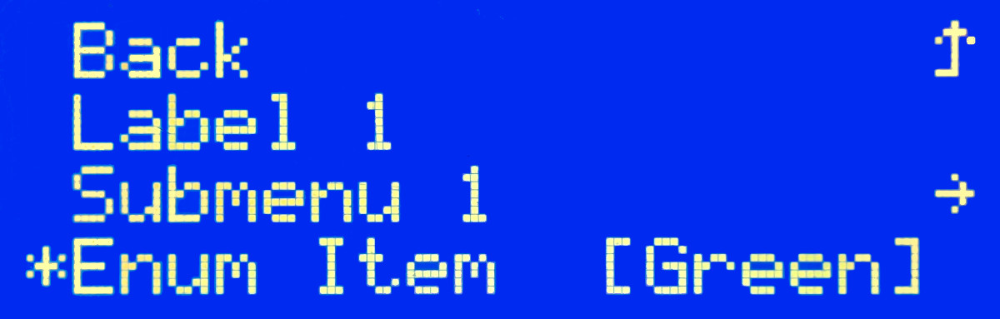

Display Menu
============

.. seo::
    :description: Instructions for setting up a simple hierarchical menu on displays.
    :image: lcd-menu.png

The component provides an infrastructure for setting up a hierarchical menu.
At the moment the character based LCD displays are supported using the ``lcd_menu``
integration.

Overview
--------

The integration provides a menu primarily intended to be controlled by a rotary encoder
with a button. It allows to navigate a hierarchy of items and submenus with the ability
to change enumeration and numeric values and execute commands. The menu can be activated
and deactivated on demand, allowing alternating between using the screen for the menu
and other information.

The component needs to be connected to an instance of a character based LCD display, which
at the moment are :ref:`lcd-pcf8574` or a :ref:`lcd-gpio`. For the best results the GPIO
connection is recommended; the I²C one running at the speed according to the datasheet
(usually 100 kHz) or even ESPHome default (50 kHz) will create perceptible delays especially
when changing a numeric value using the rotary encoder. Most PCF8574 adapters used with
these displays will happily run at 200 or even 400 kHz though so if you are comfortable
accepting risks from running your hardware out of spec, you might want to try that
in your ``i2c`` configuration.

.. code-block:: yaml

    # Example configuration entry
    display:
    - platform: lcd_pcf8574
        id: my_lcd
        ...
        user_characters:
          - position: 0
            data:
              - 0b00100
              - 0b01110
              - 0b10101
              - 0b00100
              - 0b00100
              - 0b00100
              - 0b11100
              - 0b00000
        lambda: |-
          id(my_lcd_menu).draw();
          if (!id(my_lcd_menu).is_active())
            it.print("Menu is not active");

    # Declare a LCD menu
    lcd_menu:
      id: my_lcd_menu
      display_id: my_lcd
      dimensions: 20x4
      active: True
      mark_back: 0x08
      mark_selected: 0x3e
      mark_editing: 0x2a
      mark_submenu: 0x7e
      on_enter:
        then:
          lambda: 'ESP_LOGI("display_menu", "root enter");'
      on_leave:
        then:
          lambda: 'ESP_LOGI("display_menu", "root leave");'
      menu:
        - type: back
          text: 'Back'
        - type: label
          text: 'Label 1'
        - type: label
          text: 'My'
          lambda: 'return std::string(it->get_text() + std::string(" Label"));'

    # Encoder to provide navigation
    sensor:
      - platform: rotary_encoder
        ...
        on_anticlockwise:
          - display_menu.up:
        on_clockwise:
          - display_menu.down:

    # A de-bounced GPIO is used to 'click'
    binary_sensor:
      - platform: gpio
        ...
        filters:
          - delayed_on: 10ms
          - delayed_off: 10ms
        on_press:
          - display_menu.enter:

Configuration variables:

- **id** (*Optional*, :ref:`config-id`): Manually specify the ID used for code generation.
- **display_id** (*Optional*, :ref:`config-id`): Manually specify the ID of the LCD display.
- **root_item_id** (*Optional*, :ref:`config-id`): Manually specify the ID of the root menu item.
- **dimensions** (**Required**, string): The dimensions of the display with the ``COLUMNSxROWS``
  format. This should match dimensions of the LCD display, you can however for example specify
  fewer lines and use the last one for a status one.
- **active** (*Optional*, boolean): Whether the menu should start as active, meaning accepting
  user interactions and displaying output. Defaults to ``True``.
- **mark_back**, **mark_selected**, **mark_editing**, **mark_submenu** (*Optional*, 0-255):
  Code of the character used to mark menu items going back one level, a selected one,
  the editing mode and item leading to a submenu. Defaults to ``0x5e`` (``^``), ``0x3e`` (``>``),
  ``0x2a`` (``*``) and ``0x7e`` (a right arrow). As the character set lacks a good looking
  up arrow, using a user defined character is advisable (use ``8`` to reference one at
  position ``0`` to avoid problems with zeros in a string).
- **menu** (**Required**): The first level of the menu.

Automations:

- **on_enter** (*Optional*, :ref:`Automation <automation>`): An automation to perform
  when the menu level (here the root one) is entered. See :ref:`display_menu-on_enter`.
- **on_leave** (*Optional*, :ref:`Automation <automation>`): An automation to perform
  when the menu level is not displayed anymore.
  See :ref:`display_menu-on_leave`.

Menu Items
----------

The component manages a hierarchy of menu items. The common configuration variables are: 

- **id** (*Optional*, :ref:`config-id`): Manually specify the ID used for code generation.
- **type** (**Required**, string): The type of the menu item (see below).
- **text** (*Optional*, string): The text displayed on the display.
- **lambda** (*Optional*, :ref:`lambda <config-lambda>`):
  Lambda returning a string to be displayed. The lambda gets an ``it`` argument
  pointing to the ``MenuItem`` that is being drawn and has to return a complete string
  excluding the first and last columns that are used to mark selection, editing
  and navigation. No other formatting such as printing the referenced ``select`` or
  ``number`` values is performed.

Label
*****

.. code-block:: yaml

    menu:
      - id: my_label
        type: label
        text: 'My Label'

The menu item of the type ``label`` just displays a text. There is no configuration and
no interaction is possible.

Menu
****

.. code-block:: yaml

    menu:
      - type: menu
        text: 'My Submenu'
        on_enter:
          then:
            lambda: 'ESP_LOGI("display_menu", "enter: %s", it->get_text().c_str());'
        on_leave:
          then:
            lambda: 'ESP_LOGI("display_menu", "leave: %s", it->get_text().c_str());'
        menu:
          - type: label
            text: 'Label'
          - type: back
            text: 'Back'

The menu item of the type ``menu`` defines a list of child menu items. When the item
is clicked the display shows the new menu level.

Configuration variables:

- **menu** (**Required**): Defines the child menu items.

Automations:

- **on_enter** (*Optional*, :ref:`Automation <automation>`): An automation to perform
  when the menu level is entered. See :ref:`display_menu-on_enter`.
- **on_leave** (*Optional*, :ref:`Automation <automation>`): An automation to perform
  when the menu level is not displayed anymore.
  See :ref:`display_menu-on_leave`.

Back
****

.. code-block:: yaml

    menu:
      - type: back
        text: 'Back'

The menu item of the type ``back`` closes the current menu level and goes up in
the menu level hierarchy. The ``on_leave`` automation of the current level and
``on_enter`` one of the higher one are invoked. There is no configuration.

Select
******

.. code-block:: yaml

    lcd_menu:
      menu:
        - type: select
          immediate_edit: False
          text: 'My Color'
          select: my_color
          on_enter:
            then:
              lambda: 'ESP_LOGI("display_menu", "select enter: %s, %s", it->get_text().c_str(), it->get_option_text().c_str());'
          on_leave:
            then:
              lambda: 'ESP_LOGI("display_menu", "select leave: %s, %s", it->get_text().c_str(), it->get_option_text().c_str());'
          on_value:
            then:
              lambda: 'ESP_LOGI("display_menu", "select value: %s, %s", it->get_text().c_str(), it->get_option_text().c_str());'

    select:
      - platform: template
        id: my_color
        optimistic: True
        options:
          - 'Red'
          - 'Green'
          - 'Blue'

The menu item of the type ``select`` allows cycling through a set of values defined by the
associated ``select`` component.

Configuration variables:

- **immediate_edit** (*Optional*, boolean): If ``False``, the item has to be clicked for the
  editing. On the click the ``on_enter`` automation is called and the item is marked
  as editable (the ``>`` selection marker changes to ``*`` as default). Up and down
  events then cycle through the values and the editing mode is exited by another click.
  If ``True`` the values are cycled through by clicking. No activation of the editing
  mode is necessary. Defaults to ``False``.
- **select** (**Required**, :ref:`config-id`): A ``select`` component managing
  the edited value.

Automations:

- **on_enter** (*Optional*, :ref:`Automation <automation>`): An automation to perform
  when the editing mode is activated. See :ref:`display_menu-on_enter`.
- **on_leave** (*Optional*, :ref:`Automation <automation>`): An automation to perform
  when the editing mode is exited.
  See :ref:`display_menu-on_leave`.
- **on_value** (*Optional*, :ref:`Automation <automation>`): An automation to perform
  when the value is changed.
  See :ref:`display_menu-on_value`.

Number
******

.. code-block:: yaml

    lcd_menu:
      menu:
        - type: number
          text: 'My Number'
          format: '%.2f'
          number: my_number
          on_enter:
            then:
              lambda: 'ESP_LOGI("display_menu", "number enter: %s, %f", it->get_text().c_str(), it->get_number_value());'
          on_leave:
            then:
              lambda: 'ESP_LOGI("display_menu", "number leave: %s, %f", it->get_text().c_str(), it->get_number_value());'
          on_value:
            then:
              lambda: 'ESP_LOGI("display_menu", "number value: %s, %f", it->get_text().c_str(), it->get_number_value());'

    number:
      - platform: template
        id: my_number_1
        optimistic: True
        min_value: 10.0
        max_value: 20.0
        step: 0.5
        on_value:
          then:
            lambda: 'ESP_LOGI("number", "value: %f", x);'

The menu item of the type ``number`` allows editing a floating point number.
On click the ``on_enter`` automation is called and the item is marked as editable
(the ``>`` selection marker changes to ``*`` as default). Up and down events
then increase and decrease the value by steps defined in the ``number``,
respecting the ``min_value`` and ``max_value``. The editing mode is exited
by another click.

Note that the fractional floating point values do not necessarily add nicely and
ten times ``0.100000`` is not necessarily ``1.000000``. Use steps that are
powers of two (such as ``0.125``) or take care of the rounding explicitly.

Configuration variables:

- **number** (**Required**, :ref:`config-id`): A ``number`` component managing
  the edited value. If on entering the value is less than ``min_value`` or more than
  ``max_value``, the value is capped to fall into the range.
- **format** (*Optional*, string): A ``printf``-like format string specifying
  exactly one ``f`` or ``g``-type conversion used to display the current value.
  Defaults to ``%.1f``.

Automations:

- **on_enter** (*Optional*, :ref:`Automation <automation>`): An automation to perform
  when the editing mode is activated. See :ref:`display_menu-on_enter`.
- **on_leave** (*Optional*, :ref:`Automation <automation>`): An automation to perform
  when the editing mode is exited.
  See :ref:`display_menu-on_leave`.
- **on_value** (*Optional*, :ref:`Automation <automation>`): An automation to perform
  when the value is changed.
  See :ref:`display_menu-on_value`.

Switch
******

.. code-block:: yaml

    lcd_menu:
      menu:
        - type: switch
          immediate_edit: False
          text: 'My Switch'
          on_text: 'Bright'
          off_text: 'Dark'
          select: my_switch
          on_enter:
            then:
              lambda: 'ESP_LOGI("display_menu", "switch enter: %s, %s", it->get_text().c_str(), it->get_switch_text().c_str());'
          on_leave:
            then:
              lambda: 'ESP_LOGI("display_menu", "switch leave: %s, %s", it->get_text().c_str(), it->get_switch_text().c_str());'
          on_value:
            then:
              lambda: 'ESP_LOGI("display_menu", "switch value: %s, %s", it->get_text().c_str(), it->get_switch_text().c_str());'

    switch:
      - platform: template
        id: my_switch
        optimistic: True

The menu item of the type ``switch`` allows toggling the associated ``switch`` component.

Configuration variables:

- **immediate_edit** (*Optional*, boolean): If ``False``, the item has to be clicked for the
  editing. On the click the ``on_enter`` automation is called and the item is marked
  as editable (the ``>`` selection marker changes to ``*`` as default). Up and down
  events then toggle and the editing mode is exited by another click.
  If ``True`` the switch is toggled by clicking. No activation of the editing
  mode is necessary. Defaults to ``False``.
- **on_text** (*Optional*, string): The text for the ``ON`` state. Defaults to ``On``.
- **off_text** (*Optional*, string): The text for the ``OFF`` state. Defaults to ``Off``.
- **switch** (**Required**, :ref:`config-id`): A ``switch`` component managing
  the edited value.

Automations:

- **on_enter** (*Optional*, :ref:`Automation <automation>`): An automation to perform
  when the editing mode is activated. See :ref:`display_menu-on_enter`.
- **on_leave** (*Optional*, :ref:`Automation <automation>`): An automation to perform
  when the editing mode is exited.
  See :ref:`display_menu-on_leave`.
- **on_value** (*Optional*, :ref:`Automation <automation>`): An automation to perform
  when the value is changed.
  See :ref:`display_menu-on_value`.

Command
*******

.. code-block:: yaml

    menu:
      - type: command
        text: 'Hide'
        on_value:
          then:
            - display_menu.hide:  

The menu item of the type ``command`` allows triggering commands. There is no
additional configuration.

Automations:

- **on_value** (*Optional*, :ref:`Automation <automation>`): An automation to perform
  when the menu item is clicked.
  See :ref:`display_menu-on_value`.

Automations
-----------

.. _display_menu-on_enter:

``on_enter``
************

This automation will be triggered when the menu level is entered, i.e. the component
draws its items on the display. The ``it`` parameter points to a ``MenuItem`` class
with the information of the menu item describing the displayed child items.
If present at the ``lcd_menu`` level it is an internally generated root menu item,
otherwise an user defined one. 

.. code-block:: yaml

    lcd_menu:
      ...
      menu:
        - type: menu
          text: 'Submenu 1'
          on_enter:
            then:
              lambda: 'ESP_LOGI("display_menu", "enter: %s", it->get_text().c_str());'

.. _display_menu-on_leave:

``on_leave``
************

This automation will be triggered when the menu level is exited, i.e. the component
does not draw its items on the display anymore. The ``it`` parameter points to
a ``MenuItem`` class with the information of the menu item. If present at the
``lcd_menu`` level it is an internally generated root menu item, otherwise
an user defined one. It does not matter whether the level was left due to entering
the submenu or going back to the parent menu.

.. code-block:: yaml

    lcd_menu:
      ...
      menu:
        - type: menu
          text: 'Submenu 1'
          on_leave:
            then:
              lambda: 'ESP_LOGI("display_menu", "leave: %s", it->get_text().c_str());'

.. _display_menu-on_value:

``on_value``
************

This automation will be triggered when the value edited through the menu changed
or a command was triggered.

.. code-block:: yaml

    lcd_menu:
      ...
      menu:
        - type: select
          text: 'Select Item'
          select: my_select_1
          on_value:
            then:
              lambda: 'ESP_LOGI("display_menu", "select value: %s, %s", it->get_text().c_str(), it->get_option_text().c_str());'

.. display_menu-up_action:

``display_menu.up`` Action
**************************

This is an :ref:`Action <config-action>` for navigating up in a menu. The action
is usually wired to an anticlockwise turn of a rotary encoder.

.. code-block:: yaml

    sensor:
      - platform: rotary_encoder
        ...
        on_anticlockwise:
          - display_menu.up:

Configuration variables:

- **id** (*Optional*, :ref:`config-id`): The ID of the menu to navigate.

.. display_menu-down_action:

``display_menu.down`` Action
****************************

This is an :ref:`Action <config-action>` for navigating down in a menu. The action
is usually wired to a clockwise turn of a rotary encoder.

.. code-block:: yaml

    sensor:
      - platform: rotary_encoder
        ...
        on_clockwise:
          - display_menu.down:

Configuration variables:

- **id** (*Optional*, :ref:`config-id`): The ID of the menu to navigate.

.. display_menu-enter_action:

``display_menu.enter`` Action
*****************************

This is an :ref:`Action <config-action>` for triggering a selected menu item, resulting
in an action depending on the type of the item - entering a submenu, starting/stopping
editing or triggering a command. The action is usually wired to a press button
of a rotary encoder. In case of mechanical one it is strongly advisable to debounce
it using a filter.

.. code-block:: yaml

    binary_sensor:
      - platform: gpio
        ...
        filters:
          - delayed_on: 10ms
          - delayed_off: 10ms
        on_press:
          - display_menu.enter:

Configuration variables:

- **id** (*Optional*, :ref:`config-id`): The ID of the menu to navigate.

.. display_menu-show_action:

``display_menu.show`` Action
****************************

This is an :ref:`Action <config-action>` for showing an inactive menu. The state
of the menu remains unchanged, i.e. the menu level shown at the moment it was hidden
is restored, as is the selected item. The following snippet shows the menu if it is
inactive, otherwise triggers the selected item.

.. code-block:: yaml

    on_press:
      - if:
          condition:
            display_menu.is_active:
          then:
            - display_menu.enter:
          else:
            - display_menu.show:

Configuration variables:

- **id** (*Optional*, :ref:`config-id`): The ID of the menu to show.

.. display_menu-hide_action:

``display_menu.hide`` Action
****************************

This is an :ref:`Action <config-action>` for hiding the menu. A hidden menu
does not react to ``draw()`` and does not process navigation actions.

.. code-block:: yaml

    lcd_menu:
      ...
      menu:
        - type: command
          text: 'Hide'
          on_value:
            then:
              - display_menu.hide:

Configuration variables:

- **id** (*Optional*, :ref:`config-id`): The ID of the menu to hide.

.. display_menu-show_main_action:

``display_menu.show_main`` Action
*********************************

This is an :ref:`Action <config-action>` for showing the root level of the menu.

.. code-block:: yaml

    lcd_menu:
      ...
      menu:
        - type: command
          text: 'Show Main'
          on_value:
            then:
              - display_menu.show_main:

Configuration variables:

- **id** (*Optional*, :ref:`config-id`): The ID of the menu to hide.

.. _display_menu-is_active:

``display_menu.is_active`` Condition
************************************

This :ref:`Condition <config-condition>` checks if the given menu is active, i.e.
shown on the display and processing navigation events.

.. code-block:: yaml

    on_press:
      - if:
          condition:
            display_menu.is_active:
          ...

See Also
--------

- :apiref:`display_menu_base/display_menu_base.h`
- :apiref:`lcd_menu/lcd_menu.h`
