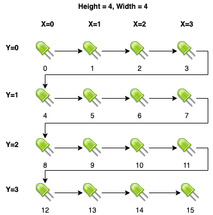
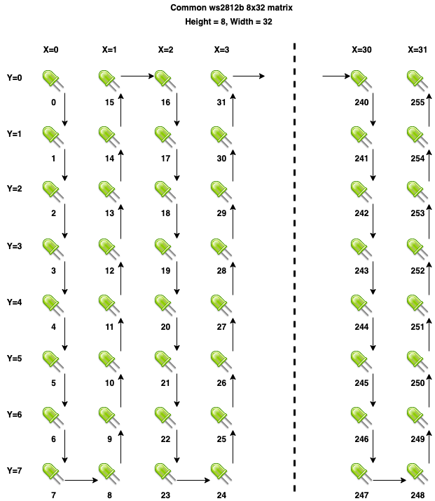

Addressable Light
=================

.. seo::
    :description: Instructions for setting up displays using addressable lights and LED matrix
    :image: addressable_light.jpg

The ``addressable_light`` display platform allows to display text and graphics on an addressable
light that has been arranged in a display matrix.

The display requires that an :apiclass:`AddressableLight <light::AddressableLight>` component, such as
:doc:`/components/light/fastled` or :doc:`/components/light/neopixelbus`, be defined.

.. figure:: images/addressable_light.jpg
    :align: center
    :width: 75.0%

    WS2812B Addressable Light Display

.. code-block:: yaml

    display:
      - platform: addressable_light
        id: led_matrix_display
        addressable_light_id: led_matrix_light
        width: 8
        height: 8
        rotation: 180°
        update_interval: 16ms
        lambda: |-
              // Draw a bulls-eye pattern
              Color red = Color(0xFF0000);
              Color green = Color(0x00FF00);
              Color blue = Color(0x0000FF);
              it.rectangle(0, 0, 8, 8, red);
              it.rectangle(1, 1, 6, 6, green);
              it.rectangle(2, 2, 4, 4, blue);
              it.rectangle(3, 3, 2, 2, red);

Configuration variables:
------------------------

- **addressable_light_id** (**Required**, :ref:`config-id`): The id of the addressable light component to use
  as a display.
- **width** (**Required**, int): The width of the LED matrix in pixels.
- **height** (**Required**, int): The height of the LED matrix in pixels.
- **rotation** (*Optional*): Set the rotation of the display. Everything you draw in ``lambda:`` will be rotated
  by this option. One of ``0°`` (default), ``90°``, ``180°``, ``270°``.
- **update_interval** (*Optional*, :ref:`config-time`): The interval to call the lambda to update the display.
  Defaults to ``16ms``.
- **pixel_mapper** (*Optional*, :ref:`lambda <config-lambda>`): A lambda that returns the integer address of the LED
  given the supplied the ``x`` and ``y`` pixel coordinate. By default, a left-to-right direct pixel mapper is used.
- **lambda** (*Optional*, :ref:`lambda <config-lambda>`): The lambda to use for rendering the content on the display.
  ``it`` will be an instance of :apiclass:`DisplayBuffer <display::DisplayBuffer>`.
  See :ref:`display-engine` for more information.
- **id** (*Optional*, :ref:`config-id`): Manually specify the ID used for code generation.

.. note::

    When enabled (the default, but also via ``it.set_enabled(true)``), any effect currently running on the
    addressable light will be disabled. When disabled (``it.set_enabled(false)``), the last configured effect will
    be restored.

    While the display is enabled, it is still possible to control the parent addressable light component in some
    limited capacity. Changing the brightness will still work, but changing the color will have no affect. It is not
    adivsable to enable any effects (ex: rainbow, color wipe, etc) while the display is enabled, as this will cause a
    great deal of flickering while the effect competes with the display for rendering.

pixel_mapper
------------

An addressable LED matrix is just an addressable LED strip laid out in a matrix -- the path often snaking
down-up-down, left-right-left, or whichever way the manufacturer has chosen. Like an addressable LED strip,
each pixel on a matrix is addressed as an offset from the first pixel (0). The job of the pixel mapper is
to translate a logical x-y pixel coordinate to the address of the expected physical LED.

Determining the correct algorithm for the pixel mapper for your matrix will hopefully only require some graph paper and a little bit of math.

Default
*******

The default pixel mapper assumes that the led matrix is addressed starting with the top left LED, moving to the right, and
then starting with the left-most row of the next row.

    Default pixel_mapper as used with a 4x4 led matrix

BTF-Lighting 8x32 WS2812B Flexible LED Matrix
*********************************************

The following image illustrates the path the addressable strip takes through the common the BTF-Lighting 8x32 matrix.

    LED layout for BTF-Lighting 8x32 WS2812B Flexible LED Matrix

Below is a definition that includes a pixel_mapper suitable for these 8x32 matrices.

.. code-block:: yaml

    display:
      - platform: addressable_light
        id: led_matrix_32x8_display
        addressable_light_id: led_matrix_32x8
        width: 32
        height: 8
        pixel_mapper: |-
          if (x % 2 == 0) {
            return (x * 8) + y;
          }
          return (x * 8) + (7 - y);
        rotation: 0°
        update_interval: 16ms

It's possible to use two 8x32 LED matrices in a 16x32 configuration (one above the other) by using the following definition:

.. code-block:: yaml

    display:
      - platform: addressable_light
        id: led_matrix_32x16_display
        addressable_light_id: led_matrix_32x16
        width: 32
        height: 16
        pixel_mapper: |-
          int iMatrixOffset = y >= 8 ? 256 : 0;
          if (x % 2 == 0) {
            return (x * 8) + (y % 8) + iMatrixOffset;
          }
          return (x * 8) + iMatrixOffset + (7 - (y % 8));
        rotation: 0°
        update_interval: 16ms

See Also
--------

- :apiref:`addressable_light/addressable_light_display.h`
- :doc:`/components/light/index`
- :doc:`/components/light/fastled`
- :doc:`/components/light/neopixelbus`
- :doc:`/components/light/partition`
- :ghedit:`Edit`
