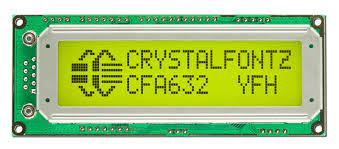

CFA-632 16x2 SPI Character LCD
==============================

.. seo::
    :description: Instructions for setting up CFA-632 16x2 SPI Character LCD display drivers.
    :image: cfa632.jpg

.. _cfa632:

Usage
-----

The ``cfa632`` display platform allows you to use
CFA-632 (`datasheet <https://www.crystalfontz.com/products/document/3392/CFA632_Series_Data_Sheet_Release_Date_2015-03-30.pdf>`__, `product page <https://www.crystalfontz.com/product/cfa632yfhkp-character-lcd-spi-16x2>`__)
displays with ESPHome.

    CFA-632 display

.. code-block:: yaml

    # Example minimal configuration entry
    display:
      - id: lcd_display
        platform: cfa632
        cs_pin: D5
        brightness: 0.5
        contrast: 0.5
        scroll_enabled: false
        wrap_enabled: false
        cursor_type: hidden
        lambda: |-
          it.set_cursor_position(0, 0);
          it.print("Hello World!")
          it.set_cursor_position(0, 13);
          it.printf("W:%c", id(wifi_client)->is_connected() ? 'C' : 'D');
          it.set_cursor_position(1, 13);
          it.printf("M:%c", id(mqtt_client)->is_connected() ? 'C' : 'D');

Configuration variables:
************************

- **cs_pin** (**Required**, :ref:`Pin Schema <config-pin_schema>`): The SPI chip select pin to use
- **update_interval** (*Optional*, :ref:`config-time`): The interval to call the lambda method to update the screen. Defaults to ``5s``.
- **id** (*Optional*, :ref:`config-id`): Manually specify the ID used for code generation.
- **brightness** (*Optional*, percentage): Set display brightness in %. Defaults to ``100%``
- **contrast** (*Optional*, percentage): Set display contrast in %. Defaults to ``100%``
- **scroll_enabled** (*Optional*, boolean): Turns scroll feature on or off
- **wrap_enabled** (*Optional*, boolean): Turns wrap feature on/off
- **cursor_type** (*Optional*, enum): Set cursor type
  - HIDDEN: Cursor is not shown
  - UNDERLINE: Sets cursor to nonblinking underscore
  - BLOCK: Sets cursor to blinking block underscore

Configuration examples
**********************

Use lambda to display realtime information:

.. code-block:: yaml

    # Example minimal configuration entry
    display:
      - id: lcd_display
        platform: cfa632
        cs_pin: D5
        brightness: 0.5
        contrast: 0.5
        scroll_enabled: false
        wrap_enabled: false
        cursor_type: hidden
        lambda: |-
          it.set_cursor_position(0, 0);
          it.print("Hello World!")
          it.set_cursor_position(0, 13);
          it.printf("W:%c", id(wifi_client)->is_connected() ? 'C' : 'D');
          it.set_cursor_position(1, 13);
          it.printf("M:%c", id(mqtt_client)->is_connected() ? 'C' : 'D');

Display sensor value on sensor value changed

.. code-block:: yaml

    # Example minimal configuration entry
    display:
      - id: lcd_display
        platform: cfa632
        cs_pin: D5
        brightness: 0.5
        contrast: 0.5
        scroll_enabled: false
        wrap_enabled: false
        cursor_type: hidden
    sensor:
      - id: temp1
        platform: ...
        on_value:
          then:
            - lambda: |-
                id(lcd_display).set_cursor_position(0, 0);
                id(lcd_display).printf("Temperature: %.2f", id(temp1).state);

See Also
--------

- :doc:`index`
- :apiref:`cfa632/cfa632.h`
- :ghedit:`Edit`
