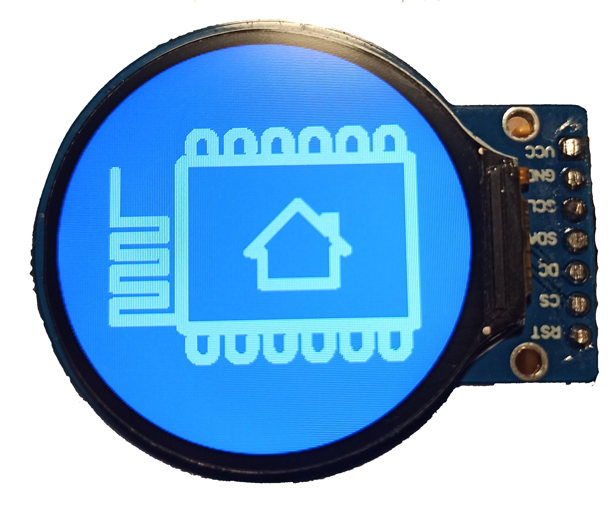

GC9A01 Round TFT LCD
==========================

.. seo::
    :description: Instructions for setting up GC9A01 LCD display drivers.
    :image: gc9a01.jpg

.. _gc9a01:

Usage
-----

The ``gc9a01`` display platform allows you to use
GC9A01 (`datasheet <https://www.makerfabs.com/desfile/files/ER-TFTM1.28-1_Datasheet.pdf>`__)
displays with ESPHome. As this is a somewhat higher resolution display, it is better suited 
for use with the ESP32.

    GC9A01 Round TFT LCD

.. code-block:: yaml

    # Example configuration entry
    spi:
      mosi_pin: GPIO32
      clk_pin: GPIO27

    display:
    - platform: gc9a01
      reset_pin: GPIO26
      cs_pin: GPIO25
      dc_pin: GPIO33
      rotation: 180
      lambda: |-
        it.print(0, 120, id(font), "Hello World!");

Configuration variables:
************************

- **cs_pin** (**Required**, :ref:`Pin Schema <config-pin_schema>`): The CS pin.
- **dc_pin** (**Required**, :ref:`Pin Schema <config-pin_schema>`): The DC pin.
- **width** (*Optional*, int): The width of a screen. Defaults to 240.
- **height** (*Optional*, int): The height of a screen. Defaults to 240.
- **offset_x** (*Optional*, int): The offset in the x direction. Everything you draw in ``lambda:`` will be shifted
  by this in the x direction. Defaults to 0.
- **offset_y** (*Optional*, int): The offset in the y direction. See ``offset_x``. Defaults to 0.
- **rotation** (*Optional*): Set the rotation of the display. Everything you draw in ``lambda:`` will be rotated
  by this option. One of ``0°`` (default), ``90°``, ``180°``, ``270°``.
- **lambda** (*Optional*, :ref:`lambda <config-lambda>`): The lambda to use for rendering the content on the display.
  See :ref:`display-engine` for more information.
- **update_interval** (*Optional*, :ref:`config-time`): The interval to re-draw the screen. Defaults to ``5s``.
- **pages** (*Optional*, list): Show pages instead of a single lambda. See :ref:`display-pages`.
- **id** (*Optional*, :ref:`config-id`): Manually specify the ID used for code generation.

See Also
--------

- :doc:`index`
- :apiref:`gc9a01/gc9a01.h`
- `Arduino GC9A01 Library <https://github.com/PaintYourDragon/Adafruit_GC9A01A>`__ by `@PaintYourDragon <https://github.com/PaintYourDragon>`__
- :ghedit:`Edit`
