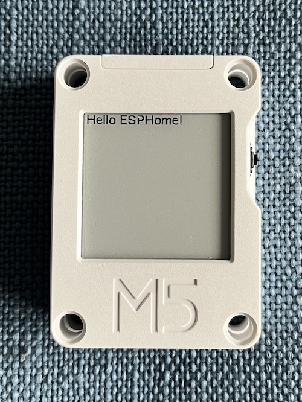

GDEW0154M09 (M5Stack Core Ink) E-Paper Display
=========================

.. seo::
    :description: Instructions for setting up gdew0154m09 / M5Stack Core Ink displays in ESPHome.
    :image: m5stack_coreink.jpg

The ``gdew0154m09`` display platform allows you to use the `M5Stack Core Ink devices <https://shop.m5stack.com/products/m5stack-esp32-core-ink-development-kit1-54-elnk-display?variant=37404426174636>`__ displays
with ESPHome. The 1.54" GDEW0154M09 `Good Display module <https://m5stack.oss-cn-shenzhen.aliyuncs.com/resource/docs/datasheet/core/CoreInk-K048-GDEW0154M09%20V2.0%20Specification.pdf>`__ is the actual display inside of this product.

    M5Stack Core Ink device running ESPHome.

This display can also be present in other devices or as an OEM component. All config provided here is the way the M5Stack Core Ink is wired up; it can easily be configured for other deployments.

The communication based on the wiring of the device is 3-wire (one-way) :ref:`SPI <spi>`. So you need to make sure your board is set to the 3-wire SPI mode and have an ``spi:`` section in your
configuration.

==================== ===================== =====================
**E-Paper Pin**      **ESP Pin**           **ESPHome Option**
-------------------- --------------------- ---------------------
``VCC``              ``3.3V``              N/A
-------------------- --------------------- ---------------------
``GND``              ``GND``               N/A
-------------------- --------------------- ---------------------
``CLK``              ``GPIO18``            ``spi.clk_pin``
-------------------- --------------------- ---------------------
``DIN``              ``GPIO23``            ``spi.mosi_pin``
-------------------- --------------------- ---------------------
``CS``               ``GPIO9``             ``cs_pin``
-------------------- --------------------- ---------------------
``DC``               ``GPIO15``            ``dc_pin``
-------------------- --------------------- ---------------------
``BUSY``             ``GPIO4``             ``busy_pin``
-------------------- --------------------- ---------------------
``RESET``            ``GPIO0``             ``reset_pin``
==================== ===================== =====================

.. code-block:: yaml

    # Example configuration entry
    font:
      - file: 'fonts/Comic Sans MS.ttf'
        id: font1
        size: 8

    spi:
      clk_pin: GPIO18
      mosi_pin: GPIO23

    display:
      - platform: gdew0154m09
        reset_pin: GPIO0
        cs_pin: GPIO9
        dc_pin: GPIO15
        busy_pin: GPIO4
        rotation: 0
        update_interval: 60s
        lambda: |-
          it.print(0, 0, id(font1), "Hello World!");

Configuration variables:
------------------------

- **cs_pin** (**Required**, :ref:`Pin Schema <config-pin_schema>`): The CS pin.
- **dc_pin** (**Required**, :ref:`Pin Schema <config-pin_schema>`): The DC pin.
- **busy_pin** (*Optional*, :ref:`Pin Schema <config-pin_schema>`): The BUSY pin. Defaults to not connected.
- **reset_pin** (*Optional*, :ref:`Pin Schema <config-pin_schema>`): The RESET pin. Defaults to not connected.
- **rotation** (*Optional*): Set the rotation of the display. Everything you draw in ``lambda:`` will be rotated
  by this option. One of ``0°`` (default), ``90°``, ``180°``, ``270°``.
- **lambda** (*Optional*, :ref:`lambda <config-lambda>`): The lambda to use for rendering the content on the display.
  See :ref:`display-engine` for more information.
- **update_interval** (*Optional*, :ref:`config-time`): The interval to re-draw the screen. Defaults to ``1s``, use ``never`` to only manually update the screen via ``component.update``.
- **pages** (*Optional*, list): Show pages instead of a single lambda. See :ref:`display-pages`.
- **spi_id** (*Optional*, :ref:`config-id`): Manually specify the ID of the :ref:`SPI Component <spi>` if you want
  to use multiple SPI buses.
- **id** (*Optional*, :ref:`config-id`): Manually specify the ID used for code generation.

See Also
--------

- :doc:`index`
- :apiref:`gdew0154m09/gdew0154m09.h`
- `M5 Core Ink EPD library <https://github.com/m5stack/M5Core-Ink>`__ by M5Stack
- :ghedit:`Edit`
