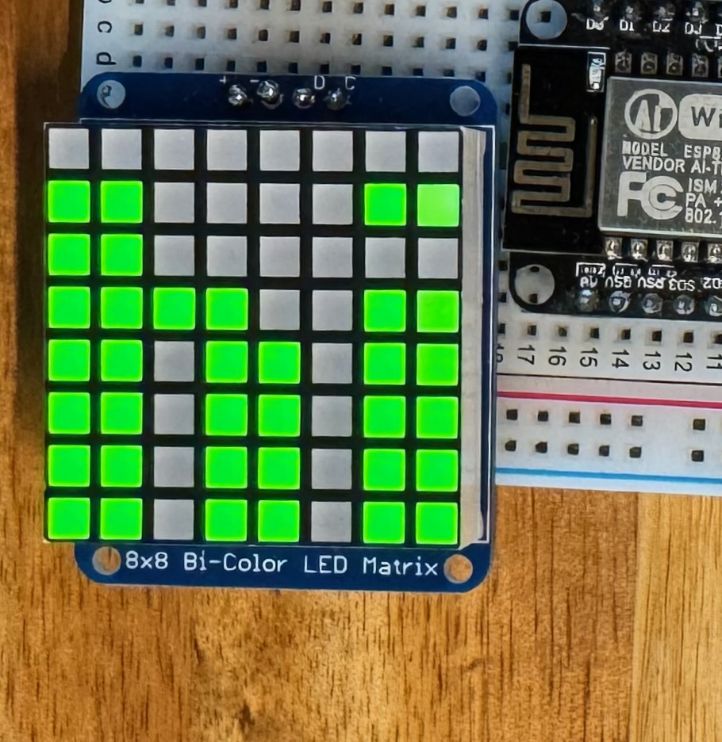

HT16K33 LED matrix Display
==========================

.. seo::
    :description: Instructions for setting up HT16K33 LED matrix displays.
    :image: ht16k33.jpg

The ``ht16k33`` display platform allows you to use ht16k33 driven LED matrices with ESPHome. Please note that this integration
is *only* for the  "matrix" display.

The initial implementation of the HT16K33 display is based on the bicolor matrix display. If you have a monocolor display,
it might work by using only the ``ht16k33::CL`` color (see :ref:`display-ht16k33_colors` for more information). However, this is not tested.
It might be able to light up the 16x8 matrices, and even display contents with some manipulation, but it's not considered as a supported device.

    HT16K33 LED matrix Display.

As the communication with the HT16K33 LED matrix is done using I²C for this integration, you need
to have an :ref:`I²C bus <i2c>` in your configuration with **frequency** less than 400kHz.
Connect VDD to 3.3V (the manufacturer recommends 4.5~5.5 V, but 3.3V seems to work fine), SDA to your set ``sda`` and
SCL to your set ``scl`` and finally GND to GND. If you don't specify the I²C pins, the default of your board will be used.

.. code-block:: yaml

    # Example configuration entry
    i2c:
      - id: i2c_ht16k33
        frequency: 400kHz

    display:
      - platform: ht16k33
        id: ht16k33_display
        i2c_id: i2c_ht16k33
        reset_pin: D0
        intensity: 15
        update_interval: 15s
        num_chips: 4
        intensity: 15
        lambda: |-
          it.print(0, 0, id(_font), "HELLO!");

Configuration variables:
------------------------

- **reset_pin** (*Optional*, :ref:`Pin Schema <config-pin_schema>`): The RESET pin. Defaults to not connected.
- **num_chips** (*Optional*, int): The number of chips you wish to use for daisy chaining. Defaults to
  ``1``, max is ``8``.
- **num_chip_lines** (*Optional*, int): Number of lines if you want to use the displays in Multiline Mode. Defaults to ``1``, max is ``8``. Example: https://github.com/esphome/esphome/pull/1622#issue-836179156
- **chip_lines_style** (*Optional*): How are the lines in Multiline Mode connected? Possible values are ``ZIGZAG`` and ``snaSNAKEke``. Defaults to ``SNAKE``
- **intensity** (*Optional*, int): The intensity with which the HT16K33 should drive the outputs. Range is
  from ``0``, least intense to ``15`` the brightest. Defaults to ``15``.
- **rotate_chip** (*Optional*): Rotates every 8x8 chip. Valid values are ``0``, ``90``, ``180`` and ``270``. Defaults to ``0``. Defaults to ``0``.
- **scroll_enable** (*Optional*, boolean): Turn scroll mode on when content does not fit. Defaults to ``true``.
- **scroll_mode** (*Optional*): Set the scroll mode. One of ``CONTINUOUS`` or ``STOP``. Defaults to ``CONTINUOUS``

    - ``CONTINUOUS``: Always scrolls and the text repeats continuously, you might need to add some
      separation at the end.
    - ``STOP``: When text is over it waits the ``scroll_dwell`` time and scroll is set back to the start.

- **scroll_speed** (*Optional*, :ref:`config-time`): Set scroll speed. Defaults to ``250ms``
- **scroll_delay** (*Optional*, :ref:`config-time`): Set delay time before scroll starts. Defaults to ``1s``.
- **scroll_dwell** (*Optional*, :ref:`config-time`): Sets the wait time at the end of the scroll before starting
  over. This is only used in mode ``STOP``. Defaults to ``1s``.
- **reverse_enable** (*Optional*, boolean): For some displays the order of the displays is reversed ("DCBA"). This option will reverse the display to ("ABCD") again. Defaults to  ``false``.
- **lambda** (*Optional*, :ref:`lambda <config-lambda>`): The lambda to use for rendering the content on the
  HT16K33. See :ref:`display-ht16k33_lambda` for more information.
- **update_interval** (*Optional*, :ref:`config-time`): The interval to re-draw the screen. Defaults to ``1s``.
- **i2c_id** (*Optional*, :ref:`config-id`): Manually specify the ID of the :ref:`I²C Component <i2c>` if you want
  to use multiple I²C buses.
- **flip_x** (*Optional*, boolean): Flip the horizontal axis on the physical screen. In other words, this only applys when the *rotate_chip* is set to ``0`` or ``180``.
  Defaults to ``false``.
- **blink_rate** (*Optional*): Set the blink frequency. Valid values are ``OFF``, ``2HZ``, ``1HZ`` and ``0.5HZ``. Defaults to ``OFF``.
- **address** (*Optional*, int): Manually specify the :ref:`I²C <i2c>` address of the display. Defaults to 0x70. **Note** that this address is used as the first chip address, the next chips will be 0x71, 0x72, 0x73, etc.
  The maximum address is 0x77.
- **id** (*Optional*, :ref:`config-id`): Manually specify the ID used for code generation.

.. _display-ht16k33_lambda:

Rendering Lambda
----------------

The HT16K33  is based on the fully fledged :ref:`display-engine`, as it has a concept of individual pixels 8 X 8
per ht16k33 chip. In the lambda you're passed a variable called ``it`` as with all other displays. Some "Special"
commands have been added to the basic display set.

.. code-block:: yaml

    display:
      - platform: ht16k33
        num_chips: 4
        lambda: |-
          it.strftime(0, 0, id(_font), "%H:%M", id(hass_time).now());
          it.image(24, 0, id(my_image));
          it.line(1, 7, 21, 7);
    font:
      - file: "pixelmix.ttf"
        id: _font
        size: 6

    time:
      - platform: homeassistant
        id: hass_time

    image:
      - file: "smile.png"
        id: my_image

This is roughly the code used to display the HT16K33 pictured in the image.

.. _display-ht16k33_colors:

Colors
******

The supported display has 2 basic colors. As a result, there are 4 possible combinations of colors:

- ``ht16k33::CL`` Color for turning on only the LEDs corresponding to the lower 8 bits. i.e. green
- ``ht16k33::CH`` Color for turning on only the LEDs corresponding to the higher 8 bits. i.e. red
- ``ht16k33::CLH`` Color for turning on the LEDs corresponding to the lower and the higher 8 bits. i.e. yellow
- ``Color::BLACK`` No color, both LED colors are off. This is also the background color.

.. code-block:: cpp

    it.filled_rectangle(0, 0, 3, 3, ht16k33::CL);
    it.filled_rectangle(2, 2, 4, 4, ht16k33::CH);
    it.filled_rectangle(5, 5, 3, 3, ht16k33::CLH);

Scrolling
*********

By default the HT16K33 display has scroll enabled. The parameters can be set in the YAML file.
They can also be changed in the Lambda by adding the following command:

.. code-block:: cpp

    it.scroll(<on/off>, <mode>, <speed>, <delay>, <dwell>);

- **on/off** -> switch scrolling on or off, use true or false
- **mode** -> ht16k33::CONTINUOUS for continuous scrolling, ht16k33::STOP = Stop at end and reset
- **speed** -> Set speed of scrolling (ms for every step of one dot)
- **delay** -> pause time at start of scrolling
- **dwell** -> pause at end of scrolling (only in mode 1)

.. code-block:: yaml

    display:
      - platform: ht16k33
        # ...
        lambda: |-
          # ...
          it.scroll(true, ht16k33::CONTINUOUS, 100, 5000, 1500);
          // OR
          it.scroll(true, ht16k33::CONTINUOUS);
          // OR
          it.scroll(true);

- The screen does not scroll if the text fits within the screen.
- ``print("...")`` and ``printf("...")`` the alternative way of displaying text does not scroll

Screen intensity
****************

The intensity of the screen can be set "dynamically" within the lambda code with the following command: it.intensity(``0`` .. ``15``).

.. code-block:: yaml

    display:
      - platform: ht16k33
        # ...
        lambda: |-
          it.intensity(10);

Screen ON/OFF
*************

The display can be switched on and off "dynamically" within the lambda code with the following command: it.turn_on() or it.turn_off().

.. code-block:: yaml

    display:
      - platform: ht16k33
        # ...
        lambda: |-
          it.turn_on();
          // OR
          it.turn_off();

Please see :ref:`display-printf` for a quick introduction into the ``printf`` formatting rules and
:ref:`display-strftime` for an introduction into the ``strftime`` time formatting.

See Also
--------

- :doc:`index`
- :apiref:`ht16k33/ht16k33.h`
- :doc:`max7219digit`
- `Adafruit_LED_Backpack <https://github.com/adafruit/Adafruit_LED_Backpack>`__ by `Adafruit <https://www.adafruit.com/>`__
- :ghedit:`Edit`
