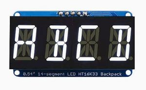

HT16K33 14-Segment Alphanumeric Display
=======================================

.. seo::
    :description: Instructions for setting up HT16K33 14-segment displays.
    :image: htk16k33_alpha.jpg

The ``ht16k33_alpha`` display platform allows you to use HT16K33 14-segment display drivers (`datasheet <https://cdn-shop.adafruit.com/datasheets/ht16K33v110.pdf>`__)
with ESPHome. The 14-segment backpack makes it really easy to add a 4-characters numeric display with decimal 
points. Please note that this integration is *only* for 14-segment display.

    HT16K33 14-Segment Backpack display

As the communication with the HT16K33 is done using I²C for this integration, you need to have an 
:ref:`I²C Bus <i2c>` in your configuration. You can make a larger display by connecting multiple display
modules to the same bus, as long as each module has a different I²C address set.

.. code-block:: yaml

    # Example configuration entry
    display:
      - platform: ht16k33_alpha
        address: 0x70
        scroll: true
        scroll_speed: 250ms
        scroll_dwell: 2s
        scroll_delay: 3
        secondary_displays:
          - address: 0x71
          - i2c_id: i2c_b
        lambda: |-
          it.print("ABCD");

Configuration variables:
------------------------

- **address** (**Required**, int): The I²C address of the display module. Defaults to ``0x70`` on the module.
- **i2c_id** (*Optional*, int): The ``id`` of the I²C bus to which the module is connected.
- **scroll** (*Optional*, boolean): Wether to scroll the text or not. Defaults to ``false``.
- **scroll_speed** (*Optional*, int): The time interval between character movements, defaults to  ``250ms``.
- **scroll_dwell** (*Optional*, int): The time to wait at the end of the scroll before starting a new, defaults to ``2s``.   
- **scroll_delay** (*Optional*, float): The number of ``scroll_speed`` cycles to wait at the beginning before starting to scroll, default ``3`` (has to be minimum ``1``).
- **secondary_display** (*Optional*, list): A list of i2c devices which to extend the display across, where:

  - **address** (**Required**, int): The I²C address of the additional display module. 
  - **i2c_id** (*Optional*, int): The ``id`` of a different I²C bus if the module is connected that way.

- **lambda** (*Optional*, :ref:`lambda <config-lambda>`): The lambda to use for rendering the content.
- **id** (*Optional*, :ref:`config-id`): Manually specify the ID used for code generation.

Rendering Lambda
----------------

The ``ht16k33_alpha`` has a similar API to the fully fledged :ref:`display-engine`, but it's only a subset as the HT16K33
14-segment displays don't have a concept of individual pixels. In the lambda you're passed a variable called ``it``
as with all other displays. In this case however, ``it`` is an HT16K33 instance (see API Reference).

Each of the three methods (``print``, ``printf`` and ``strftime``) are supported but no positional arguments are supported.
All the same parameters for the I²C display can be used other than the dimensions.

Also note that the ``.`` (dot) character is special because when ESPHome encounters it in the string the dot
segment of the previous position will be used.

Brightness Control
-----------------

With the ``ht16k33_alpha`` the brightness can be controlled by functions ``get_brightness()`` and off by ``set_brightness()`` 
in the using lambdas. For example a ``number`` component could be used to get and set the brightness value:

.. code-block:: yaml

    display:
      - platform: ht16k33_alpha
        id: mydisplay
        # ...

    number:
      - platform: template
        name: "Display brightness"
        min_value: 0
        max_value: 100
        step: 1
        lambda: 'return id(mydisplay).get_brightness();'
        set_action:
          - lambda: |-
              id(mydisplay).set_brightness(x);

See Also
--------

- :doc:`index`
- :ref:`display-printf`
- :ref:`display-strftime`
- :ref:`Lambdas <config-lambda>`
- :ghedit:`Edit`
