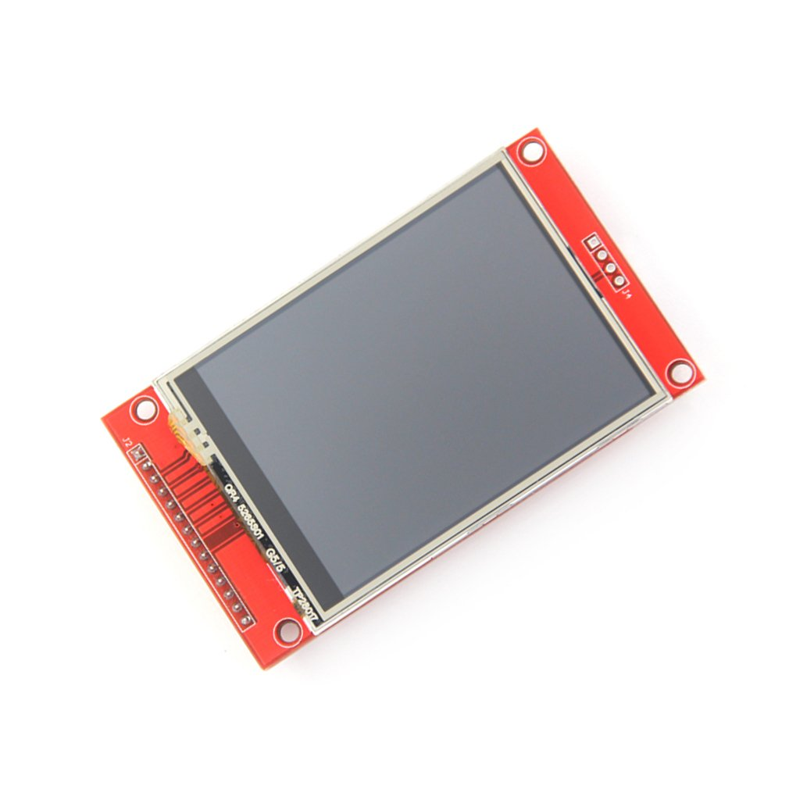

ILI9341 TFT LCD
===============

.. seo::
    :description: Instructions for setting up ILI9341 TFT LCD display drivers.
    :image: ili9341.jpg

.. _ili9341:

Usage
-----

The ``ili9341`` display platform allows you to use
ILI9341 (`datasheet <https://cdn-shop.adafruit.com/datasheets/ILI9341.pdf>`__,
`Aliexpress <https://www.aliexpress.com/af/Ili9341.html>`__)
displays with ESPHome. As this is a somewhat higher resolution display and may require pins
beyond the typical SPI connections, it is better suited for use with the ESP32.

    ILI9341 display

.. code-block:: yaml

    # Example minimal configuration entry
    display:
      - platform: ili9341
        model: TFT 2.4
        cs_pin: 14
        dc_pin: 27
        led_pin: 32  ### see note below ###
        reset_pin: 33

        lambda: |-
          it.fill(COLOR_BLACK);
          it.print(0, 0, id(my_font), id(my_red), TextAlign::TOP_LEFT, "Hello World!");

Configuration variables:
************************

- **model** (**Required**): The model of the display. Options are:

  - ``M5STACK``
  - ``TFT 2.4``

- **cs_pin** (*Optional*, :ref:`Pin Schema <config-pin_schema>`): The CS pin.
- **dc_pin** (**Required**, :ref:`Pin Schema <config-pin_schema>`): The DC pin.
- **reset_pin** (*Optional*, :ref:`Pin Schema <config-pin_schema>`): The RESET pin.
- **led_pin** (*Optional*, :ref:`Pin Schema <config-pin_schema>`): The display's backlight pin. **Note:** Connect to a
  PWM-capable pin to switch/dim the display's backlight **or** save a pin by connecting it through a 3.3K resistor to the +3V supply.
- **rotation** (*Optional*): Set the rotation of the display. Everything drawn in the ``lambda:`` will be rotated
  per this option. One of ``0°`` (default), ``90°``, ``180°``, or ``270°``.
- **lambda** (*Optional*, :ref:`lambda <config-lambda>`): The lambda to use for rendering the content on the display.
  See :ref:`display-engine` for more information.
- **update_interval** (*Optional*, :ref:`config-time`): The interval to re-draw the screen. Defaults to ``5s``.
- **auto_clear_enabled** (*Optional*, boolean): Whether to automatically clear the display in each loop (''true'', default),
  or to keep the existing display content (must overwrite explicitly, e.g., only on data change).
- **pages** (*Optional*, list): Show pages instead of a single lambda. See :ref:`display-pages`.
- **id** (*Optional*, :ref:`config-id`): Manually specify the ID used for code generation.

Configuration examples
**********************

To utilize the color capabilities of this display module, you'll likely want to add a ``color:`` section to your
YAML configuration; please see :ref:`color <config-color>` for more detail on this configuration section.

To use colors in your lambda:

.. code-block:: yaml

    color:
      - id: my_red
        red: 100%
        green: 3%
        blue: 5%

    ...

    display:
        ...
        lambda: |-
          it.rectangle(0,  0, it.get_width(), it.get_height(), id(my_red));

To bring in color images:

.. code-block:: yaml

    image:
      - file: "image.jpg"
        id: my_image
        resize: 200x200
        type: RGB24

    ...

    display:
        ...
        lambda: |-
          it.image(0, 0, id(my_image));

To configure a dimmable backlight:

.. code-block:: yaml

    # Define a PWM output on the ESP32
    output:
      - platform: ledc
        pin: 32
        id: gpio_32_backlight_pwm

    # Define a monochromatic, dimmable light for the backlight
    light:
      - platform: monochromatic
        output: gpio_32_backlight_pwm
        name: "ILI9341 Display Backlight"
        id: back_light
        restore_mode: ALWAYS_ON

See Also
--------

- :doc:`index`
- :ghsources:`esphome/components/ili9341`
- :ghedit:`Edit`
