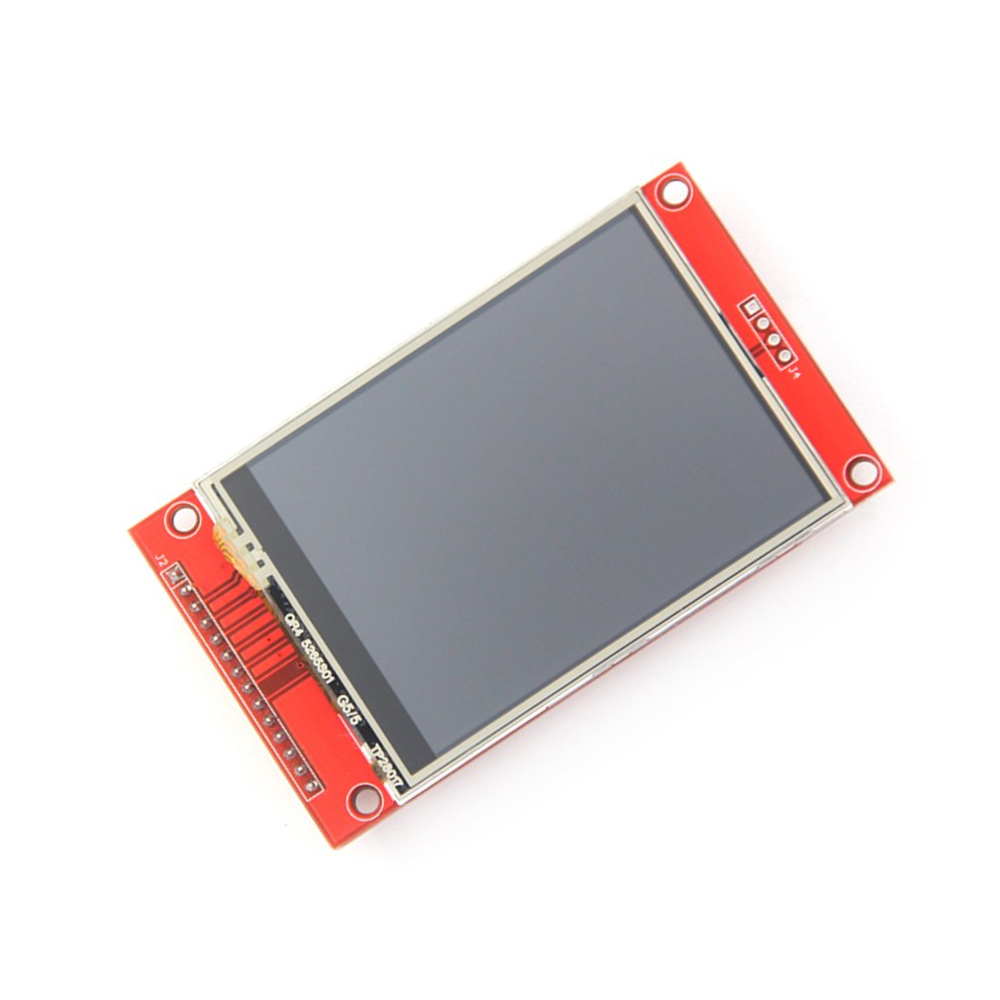

ILI9xxx TFT LCD Series
======================

.. seo::
    :description: Instructions for setting up ILI9xxx like TFT LCD display drivers.
    :image: ili9341.jpg

.. _ili9xxx:

Models
------
With this display driver you can control the following displays:
  - GC9A01A
  - ILI9341
  - ILI9342
  - ILI9481
  - ILI9481-18 (ILI9481 in 18 bit, i.e. 262K color, mode)
  - ILI9486
  - ILI9488
  - ILI9488_A (alternative gamma configuration for ILI9488)
  - M5STACK
  - S3BOX
  - S3BOX_LITE
  - ST7796
  - ST7789V
  - TFT 2.4
  - TFT 2.4R
  - WAVESHARE_RES_3_5 (Waveshare Pico-ResTouch-LCD-3.5)

More display drivers will come in the future.

Usage
-----
This component is the successor of the ILI9341 component supporting more display driver chips from the ILI and related
families.

The ``ILI9xxx`` display platform allows you to use
ILI9341 (`datasheet <https://cdn-shop.adafruit.com/datasheets/ILI9341.pdf>`__,
`Aliexpress <https://www.aliexpress.com/af/Ili9341.html>`__) and other
displays from the same chip family with ESPHome. As this is a somewhat higher resolution display and requires additional pins
beyond the basic SPI connections, and a reasonable amount of RAM, it is not well suited for the ESP8266.

**Note:** use of 16 bit colors requires double the amount of RAM as 8 bit, and may need PSRAM to be available.

    ILI9341 display

.. code-block:: yaml

    # Example minimal configuration entry
    display:
      - platform: ili9xxx
        model: ili9341
        dc_pin: GPIOXX
        reset_pin: GPIOXX
        lambda: |-
          it.fill(COLOR_BLACK);
          it.print(0, 0, id(my_font), id(my_red), TextAlign::TOP_LEFT, "Hello World!");

Configuration variables:
************************

- **model** (**Required**): The model of the display. Options are:

  - ``M5STACK``, ``TFT 2.4``, ``TFT 2.4R``, ``S3BOX``, ``S3BOX_LITE``, ``WSPICOLCD``
  - ``ILI9341``, ``ILI9342``, ``ILI9486``, ``ILI9488``, ``ILI9488_A`` (alternative gamma configuration for ILI9488)
  - ``ILI9481``, ``ILI9481-18`` (18 bit mode)
  - ``ST7789V``, ``ST7796``
  - ``GC9A01A``

- **dc_pin** (**Required**, :ref:`Pin Schema <config-pin_schema>`): The DC pin.
- **reset_pin** (*Optional*, :ref:`Pin Schema <config-pin_schema>`): The RESET pin.
- **lambda** (*Optional*, :ref:`lambda <config-lambda>`): The lambda to use for rendering the content on the display.
  See :ref:`display-engine` for more information.
- **update_interval** (*Optional*, :ref:`config-time`): The interval to re-draw the screen. Defaults to ``5s``.
- **auto_clear_enabled** (*Optional*, boolean): Whether to automatically clear the display in each loop (''true'', default),
  or to keep the existing display content (must overwrite explicitly, e.g., only on data change).
- **pages** (*Optional*, list): Show pages instead of a single lambda. See :ref:`display-pages`.
- **id** (*Optional*, :ref:`config-id`): Manually specify the ID used for code generation.
- **color_palette** (*Optional*): The type of color pallet that will be used in the ESP's internal 8-bits-per-pixel buffer.  This can be used to improve color depth quality of the image.  For example if you know that the display will only be showing grayscale images, the clarity of the display can be improved by targeting the available colors to monochrome only.  Options are:

  - ``NONE`` (default)
  - ``GRAYSCALE``
  - ``IMAGE_ADAPTIVE``

- **color_order** (*Optional*): Should be one of ``bgr`` (default) or ``rgb``.
- **color_palette_images** (*Optional*): A list of image files that will be used to generate the color pallet for the display.  This should only be used in conjunction with ``-color_palette: IMAGE_ADAPTIVE`` above.  The images will be analysed at compile time and a custom color pallet will be created based on the most commonly occuring colors.  A typical setting would be a sample image that represented the fully populated display.  This can significantly improve the quality of displayed images.  Note that these images are not stored on the ESP device, just the 256byte color pallet created from them.
- **dimensions** (*Optional*): Dimensions of the screen, specified either as *width* **x** *height* (e.g ``320x240``) or with separate config keys. If not provided the dimensions will be determined by the model selected.

    - **height** (**Required**, int): Specifies height of display in pixels.
    - **width** (**Required**, int): Specifies width of display.
    - **offset_width** (*Optional*, int): Specify an offset for the x-direction of the display, typically used when an LCD is smaller than the maximum supported by the driver chip. Default is 0
    - **offset_height** (*Optional*, int): Specify an offset for the y-direction of the display. Default is 0.

- **invert_colors** (*Optional*): With this boolean option you can invert the display colors. **Note** some of the displays have this option set automatically to true and can't be changed.
- **18bit_mode** (*Optional*): With this boolean option you can manual enable or disable the 18 bit color mode.
- **rotation** (*Optional*): Rotate the display presentation in software. Choose one of ``0°``, ``90°``, ``180°``, or ``270°``. This option cannot be used with ``transform``.
- **transform** (*Optional*): Transform the display presentation using hardware. All defaults are ``false``. This option cannot be used with ``rotation``.

   - **swap_xy** (*Optional*, boolean): If true, exchange the x and y axes.
   - **mirror_x** (*Optional*, boolean): If true, mirror the x axis.
   - **mirror_y** (*Optional*, boolean): If true, mirror the y axis.

**Note:** The ``rotation`` variable will do a software based rotation. It is better to use the **transform** to rotate the display in hardware. Use one of the following combinations:
    - 90 degrees - use ``swap_xy`` with ``mirror_x``
    - 180 degrees - use ``mirror_x`` with ``mirror_y``
    - 270 degrees - use ``swap_xy`` with ``mirror_y``

With 90 and 270 rotations you will also need to swap the **dimensions** ''height'' and ''width'' (see example below.

To modify the SPI setting see :ref:`SPI bus <spi>` . The default **data_rate** is set to ``40MHz`` and the **spi_mode** mode is ``MODE0`` but some displays require ``MODE3`` (*).

**Note:** The maximum achievable data rate will depend on the chip type (e.g. ESP32 vs ESP32-S3) the pins used (on ESP32 using the default SPI pins allows higher rates) and the connection type (on-board connections will support higher rates than long cables or DuPont wires.) If in doubt, start with a low speed and test higher rates to find what works. A MISO pin should preferably not be specified, as this will limit the maximum rate in some circumstances, and is not required if the SPI bus is used only for the display.

Configuration examples
**********************

To use hardware rotation, use both ``dimensions`` and ``transform``, e.g. this config will turn a landscape display with
height 320 and width 480 into portrait. Note that the dimensions are those of the final display.

.. code-block:: yaml

    transform:
      swap_xy: true
      mirror_x: true
    dimensions:
      height: 480
      width: 320

To utilize the color capabilities of this display module, you'll likely want to add a ``color:`` section to your
YAML configuration; please see :ref:`color <config-color>` for more detail on this configuration section.

To use colors in your lambda:

.. code-block:: yaml

    color:
      - id: my_red
        red: 100%
        green: 3%
        blue: 5%

    ...

    display:
        ...
        lambda: |-
          it.rectangle(0,  0, it.get_width(), it.get_height(), id(my_red));

To bring in color images:

.. code-block:: yaml

    image:
      - file: "image.jpg"
        id: my_image
        resize: 200x200
        type: RGB24

    ...

    display:
        ...
        lambda: |-
          it.image(0, 0, id(my_image));

To configure a dimmable backlight:

.. code-block:: yaml

    # Define a PWM output on the ESP32
    output:
      - platform: ledc
        pin: GPIOXX
        id: backlight_pwm

    # Define a monochromatic, dimmable light for the backlight
    light:
      - platform: monochromatic
        output: backlight_pwm
        name: "Display Backlight"
        id: back_light
        restore_mode: ALWAYS_ON

To configure an image adaptive color pallet to show greater than 8 bit color depth with a RAM limited screen buffer:

.. code-block:: yaml

    image:
      - file: "sample_100x100.png"
        id: myimage
        resize: 100x100
        type: RGB24

    display:
      - platform: ili9xxx
        model: ili9341
        dc_pin: GPIOXX
        reset_pin: GPIOXX
        rotation: 90
        id: tft_ha
        color_palette: IMAGE_ADAPTIVE
        color_palette_images:
          - "sample_100x100.png"
          - "display_design.png"
        lambda: |-
          it.image(0, 0, id(myimage));

Using the ``transform`` options to hardware rotate the display on a Lilygo T-Embed. This has an st7789v but only uses 170 pixels of the 240 width.
This config rotates the display into landscape mode using the driver chip.

.. code-block:: yaml

    display:
      - platform: ili9xxx
        model: st7789v
        dimensions:
          height: 170
          width: 320
          offset_height: 35
          offset_width: 0
        transform:
          swap_xy: true
          mirror_x: false
          mirror_y: true
        color_order: bgr
        data_rate: 80MHz
        cs_pin: GPIOXX
        dc_pin: GPIO13
        reset_pin: GPIO9

For Lilygo TTGO Boards if you move from the st7789v to this you need the following settings to make it work.

.. code-block:: yaml

    display:
      - platform: ili9xxx
        model: st7789v
        #TTGO TDisplay 135x240
        dimensions:
          height: 240
          width: 135
          offset_height: 40
          offset_width: 52
        # Required or the colors are all inverted, and Black screen is White
        invert_colors: true

See Also
--------

- :doc:`index`
- :apiref:`ili9xxx/ili9xxx_display.h`
- :ghedit:`Edit`
