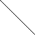
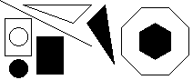
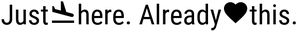
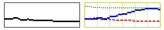
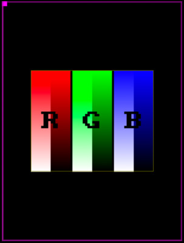

Display Component
=================

.. seo::
    :description: Instructions for setting up the display component.
    :image: folder-open.svg

The ``display`` component houses ESPHome's powerful rendering and display
engine. Fundamentally, there are these types of displays:

- Text based displays like :doc:`7-Segment displays <max7219>` or
  :doc:`LCD displays <lcd_display>`.
- Graphical serial displays like :doc:`nextion` that have their own processors for rendering.
- Graphical binary displays which can toggle ON/OFF any pixel, like :doc:`E-Paper <waveshare_epaper>`,
  :doc:`OLED <ssd1306>` or :doc:`TFT <ili9xxx>` displays.

For the last type, ESPHome has a powerful rendering engine that can do
many things like draw some basic shapes, print text with any font you want, or even show images.

To achieve all this flexibility displays tie in directly into ESPHome's :ref:`lambda system <config-lambda>`.
So when you want to write some text or sensor values to the screen you will be writing in C++ code
using an API that is designed to

- be simple and to be used without programming experience
- but also be flexible enough to work with more complex tasks like displaying an analog clock.

.. _display-engine:

Display Rendering Engine
------------------------

In this section we will be discussing how to use ESPHome's display rendering engine from ESPHome
and some basic commands. Please note that this only applies to displays that can control each pixel
individually.

.. note::

    Display hardware is complex and sometimes doesn't behave as expected. If you're having trouble with your display,
    please see :ref:`troubleshooting` below.

So, first a few basics: When setting up a display platform in ESPHome there will be a configuration
option called ``lambda:`` which will be called every time ESPHome wants to re-render the display.
In each cycle, the display is automatically cleared before the lambda is executed. You can disable
this behavior by setting ``auto_clear_enabled: false``.
In the lambda, you can write code like in any :ref:`lambda <config-lambda>` in ESPHome. Display
lambdas are additionally passed a variable called ``it`` which represents the rendering engine object.

.. code-block:: yaml

    display:
      - platform: ...
        # ...
        lambda: |-
          // Write your display rendering code here

          // For example, draw a line from [x=0,y=0] to [x=50,y=50]
          it.line(0, 0, 50, 50);

.. note::

    Lambdas are essentially just a lightly modified version of C++. So don't forget to end each line
    with a semicolon (``;``). Otherwise you will be greeted by a long error message at the compilation stage.

If you compile and upload the configuration above, you should see a black (or white, depending on the display)
line which starts at the top left and goes a few pixels down at a 45° angle. (If it's in another corner, use the
``rotation:`` option to rotate the display to your liking)

This already highlights one of the things you must learn before diving into writing your own custom display code:
The **top left** is always the origin of the pixel coordinate system. Also, all points in this coordinate system
are a pair of integers like ``50, 50`` which represent the shift to the right and shift downwards. So, in other words,
x always represents the horizontal axis (width) and y the vertical axis (height). And the convention in
the rendering engine is always first specify the ``x`` coordinate and then the ``y`` coordinate.

Basic Shapes
------------

Now that you know a bit more about ESPHome's coordinate system, let's draw some basic shapes like lines, rectangles, circles or even polygons:

.. code-block:: yaml

    display:
      - platform: ...
        # ...
        lambda: |-
          // Draw a line from [0,0] to [100,50]
          it.line(0, 0, 100, 50);
          // Draw the outline of a rectangle with the top left at [5,20], a width of 30 and a height of 42
          it.rectangle(5, 20, 30, 42);
          // Draw the same rectangle a few pixels apart, but this time filled
          it.filled_rectangle(40, 40, 30, 42);

          // Circles! Let's draw one with the center at [20,40] and a radius of 10
          it.circle(20, 40, 10);
          // ... and the same thing filled again
          it.filled_circle(20, 75, 10);

          // Triangles... Let's draw the outline of a triangle from the [x,y] coordinates of its three points
          // [25,5], [100,5], [80,25]
          it.triangle(25, 5, 100, 5, 80, 25);
          // and a filled triangle !
          it.filled_triangle(115, 5, 95, 25, 125, 70);

          // Regular Polygons? Let's draw a filled, pointy-topped hexagon inscribed in a circle
          // centered on [170,45] with a radius of 20
          it.filled_regular_polygon(170, 45, 20, EDGES_HEXAGON);
          // and the outline of flat-topped octagon around it!
          it.regular_polygon(170, 45, 40, EDGES_OCTAGON, VARIATION_FLAT_TOP);
          // Need to rotate the polygon, or retrieve the coordinates of its vertices? Check the API!

All the above methods can optionally also be called with an argument at the end which specifies in which
color to draw. For monochrome displays, only ``COLOR_ON`` (the default if color is not given) and ``COLOR_OFF`` are supported.

.. code-block:: yaml

    display:
      - platform: ...
        # ...
        lambda: |-
          // Turn the whole display on
          it.fill(COLOR_ON);
          // Turn the whole display off
          it.fill(COLOR_OFF);

          // Turn a single pixel off at [50,60]
          it.draw_pixel_at(50, 60, COLOR_OFF);

For color displays (e.g. TFT displays), you can use the Color class.

.. code-block:: yaml

    display:
      - platform: ...
        # ...
        lambda: |-
          auto black = Color(0, 0, 0);
          auto red = Color(255, 0, 0);
          auto green = Color(0, 255, 0);
          auto blue = Color(0, 0, 255);
          auto white = Color(255, 255, 255);
          it.filled_circle(20, 32, 15, black);
          it.filled_circle(40, 32, 15, red);
          it.filled_circle(60, 32, 15, green);
          it.filled_circle(80, 32, 15, blue);
          it.filled_circle(100, 32, 15, white);

Additionally, you have access to two helper methods which will fetch the width and height of the display:

.. code-block:: yaml

    display:
      - platform: ...
        # ...
        lambda: |-
          // Draw a circle in the middle of the display
          it.filled_circle(it.get_width() / 2, it.get_height() / 2, 20);

          // Turn off bottom half of the screen
          it.filled_rectangle(0, it.get_height()/2, it.get_width(), it.get_height()/2, COLOR_OFF);

You can view the full API documentation for the rendering engine in the "API Reference" in the See Also section.

.. _display-static_text:

Drawing Static Text
-------------------

To be able to display text, you need to prepare some fonts. ESPHome's :ref:`font renderer <display-fonts>` allows you to use OpenType/TrueType/Bitmap fonts for your texts. This is very flexiblle because you can prepare various sets of fonts at different sizes with a different number of glyphs which is extremely convenient when we're talking about flash space.

In your display code, you can render static text by referencing the font and just entering your string enclosed in double quotes:

.. code-block:: yaml

    display:
      - platform: ...
        # ...
        lambda: |-
          // Print the string "Hello World!" at [0,10]
          it.print(0, 10, id(my_font), "Hello World!");

By default, ESPHome will *align* the text at the top left. That means if you enter the coordinates
``[0,10]`` for your text, the top left of the text will be at ``[0,10]``. If you want to draw some
text at the right side of the display, it is however sometimes useful to choose a different **text alignment**.
When you enter ``[0,10]`` you're really telling ESPHome that it should position the **anchor point** of the text
at ``[0,10]``. When using a different alignment, like ``TOP_RIGHT``, the text will be positioned left of the anchor
pointed, so that, as the name implies, the anchor point is a the *top right* corner of the text.

.. code-block:: yaml

    display:
      - platform: ...
        # ...
        lambda: |-
          // Aligned on left by default
          it.print(0, 0, id(my_font), "Left aligned");

          // Aligned on right edge
          it.print(it.get_width(), 0, id(my_font), TextAlign::TOP_RIGHT, "Right aligned");

As with basic shapes, you can also specify a color for the text:

.. code-block:: yaml

    display:
      - platform: ...
        # ...
        lambda: |-
          // Syntax is always: it.print(<x>, <y>, , [color=COLOR_ON], [align=TextAlign::TOP_LEFT], <text>);
          it.print(0, 0, id(my_font), COLOR_ON, "Left aligned");

In case of fonts rendered at higher bit depths, the background color has to be specified after the text in order for antialiasing to work:

.. code-block:: yaml

    display:
      - platform: ...
        # ...
        lambda: |-
          // Syntax is always: it.print(<x>, <y>, , [color=COLOR_ON], [align], <text>, [color=COLOR_OFF]);
          it.print(0, 0, id(my_font_with_icons), COLOR_ON, TextAlign::CENTER, "Just\U000f05d4here. Already\U000F02D1this.", COLOR_OFF);

.. _display-printf:

Formatted Text
--------------

Static text by itself is not too impressive. What we really want is to display *dynamic* content like sensor values
on the display!. That's where ``printf`` comes in. ``printf`` is a formatting engine from the C era and ESPHome
chose to use because ... well, I'm too lazy to create a fully-fledged format engine where the existing stuff
is way better documented :)

``printf`` can do way more stuff than you will probably ever need, but it's also quite simple for the basic stuff.
For example, a printf call can look like this:

.. code-block:: yaml

    sensor:
      - platform: ...
        # ...
        id: my_sensor

    display:
      - platform: ...
        # ...
        lambda: |-
          it.printf(0, 0, id(my_font), "The sensor value is: %.1f", id(my_sensor).state);
          // If the sensor has the value 30.02, the result will be: "The sensor value is: 30.0"

As you can see, when you call ``printf`` most of the string is printed as-is, but when this weird percent sign with some
stuff after it is encountered, it is magically replaced by the argument after the format (here ``id(my_sensor).state``).

Every time you type a percent sign ``%`` in a printf format string, it will treat the following letters as a format tag
until a so-called "specifier" is encountered (in this case ``f``). You can read more about it
`here <https://www.tutorialspoint.com/c_standard_library/c_function_printf.htm>`__,
but for ESPHome there are really just a few things you need to know.

Let's break ``%.1f`` down:

- ``%`` - initiate the format string
- ``.1`` - round the decimal number to ``1`` digits after the decimal point.
- ``f`` - the specifier which tells printf the data type of the argument. Here it is a f(loat).

For example, if you would like to print a sensor value with two digits of accuracy, you would write ``%.2f`` and with
zero digits of accuracy (without a decimal) ``%.0f``.

Another interesting format string is ``%7.2f``, which would become the right-justified string
``"  20.51"`` for a value of 20.506.

- ``%`` - initiate the format
- ``7`` - means that the number will be right-justified and be padded on the left by spaces if
  the result would be shorter than 7 characters long.
- ``.2`` - round the decimal number to ``2`` digits after the decimal point.
- ``f`` - specifier: f(loat).

You can even have as many formatted items as you want in a single printf call. Just make sure the put the
arguments after the format string in the right order.

.. code-block:: yaml

    display:
      - platform: ...
        # ...
        lambda: |-
          // %% - literal % sign
          it.printf(0, 0, id(my_font), "Temperature: %.1f°C, Humidity: %.1f%%", id(temperature).state, id(humidity).state);

To display a text string from a ``text_sensor``, append ``.c_str()`` to the end of your variable.

.. code-block:: yaml

    display:
      - platform: ...
        # ...
        lambda: |-
          it.printf(0, 0, id(my_font), "Text to follow: %s", id(template_text).state.c_str());

When using anti-aliased fonts you will probably need to specify the color to draw the characters, and the background
color to mix in for anti-aliasing. This requires the full version of `printf`, e.g.:

.. code-block:: yaml

    display:
      - platform: ...
        # ...
        lambda: |-
            it.printf(10, 100, id(roboto), Color(0x123456), COLOR_OFF, display::TextAlign::BASELINE, "%f", id(heap_free).state);

The last printf tip for use in displays I will discuss here is how to display binary sensor values. You
*could* of course just check the state with an ``if`` statement as the first few lines in the example below, but if
you want to be efficient you can use an *inline if* too. With the ``%s`` print specifier you can tell it to
use any string you pass it, like ``"ON"`` or ``"OFF"``.

.. code-block:: yaml

    binary_sensor:
      - platform: ...
        # ...
        id: my_binary_sensor

    display:
      - platform: ...
        # ...
        lambda: |-
          if (id(my_binary_sensor).state) {
            it.print(0, 0, id(my_font), "state: ON");
          } else {
            it.print(0, 0, id(my_font), "state: OFF");
          }
          // Shorthand:
          it.printf(0, 0, id(my_font), "State: %s", id(my_binary_sensor).state ? "ON" : "OFF");

.. note::

    For displaying external data on the display, for example data from your Home Assistant instance,
    you can use the :doc:`/components/text_sensor/mqtt_subscribe` (see the example there for more information).

.. _display-strftime:

Displaying Time
---------------

You can display current time using a time component. Please see the example :ref:`here <strftime>`.

.. _clipping:

Screen Clipping
---------------

Screen clipping is a new set of methods since version 2023.2.0 of esphome. It could be useful when you just want to show
a part of an image or make sure that what you draw on the screen does not go outside a specific region on the screen.

With ``start_clipping(left, top, right, bottom);`` start you the clipping process and when you are done drawing in that region
you can stop the clipping process with ``end_clipping();`` . You can nest as many ``start_clipping();`` as you want as long
you end them as many times as well.

.. code-block:: yaml

    binary_sensor:
      - platform: ...
        # ...
        id: my_binary_sensor

    color:
      - name: my_red
        red: 100%

    display:
      - platform: ...
        # ...
        lambda: |-
          if (id(my_binary_sensor).state) {
            it.print(0, 0, id(my_font), "state: ON");
          } else {
            it.print(0, 0, id(my_font), "state: OFF");
          }
          // Shorthand:
          it.start_clipping(40,0,140,20);
          it.printf(0, 0, id(my_font), id(my_red), "State: %s", id(my_binary_sensor).state ? "ON" : "OFF");
          it.end_clipping();

After you started clipping you can manipulate the region with ``extend_clipping(left, top, right, bottom);``
and ``shrink_clipping(left, top, right, bottom);`` within previous set clipping region.

With ``get_clipping();`` you get a ``Rect`` object back with the latest set clipping region.

.. code-block:: cpp

    class Rect {
        int16_t x;  ///< X/Left coordinate
        int16_t y;  ///< Y/Top coordinate
        int16_t w;  ///< Width
        int16_t h;  ///< Height
        int16_t x2();  ///< Right coordinate
        int16_t y2();  ///< bottom coordinate
      };

With ``is_clipping();`` tells you if clipping is activated.

.. _config-color:

Color
-----

When using RGB-capable displays in ESPHome you may wish to use custom colors.
A ``color`` component exists for just this purpose:

.. code-block:: yaml

    color:
      - id: my_light_red
        red: 100%
        green: 20%
        blue: 25%
        white: 0%

Alternatively, you can use ``<color>_int`` to specify the color as an int value:

.. code-block:: yaml

    color:
      - id: my_light_red
        red_int: 255
        green_int: 51
        blue_int: 64
        white_int: 0

Or, if you are more comforatble with hex values, you can use ``hex``:

.. code-block:: yaml

    color:
      - id: my_light_red
        hex: FF3340

Configuration variables:

- **red** (*Optional*, percentage): The percentage of the red component. Defaults to ``100%``.
- **red_int** (*Optional*, integer): The brightness of the red component on a scale of ``0`` to ``255``. Defaults to ``255``.
- **green** (*Optional*, percentage): The percentage of the green component. Defaults to ``100%``.
- **green_int** (*Optional*, integer): The brightness of the green component on a scale of ``0`` to ``255``. Defaults to ``255``.
- **blue** (*Optional*, percentage): The percentage of the blue component. Defaults to ``100%``.
- **blue_int** (*Optional*, integer): The brightness of the blue component on a scale of ``0`` to ``255``. Defaults to ``255``.
- **white** (*Optional*, percentage): The percentage of the white component. Defaults to ``100%``.
- **white_int** (*Optional*, integer): The brightness of the white component on a scale of ``0`` to ``255``. Defaults to ``255``.
- **hex** (*Optional*, string): The color in hexadecimal representation. Defaults to ``FFFFFF``.

RGB displays use red, green, and blue, while grayscale displays may use white.

.. _display-graphs:

Graph Component
---------------

You can display a graph of a sensor value(s) using this component. The states used for the graph are stored in
memory at the time the sensor updates and will be lost when the device reboots.

Examples:

Graph component with options for grids, border and line-types.

.. code-block:: yaml

    graph:
      # Show bare-minimum auto-ranged graph
      - id: single_temperature_graph
        sensor: my_temperature
        duration: 1h
        width: 151
        height: 51
      # Show multi-trace graph
      - id: multi_temperature_graph
        duration: 1h
        x_grid: 10min
        y_grid: 1.0     # degC/div
        width: 151
        height: 51
        traces:
          - sensor: my_inside_temperature
            line_type: DASHED
            line_thickness: 2
            color: my_red
          - sensor: my_outside_temperature
            line_type: SOLID
            continuous: true
            line_thickness: 3
            color: my_blue
          - sensor: my_beer_temperature
            line_type: DOTTED
            line_thickness: 2
            color: my_green

Configuration variables:

- **id** (**Required**, :ref:`config-id`): The ID with which you will be able to reference the graph later
  in your display code.
- **width** (**Required**, int): The graph width in pixels
- **height** (**Required**, int): The graph height in pixels
- **duration** (**Required**, :ref:`config-time`): The total graph history duration.
- **border** (*Optional*, boolean): Specifies if a border will be drawn around the graph. Default is True.
- **x_grid** (*Optional*): Specifies the time per division. If not specified, no vertical grid will be drawn.
- **y_grid** (*Optional*, float): Specifies the number of units per division. If not specified, no horizontal grid will be drawn.
- **max_range** (*Optional*): Specifies the maximum Y-axis range.
- **min_range** (*Optional*): Specifies the minimum Y-axis range.
- **max_value** (*Optional*): Specifies the maximum Y-axis value.
- **min_value** (*Optional*): Specifies the minimum Y-axis value.
- **traces** (*Optional*): Use this to specify more than a single trace.

Trace specific fields:

- **sensor** (*Optional*, :ref:`config-id`): The sensor value to plot
- **line_thickness** (*Optional*): Defaults to 3
- **line_type** (*Optional*): Specifies the plot line-type. Can be one of the following: ``SOLID``, ``DOTTED``, ``DASHED``. Defaults to ``SOLID``.
- **continuous** (*Optional*): connects the individual points to make a continuous line.  Defaults to ``false``.
- **color** (*Optional*): Sets the color of the sensor trace.

And then later in code:

.. code-block:: yaml

    display:
      - platform: ...
        # ...
        pages:
          - id: page1
            lambda: |-
              // Draw the graph at position [x=10,y=20]
              it.graph(10, 20, id(single_temperature_graph));
          - id: page2
            lambda: |-
              // Draw the graph at position [x=10,y=20]
              it.graph(10, 20, id(multi_temperature_graph), my_yellow);

    color:
      - id: my_red
        red: 100%
        green: 0%
        blue: 0%
      - id: my_green
        red: 0%
        green: 100%
        blue: 0%
      - id: my_blue
        red: 0%
        green: 0%
        blue: 100%
      - id: my_yellow
        red: 100%
        green: 100%
        blue: 0%
.. note::

    Here are some things to note:
    - Setting ``y_grid`` will expand any specified range to the nearest multiple of grid spacings.
    - Axis labels are currently not possible without manually placing them.
    - The grid and border color is set with it.graph(), while the traces are defined separately.

.. _display-qrcode:

QR Code Component
-----------------

Use this component to generate a QR-code containing a string on the device, which can then be drawn on compatible displays.

.. code-block:: yaml

    qr_code:
      - id: homepage_qr
        value: esphome.io

Configuration variables:

- **id** (**Required**, :ref:`config-id`): The ID with which you will be able to reference the QR-code later
  in your display code.
- **value** (**Required**, string): The string which you want to encode in the QR-code.
- **ecc** (*Optional*, string): The error correction code level you want to use. Defaults to ``LOW``. You can use one of the following values:

  - ``LOW``: The QR Code can tolerate about 7% erroneous codewords
  - ``MEDIUM``: The QR Code can tolerate about 15% erroneous codewords
  - ``QUARTILE``: The QR Code can tolerate about 25% erroneous codewords
  - ``HIGH``: The QR Code can tolerate about 30% erroneous codewords

To draw the QR-code, call the ``it.qr_code`` function from your render lambda:

.. code-block:: yaml

    display:
      - platform: ...
        # ...
        pages:
          - id: page1
            lambda: |-
              // Draw the QR-code at position [x=50,y=0] with white color and a 2x scale
              it.qr_code(50, 0, id(homepage_qr), Color(255,255,255), 2);

              // Draw the QR-code in the center of the screen with white color and a 2x scale
              auto size = id(homepage_qr).get_size() * 2; // Multiply by scale
              auto x = (it.get_width() / 2) - (size / 2);
              auto y = (it.get_height() / 2) - (size / 2);
              it.qr_code(x, y, id(homepage_qr), Color(255,255,255), 2);

.. _display-image:

Images
------

Use this component to store graphical images on the device, you can then draw the images on compatible displays.

.. code-block:: yaml

    image:
      - file: "image.png"
        id: my_image
        resize: 100x100

.. code-block:: yaml

    image:
      - file: mdi:alert-outline
        id: alert
        resize: 80x80

.. code-block:: yaml

    image:
      - file: https://esphome.io/_images/logo.png
        id: esphome_logo
        resize: 200x162

Configuration variables:

- **file** (**Required**, string):

  - **Local files**: The path (relative to where the .yaml file is) of the image file.
  - **Material Design Icons**: Specify the `Material Design Icon <https://pictogrammers.com/library/mdi/>`_
    id in the format ``mdi:icon-name``, and that icon will automatically be downloaded and added to the configuration.
  - **Remote files**: The URL of the image file.

- **id** (**Required**, :ref:`config-id`): The ID with which you will be able to reference the image later
  in your display code.
- **resize** (*Optional*, string): If set, this will resize the image to fit inside the given dimensions ``WIDTHxHEIGHT``
  and preserve the aspect ratio.
- **type** (*Optional*): Specifies how to encode image internally. Defaults to ``BINARY`` for local images and ``TRANSPARENT_BINARY`` for MDIs.

  - ``BINARY``: Two colors, suitable for 1 color displays or 2 color image in color displays. Uses 1 bit
    per pixel, 8 pixels per byte.
  - ``TRANSPARENT_BINARY``: One color, any pixel that is fully transparent will not be drawn, and any other pixel
    will be the on color. Uses 1 bit per pixel, 8 pixels per byte.
  - ``GRAYSCALE``: Full scale grey. Uses 8 bits per pixel, 1 pixel per byte.
  - ``RGB565``: Lossy RGB color stored. Uses 2 bytes per pixel.
  - ``RGB24``: Full RGB color stored. Uses 3 bytes per pixel.
  - ``RGBA``: Full RGB color stored. Uses 4 bytes per pixel. Any pixel with an alpha value < 127 will not be drawn.

- **use_transparency** (*Optional*): If set the alpha channel of the input image will be taken into account, and pixels with alpha < 127 will not be drawn. For image types without explicit alpha channel, the color (0, 0, 1) (very dark blue) will be mapped to black, to be able to store transparency information within the image. Explicitly transparent types (``TRANSPARENT_BINARY`` and ``RGBA``) default to ``True`` and cannot be set to ``False``; other types default to ``False``.

- **dither** (*Optional*): Specifies which dither method used to process the image, only used in GRAYSCALE and BINARY type image. Defaults to ``NONE``. You can read more about it `here <https://pillow.readthedocs.io/en/stable/reference/Image.html?highlight=Dither#PIL.Image.Image.convert>`__ and `here <https://en.wikipedia.org/wiki/Dither>`__.

  - ``NONE``: Every pixel convert to its nearest color.
  - ``FLOYDSTEINBERG``: Uses Floyd-Steinberg dither to approximate the original image luminosity levels.

.. note::

    To use images you will need to have the python ``pillow`` package installed.
    If you're running this as a Home Assistant add-on or with the official ESPHome docker image, it should already be
    installed. Otherwise you need to install it using ``pip install pillow``.
    Additionally, if you want to use SVG images (including MDI images), you will additionally need to have the python ``cairosvg`` package installed.
    If you're running this as a Home Assistant add-on or with the official ESPHome docker image, it should also already be
    installed. Otherwise you need to install it using ``pip install cairosvg``.

And then later in code:

.. code-block:: yaml

    display:
      - platform: ...
        # ...
        lambda: |-
          // Draw the image my_image at position [x=0,y=0]
          it.image(0, 0, id(my_image));

By default, ESPHome will *align* the image at the top left. That means if you enter the coordinates
``[0,10]`` for your image, the top left of the image will be at ``[0,10]``. If you want to draw some
image at the right side of the display, it is however sometimes useful to choose a different **image alignment**.
When you enter ``[0,10]`` you're really telling ESPHome that it should position the **anchor point** of the image
at ``[0,10]``. When using a different alignment, like ``TOP_RIGHT``, the image will be positioned left of the anchor
pointed, so that, as the name implies, the anchor point is a the *top right* corner of the image.

.. code-block:: yaml

    display:
      - platform: ...
        # ...
        lambda: |-
          // Aligned on left by default
          it.image(0, 0, id(my_image));

          // Aligned on right edge
          it.image(it.get_width(), 0, id(my_image), ImageAlign::TOP_RIGHT);

For binary images the ``image`` method accepts two additional color parameters which can
be supplied to modify the color used to represent the on and off bits respectively. e.g.

.. code-block:: yaml

    display:
      - platform: ...
        # ...
        lambda: |-
          // Draw the image my_image at position [x=0,y=0]
          // with front color red and back color blue
          it.image(0, 0, id(my_image), id(red), id(blue));

          // Aligned on right edge
          it.image(it.get_width(), 0, id(my_image), ImageAlign::TOP_RIGHT, id(red), id(blue));

You can also use this to invert images in two colors display, use ``COLOR_OFF`` then ``COLOR_ON``
as the additional parameters.

Animation
---------

Allows to use animated images on displays. Animation inherits all options from the image component.
It adds additional lambda methods: ``next_frame()``, ``prev_frame()`` and ``set_frame()`` to change the shown picture of a gif.

.. code-block:: yaml

    animation:
      - file: "animation.gif"
        id: my_animation
        resize: 100x100

The animation can be rendered just like the image component with the ``image()`` function of the display component.

To show the next frame of the animation call ``id(my_animation).next_frame()``, to show the previous picture use ``id(my_animation).prev_frame()``. To show a specific picture use ``id(my_animation).set_frame(int frame)``.
This can be combined with all Lambdas:

.. code-block:: yaml

    display:
      - platform: ...
        # ...
        lambda: |-
          //Ingress shown animation Frame.
          id(my_animation).next_frame();
          // Draw the animation my_animation at position [x=0,y=0]
          it.image(0, 0, id(my_animation), COLOR_ON, COLOR_OFF);

Additionally, you can use the ``animation.next_frame``, ``animation.prev_frame`` or ``animation.set_frame`` actions.

.. note::

    To draw the next animation independent of Display draw cycle use an interval:

    .. code-block:: yaml

        interval:
          - interval: 5s
              then:
                animation.next_frame: my_animation

Configuration variables:
^^^^^^^^^^^^^^^^^^^^^^^^

- **file** (**Required**, string): The path (relative to where the .yaml file is) of the gif file.
- **id** (**Required**, :ref:`config-id`): The ID with which you will be able to reference the animation later
  in your display code.
- **resize** (*Optional*, string): If set, this will resize all the frames to fit inside the given dimensions ``WIDTHxHEIGHT``
  and preserve the aspect ratio.
- **type** (*Optional*): Specifies how to encode each frame internally. Defaults to ``BINARY``.

  - ``BINARY``: Two colors, suitable for 1 color displays or 2 color image in color displays. Uses 1 bit
    per pixel, 8 pixels per byte.
  - ``TRANSPARENT_BINARY``: One color, any pixel that is fully transparent will not be drawn, and any other pixel
    will be the on color. Uses 1 bit per pixel, 8 pixels per byte.
  - ``GRAYSCALE``: Full scale grey. Uses 8 bits per pixel, 1 pixel per byte.
  - ``RGB565``: Lossy RGB color stored. Uses 2 bytes per pixel.
  - ``RGB24``: Full RGB color stored. Uses 3 bytes per pixel.
  - ``RGBA``: Full RGB color stored. Uses 4 bytes per pixel. Any pixel with an alpha value < 127 will not be drawn.

- **use_transparency** (*Optional*): If set the alpha channel of the input image will be taken into account, and pixels with alpha < 127 will not be drawn. For image types without explicit alpha channel, the color (0, 0, 1) (very dark blue) will be mapped to black, to be able to store transparency information within the image. Explicitly transparent types (``TRANSPARENT_BINARY`` and ``RGBA``) default to ``True`` and cannot be set to ``False``; other types default to ``False``.
- **loop** (*Optional*): If you want to loop over a subset of your animation (e.g. a fire animation where the fire "starts", then "burns" and "dies") you can specify some frames to loop over.

  - **start_frame** (*Optional*, int): The frame to loop back to when ``end_frame`` is reached. Defaults to the first frame in the animation.
  - **end_frame** (*Optional*, int): The last frame to show in the loop; when this frame is reached it will loop back to ``start_frame``. Defaults to the last frame in the animation.
  - **repeat** (*Optional*, int): Specifies how many times the loop will run. When the count is reached, the animation will continue with the next frame after ``end_frame``, or restart from the beginning if ``end_frame`` was the last frame. Defaults to "loop forever".

Actions:
^^^^^^^^

- **animation.next_frame**: Moves the animation to the next frame. This is equivalent to the ``id(my_animation).next_frame();`` lambda call.

  - **id** (**Required**, :ref:`config-id`): The ID of the animation to animate.

- **animation.prev_frame**: Moves the animation to the previous frame. This is equivalent to the ``id(my_animation).prev_frame();`` lambda call.

  - **id** (**Required**, :ref:`config-id`): The ID of the animation to animate.

- **animation.set_frame**: Moves the animation to a specific frame. This is equivalent to the ``id(my_animation).set_frame(frame);`` lambda call.

  - **id** (**Required**, :ref:`config-id`): The ID of the animation to animate.
  - **frame** (**Required**, int): The frame index to show next.

.. _display-pages:

Display Pages
-------------

Certain display types also allow you to show "pages". With pages you can create drawing lambdas
that you can switch between. For example with pages you can set up 3 screens, each with
different content, and switch between them on a timer.

.. code-block:: yaml

    display:
      - platform: ...
        # ...
        id: my_display
        pages:
          - id: page1
            lambda: |-
              it.print(0, 10, id(my_font), "This is page 1!");
          - id: page2
            lambda: |-
              it.print(0, 10, id(my_font), "This is page 2!");

You can then switch between these with three different actions:

**show_next** / **show_previous**: Shows the next or previous page, wraps around at the end.

.. code-block:: yaml

    on_...:
      - display.page.show_next: my_display
      - display.page.show_previous: my_display

    # For example cycle through pages on a timer
    interval:
      - interval: 5s
        then:
          - display.page.show_next: my_display
          - component.update: my_display

**display.page.show**: Show a specific page

.. code-block:: yaml

    on_...:
      - display.page.show: page1

      # Templated
      - display.page.show: !lambda |-
          if (id(my_binary_sensor).state) {
            return id(page1);
          } else {
            return id(page2);
          }

.. note::

    To trigger a redraw right after the page show use a :ref:`component.update <component-update_action>`
    action:

    .. code-block:: yaml

        # For example cycle through pages on a timer
        interval:
          - interval: 5s
            then:
              - display.page.show_next: my_display
              - component.update: my_display

.. _display-is_displaying_page-condition:

**display.is_displaying_page**: This condition returns true while the specified page is being shown.

.. code-block:: yaml

    # In some trigger:
    on_...:
      - if:
          condition:
            display.is_displaying_page: page1
          then:
            ...
      - if:
          condition:
            display.is_displaying_page:
              id: my_display
              page_id: page2
          then:
            ...

.. _display-on_page_change-trigger:

**on_page_change**: This automation will be triggered when the page that is shown changes.

.. code-block:: yaml

    display:
      - platform: ...
        # ...
        on_page_change:
          - from: page1
            to: page2
            then:
              lambda: |-
                ESP_LOGD("display", "Page changed from 1 to 2");

- **from** (*Optional*, :ref:`config-id`): A page id. If set the automation is only triggered if changing from this page. Defaults to all pages.
- **to** (*Optional*, :ref:`config-id`): A page id. If set the automation is only triggered if changing to this page. Defaults to all pages.

Additionally the old page will be given as the variable ``from`` and the new one as the variable ``to``.

.. _troubleshooting:

Troubleshooting
---------------

Using the Color Test Card
-------------------------

If you're experiencing issues with your color display, the ``show_test_card: true`` option can help you to identify what might be wrong.

- It will show bars for Red, Green and Blue, graduating to black and white.
- Together with that it will show the letters "**R**", "**G**" and "**B**" to validate the display geometry.
- There will be a rectangle around the corners of the display with a marker at the 0,0 corner which should be at the top left of the screen.

When all points above are shown correctly then the display is working as expected.
To help the graphics display team determine the best way to help you, **a picture of the result of this option is very helpful.**

Should you `create an issue <https://github.com/esphome/issues/issues>`__ in GitHub regarding your display, please
be sure to **include a link to where you purchased the display** so that we can validate the configuration you've used.

.. note::

    For displays in 8 bit mode you will see distinct color blocks rather than a smooth gradient.

See Also
--------

- :apiref:`display/display_buffer.h`
- :ref:`Fonts <display-fonts>`
- :ghedit:`Edit`

.. toctree::
    :maxdepth: 1
    :glob:

    *
