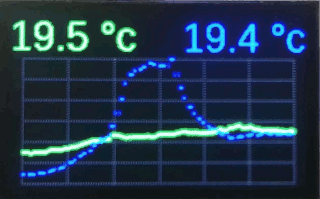

Display Component
=================

.. seo::
    :description: Instructions for setting up the display integration.
    :image: folder-open.svg

The ``display`` component houses ESPHome's powerful rendering and display
engine. Fundamentally, there are these types of displays:

- Text based displays like :doc:`7-Segment displays <max7219>` or
  :doc:`some LCD displays <lcd_display>`.
- Displays like the :doc:`nextion` that have their own processors for rendering.
- Binary displays which can toggle ON/OFF any pixel, like :doc:`E-Paper displays <waveshare_epaper>` or
  :doc:`OLED displays <ssd1306>`.

For the last type, ESPHome has a powerful rendering engine that can do
many things like draw some basic shapes, print text with any font you want, or even show images.

To achieve all this flexibility displays tie in directly into ESPHome's :ref:`lambda system <config-lambda>`.
So when you want to write some text or sensor values to the screen you will be writing in C++ code
using an API that is designed to

- be simple and to be used without programming experience
- but also be flexible enough to work with more complex tasks like displaying an analog clock.

.. _display-engine:

Display Rendering Engine
------------------------

In this section we will be discussing how to use ESPHome's display rendering engine from ESPHome
and some basic commands. Please note that this only applies to displays that can control each pixel
individually.

So, first a few basics: When setting up a display platform in ESPHome there will be a configuration
option called ``lambda:`` which will be called every time ESPHome wants to re-render the display.
In each cycle, the display is automatically cleared before the lambda is executed. You can disable
this behavior by setting ``auto_clear_enabled: false``.
In the lambda, you can write code like in any :ref:`lambda <config-lambda>` in ESPHome. Display
lambdas are additionally passed a variable called ``it`` which represents the rendering engine object.

.. code-block:: yaml

    display:
      - platform: ...
        # ...
        lambda: |-
          // Write your display rendering code here

          // For example, draw a line from [x=0,y=0] to [x=50,y=50]
          it.line(0, 0, 50, 50);

.. note::

    Lambdas are essentially just a lightly modified version of C++. So don't forget to end each line
    with a semicolon (``;``). Otherwise you will be greeted by a long error message at the compilation stage.

If you compile and upload the configuration above, you should see a black (or white, depending on the display)
line which starts at the top left and goes a few pixels down at a 45° angle. (If it's in another corner, use the
``rotation:`` option to rotate the display to your liking)

This already highlights one of the things you must learn before diving into writing your own custom display code:
The **top left** is always the origin of the pixel coordinate system. Also, all points in this coordinate system
are a pair of integers like ``50, 50`` which represent the shift to the right and shift downwards. So, in other words,
x always represents the horizontal axis (width) and y the vertical axis (height). And the convention in
the rendering engine is always first specify the ``x`` coordinate and then the ``y`` coordinate.

Basic Shapes
************

Now that you know a bit more about ESPHome's coordinate system, let's draw some basic shapes like lines, rectangles
and circles:

.. code-block:: yaml

    display:
      - platform: ...
        # ...
        lambda: |-
          // Draw a line from [0,0] to [100,50]
          it.line(0, 0, 100, 50);
          // Draw the outline of a rectangle with the top left at [50,60], a width of 30 and a height of 42
          it.rectangle(50, 60, 30, 42);
          // Draw the same rectangle, but this time filled.
          it.filled_rectangle(50, 60, 30, 42);

          // Circles! Let's draw one with the center at [25,25] and a radius of 10
          it.circle(25, 25, 10);
          // ... and the same thing filled again
          it.filled_circle(25, 25, 10);

All the above methods can optionally also be called with an argument at the end which specifies in which
color to draw. For monochrome displays, only ``COLOR_ON`` (the default if color is not given) and ``COLOR_OFF`` are supported.

.. code-block:: yaml

    display:
      - platform: ...
        # ...
        lambda: |-
          // Turn the whole display on.
          it.fill(COLOR_ON);
          // Turn the whole display off.
          it.fill(COLOR_OFF);

          // Turn a single pixel off at [50,60]
          it.draw_pixel_at(50, 60, COLOR_OFF);

          // Turn off a whole display portion.
          it.rectangle(50, 50, 30, 42, COLOR_OFF);

For color displays (e.g. TFT displays), you can use the Color class.

.. code-block:: yaml

    display:
      - platform: ...
        # ...
        lambda: |-
          auto red = Color(255, 0, 0);
          auto green = Color(0, 255, 0);
          auto blue = Color(0, 0, 255);
          auto white = Color(255, 255, 255);
          it.rectangle(20, 50, 30, 30, white);
          it.rectangle(25, 55, 30, 30, red);
          it.rectangle(30, 60, 30, 30, green);
          it.rectangle(35, 65, 30, 30, blue);

Additionally, you have access to two helper methods which will fetch the width and height of the display:

.. code-block:: yaml

    display:
      - platform: ...
        # ...
        lambda: |-
          // Draw a circle in the middle of the display
          it.filled_circle(it.get_width() / 2, it.get_height() / 2, 20);

You can view the full API documentation for the rendering engine in the "API Reference" in the See Also section.

.. _display-static_text:

Drawing Static Text
*******************

The rendering engine also has a powerful font drawer which integrates seamlessly into ESPHome.
Whereas in most Arduino display projects you have to use one of a few pre-defined fonts in very
specific sizes, with ESPHome you have the option to use **any** TrueType (``.ttf``) font file
at **any** size! Granted the reason for it is actually not having to worry about the licensing of font files :)

To use fonts you first have to define a font object in your ESPHome configuration file. Just grab
a ``.ttf`` file from somewhere on the internet and place it, for example,
inside a ``fonts`` folder next to your configuration file.

Next, create a ``font:`` section in your configuration:

.. code-block:: yaml

    font:
      - file: "fonts/Comic Sans MS.ttf"
        id: my_font
        size: 20

    display:
      # ...

Configuration variables:

- **file** (**Required**, string): The path (relative to where the .yaml file is) of the TrueType font
  file.
- **id** (**Required**, :ref:`config-id`): The ID with which you will be able to reference the font later
  in your display code.
- **size** (*Optional*, int): The size of the font in pt (not pixel!).
  If you want to use the same font in different sizes, create two font objects. Defaults to ``20``.
- **glyphs** (*Optional*, list): A list of characters you plan to use. Only the characters you specify
  here will be compiled into the binary. Adjust this if you need some special characters or want to
  reduce the size of the binary if you don't plan to use some glyphs. The items in the list can also
  be more than one character long if you for example want to use font ligatures. Defaults to
  ``!"%()+=,-_.:°0123456789ABCDEFGHIJKLMNOPQRSTUVWXYZ abcdefghijklmnopqrstuvwxyz``.

.. note::

    To use fonts you will need to have the python ``pillow`` package installed, as ESPHome uses that package
    to translate the TrueType files into an internal format. If you're running this as a Home Assistant
    add-on or with the official ESPHome docker image, it should already be installed. Otherwise you need
    to install it using
    ``pip install pillow``.

Then, in your display code just reference the font like so:

.. code-block:: yaml

    display:
      - platform: ...
        # ...
        lambda: |-
          // Print the string "Hello World!" at [0,10]
          it.print(0, 10, id(my_font), "Hello World!");

By default, ESPHome will *align* the text at the top left. That means if you enter the coordinates
``[0,10]`` for your text, the top left of the text will be at ``[0,10]``. If you want to draw some
text at the right side of the display, it is however sometimes useful to choose a different **text alignment**.
When you enter ``[0,10]`` you're really telling ESPHome that it should position the **anchor point** of the text
at ``[0,10]``. When using a different alignment, like ``TOP_RIGHT``, the text will be positioned left of the anchor
pointed, so that, as the name implies, the anchor point is a the *top right* corner of the text.

.. code-block:: yaml

    display:
      - platform: ...
        # ...
        lambda: |-
          // Aligned on left by default
          it.print(0, 0, id(my_font), "Left aligned");

          // Aligned on right edge
          it.print(it.get_width(), 0, id(my_font), TextAlign::TOP_RIGHT, "Right aligned");

As with basic shapes, you can also specify a color for the text:

.. code-block:: yaml

    display:
      - platform: ...
        # ...
        lambda: |-
          // Syntax is always: it.print(<x>, <y>, , [color=COLOR_ON], [align=TextAlign::TOP_LEFT], <text>);
          it.print(0, 0, id(my_font), COLOR_ON, "Left aligned");

.. _display-printf:

Formatted Text
**************

Static text by itself is not too impressive. What we really want is to display *dynamic* content like sensor values
on the display!. That's where ``printf`` comes in. ``printf`` is a formatting engine from the C era and ESPHome
chose to use because ... well, I'm too lazy to create a fully-fledged format engine where the existing stuff
is way better documented :)

``printf`` can do way more stuff than you will probably ever need, but it's also quite simple for the basic stuff.
For example, a printf call can look like this:

.. code-block:: yaml

    sensor:
      - platform: ...
        # ...
        id: my_sensor

    display:
      - platform: ...
        # ...
        lambda: |-
          it.printf(0, 0, id(my_font), "The sensor value is: %.1f", id(my_sensor).state);
          // If the sensor has the value 30.02, the result will be: "The sensor value is: 30.0"

As you can see, when you call ``printf`` most of the string is printed as-is, but when this weird percent sign with some
stuff after it is encountered, it is magically replaced by the argument after the format (here ``id(my_sensor).state``).

Every time you type a percent sign ``%`` in a printf format string, it will treat the following letters as a format tag
until a so-called "specifier" is encountered (in this case ``f``). You can read more about it
`here <https://www.tutorialspoint.com/c_standard_library/c_function_printf.htm>`__,
but for ESPHome there are really just a few things you need to know.

Let's break ``%.1f`` down:

- ``%`` - initiate the format string
- ``.1`` - round the decimal number to ``1`` digits after the decimal point.
- ``f`` - the specifier which tells printf the data type of the argument. Here it is a f(loat).

For example, if you would like to print a sensor value with two digits of accuracy, you would write ``%.2f`` and with
zero digits of accuracy (without a decimal) ``%.0f``.

Another interesting format string is ``%7.2f``, which would become the right-justified string
``"  20.51"`` for a value of 20.506.

- ``%`` - initiate the format
- ``7`` - means that the number will be right-justified and be padded on the left by spaces if
  the result would be shorter than 7 characters long.
- ``.2`` - round the decimal number to ``2`` digits after the decimal point.
- ``f`` - specifier: f(loat).

You can even have as many format strings as you want in a single printf call. Just make sure the put the
arguments after the format string in the right order.

.. code-block:: yaml

    display:
      - platform: ...
        # ...
        lambda: |-
          // %% - literal % sign
          it.printf(0, 0, id(my_font), "Temperature: %.1f°C, Humidity: %.1f%%", id(temperature).state, id(humidity).state);

To display a text string from a ``text_sensor``, append ``.c_str()`` to the end of your variable.

.. code-block:: yaml

    display:
      - platform: ...
        # ...
        lambda: |-
          it.printf(0, 0, id(my_font), "Text to follow: %s", id(template_text).state.c_str());

The last printf tip for use in displays I will discuss here is how to display binary sensor values. You
*could* of course just check the state with an ``if`` statement as the first few lines in the example below, but if
you want to be efficient you can use an *inline if* too. With the ``%s`` print specifier you can tell it to
use any string you pass it, like ``"ON"`` or ``"OFF"``.

.. code-block:: yaml

    binary_sensor:
      - platform: ...
        # ...
        id: my_binary_sensor

    display:
      - platform: ...
        # ...
        lambda: |-
          if (id(my_binary_sensor).state) {
            it.print(0, 0, id(my_font), "state: ON");
          } else {
            it.print(0, 0, id(my_font), "state: OFF");
          }
          // Shorthand:
          it.printf(0, 0, id(my_font), "State: %s", id(my_binary_sensor).state ? "ON" : "OFF");

.. note::

    For displaying external data on the display, for example data from your Home Assistant instance,
    you can use the :doc:`/components/text_sensor/mqtt_subscribe` (see the example there for more information).

.. _display-strftime:

Displaying Time
***************

You can display current time using a time component. Please see the example :ref:`here <strftime>`.

.. _config-color:

Color
*****

When using RGB-capable displays in ESPHome you may wish to use custom colors.
A ``color`` component exists for just this purpose:

.. code-block:: yaml

    color:
      - id: my_light_red
        red: 100%
        green: 20%
        blue: 25%
        white: 0%

Configuration variables:

- **red** (*Optional*, percentage): The percentage of the red component. Defaults to ``100%``.
- **green** (*Optional*, percentage): The percentage of the green component. Defaults to ``100%``.
- **blue** (*Optional*, percentage): The percentage of the blue component. Defaults to ``100%``.
- **white** (*Optional*, percentage): The percentage of the white component. Defaults to ``100%``.

RGB displays use red, green, and blue, while grayscale displays may use white.

.. _display-graphs:

Graphs
******

You can display a graph of a sensor value(s) using this component. Examples:

.. figure:: images/graph_screen.png
    :align: center
    :width: 60.0%

Graph component with options for grids, border and line-types.

.. code-block:: yaml

    graph:
      # Show bare-minimum auto-ranged graph
      - id: single_temperature_graph
        sensor: my_temperature
        duration: 1h
        width: 151
        height: 51
      # Show multi-trace graph
      - id: multi_temperature_graph
        duration: 1h
        x_grid: 10min
        y_grid: 1.0     # degC/div
        width: 151
        height: 51
        traces:
          - sensor: my_inside_temperature
            line_type: DASHED
            line_thickness: 2
            color: my_red
          - sensor: my_outside_temperature
            line_type: SOLID
            line_thickness: 3
            color: my_blue
          - sensor: my_beer_temperature
            line_type: DOTTED
            line_thickness: 2
            color: my_green

Configuration variables:

- **id** (**Required**, :ref:`config-id`): The ID with which you will be able to reference the graph later
  in your display code.
- **width** (**Required**, int): The graph width in pixels
- **height** (**Required**, int): The graph height in pixels
- **duration** (**Required**, :ref:`config-time`): The total graph history duration.
- **border** (*Optional*, boolean): Specifies if a border will be drawn around the graph. Default is True.
- **x_grid** (*Optional*): Specifies the time per division. If not specified, no vertical grid will be drawn.
- **y_grid** (*Optional*, float): Specifies the number of units per division. If not specified, no horizontal grid will be drawn.
- **max_range** (*Optional*): Specifies the maximum Y-axis range.
- **min_range** (*Optional*): Specifies the minimum Y-axis range.
- **max_value** (*Optional*): Specifies the maximum Y-axis value.
- **min_value** (*Optional*): Specifies the minimum Y-axis value.
- **traces** (*Optional*): Use this to specify more than a single trace.

Trace specific fields:
- **sensor** (*Optional*, :ref:`config-id`): The sensor value to plot
- **line_thickness** (*Optional*): Defaults to 3
- **line_type** (*Optional*): Specifies the plot line-type. Can be one of the following: ``SOLID``, ``DOTTED``, ``DASHED``. Defaults to ``SOLID``.
- **color** (*Optional*): Sets the color of the sensor trace.

And then later in code:

.. code-block:: yaml

    display:
      - platform: ...
        # ...
        pages:
          - id: page1
            lambda: |-
              // Draw the graph at position [x=10,y=20]
              it.graph(10, 20, id(simple_temperature_graph));
          - id: page2
            lambda: |-
              // Draw the graph at position [x=10,y=20]
              it.graph(10, 20, id(multi_temperature_graph), my_yellow);

    color:
      - id: my_red
        red: 100%
        green: 0%
        blue: 0%
      - id: my_green
        red: 0%
        green: 100%
        blue: 0%
      - id: my_blue
        red: 0%
        green: 0%
        blue: 100%
      - id: my_yellow
        red: 100%
        green: 100%
        blue: 0%
.. note::

    Here are some things to note:
    - Setting ``y_grid`` will expand any specified range to the nearest multiple of grid spacings.
    - Axis labels are currently not possible without manually placing them.
    - The grid and border color is set with it.graph(), while the traces are defined separately.

QR Codes
********

Use this component to generate a QR-code containing a string on the device, which can then be drawn on compatible displays.

.. code-block:: yaml

    qr_code:
      - id: homepage_qr
        value: esphome.io

Configuration variables:

- **id** (**Required**, :ref:`config-id`): The ID with which you will be able to reference the QR-code later
  in your display code.
- **value** (**Required**, string): The string which you want to encode in the QR-code.
- **ecc** (*Optional*, string): The error correction code level you want to use. Defaults to ``LOW``. You can use one of the following values:

  - ``LOW`` - The QR Code can tolerate about 7% erroneous codewords
  - ``MEDIUM`` - The QR Code can tolerate about 15% erroneous codewords
  - ``QUARTILE`` - The QR Code can tolerate about 25% erroneous codewords
  - ``HIGH`` - The QR Code can tolerate about 30% erroneous codewords

To draw the QR-code, call the `it.qr_code` function from your render lambda:

.. code-block:: yaml

    display:
      - platform: ...
        # ...
        pages:
          - id: page1
            lambda: |-
              // Draw the QR-code at position [x=50,y=0] with white color and a 2x scale
              it.qr_code(50, 0, id(homepage_qr), Color(255,255,255), 2);

Images
******

Use this component to store graphical images on the device, you can then draw the images on compatible displays.

.. code-block:: yaml

    image:
      - file: "image.png"
        id: my_image
        resize: 100x100

Configuration variables:

- **file** (**Required**, string): The path (relative to where the .yaml file is) of the image file.
- **id** (**Required**, :ref:`config-id`): The ID with which you will be able to reference the image later
  in your display code.
- **resize** (*Optional*, string): If set, this will resize the image to fit inside the given dimensions ``WIDTHxHEIGHT``
  and preserve the aspect ratio.
- **type** (*Optional*): Specifies how to encode image internally. Defaults to ``BINARY``.

  - ``BINARY``: Two colors, suitable for 1 color displays or 2 color image in color displays. Uses 1 bit
    per pixel, 8 pixels per byte.
  - ``GRAYSCALE``: Full scale grey. Uses 8 bits per pixel, 1 pixel per byte.
  - ``RGB24``: Full RGB color stored. Uses 3 bytes per pixel.

- **dither** (*Optional*): Specifies which dither method used to process the image, only used in GRAYSCALE and BINARY type image. Defaults to ``NONE``. You can read more about it `here <https://pillow.readthedocs.io/en/stable/reference/Image.html?highlight=Dither#PIL.Image.Image.convert>`__ and `here <https://en.wikipedia.org/wiki/Dither>`__.

  - ``NONE``: Every pixel convert to its nearest color.
  - ``FLOYDSTEINBERG``: Uses Floyd-Steinberg dither to approximate the original image luminosity levels.

.. note::

    To use images you will need to have the python ``pillow`` package installed.
    If you're running this as a Home Assistant add-on or with the official ESPHome docker image, it should already be
    installed. Otherwise you need to install it using ``pip install pillow``.

And then later in code:

.. code-block:: yaml

    display:
      - platform: ...
        # ...
        lambda: |-
          // Draw the image my_image at position [x=0,y=0]
          it.image(0, 0, id(my_image));

For binary images the ``image`` method accepts two additional color parameters which can
be supplied to modify the color used to represent the on and off bits respectively. e.g.

.. code-block:: yaml

    display:
      - platform: ...
        # ...
        lambda: |-
          // Draw the image my_image at position [x=0,y=0]
          // with front color red and back color blue
          it.image(0, 0, id(my_image), id(red), id(blue));

You can also use this to invert images in two colors display, use ``COLOR_OFF`` then ``COLOR_ON``
as the additional parameters.

Animation
*********

Allows to use animated images on displays. Animation inherits all options from the image component.
It adds an additional lambda method: ``next_frame()`` to change the shown picture of a gif.

.. code-block:: yaml

    animation:
      - file: "animation.gif"
        id: my_animation
        resize: 100x100

The animation can be rendered just like the image component with the ``image()`` function of the display component.

To show the next frame of the animation call ``id(my_animation).next_frame()``
This can be combined with all Lambdas:

.. code-block:: yaml

    display:
      - platform: ...
        # ...
        lambda: |-
          //Ingress shown animation Frame.
          id(my_animation).next_frame();
          // Draw the animation my_animation at position [x=0,y=0]
          it.image(0, 0, id(my_animation), COLOR_ON, COLOR_OFF);

.. note::

    To draw the next animation independent of Display draw cycle use an interval:

    .. code-block:: yaml

        interval:
          - interval: 5s
              then:
                lambda: |-
                  id(my_animation).next_frame();

Configuration variables:
^^^^^^^^^^^^^^^^^^^^^^^^

- **file** (**Required**, string): The path (relative to where the .yaml file is) of the gif file.
- **id** (**Required**, :ref:`config-id`): The ID with which you will be able to reference the animation later
  in your display code.
- **resize** (*Optional*, string): If set, this will resize all the frames to fit inside the given dimensions ``WIDTHxHEIGHT``
  and preserve the aspect ratio.
- **type** (*Optional*): Specifies how to encode each frame internally. Defaults to ``BINARY``.

  - ``BINARY``: Two colors, suitable for 1 color displays or 2 color image in color displays. Uses 1 bit
    per pixel, 8 pixels per byte.
  - ``GREYSCALE``: Full scale grey. Uses 8 bits per pixel, 1 pixel per byte.
  - ``RGB24``: Full RGB color stored. Uses 3 bytes per pixel.

- **dither** (*Optional*): Specifies which dither method used to process each frame, only used in GREYSCALE and BINARY type image.
  Defaults to ``NONE``. You can read more about it `here <https://pillow.readthedocs.io/en/stable/reference/Image.html?highlight=Dither#PIL.Image.Image.convert>`__
  and `here <https://en.wikipedia.org/wiki/Dither>`__.

  - ``NONE``: Every pixel convert to its nearest color.
  - ``FLOYDSTEINBERG``: Uses Floyd-Steinberg dither to approximate the original image luminosity levels.

.. _display-pages:

Display Pages
-------------

Certain display types also allow you to show "pages". With pages you can create drawing lambdas
that you can switch between. For example with pages you can set up 3 screens, each with
different content, and switch between them on a timer.

.. code-block:: yaml

    display:
      - platform: ...
        # ...
        id: my_display
        pages:
          - id: page1
            lambda: |-
              it.print(0, 10, id(my_font), "This is page 1!");
          - id: page2
            lambda: |-
              it.print(0, 10, id(my_font), "This is page 2!");

You can then switch between these with three different actions:

**show_next** / **show_previous**: Shows the next or previous page, wraps around at the end.

.. code-block:: yaml

    on_...:
      - display.page.show_next: my_display
      - display.page.show_previous: my_display

    # For example cycle through pages on a timer
    interval:
      - interval: 5s
        then:
          - display.page.show_next: my_display
          - component.update: my_display

**display.page.show**: Show a specific page

.. code-block:: yaml

    on_...:
      - display.page.show: page1

      # Templated
      - display.page.show: !lambda |-
          if (id(my_binary_sensor).state) {
            return id(page1);
          } else {
            return id(page2);
          }

.. note::

    To trigger a redraw right after the page show use a :ref:`component.update <component-update_action>`
    action:

    .. code-block:: yaml

        # For example cycle through pages on a timer
        interval:
          - interval: 5s
            then:
              - display.page.show_next: my_display
              - component.update: my_display

.. _display-is_displaying_page-condition:

**display.is_displaying_page**: This condition returns true while the specified page is being shown.

.. code-block:: yaml

    # In some trigger:
    on_...:
      - if:
          condition:
            display.is_displaying_page: page1
          then:
            ...
      - if:
          condition:
            display.is_displaying_page:
              id: my_display
              page_id: page2
          then:
            ...

.. _display-on_page_change-trigger:

**on_page_change**: This automation will be triggered when the page that is shown changes.

.. code-block:: yaml

    display:
      - platform: ...
        # ...
        on_page_change:
          - from: page1
            to: page2
            then:
              lambda: |-
                ESP_LOGD("display", "Page changed from 1 to 2");

- **from** (*Optional*, :ref:`config-id`): A page id. If set the automation is only triggered if changing from this page. Defaults to all pages.
- **to** (*Optional*, :ref:`config-id`): A page id. If set the automation is only triggered if changing to this page. Defaults to all pages.

Additionally the old page will be given as the variable ``from`` and the new one as the variable ``to``.

See Also
--------

- :apiref:`display/display_buffer.h`
- :ghedit:`Edit`

.. toctree::
    :maxdepth: 1
    :glob:

    *
